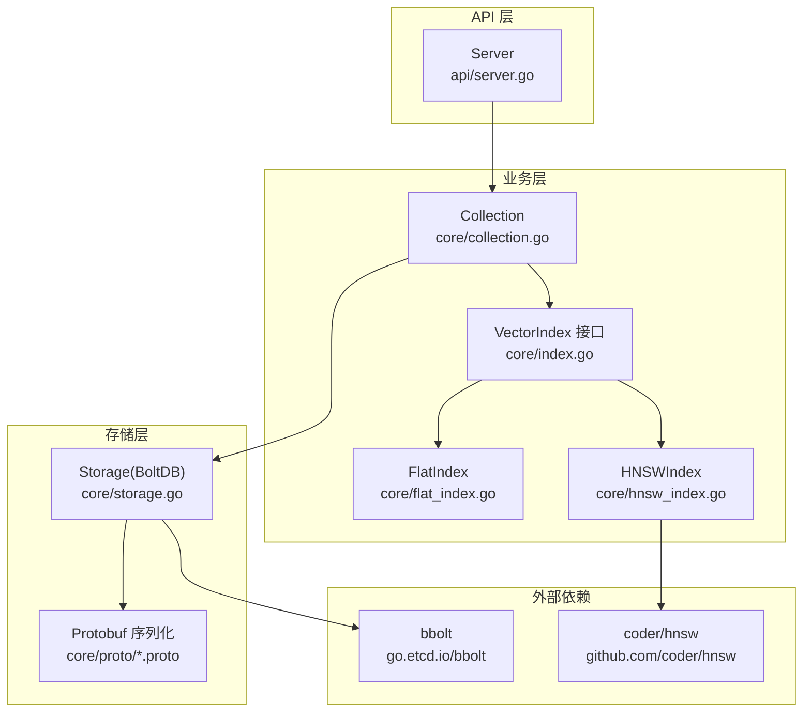
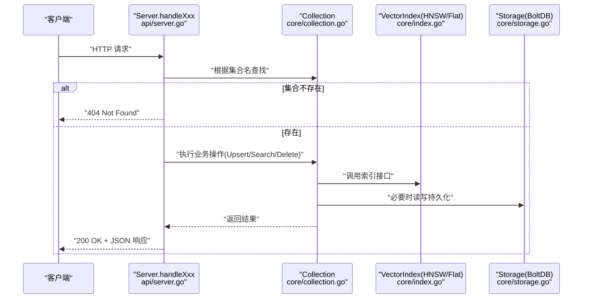
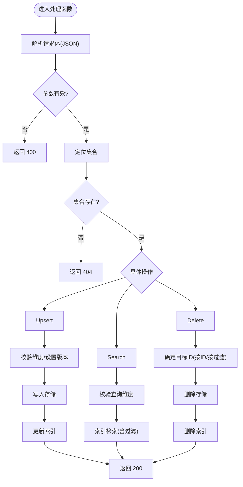
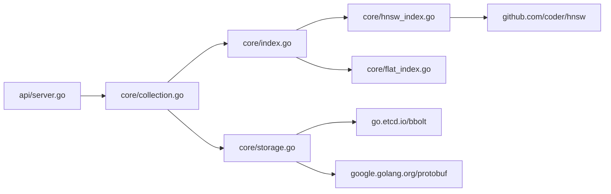

# API 参考

<cite>
**本文引用的文件**
- [api/server.go](file://api/server.go)
- [cmd/govector/main.go](file://cmd/govector/main.go)
- [core/models.go](file://core/models.go)
- [core/collection.go](file://core/collection.go)
- [core/storage.go](file://core/storage.go)
- [core/index.go](file://core/index.go)
- [core/hnsw_index.go](file://core/hnsw_index.go)
- [core/flat_index.go](file://core/flat_index.go)
- [core/math.go](file://core/math.go)
- [api/server_test.go](file://api/server_test.go)
- [go.mod](file://go.mod)
</cite>

## 目录
1. [简介](#简介)
2. [项目结构](#项目结构)
3. [核心组件](#核心组件)
4. [架构总览](#架构总览)
5. [详细组件分析](#详细组件分析)
6. [依赖关系分析](#依赖关系分析)
7. [性能考量](#性能考量)
8. [故障排查指南](#故障排查指南)
9. [结论](#结论)
10. [附录：Qdrant 兼容对照表](#附录qdrant-兼容对照表)

## 简介
本文件为 GoVector 的完整 API 参考文档，覆盖 HTTP REST 接口、数据模型、过滤器语法、错误码、Qdrant 兼容性说明、启动与配置、以及常见使用场景的最佳实践。GoVector 提供 Qdrant 兼容的 REST API，支持集合管理、点写入（Upsert）、相似度检索（Search）与删除（Delete），并内置 HNSW 近似最近邻索引与持久化存储。

## 项目结构
- api 包：提供 HTTP API 服务器，暴露集合与点操作的 REST 端点。
- core 包：核心数据模型、集合、索引（HNSW/Flat）、存储（BoltDB+Protobuf）、数学度量。
- cmd/govector serve：独立服务入口，启动 HTTP 服务器并加载默认集合。
- 测试：覆盖 API 行为与错误码，验证端点正确性。

图表来源
- [api/server.go:54-95](file://api/server.go#L54-L95)
- [core/collection.go:22-91](file://core/collection.go#L22-L91)
- [core/storage.go:88-114](file://core/storage.go#L88-L114)
- [core/hnsw_index.go:52-106](file://core/hnsw_index.go#L52-L106)
- [core/flat_index.go:19-25](file://core/flat_index.go#L19-L25)
- [go.mod:5-9](file://go.mod#L5-L9)

章节来源
- [api/server.go:54-95](file://api/server.go#L54-L95)
- [cmd/govector/main.go:18-92](file://cmd/govector/main.go#L18-L92)
- [core/collection.go:22-91](file://core/collection.go#L22-L91)
- [core/storage.go:88-114](file://core/storage.go#L88-L114)
- [core/index.go:5-28](file://core/index.go#L5-L28)
- [core/hnsw_index.go:52-106](file://core/hnsw_index.go#L52-L106)
- [core/flat_index.go:19-25](file://core/flat_index.go#L19-L25)
- [go.mod:5-9](file://go.mod#L5-L9)

## 核心组件
- Server：HTTP API 服务器，负责路由与错误处理；管理集合映射与存储。
- Collection：集合抽象，封装 Upsert/Search/Delete 与线程安全；选择 Flat 或 HNSW 索引。
- VectorIndex 接口：统一索引能力（Upsert/Search/Delete/Count/按过滤器取ID/按过滤器删除）。
- Storage：基于 bbolt 的持久化，使用 Protobuf 序列化点；支持 SQ8 量化。
- 数据模型：PointStruct、ScoredPoint、Filter/Condition/RangeValue 等，兼容 Qdrant Payload 结构与过滤语法。

章节来源
- [api/server.go:16-34](file://api/server.go#L16-L34)
- [core/collection.go:9-20](file://core/collection.go#L9-L20)
- [core/index.go:5-28](file://core/index.go#L5-L28)
- [core/storage.go:13-20](file://core/storage.go#L13-L20)
- [core/models.go:5-25](file://core/models.go#L5-L25)

## 架构总览
下图展示从 HTTP 请求到索引与存储的调用链路，以及集合加载与持久化流程。

图表来源
- [api/server.go:145-258](file://api/server.go#L145-L258)
- [core/collection.go:93-197](file://core/collection.go#L93-L197)
- [core/storage.go:144-187](file://core/storage.go#L144-L187)
- [core/index.go:5-28](file://core/index.go#L5-L28)

## 详细组件分析

### HTTP API 端点总览
- 集合管理
  - POST /collections：创建集合
  - DELETE /collections/{name}：删除集合
  - GET /collections：列出集合
  - GET /collections/{name}：获取集合信息
- 点操作
  - PUT /collections/{name}/points：批量写入/更新点
  - POST /collections/{name}/points/search：向量检索
  - POST /collections/{name}/points/delete：按 ID 或过滤器删除点

章节来源
- [api/server.go:56-84](file://api/server.go#L56-L84)

### 端点规范与响应格式

- POST /collections
  - 功能：创建集合
  - 请求体字段
    - name: 字符串，集合名称
    - vector_size: 整数，向量维度（必须为正）
    - distance: 字符串，距离度量，支持 "cosine"/"euclidean"/"dot" 或大小写变体
    - hnsw: 布尔，是否启用 HNSW（可选）
    - parameters: 对象，HNSW 参数（可选）
      - m: 整数，最大连接数
      - ef_construction: 整数，构建候选列表大小
      - ef_search: 整数，搜索候选列表大小
      - k: 整数，返回近邻数量
  - 成功响应：200，包含集合配置与参数
  - 错误：
    - 400：JSON 解析失败、vector_size 非正、distance 不支持
    - 409：集合已存在
    - 500：内部错误

- DELETE /collections/{name}
  - 功能：删除集合
  - 成功响应：200，包含完成状态与被删除集合名
  - 错误：404（集合不存在）

- GET /collections
  - 功能：列出所有集合的基本信息（名称、维度、度量、点数）
  - 成功响应：200

- GET /collections/{name}
  - 功能：获取指定集合的详细信息
  - 成功响应：200
  - 错误：404（集合不存在）

- PUT /collections/{name}/points
  - 功能：批量 upsert 点
  - 请求体字段
    - points: 数组，元素为 PointStruct
  - 成功响应：200，包含状态与操作完成标记
  - 错误：400（JSON 解析失败）、404（集合不存在）、500（内部错误）

- POST /collections/{name}/points/search
  - 功能：向量检索
  - 请求体字段
    - vector: 数组，查询向量
    - limit: 整数，返回前 K 个结果，默认 10
    - filter: 对象，Payload 过滤条件（可选）
  - 成功响应：200，包含状态与结果数组（ScoredPoint）
  - 错误：400（JSON 解析失败）、404（集合不存在）、500（内部错误）

- POST /collections/{name}/points/delete
  - 功能：删除点（按 ID 或按过滤器）
  - 请求体字段
    - points: 字符串数组，按 ID 删除（二选一）
    - filter: 对象，按过滤器删除（二选一）
  - 成功响应：200，包含状态、完成标记与删除计数
  - 错误：400（JSON 解析失败）、404（集合不存在）、500（内部错误）

章节来源
- [api/server.go:260-352](file://api/server.go#L260-L352)
- [api/server.go:354-380](file://api/server.go#L354-L380)
- [api/server.go:382-400](file://api/server.go#L382-L400)
- [api/server.go:402-423](file://api/server.go#L402-L423)
- [api/server.go:145-176](file://api/server.go#L145-L176)
- [api/server.go:178-218](file://api/server.go#L178-L218)
- [api/server.go:220-258](file://api/server.go#L220-L258)

### 数据模型与过滤语法

- PointStruct
  - id: 字符串，唯一标识
  - version: 整数，版本号（时间戳/递增）
  - vector: 浮点数组，向量
  - payload: 对象，元数据（用于过滤）

- ScoredPoint
  - id/version/score/payload

- Filter 与 Condition
  - must/must_not：数组，条件列表
  - Condition
    - key: 字符串，payload 中的键
    - type: 字符串，条件类型
      - exact：精确匹配
      - range：范围比较（gt/gte/lt/lte）
      - prefix：前缀匹配（字符串）
      - contains：包含匹配（数组/字符串）
      - regex：正则匹配（字符串）
    - match：对象，用于 exact/prefix/contains/regex
    - range：对象，用于 range

- Payload 过滤匹配规则
  - must：全部满足
  - must_not：全部不满足
  - 未提供 filter：视为匹配全部

章节来源
- [core/models.go:5-25](file://core/models.go#L5-L25)
- [core/models.go:27-69](file://core/models.go#L27-L69)
- [core/models.go:81-106](file://core/models.go#L81-L106)
- [core/models.go:108-130](file://core/models.go#L108-L130)
- [core/models.go:131-195](file://core/models.go#L131-L195)
- [core/models.go:197-248](file://core/models.go#L197-L248)
- [core/models.go:260-279](file://core/models.go#L260-L279)

### 处理流程与算法要点

- Upsert 写入流程
  - 校验维度与设置版本
  - 先落盘（Storage），再更新内存索引（Index）
  - 失败回滚：尝试从存储删除以保持一致性

- Search 检索流程
  - 查询向量维度校验
  - HNSW：先图遍历，再应用 Payload 过滤，最后计算精确分数
  - Flat：暴力遍历，按度量排序后截断

- Delete 删除流程
  - 若提供 points：按 ID 删除
  - 若提供 filter：先从索引获取 ID 列表，再删除
  - 先删存储，再删索引

图表来源
- [api/server.go:145-258](file://api/server.go#L145-L258)
- [core/collection.go:93-197](file://core/collection.go#L93-L197)
- [core/storage.go:144-187](file://core/storage.go#L144-L187)
- [core/hnsw_index.go:126-176](file://core/hnsw_index.go#L126-L176)
- [core/flat_index.go:40-74](file://core/flat_index.go#L40-L74)

章节来源
- [api/server.go:145-258](file://api/server.go#L145-L258)
- [core/collection.go:93-197](file://core/collection.go#L93-L197)
- [core/storage.go:144-187](file://core/storage.go#L144-L187)
- [core/hnsw_index.go:126-176](file://core/hnsw_index.go#L126-L176)
- [core/flat_index.go:40-74](file://core/flat_index.go#L40-L74)

### 错误码与语义
- 400 Bad Request：JSON 解析失败、参数非法（如 vector_size ≤ 0、不支持的距离度量）
- 404 Not Found：集合不存在
- 409 Conflict：集合已存在（创建时）
- 500 Internal Server Error：内部错误（存储失败、索引更新失败、加载失败等）

章节来源
- [api/server.go:161-169](file://api/server.go#L161-L169)
- [api/server.go:198-201](file://api/server.go#L198-L201)
- [api/server.go:239-242](file://api/server.go#L239-L242)
- [api/server.go:272-275](file://api/server.go#L272-L275)
- [api/server.go:286-290](file://api/server.go#L286-L290)
- [api/server.go:292-304](file://api/server.go#L292-L304)
- [api/server.go:357-365](file://api/server.go#L357-L365)
- [api/server.go:408-411](file://api/server.go#L408-L411)
- [api/server.go:424-427](file://api/server.go#L424-L427)

### 认证、速率限制与版本控制
- 认证：当前实现未内置认证机制，建议通过反向代理（如 Nginx/TLS）或网关进行鉴权。
- 速率限制：未内置限流策略，可通过上游网关或容器编排工具实现。
- 版本控制：点结构包含 version 字段，用于版本追踪；存储层提供 nanosecond 粒度的时间戳版本生成。

章节来源
- [core/models.go:11-16](file://core/models.go#L11-L16)
- [core/collection.go:101-109](file://core/collection.go#L101-L109)

### 启动与配置
- 独立服务启动
  - 端口：-port，默认 18080
  - 数据库路径：-db，默认 govector.db
  - 是否启用 HNSW：-hnsw，默认 true
- 服务行为
  - 启动时加载存储中的集合元数据并重建集合
  - 支持优雅关闭（context 控制超时）

章节来源
- [cmd/govector/main.go:18-92](file://cmd/govector/main.go#L18-L92)
- [api/server.go:97-129](file://api/server.go#L97-L129)

### 代码示例（路径指引）
- 创建集合
  - 请求：POST /collections
  - 示例请求体字段参考：[api/server_test.go:163-174](file://api/server_test.go#L163-L174)
  - 成功响应结构参考：[api/server.go:335-351](file://api/server.go#L335-L351)
- 写入点
  - 请求：PUT /collections/{name}/points
  - 示例请求体字段参考：[api/server_test.go:347-349](file://api/server_test.go#L347-L349)
  - 成功响应结构参考：[api/server.go:171-176](file://api/server.go#L171-L176)
- 检索
  - 请求：POST /collections/{name}/points/search
  - 示例请求体字段参考：[api/server_test.go:386-389](file://api/server_test.go#L386-L389)
  - 成功响应结构参考：[api/server.go:213-218](file://api/server.go#L213-L218)
- 删除
  - 请求：POST /collections/{name}/points/delete
  - 按 ID 删除示例请求体字段参考：[api/server_test.go:435-437](file://api/server_test.go#L435-L437)
  - 按过滤器删除示例请求体字段参考：[api/server_test.go:451-457](file://api/server_test.go#L451-L457)
  - 成功响应结构参考：[api/server.go:250-258](file://api/server.go#L250-L258)

章节来源
- [api/server_test.go:158-258](file://api/server_test.go#L158-L258)
- [api/server_test.go:339-483](file://api/server_test.go#L339-L483)
- [api/server.go:145-258](file://api/server.go#L145-L258)

## 依赖关系分析

图表来源
- [api/server.go:13](file://api/server.go#L13)
- [core/collection.go:3](file://core/collection.go#L3)
- [core/storage.go:8](file://core/storage.go#L8)
- [core/hnsw_index.go:8](file://core/hnsw_index.go#L8)
- [go.mod:5-9](file://go.mod#L5-L9)

章节来源
- [api/server.go:13](file://api/server.go#L13)
- [core/collection.go:3](file://core/collection.go#L3)
- [core/storage.go:8](file://core/storage.go#L8)
- [core/hnsw_index.go:8](file://core/hnsw_index.go#L8)
- [go.mod:5-9](file://go.mod#L5-L9)

## 性能考量
- 索引选择
  - HNSW：适合大规模数据，检索延迟低，支持 ef_search、m 等参数调优
  - Flat：小规模数据，精确但 O(n) 检索
- 持久化与序列化
  - 使用 bbolt + Protobuf，写入顺序稳定；Upsert 先落盘再更新索引，保证一致性
- 过滤策略
  - HNSW 检索采用“过采样 + 后过滤”策略，过滤越重，over-fetch 系数越大
- 量化
  - 可选 SQ8 量化，减少磁盘占用，加载时解量化

章节来源
- [core/hnsw_index.go:126-176](file://core/hnsw_index.go#L126-L176)
- [core/storage.go:144-187](file://core/storage.go#L144-L187)
- [core/storage.go:215-224](file://core/storage.go#L215-L224)

## 故障排查指南
- 400 错误
  - JSON 解析失败：检查请求体格式
  - vector_size 非正：确保大于 0
  - distance 不支持：仅支持 cosine/euclidean/dot（大小写不敏感）
- 404 错误
  - 集合不存在：确认集合名称与创建流程
- 409 错误
  - 创建集合时名称冲突：更换名称或先删除
- 500 错误
  - 存储/索引异常：查看服务日志；确认数据库文件权限与磁盘空间
- 检索结果为空
  - 检查 vector 维度是否与集合一致
  - 过滤条件过于严格导致过采样后仍无命中

章节来源
- [api/server.go:161-169](file://api/server.go#L161-L169)
- [api/server.go:198-201](file://api/server.go#L198-L201)
- [api/server.go:239-242](file://api/server.go#L239-L242)
- [api/server.go:272-275](file://api/server.go#L272-L275)
- [api/server.go:286-290](file://api/server.go#L286-L290)
- [api/server.go:292-304](file://api/server.go#L292-L304)
- [api/server.go:357-365](file://api/server.go#L357-L365)
- [api/server.go:408-411](file://api/server.go#L408-L411)
- [api/server.go:424-427](file://api/server.go#L424-L427)

## 结论
本 API 参考文档基于仓库现有实现，系统性梳理了 GoVector 的 Qdrant 兼容 REST 接口、数据模型、过滤语法与错误码，并提供了启动配置、性能与故障排查建议。建议在生产环境中结合反向代理实现认证与限流，并根据数据规模选择合适的索引与参数。

## 附录：Qdrant 兼容对照表
- 集合管理
  - POST /collections：创建集合（兼容）
  - DELETE /collections/{name}：删除集合（兼容）
  - GET /collections：列出集合（兼容）
  - GET /collections/{name}：获取集合信息（兼容）
- 点操作
  - PUT /collections/{name}/points：Upsert（兼容）
  - POST /collections/{name}/points/search：Search（兼容）
  - POST /collections/{name}/points/delete：Delete（兼容）
- 过滤语法
  - 支持 exact/range/prefix/contains/regex 与 must/must_not 组合（兼容）
- 返回结构
  - 统一使用 "status":"ok" 与 "result" 字段包装（兼容风格）
- 差异提示
  - 本实现未内置认证与限流，需通过网关或反向代理实现
  - 量化与集合元数据持久化为扩展能力，非 Qdrant 标准字段

章节来源
- [api/server.go:56-84](file://api/server.go#L56-L84)
- [core/models.go:27-69](file://core/models.go#L27-L69)
- [core/models.go:81-106](file://core/models.go#L81-L106)