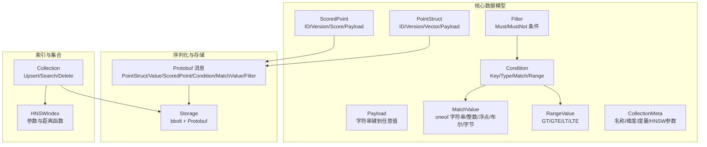
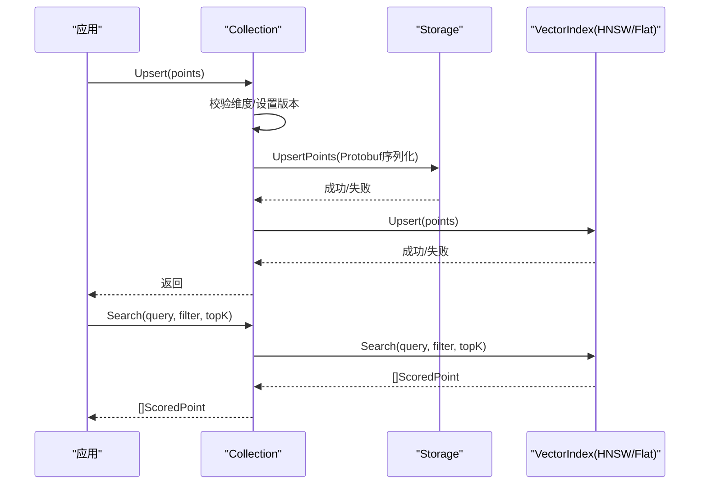

# 数据模型

<cite>
**本文引用的文件列表**
- [models.go](file://core/models.go)
- [point.proto](file://core/proto/point.proto)
- [point.pb.go](file://core/proto/point.pb.go)
- [storage.go](file://core/storage.go)
- [collection.go](file://core/collection.go)
- [math.go](file://core/math.go)
- [hnsw_index.go](file://core/hnsw_index.go)
- [models_test.go](file://core/models_test.go)
- [README.md](file://README.md)
</cite>

## 目录
1. [简介](#简介)
2. [项目结构与数据模型概览](#项目结构与数据模型概览)
3. [核心数据结构总览](#核心数据结构总览)
4. [架构与数据流概览](#架构与数据流概览)
5. [详细数据模型解析](#详细数据模型解析)
6. [协议缓冲与JSON映射关系](#协议缓冲与json映射关系)
7. [向量存储与序列化机制](#向量存储与序列化机制)
8. [数据模型关系图与转换规则](#数据模型关系图与转换规则)
9. [性能考量与优化建议](#性能考量与优化建议)
10. [故障排查指南](#故障排查指南)
11. [结论](#结论)
12. [附录：数据示例](#附录数据示例)

## 简介
本文件系统性梳理 GoVector 的数据模型，覆盖核心数据结构（PointStruct、ScoredPoint、Filter、Payload、CollectionMeta 等），解释其字段定义、数据类型、约束条件与使用场景；详述 Protocol Buffers 定义的二进制格式与 JSON 映射关系；说明向量数据的存储格式、序列化机制与性能考量；给出数据模型之间的关系图与转换规则，并提供实际数据示例以帮助理解。

## 项目结构与数据模型概览
- 核心数据模型位于 core 包中：
  - models.go：定义 Payload、PointStruct、ScoredPoint、Filter、RangeValue、MatchValue、CollectionMeta 及过滤匹配逻辑
  - proto/point.proto：定义 Protobuf 消息结构（PointStruct、Value、ScoredPoint、Condition、MatchValue、Filter）
  - proto/point.pb.go：由 protoc-gen-go 生成的 Protobuf Go 代码
  - storage.go：基于 bbolt 的持久化层，负责将 PointStruct 序列化为 Protobuf 并写入磁盘
  - collection.go：集合抽象，封装 Upsert/Search/Delete 等操作，并协调存储与索引
  - math.go：距离度量枚举与计算函数（Cosine、Euclid、Dot）
  - hnsw_index.go：HNSW 参数与索引实现
  - models_test.go：过滤器与匹配逻辑的单元测试，展示典型用法
  - README.md：项目特性与使用说明



图表来源
- [models.go:5-79](file://core/models.go#L5-L79)
- [point.proto:7-49](file://core/proto/point.proto#L7-L49)
- [point.pb.go:24-514](file://core/proto/point.pb.go#L24-L514)
- [storage.go:22-86](file://core/storage.go#L22-L86)
- [collection.go:12-91](file://core/collection.go#L12-L91)
- [hnsw_index.go:11-106](file://core/hnsw_index.go#L11-L106)

章节来源
- [models.go:5-79](file://core/models.go#L5-L79)
- [point.proto:1-49](file://core/proto/point.proto#L1-L49)
- [storage.go:13-360](file://core/storage.go#L13-L360)
- [collection.go:9-198](file://core/collection.go#L9-L198)
- [math.go:5-79](file://core/math.go#L5-L79)
- [hnsw_index.go:11-106](file://core/hnsw_index.go#L11-L106)
- [README.md:16-42](file://README.md#L16-L42)

## 核心数据结构总览
- Payload：字符串键到任意值的元数据映射，用于过滤与检索
- PointStruct：向量点实体，包含唯一标识、版本号、向量数组与可选元数据
- ScoredPoint：查询结果，包含相似度/距离分值与点信息
- Filter：查询过滤器，支持 Must 与 MustNot 条件集合
- Condition：单个过滤条件，指定键、类型与匹配值或范围
- MatchValue：匹配值，采用 oneof 支持多种基础类型
- RangeValue：范围值，支持大于/大于等于/小于/小于等于
- CollectionMeta：集合元数据，记录集合名、向量维度、距离度量、是否使用 HNSW 及参数

章节来源
- [models.go:5-79](file://core/models.go#L5-L79)

## 架构与数据流概览
- 写入流程：应用调用 Collection.Upsert → 校验维度与设置版本 → 存储层先写入 bbolt（Protobuf 序列化）→ 更新内存索引（Flat 或 HNSW）
- 查询流程：Collection.Search → 锁定读取 → 调用索引 Search → 返回 ScoredPoint 列表
- 删除流程：Collection.Delete → 确定目标 ID（显式 ID 或按过滤器匹配）→ 先删除存储再删除索引
- 过滤匹配：MatchFilter 遍历 Must/MustNot 条件，逐条调用 matchCondition → 分支处理 exact/range/prefix/contains/regex



图表来源
- [collection.go:93-147](file://core/collection.go#L93-L147)
- [storage.go:144-187](file://core/storage.go#L144-L187)
- [hnsw_index.go:41-106](file://core/hnsw_index.go#L41-L106)

章节来源
- [collection.go:93-198](file://core/collection.go#L93-L198)
- [storage.go:144-187](file://core/storage.go#L144-L187)
- [hnsw_index.go:41-106](file://core/hnsw_index.go#L41-L106)

## 详细数据模型解析

### Payload（元数据）
- 类型：map[string]interface{}
- 约束：键必须为字符串；值可为字符串、整数、浮点、布尔、字节切片或数组/字符串/整数切片（在过滤器中被识别）
- 使用场景：作为 Filter 的匹配对象，支持多条件组合
- JSON 映射：直接映射为 JSON 对象

章节来源
- [models.go:5-7](file://core/models.go#L5-L7)
- [models_test.go:8-15](file://core/models_test.go#L8-L15)

### PointStruct（向量点）
- 字段
  - ID：字符串，唯一标识
  - Version：uint64，版本号（时间戳纳秒级）
  - Vector：[]float32，向量嵌入
  - Payload：Payload，可选元数据
- 约束
  - 向量长度需与集合维度一致
  - 版本号在批量 Upsert 时统一设置
- 使用场景：插入/更新向量点；作为 Protobuf 序列化的目标

章节来源
- [models.go:9-16](file://core/models.go#L9-L16)
- [collection.go:93-133](file://core/collection.go#L93-L133)
- [storage.go:22-56](file://core/storage.go#L22-L56)

### ScoredPoint（带分数的结果）
- 字段
  - ID：字符串
  - Version：uint64
  - Score：float32，相似度或距离分值（由集合度量决定“越小/越大”更相似）
  - Payload：Payload
- 约束：Score 值由底层索引返回，排序时遵循度量约定
- 使用场景：Search 查询返回结果

章节来源
- [models.go:18-25](file://core/models.go#L18-L25)
- [collection.go:135-147](file://core/collection.go#L135-L147)

### Filter（过滤器）
- 字段
  - Must：[]Condition，全部满足
  - MustNot：[]Condition，均不满足
- 约束：Must 与 MustNot 同时存在时，二者都必须满足才命中
- 使用场景：Search/Delete 时按元数据筛选

章节来源
- [models.go:27-32](file://core/models.go#L27-L32)

### Condition（条件）
- 字段
  - Key：string，元数据键
  - Type：ConditionType，匹配类型（exact/range/prefix/contains/regex）
  - Match：MatchValue，精确匹配值
  - Range：*RangeValue，范围匹配
- 约束：Type 为 range 时使用 Range；否则使用 Match
- 使用场景：描述单个键的过滤规则

章节来源
- [models.go:50-56](file://core/models.go#L50-L56)

### MatchValue（匹配值）
- oneof 支持：string/int/float/bool/bytes
- 使用场景：Filter 中精确匹配的值载体

章节来源
- [models.go:58-61](file://core/models.go#L58-L61)
- [point.proto:35-43](file://core/proto/point.proto#L35-L43)
- [point.pb.go:334-462](file://core/proto/point.pb.go#L334-L462)

### RangeValue（范围值）
- 字段：GT/GTE/LT/LTE，支持 int 与 float64
- 使用场景：数值范围过滤

章节来源
- [models.go:63-69](file://core/models.go#L63-L69)

### CollectionMeta（集合元数据）
- 字段
  - Name：string
  - VectorLen：int
  - Metric：Distance
  - UseHNSW：bool
  - HNSWParams：HNSWParams
- 使用场景：持久化集合配置，重启后恢复

章节来源
- [models.go:71-79](file://core/models.go#L71-L79)
- [collection.go:56-66](file://core/collection.go#L56-L66)

## 协议缓冲与JSON映射关系

### Protobuf 消息定义与字段映射
- PointStruct
  - id：string
  - vector：repeated float
  - payload：map<string, Value>
- Value（oneof）
  - string_value、int_value、double_value、bool_value、bytes_value
- ScoredPoint
  - id：string
  - version：uint64
  - score：float
  - payload：map<string, Value>
- Condition
  - key：string
  - match：MatchValue
- MatchValue（oneof）
  - string_value、int_value、double_value、bool_value、bytes_value
- Filter
  - must：[]Condition
  - must_not：[]Condition

章节来源
- [point.proto:7-49](file://core/proto/point.proto#L7-L49)

### JSON 映射规则
- Protobuf 字段名与 JSON 名称通常一致（如 id、version、score、must、must_not）
- map<string, Value> 在 JSON 中表现为对象，键为字符串，值为 Value 对象
- oneof 字段在 JSON 中仅输出被设置的那个字段（如 stringValue、intValue 等）

章节来源
- [point.pb.go:24-514](file://core/proto/point.pb.go#L24-L514)

### Go 结构体与 Protobuf 的转换
- toProtoPoint/fromProtoPoint：将 core.Payload 映射为 pb.Value.oneof，反之亦然
- 注意：Go 端 Payload 的 interface{} 值在转换时会根据具体类型选择 oneof 字段；不支持的类型会被跳过

章节来源
- [storage.go:22-86](file://core/storage.go#L22-L86)

## 向量存储与序列化机制

### 存储引擎与容器
- bbolt（BoltDB）：每个集合一个桶（bucket），键为点 ID，值为 Protobuf 序列化后的字节
- 元数据桶：__collections_meta__，保存 CollectionMeta（JSON）

章节来源
- [storage.go:13-20](file://core/storage.go#L13-L20)
- [storage.go:131-142](file://core/storage.go#L131-L142)
- [storage.go:261-280](file://core/storage.go#L261-L280)

### 序列化与反序列化
- 写入：PointStruct → toProtoPoint → proto.Marshal → bbolt.Put
- 读取：bbolt.Get → proto.Unmarshal → fromProtoPoint
- 量化：可选 SQ8 量化，写入时将向量压缩并存入 Payload，读取时解压还原

章节来源
- [storage.go:144-187](file://core/storage.go#L144-L187)
- [storage.go:189-235](file://core/storage.go#L189-L235)

### 版本控制与一致性
- Upsert 批量写入时统一设置 Version（纳秒级时间戳）
- 写入顺序：先存储，再更新索引；若索引更新失败，尝试回滚存储（尽力而为）

章节来源
- [collection.go:93-133](file://core/collection.go#L93-L133)

## 数据模型关系图与转换规则

```mermaid
classDiagram
class Payload {
+map[string]interface{}
}
class PointStruct {
+string ID
+uint64 Version
+[]float32 Vector
+Payload Payload
}
class ScoredPoint {
+string ID
+uint64 Version
+float32 Score
+Payload Payload
}
class Filter {
+[]Condition Must
+[]Condition MustNot
}
class Condition {
+string Key
+ConditionType Type
+MatchValue Match
+RangeValue Range
}
class MatchValue {
+oneof Value
}
class RangeValue {
+interface{} GT
+interface{} GTE
+interface{} LT
+interface{} LTE
}
class CollectionMeta {
+string Name
+int VectorLen
+Distance Metric
+bool UseHNSW
+HNSWParams HNSWParams
}
PointStruct --> Payload : "包含"
ScoredPoint --> Payload : "包含"
Filter --> Condition : "包含"
Condition --> MatchValue : "使用"
Condition --> RangeValue : "使用"
```

图表来源
- [models.go:5-79](file://core/models.go#L5-L79)

### 转换规则
- Go Payload ↔ Protobuf Value.oneof
  - string/int/int64/float32/float64/bool/[]byte 映射到对应 oneof 字段
  - 不支持类型会被忽略
- CollectionMeta 以 JSON 形式保存在 __collections_meta__ 桶中

章节来源
- [storage.go:22-86](file://core/storage.go#L22-L86)
- [storage.go:261-307](file://core/storage.go#L261-L307)

## 性能考量与优化建议
- 距离度量
  - Cosine：归一化，适合不同尺度向量；HNSW 默认使用 1 - cos 直接距离
  - Euclid：L2 距离，较小更相似；HNSW 使用标准欧氏距离
  - Dot：内积，较大更相似；HNSW 将其转为负值以适配最小化策略
- HNSW 参数
  - M：每节点最大连接数
  - EfConstruction/EfSearch：构建/搜索候选列表大小
  - K：返回近邻数量
- 量化
  - SQ8 量化可显著降低磁盘占用，加载时自动解压；适用于大规模数据
- 写入顺序
  - 先存储后索引，保证存储优先一致性；索引失败时尽力回滚存储

章节来源
- [math.go:24-78](file://core/math.go#L24-L78)
- [hnsw_index.go:11-106](file://core/hnsw_index.go#L11-L106)
- [storage.go:95-114](file://core/storage.go#L95-L114)
- [collection.go:93-133](file://core/collection.go#L93-L133)

## 故障排查指南
- 维度不匹配
  - 现象：Upsert/Search 报错“维度不一致”
  - 处理：确保 PointStruct.Vector 长度与集合 VectorLen 一致
- 过滤器无效
  - 现象：Filter 未生效或误判
  - 排查：确认 Key 是否存在于 Payload；RangeValue 类型与值类型一致（int/float64）
- 正则表达式错误
  - 现象：matchRegex 返回 false
  - 处理：检查正则语法；非法正则将直接返回不匹配
- 存储关闭或不可用
  - 现象：UpsertPoints/LoadCollection 报错“storage is closed”
  - 处理：确保 Storage 已正确打开且未关闭

章节来源
- [collection.go:104-109](file://core/collection.go#L104-L109)
- [collection.go:138-141](file://core/collection.go#L138-L141)
- [models.go:131-195](file://core/models.go#L131-L195)
- [models.go:260-279](file://core/models.go#L260-L279)
- [storage.go:148-151](file://core/storage.go#L148-L151)
- [storage.go:193-196](file://core/storage.go#L193-L196)

## 结论
GoVector 的数据模型围绕 PointStruct、ScoredPoint、Filter、Payload、CollectionMeta 展开，结合 Protobuf 的强类型与高效序列化能力，以及 bbolt 的轻量持久化，实现了高性能、可扩展的嵌入式向量数据库。通过明确的字段定义、严格的约束与完善的过滤匹配逻辑，用户可以在本地或边缘设备上快速构建向量检索与过滤能力。

## 附录：数据示例
以下示例展示各数据结构的完整表示形式（以 JSON 形式呈现，便于理解字段与取值）：

- PointStruct 示例
  - 字段：id、version、vector、payload
  - payload 示例键值：category(string)、price(int)、in_stock(bool)、tags([]string)、name(string)
  - 参考路径：[models_test.go:8-15](file://core/models_test.go#L8-L15)

- ScoredPoint 示例
  - 字段：id、version、score、payload
  - 参考路径：[collection.go:135-147](file://core/collection.go#L135-L147)

- Filter/Condition/MatchValue/RangeValue 示例
  - Filter：must/must_not 数组，每个元素为 Condition
  - Condition：key、type、match 或 range
  - MatchValue：oneof 字段（string_value/int_value/double_value/bool_value/bytes_value）
  - RangeValue：gt/gte/lt/lte
  - 参考路径：[models_test.go:132-218](file://core/models_test.go#L132-L218)，[point.proto:30-49](file://core/proto/point.proto#L30-L49)

- CollectionMeta 示例
  - 字段：name、vector_size、distance、hnsw、parameters
  - 参考路径：[collection.go:56-66](file://core/collection.go#L56-L66)