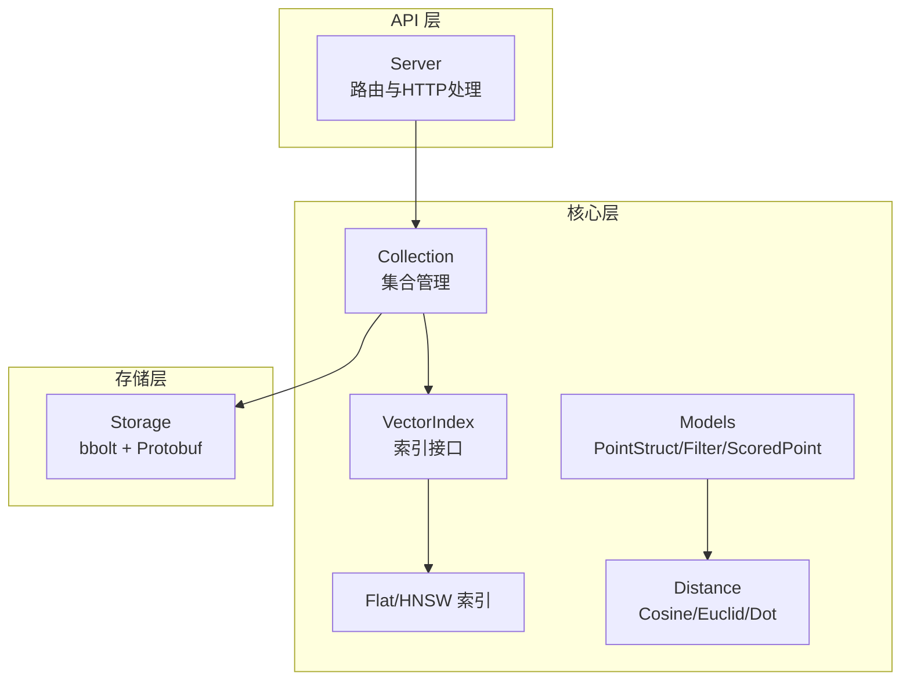
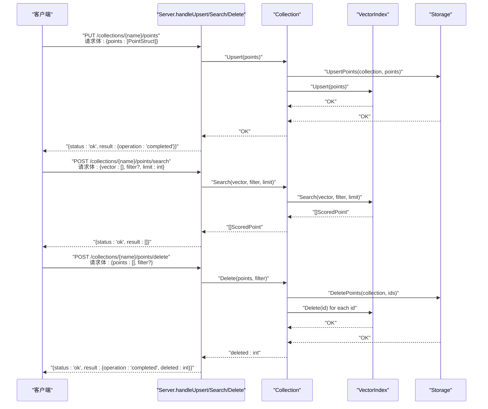
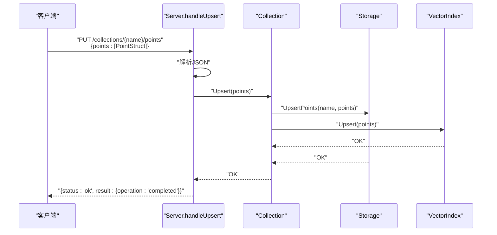
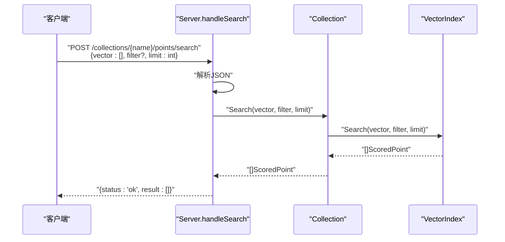
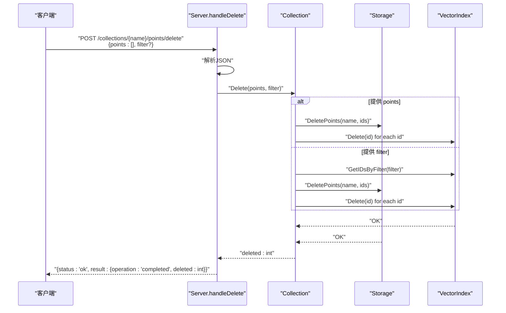
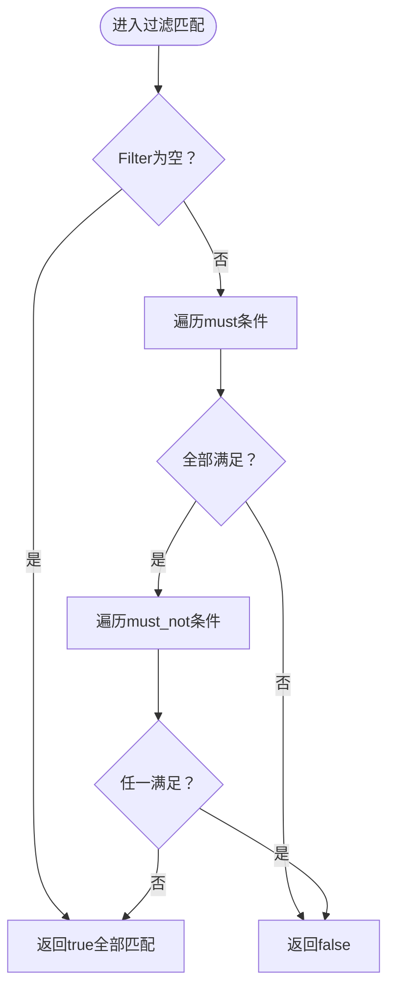
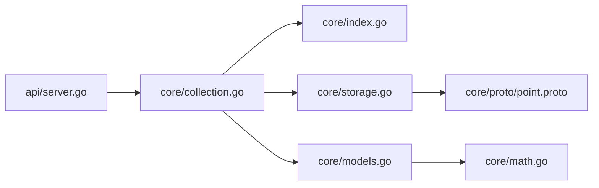

# 点操作 API

<cite>
**本文引用的文件**
- [api/server.go](file://api/server.go)
- [core/models.go](file://core/models.go)
- [core/collection.go](file://core/collection.go)
- [core/storage.go](file://core/storage.go)
- [core/index.go](file://core/index.go)
- [core/math.go](file://core/math.go)
- [core/proto/point.proto](file://core/proto/point.proto)
- [cmd/govector/main.go](file://cmd/govector/main.go)
- [api/server_test.go](file://api/server_test.go)
</cite>

## 目录
1. [简介](#简介)
2. [项目结构](#项目结构)
3. [核心组件](#核心组件)
4. [架构总览](#架构总览)
5. [详细组件分析](#详细组件分析)
6. [依赖分析](#依赖分析)
7. [性能考虑](#性能考虑)
8. [故障排除指南](#故障排除指南)
9. [结论](#结论)
10. [附录](#附录)

## 简介
本文件面向“点操作”API，系统性地记录与实现相关的 HTTP 端点：PUT /collections/{name}/points（Upsert 点）、POST /collections/{name}/points/search（搜索）、POST /collections/{name}/points/delete（删除）。文档涵盖：
- 端点请求/响应模式与字段定义
- PointStruct 结构、向量数据格式、过滤条件语法
- Upsert 批量插入、更新与覆盖机制
- 搜索查询参数配置（向量、过滤器、限制数量）
- 删除操作的多种方式（按 ID 与按过滤条件）
- 完整的 JSON 示例与错误处理说明

## 项目结构
该服务采用分层设计：
- API 层：负责路由与 HTTP 协议编解码
- 核心层：Collection、Index、Storage 等业务逻辑
- 存储层：基于 bbolt 的本地持久化，配合 Protobuf 序列化



图表来源
- [api/server.go:54-95](file://api/server.go#L54-L95)
- [core/collection.go:9-20](file://core/collection.go#L9-L20)
- [core/index.go:5-28](file://core/index.go#L5-L28)
- [core/storage.go:13-20](file://core/storage.go#L13-L20)
- [core/math.go:5-22](file://core/math.go#L5-L22)

章节来源
- [api/server.go:54-95](file://api/server.go#L54-L95)
- [core/collection.go:9-20](file://core/collection.go#L9-L20)
- [core/index.go:5-28](file://core/index.go#L5-L28)
- [core/storage.go:13-20](file://core/storage.go#L13-L20)
- [core/math.go:5-22](file://core/math.go#L5-L22)

## 核心组件
- Server：HTTP 路由与请求处理，暴露点操作端点
- Collection：集合抽象，封装 Upsert/Search/Delete 业务
- VectorIndex 接口：统一的索引能力（Upsert/Search/Delete/Count/Filter）
- Storage：本地持久化，支持 bbolt 与 Protobuf 序列化
- Models：数据模型（PointStruct、Filter、ScoredPoint）与匹配算法
- Distance：距离度量（Cosine/Euclid/Dot）

章节来源
- [api/server.go:16-34](file://api/server.go#L16-L34)
- [core/collection.go:9-20](file://core/collection.go#L9-L20)
- [core/index.go:5-28](file://core/index.go#L5-L28)
- [core/storage.go:13-20](file://core/storage.go#L13-L20)
- [core/models.go:5-25](file://core/models.go#L5-L25)
- [core/math.go:5-22](file://core/math.go#L5-L22)

## 架构总览
点操作 API 的调用链路如下：



图表来源
- [api/server.go:148-176](file://api/server.go#L148-L176)
- [api/server.go:182-218](file://api/server.go#L182-L218)
- [api/server.go:224-258](file://api/server.go#L224-L258)
- [core/collection.go:97-133](file://core/collection.go#L97-L133)
- [core/collection.go:138-147](file://core/collection.go#L138-L147)
- [core/collection.go:162-197](file://core/collection.go#L162-L197)
- [core/storage.go:148-187](file://core/storage.go#L148-L187)
- [core/storage.go:341-359](file://core/storage.go#L341-L359)

## 详细组件分析

### 点结构与过滤器模型
- PointStruct：包含唯一标识、版本号、向量、可选负载（用于过滤）
- ScoredPoint：搜索结果，包含相似度分数与点信息
- Filter：支持 must/must_not 条件，条件类型包括 exact、range、prefix、contains、regex
- Distance：支持 Cosine、Euclid、Dot 三种度量

```mermaid
classDiagram
class PointStruct {
+string id
+uint64 version
+[]float32 vector
+map[string]interface{} payload
}
class ScoredPoint {
+string id
+uint64 version
+float32 score
+map[string]interface{} payload
}
class Filter {
+[]Condition must
+[]Condition must_not
}
class Condition {
+string key
+string type
+MatchValue match
+RangeValue range
}
class MatchValue {
+interface{} value
}
class RangeValue {
+interface{} gt
+interface{} gte
+interface{} lt
+interface{} lte
}
class Distance {
<<enumeration>>
+Cosine
+Euclid
+Dot
}
ScoredPoint --> PointStruct : "包含"
Filter --> Condition : "组合"
Condition --> MatchValue : "匹配值"
Condition --> RangeValue : "范围值"
Collection ..> Distance : "使用"
```

图表来源
- [core/models.go:9-25](file://core/models.go#L9-L25)
- [core/models.go:27-69](file://core/models.go#L27-L69)
- [core/math.go:5-22](file://core/math.go#L5-L22)

章节来源
- [core/models.go:9-25](file://core/models.go#L9-L25)
- [core/models.go:27-69](file://core/models.go#L27-L69)
- [core/math.go:5-22](file://core/math.go#L5-L22)

### Upsert 点（PUT /collections/{name}/points）
- 功能：批量插入或更新点；若集合不存在返回 404；请求体必须为合法 JSON 返回 400；内部错误返回 500
- 请求体字段
  - points：数组，元素为 PointStruct
- 响应体字段
  - status：字符串，固定为 "ok"
  - result.operation：字符串，固定为 "completed"
- 处理流程
  - 解析 JSON -> 校验集合存在 -> 调用 Collection.Upsert -> 成功返回 200 OK



图表来源
- [api/server.go:148-176](file://api/server.go#L148-L176)
- [core/collection.go:97-133](file://core/collection.go#L97-L133)
- [core/storage.go:148-187](file://core/storage.go#L148-L187)

章节来源
- [api/server.go:148-176](file://api/server.go#L148-L176)
- [core/collection.go:97-133](file://core/collection.go#L97-L133)
- [core/storage.go:148-187](file://core/storage.go#L148-L187)

### 搜索（POST /collections/{name}/points/search）
- 功能：根据向量进行相似度检索，支持可选过滤器与限制数量
- 请求体字段
  - vector：数组，浮点数，维度需与集合一致
  - filter：可选，Filter 对象
  - limit：整数，返回前 K 个结果，默认 10
- 响应体字段
  - status：字符串，固定为 "ok"
  - result：数组，元素为 ScoredPoint
- 处理流程
  - 解析 JSON -> 校验集合存在 -> 校验向量维度 -> 调用 Collection.Search -> 返回 200 OK



图表来源
- [api/server.go:182-218](file://api/server.go#L182-L218)
- [core/collection.go:138-147](file://core/collection.go#L138-L147)

章节来源
- [api/server.go:182-218](file://api/server.go#L182-L218)
- [core/collection.go:138-147](file://core/collection.go#L138-L147)

### 删除（POST /collections/{name}/points/delete）
- 功能：支持按 ID 删除或按过滤条件删除；二者至少提供其一
- 请求体字段
  - points：可选，字符串数组，指定要删除的点 ID
  - filter：可选，Filter 对象，匹配要删除的点
- 响应体字段
  - status：字符串，固定为 "ok"
  - result.operation：字符串，固定为 "completed"
  - result.deleted：整数，实际删除的点数量
- 处理流程
  - 解析 JSON -> 校验集合存在 -> 计算目标 ID 列表（ID 或通过过滤器推导）-> 先删除存储再删除索引 -> 返回 200 OK



图表来源
- [api/server.go:224-258](file://api/server.go#L224-L258)
- [core/collection.go:162-197](file://core/collection.go#L162-L197)
- [core/storage.go:341-359](file://core/storage.go#L341-L359)

章节来源
- [api/server.go:224-258](file://api/server.go#L224-L258)
- [core/collection.go:162-197](file://core/collection.go#L162-L197)
- [core/storage.go:341-359](file://core/storage.go#L341-L359)

### 过滤器语法与匹配规则
- Filter
  - must：所有条件都必须满足
  - must_not：任何条件都不能满足
- Condition
  - key：负载中的键名
  - type：匹配类型
    - exact：精确相等
    - range：数值范围比较（gt/gte/lt/lte）
    - prefix：字符串前缀匹配
    - contains：数组/字符串包含
    - regex：正则表达式匹配
  - match：匹配值
  - range：范围值对象
- 匹配算法
  - 数值范围：支持 int 与 float64
  - 字符串前缀：长度检查
  - 数组/字符串包含：逐项比较
  - 正则：编译并匹配



图表来源
- [core/models.go:86-106](file://core/models.go#L86-L106)
- [core/models.go:108-129](file://core/models.go#L108-L129)
- [core/models.go:131-195](file://core/models.go#L131-L195)
- [core/models.go:197-214](file://core/models.go#L197-L214)
- [core/models.go:216-248](file://core/models.go#L216-L248)
- [core/models.go:260-279](file://core/models.go#L260-L279)

章节来源
- [core/models.go:86-106](file://core/models.go#L86-L106)
- [core/models.go:108-129](file://core/models.go#L108-L129)
- [core/models.go:131-195](file://core/models.go#L131-L195)
- [core/models.go:197-214](file://core/models.go#L197-L214)
- [core/models.go:216-248](file://core/models.go#L216-L248)
- [core/models.go:260-279](file://core/models.go#L260-L279)

### 向量数据格式与度量
- 向量：[]float32，维度需与集合一致
- 度量：
  - Cosine：[-1, 1]，值越大越相似
  - Euclid：[0, +∞)，值越小越相似
  - Dot：(-∞, +∞)，值越大越相似
- 默认度量为 Cosine

章节来源
- [core/math.go:5-22](file://core/math.go#L5-L22)
- [core/math.go:27-78](file://core/math.go#L27-L78)

### 端点与错误码
- PUT /collections/{name}/points
  - 200：成功
  - 400：无效 JSON
  - 404：集合不存在
  - 500：内部错误
- POST /collections/{name}/points/search
  - 200：成功
  - 400：无效 JSON
  - 404：集合不存在
  - 500：内部错误
- POST /collections/{name}/points/delete
  - 200：成功
  - 400：无效 JSON
  - 404：集合不存在
  - 500：内部错误

章节来源
- [api/server.go:148-176](file://api/server.go#L148-L176)
- [api/server.go:182-218](file://api/server.go#L182-L218)
- [api/server.go:224-258](file://api/server.go#L224-L258)

## 依赖分析
- API 层依赖核心层的 Collection 与 Index 接口
- Collection 依赖 VectorIndex 与 Storage
- Storage 依赖 bbolt 与 Protobuf
- Models 与 Distance 为纯数据与计算层



图表来源
- [api/server.go:16-34](file://api/server.go#L16-L34)
- [core/collection.go:9-20](file://core/collection.go#L9-L20)
- [core/storage.go:13-20](file://core/storage.go#L13-L20)
- [core/models.go:5-25](file://core/models.go#L5-L25)
- [core/math.go:5-22](file://core/math.go#L5-L22)
- [core/proto/point.proto:1-49](file://core/proto/point.proto#L1-L49)

章节来源
- [api/server.go:16-34](file://api/server.go#L16-L34)
- [core/collection.go:9-20](file://core/collection.go#L9-L20)
- [core/storage.go:13-20](file://core/storage.go#L13-L20)
- [core/models.go:5-25](file://core/models.go#L5-L25)
- [core/math.go:5-22](file://core/math.go#L5-L22)
- [core/proto/point.proto:1-49](file://core/proto/point.proto#L1-L49)

## 性能考虑
- 索引选择：Flat（内存暴力）与 HNSW（图近似）可切换，HNSW 在大规模场景下具备更优的查询延迟
- 持久化顺序：先写存储再更新索引，保证一致性与可恢复性
- 向量量化：可启用 SQ8 量化以降低磁盘占用与加载成本
- 查询默认限制：未显式设置 limit 时默认返回前 10 条结果

章节来源
- [core/collection.go:22-41](file://core/collection.go#L22-L41)
- [core/storage.go:148-187](file://core/storage.go#L148-L187)
- [api/server.go:203-205](file://api/server.go#L203-L205)

## 故障排除指南
- 集合不存在
  - 现象：404 Not Found
  - 排查：确认集合名称正确且已创建
- JSON 解析失败
  - 现象：400 Bad Request
  - 排查：检查请求体是否为合法 JSON
- 向量维度不匹配
  - 现象：Search 时返回 500 内部错误
  - 排查：确保 vector 维度与集合一致
- 删除参数缺失
  - 现象：Delete 返回 500 内部错误（提示必须提供 points 或 filter）
  - 排查：至少提供 points 或 filter 其中之一

章节来源
- [api/server.go:153-156](file://api/server.go#L153-L156)
- [api/server.go:198-201](file://api/server.go#L198-L201)
- [api/server.go:229-232](file://api/server.go#L229-L232)
- [api/server.go:244-247](file://api/server.go#L244-L247)
- [core/collection.go:105-109](file://core/collection.go#L105-L109)
- [core/collection.go:139-141](file://core/collection.go#L139-L141)
- [core/collection.go:173-175](file://core/collection.go#L173-L175)

## 结论
点操作 API 提供了与 Qdrant 兼容的 REST 接口，覆盖 Upsert、Search、Delete 三大核心能力。通过 Collection 抽象与 VectorIndex 接口，系统在一致性、可扩展性与性能之间取得平衡。建议在生产环境结合 HNSW 索引与向量量化以获得最佳吞吐与延迟表现。

## 附录

### 端点定义与示例

- Upsert（PUT /collections/{name}/points）
  - 请求体
    - points：数组，元素为 PointStruct
      - id：字符串，唯一标识
      - version：整数，版本号（自动赋值）
      - vector：数组，浮点数，维度需与集合一致
      - payload：可选，键值对，用于过滤
  - 响应体
    - status：字符串，固定为 "ok"
    - result.operation：字符串，固定为 "completed"

- 搜索（POST /collections/{name}/points/search）
  - 请求体
    - vector：数组，浮点数，维度需与集合一致
    - filter：可选，Filter 对象
      - must：[]Condition
      - must_not：[]Condition
    - limit：整数，返回前 K 个结果，默认 10
  - 响应体
    - status：字符串，固定为 "ok"
    - result：数组，元素为 ScoredPoint
      - id：字符串
      - version：整数
      - score：浮点数
      - payload：可选

- 删除（POST /collections/{name}/points/delete）
  - 请求体
    - points：可选，字符串数组，指定要删除的点 ID
    - filter：可选，Filter 对象，匹配要删除的点
  - 响应体
    - status：字符串，固定为 "ok"
    - result.operation：字符串，固定为 "completed"
    - result.deleted：整数，实际删除的点数量

章节来源
- [api/server.go:148-176](file://api/server.go#L148-L176)
- [api/server.go:182-218](file://api/server.go#L182-L218)
- [api/server.go:224-258](file://api/server.go#L224-L258)
- [core/models.go:9-25](file://core/models.go#L9-L25)
- [core/models.go:27-69](file://core/models.go#L27-L69)

### 过滤器语法参考
- exact：精确匹配
- range：gt/gte/lt/lte 数值范围
- prefix：字符串前缀
- contains：数组/字符串包含
- regex：正则表达式

章节来源
- [core/models.go:27-69](file://core/models.go#L27-L69)
- [core/models.go:131-195](file://core/models.go#L131-L195)
- [core/models.go:197-214](file://core/models.go#L197-L214)
- [core/models.go:216-248](file://core/models.go#L216-L248)
- [core/models.go:260-279](file://core/models.go#L260-L279)

### 示例请求/响应（路径引用）
- Upsert 请求体示例
  - [api/server_test.go:344-349](file://api/server_test.go#L344-L349)
- 搜索请求体示例
  - [api/server_test.go:386-389](file://api/server_test.go#L386-L389)
- 删除请求体示例（按 ID）
  - [api/server_test.go:435-437](file://api/server_test.go#L435-L437)
- 删除请求体示例（按过滤条件）
  - [api/server_test.go:451-457](file://api/server_test.go#L451-L457)