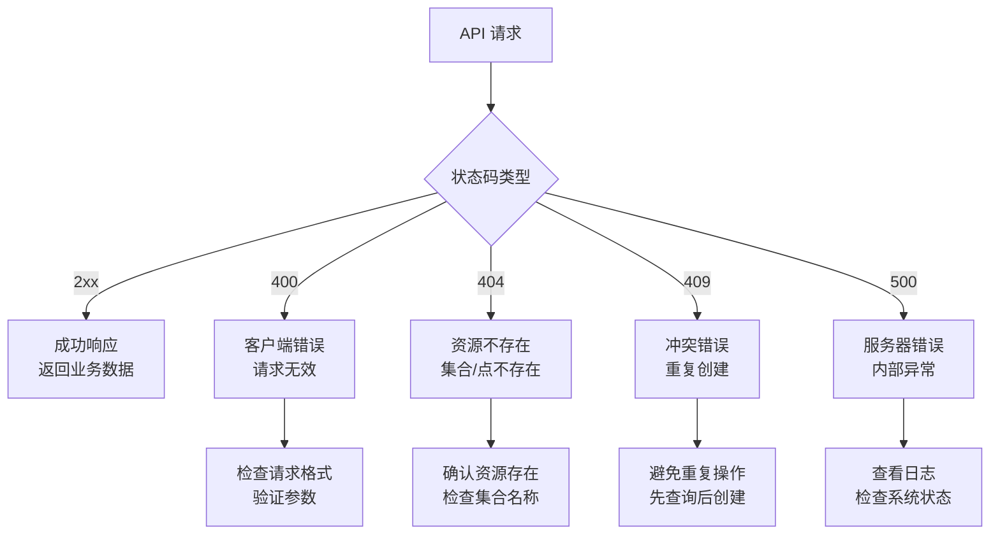
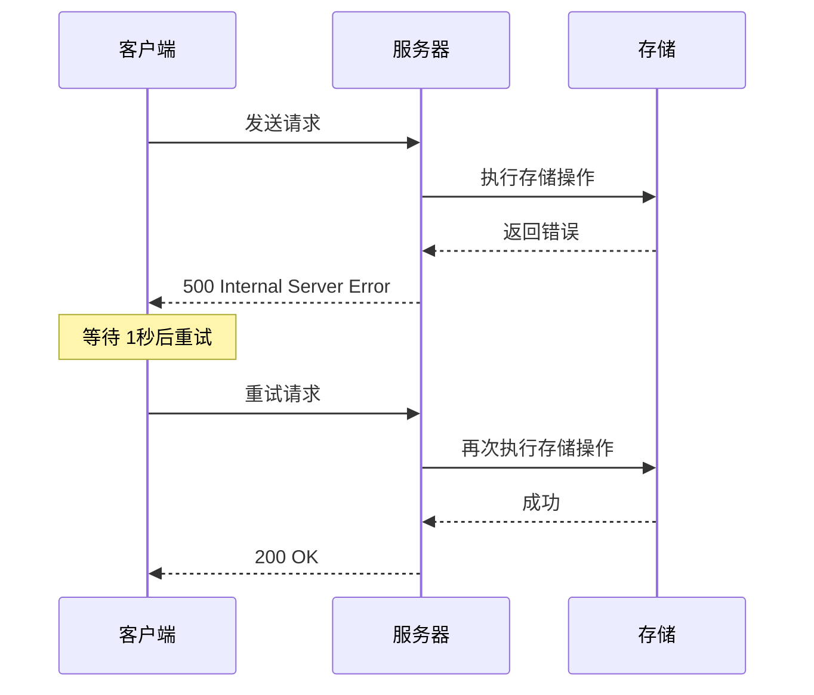
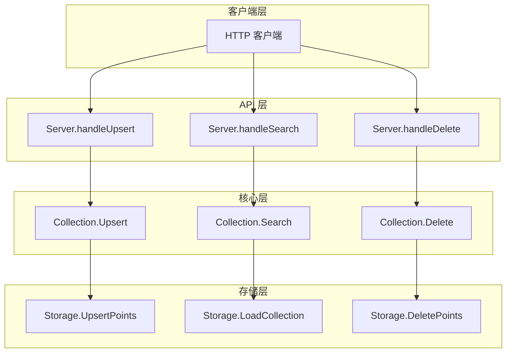
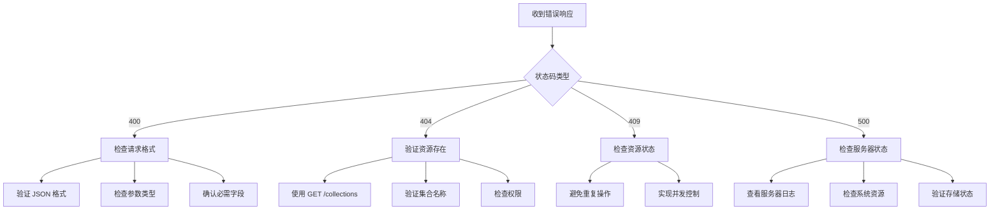

# 错误处理

<cite>
**本文档引用的文件**
- [api/server.go](file://api/server.go)
- [api/server_test.go](file://api/server_test.go)
- [cmd/govector/main.go](file://cmd/govector/main.go)
- [core/collection.go](file://core/collection.go)
- [core/models.go](file://core/models.go)
- [core/storage.go](file://core/storage.go)
- [core/index.go](file://core/index.go)
- [core/flat_index.go](file://core/flat_index.go)
- [core/hnsw_index.go](file://core/hnsw_index.go)
</cite>

## 目录
1. [简介](#简介)
2. [错误状态码概览](#错误状态码概览)
3. [HTTP 状态码详解](#http-状态码详解)
4. [错误响应格式](#错误响应格式)
5. [常见错误场景与诊断](#常见错误场景与诊断)
6. [错误日志与调试](#错误日志与调试)
7. [最佳实践与重试策略](#最佳实践与重试策略)
8. [架构层面的错误处理](#架构层面的错误处理)
9. [故障排除指南](#故障排除指南)
10. [总结](#总结)

## 简介

GoVector 是一个高性能的嵌入式向量数据库，提供了与 Qdrant 兼容的 REST API 接口。本指南专注于系统中的错误处理机制，详细说明所有可能的 HTTP 状态码、触发条件、错误响应格式以及诊断和解决方法。

## 错误状态码概览

GoVector API 支持以下标准 HTTP 状态码：

- **200 OK** - 请求成功执行
- **400 Bad Request** - 请求格式或参数无效
- **404 Not Found** - 指定的资源不存在
- **409 Conflict** - 资源冲突（如重复创建）
- **500 Internal Server Error** - 服务器内部错误



**图表来源**
- [api/server.go:145-423](file://api/server.go#L145-L423)

## HTTP 状态码详解

### 200 OK - 成功响应

**触发条件：**
- 所有成功的 API 调用
- 集合管理操作成功完成
- 向量操作成功执行

**响应特征：**
- 返回标准的 JSON 响应格式
- 包含 `status` 字段为 `"ok"`
- 包含具体的业务结果在 `result` 字段中

### 400 Bad Request - 请求错误

**触发条件：**
- JSON 格式无效
- 缺少必需的请求参数
- 参数类型不正确
- 向量维度不匹配

**具体场景：**

1. **无效 JSON 格式**
   - 请求体不是有效的 JSON
   - 字段类型与期望不符

2. **参数验证失败**
   - 集合名称为空或格式不正确
   - 向量大小必须为正数
   - 距离度量参数无效

3. **数据格式错误**
   - 向量数组中的向量维度与集合定义不匹配
   - 查询向量维度不正确

**章节来源**
- [api/server.go:161-163](file://api/server.go#L161-L163)
- [api/server.go:287-290](file://api/server.go#L287-L290)
- [api/server.go:298-304](file://api/server.go#L298-L304)
- [core/collection.go:105-107](file://core/collection.go#L105-L107)

### 404 Not Found - 资源不存在

**触发条件：**
- 访问不存在的集合
- 对不存在的集合执行操作
- 删除不存在的点

**具体场景：**

1. **集合不存在**
   - 尝试访问未创建的集合
   - 使用错误的集合名称

2. **点不存在**
   - 删除不存在的点 ID
   - 搜索不存在的集合

3. **路径参数错误**
   - 集合名称拼写错误
   - URL 路径不正确

**章节来源**
- [api/server.go:153-155](file://api/server.go#L153-L155)
- [api/server.go:187-189](file://api/server.go#L187-L189)
- [api/server.go:229-231](file://api/server.go#L229-L231)
- [api/server.go:362-364](file://api/server.go#L362-L364)
- [api/server.go:408-410](file://api/server.go#L408-L410)

### 409 Conflict - 冲突错误

**触发条件：**
- 尝试创建已存在的集合
- 资源状态冲突

**具体场景：**
- 重复创建同名集合
- 并发操作导致的状态冲突

**章节来源**
- [api/server.go:281-283](file://api/server.go#L281-L283)

### 500 Internal Server Error - 内部错误

**触发条件：**
- 存储引擎操作失败
- 索引更新失败
- 数据库连接问题
- 系统资源不足

**具体场景：**

1. **存储层错误**
   - 数据库打开失败
   - 数据持久化失败
   - 元数据保存失败

2. **索引层错误**
   - 向量索引更新失败
   - 搜索操作异常
   - 点删除失败

3. **系统级错误**
   - 内存不足
   - 文件权限问题
   - 网络连接异常

**章节来源**
- [api/server.go:167-169](file://api/server.go#L167-L169)
- [api/server.go:209-211](file://api/server.go#L209-L211)
- [api/server.go:246-248](file://api/server.go#L246-L248)
- [api/server.go:326-328](file://api/server.go#L326-L328)
- [core/storage.go:100-101](file://core/storage.go#L100-L101)
- [core/collection.go:113-115](file://core/collection.go#L113-L115)

## 错误响应格式

### 标准错误响应结构

所有错误响应都遵循统一的 JSON 格式：

```json
{
  "status": "error",
  "result": {
    "message": "错误描述信息",
    "code": "错误代码",
    "details": "详细错误信息"
  }
}
```

### 成功响应结构

成功的响应使用相同的结构，但 `status` 为 `"ok"`：

```json
{
  "status": "ok",
  "result": {
    "operation": "completed",
    "data": "业务数据"
  }
}
```

### 字段说明

| 字段名 | 类型 | 必需 | 描述 |
|--------|------|------|------|
| status | string | 是 | 响应状态，成功时为 "ok"，错误时为 "error" |
| result | object | 是 | 响应结果对象 |
| message | string | 是 | 错误描述信息 |
| code | string | 否 | 错误代码标识符 |
| details | string | 否 | 详细的错误上下文信息 |

**章节来源**
- [api/server.go:171-175](file://api/server.go#L171-L175)
- [api/server.go:213-217](file://api/server.go#L213-L217)
- [api/server.go:250-257](file://api/server.go#L250-L257)

## 常见错误场景与诊断

### 1. 无效 JSON 格式

**触发条件：**
- 请求体不是有效的 JSON
- 字段类型与期望不符
- 缺少必需字段

**诊断步骤：**
1. 验证 JSON 格式的正确性
2. 检查必需字段是否存在
3. 确认字段类型与 API 文档一致

**解决方案：**
- 使用在线 JSON 验证工具
- 参考 API 文档的请求示例
- 实现客户端数据验证

**章节来源**
- [api/server.go:161-163](file://api/server.go#L161-L163)
- [api/server_test.go:362-369](file://api/server_test.go#L362-L369)

### 2. 集合不存在

**触发条件：**
- 访问不存在的集合名称
- 对未创建的集合执行操作

**诊断步骤：**
1. 使用 `GET /collections` 列出所有集合
2. 验证集合名称的拼写
3. 检查集合是否正确创建

**解决方案：**
- 先创建集合再进行操作
- 实现集合存在性检查
- 使用幂等操作确保集合存在

**章节来源**
- [api/server.go:153-155](file://api/server.go#L153-L155)
- [api/server_test.go:328-337](file://api/server_test.go#L328-L337)

### 3. 参数验证失败

**触发条件：**
- 向量大小为负数或零
- 距离度量参数无效
- 查询参数格式不正确

**诊断步骤：**
1. 检查向量维度设置
2. 验证距离度量的有效性
3. 确认查询参数的完整性

**解决方案：**
- 实现参数范围验证
- 提供默认参数值
- 添加输入格式验证

**章节来源**
- [api/server.go:287-290](file://api/server.go#L287-L290)
- [api/server.go:298-304](file://api/server.go#L298-L304)

### 4. 数据维度不匹配

**触发条件：**
- 向量数组中的向量维度与集合定义不匹配
- 查询向量维度与集合配置不一致

**诊断步骤：**
1. 检查集合的向量维度配置
2. 验证所有向量的维度一致性
3. 确认查询向量的维度

**解决方案：**
- 在插入数据前验证维度
- 实现自动维度检查
- 提供清晰的错误提示

**章节来源**
- [core/collection.go:105-107](file://core/collection.go#L105-L107)

### 5. 存储操作失败

**触发条件：**
- 数据库连接问题
- 文件权限不足
- 磁盘空间不足

**诊断步骤：**
1. 检查数据库文件权限
2. 验证磁盘空间充足
3. 确认数据库文件可访问

**解决方案：**
- 实现存储连接重试
- 添加磁盘空间监控
- 提供存储状态检查

**章节来源**
- [core/storage.go:100-101](file://core/storage.go#L100-L101)
- [core/storage.go:149-151](file://core/storage.go#L149-L151)

## 错误日志与调试

### 日志记录策略

GoVector 在关键错误点记录详细的日志信息：

1. **启动阶段错误**
   - 存储初始化失败
   - 集合加载异常

2. **运行时错误**
   - API 调用失败
   - 数据操作异常

3. **系统级错误**
   - 资源不足
   - 权限问题

### 调试技巧

**启用详细日志：**
```bash
# 设置环境变量以获取更详细的日志输出
export GOVECTOR_LOG_LEVEL=debug
```

**使用测试工具：**
```bash
# 使用 curl 进行手动测试
curl -X POST "http://localhost:18080/collections" \
  -H "Content-Type: application/json" \
  -d '{"name":"test","vector_size":128,"distance":"cosine"}'
```

**章节来源**
- [cmd/govector/main.go:74-76](file://cmd/govector/main.go#L74-L76)
- [api/server.go:98-129](file://api/server.go#L98-L129)

## 最佳实践与重试策略

### 客户端重试策略

**指数退避重试：**


**重试参数建议：**
- 最大重试次数：3-5 次
- 初始等待时间：1-2 秒
- 退避因子：2
- 最大等待时间：30-60 秒

### 错误处理最佳实践

**1. 客户端实现要点：**
- 实现幂等操作
- 添加超时控制
- 区分可重试错误和不可重试错误
- 记录重试历史

**2. 服务端实现要点：**
- 提供详细的错误信息
- 实现优雅降级
- 添加健康检查
- 监控错误率

**3. 配置管理：**
```yaml
retry_policy:
  max_attempts: 3
  base_delay: 1000
  max_delay: 30000
  backoff_multiplier: 2
  
error_handling:
  log_level: warn
  timeout: 30000
  circuit_breaker:
    enabled: true
    threshold: 5
    timeout: 60000
```

## 架构层面的错误处理

### 错误传播链



**图表来源**
- [api/server.go:145-423](file://api/server.go#L145-L423)
- [core/collection.go:97-197](file://core/collection.go#L97-L197)
- [core/storage.go:144-359](file://core/storage.go#L144-L359)

### 错误分类与处理策略

**可重试错误：**
- 网络连接超时
- 数据库暂时不可用
- 资源竞争冲突

**不可重试错误：**
- 请求参数格式错误
- 资源不存在
- 权限不足

**章节来源**
- [api/server.go:145-423](file://api/server.go#L145-L423)
- [core/collection.go:97-197](file://core/collection.go#L97-L197)

## 故障排除指南

### 常见问题诊断流程



### 性能相关错误

**内存不足错误：**
- 监控内存使用情况
- 调整批量操作大小
- 实现内存压力检测

**磁盘空间不足：**
- 监控磁盘使用率
- 实现自动清理机制
- 配置磁盘空间告警

**网络连接问题：**
- 实现连接池管理
- 添加连接超时设置
- 实现自动重连机制

**章节来源**
- [core/storage.go:100-101](file://core/storage.go#L100-L101)
- [cmd/govector/main.go](file://cmd/govector/main.go)

## 总结

GoVector 的错误处理机制设计遵循 RESTful API 最佳实践，提供了清晰、一致的错误响应格式和完善的错误分类。通过理解不同状态码的触发条件、实现适当的客户端重试策略、建立有效的日志监控体系，可以显著提升系统的稳定性和用户体验。

关键要点：
- 始终验证请求格式和参数有效性
- 实现合理的重试机制和超时控制
- 建立完善的日志记录和监控体系
- 区分可重试和不可重试错误类型
- 提供清晰的错误信息和诊断建议

通过遵循这些指导原则，开发者可以构建更加健壮和可靠的向量数据库应用。