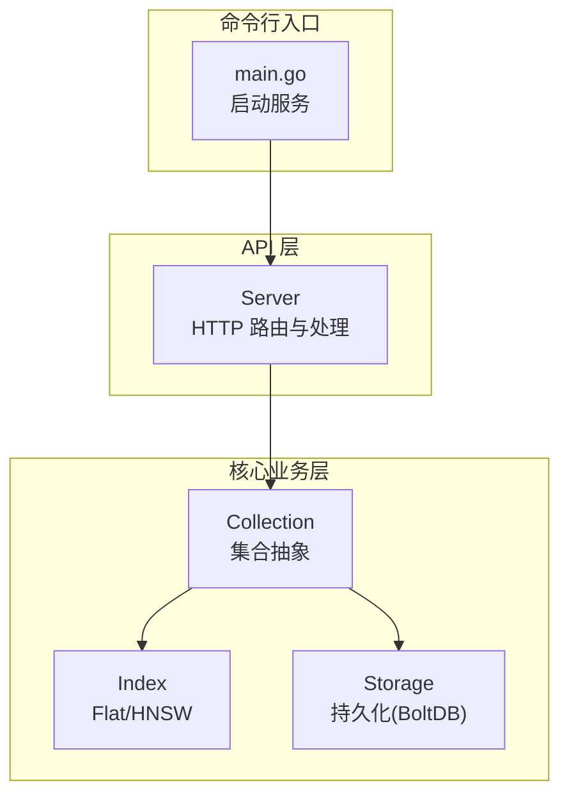
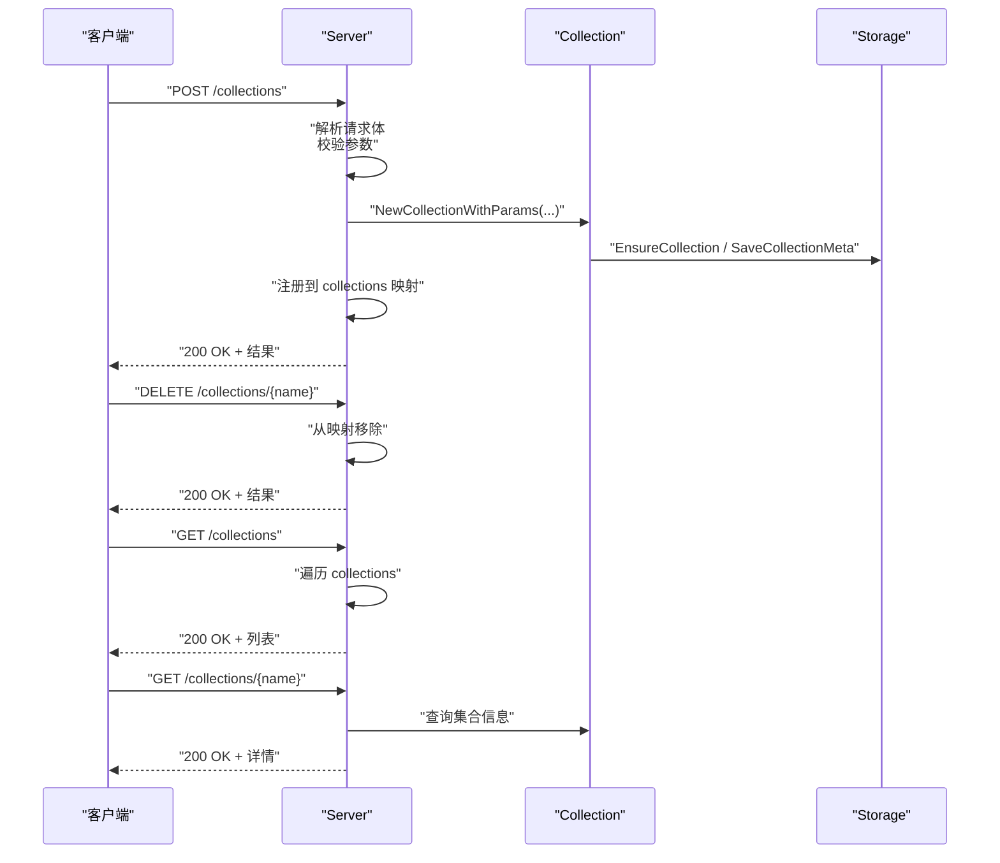
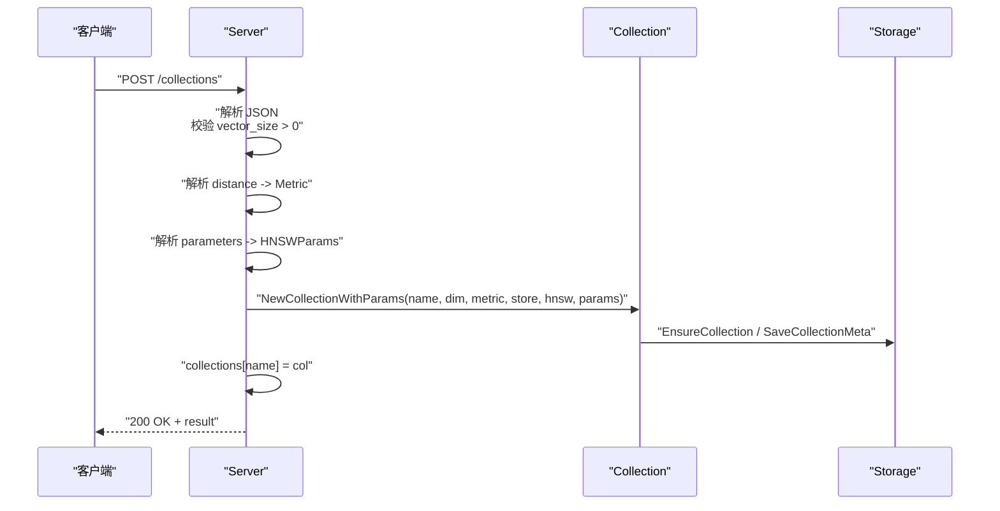
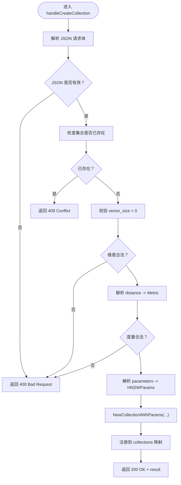
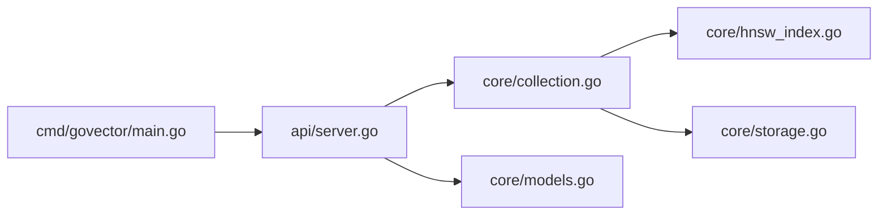

# 集合管理 API

<cite>
**本文档引用的文件**
- [api/server.go](file://api/server.go)
- [core/collection.go](file://core/collection.go)
- [core/models.go](file://core/models.go)
- [core/hnsw_index.go](file://core/hnsw_index.go)
- [core/storage.go](file://core/storage.go)
- [cmd/govector/main.go](file://cmd/govector/main.go)
- [api/server_test.go](file://api/server_test.go)
- [README.md](file://README.md)
</cite>

## 目录
1. [简介](#简介)
2. [项目结构](#项目结构)
3. [核心组件](#核心组件)
4. [架构总览](#架构总览)
5. [详细组件分析](#详细组件分析)
6. [依赖关系分析](#依赖关系分析)
7. [性能考虑](#性能考虑)
8. [故障排除指南](#故障排除指南)
9. [结论](#结论)

## 简介
本文件面向集合管理 API 的使用者与维护者，系统性地说明集合相关的 HTTP 端点，包括：
- POST /collections：创建集合
- DELETE /collections/{name}：删除集合
- GET /collections：列出集合
- GET /collections/{name}：获取集合信息

同时，详细解释集合配置参数（如 vector_size、distance、hnsw、parameters）的作用与取值范围，并提供丰富的 JSON 示例以展示不同类型的集合创建方式（含 HNSW 参数配置与距离度量选择）。最后，说明集合生命周期管理与状态检查方法。

## 项目结构
该服务采用分层架构：
- API 层：提供 HTTP 接口，路由到具体处理函数
- 核心业务层：Collection 抽象、索引引擎（Flat/HNSW）、存储引擎（BoltDB）
- 命令行入口：启动独立微服务模式

图表来源
- [api/server.go:54-95](file://api/server.go#L54-L95)
- [core/collection.go:22-91](file://core/collection.go#L22-L91)
- [core/storage.go:88-114](file://core/storage.go#L88-L114)
- [cmd/govector/main.go:18-92](file://cmd/govector/main.go#L18-L92)

章节来源
- [api/server.go:54-95](file://api/server.go#L54-L95)
- [core/collection.go:22-91](file://core/collection.go#L22-L91)
- [core/storage.go:88-114](file://core/storage.go#L88-L114)
- [cmd/govector/main.go:18-92](file://cmd/govector/main.go#L18-L92)

## 核心组件
- Server：HTTP 服务器，负责路由与集合管理端点处理
- Collection：集合抽象，封装向量维度、距离度量、索引与存储
- Index：索引接口，支持 Flat 与 HNSW 两种实现
- Storage：本地持久化引擎，基于 BoltDB 与 Protobuf
- HNSWParams：HNSW 索引可调参数集合

章节来源
- [api/server.go:16-34](file://api/server.go#L16-L34)
- [core/collection.go:9-20](file://core/collection.go#L9-L20)
- [core/hnsw_index.go:11-39](file://core/hnsw_index.go#L11-L39)
- [core/storage.go:13-20](file://core/storage.go#L13-L20)

## 架构总览
集合管理 API 的关键流程如下：
- 创建集合：解析请求体，校验参数，构建 Collection 并注册到 Server
- 删除集合：从 Server 移除集合实例
- 列出集合：遍历 Server 中的集合并返回基本信息
- 获取集合：返回指定集合的名称、维度、距离度量与点数

图表来源
- [api/server.go:260-423](file://api/server.go#L260-L423)
- [core/collection.go:30-91](file://core/collection.go#L30-L91)
- [core/storage.go:131-142](file://core/storage.go#L131-L142)

## 详细组件分析

### 端点规范与行为

#### POST /collections（创建集合）
- 请求体字段
  - name：字符串，集合唯一标识
  - vector_size：正整数，向量维度
  - distance：字符串，距离度量，支持 "euclidean"/"Euclid"、"dot"/"Dot"、"cosine"/"Cosine"
  - hnsw：布尔值，是否使用 HNSW 索引（可选）
  - parameters：对象，HNSW 参数（可选）
    - m：整数，节点最大连接数
    - ef_construction：整数，构建时候选列表大小
    - ef_search：整数，搜索时候选列表大小
    - k：整数，返回近邻数量
- 成功响应
  - 状态码：200
  - 返回字段：status、result.name、result.vector_size、result.distance、result.hnsw、result.parameters、result.operation
- 错误响应
  - 400：JSON 解析失败、vector_size 非正、distance 不合法
  - 409：集合已存在
  - 500：内部错误（创建失败）

示例请求（创建 HNSW 集合，自定义参数）
- 请求体
  - name: "my_collection"
  - vector_size: 128
  - distance: "euclidean"
  - hnsw: true
  - parameters: { "m": 16, "ef_construction": 128, "ef_search": 64, "k": 10 }

示例响应
- 状态码：200
- 返回体包含集合元数据与参数

章节来源
- [api/server.go:260-352](file://api/server.go#L260-L352)
- [core/hnsw_index.go:11-39](file://core/hnsw_index.go#L11-L39)

#### DELETE /collections/{name}（删除集合）
- 路径参数
  - name：集合名称
- 成功响应
  - 状态码：200
  - 返回字段：status、result.operation、result.collection
- 错误响应
  - 404：集合不存在

章节来源
- [api/server.go:354-380](file://api/server.go#L354-L380)

#### GET /collections（列出集合）
- 成功响应
  - 状态码：200
  - 返回字段：status、result（数组），每项包含 name、vector_size、distance、points_count
- 错误响应
  - 无（总是 200）

章节来源
- [api/server.go:382-400](file://api/server.go#L382-L400)

#### GET /collections/{name}（获取集合信息）
- 路径参数
  - name：集合名称
- 成功响应
  - 状态码：200
  - 返回字段：status、result.name、result.vector_size、result.distance、result.points_count
- 错误响应
  - 404：集合不存在

章节来源
- [api/server.go:402-423](file://api/server.go#L402-L423)

### 集合配置参数详解

- vector_size（向量维度）
  - 类型：正整数
  - 作用：固定集合中向量的维度，插入与查询时必须匹配
  - 取值范围：> 0
  - 影响：内存占用、索引构建成本、查询性能

- distance（距离度量）
  - 类型：字符串
  - 取值："euclidean"/"Euclid"、"dot"/"Dot"、"cosine"/"Cosine"
  - 影响：相似度计算方式，决定索引与搜索策略
  - 注意：HNSW 对不同度量有不同距离函数适配

- hnsw（是否启用 HNSW）
  - 类型：布尔值
  - 作用：控制使用 HNSW 近似最近邻索引还是 Flat 线性索引
  - 默认：true（在命令行启动时可通过参数控制）

- parameters（HNSW 参数）
  - m：节点最大连接数，越大图越稠密，召回率越高但内存与构建时间增加
  - ef_construction：构建阶段候选列表大小，越大召回率越高但构建更慢
  - ef_search：搜索阶段候选列表大小，越大召回率越高但延迟增加
  - k：返回近邻数量（HNSW 搜索时会过采样再过滤）

章节来源
- [api/server.go:292-321](file://api/server.go#L292-L321)
- [core/hnsw_index.go:11-39](file://core/hnsw_index.go#L11-L39)

### 集合生命周期与状态检查

- 生命周期
  - 创建：Server.handleCreateCollection 解析请求、校验参数、创建 Collection 并注册到 Server
  - 运行：Server 维护 collections 映射，提供查询与操作
  - 删除：Server.handleDeleteCollection 从映射移除集合
  - 加载：Server.Start 启动时自动从 Storage 加载集合元数据并重建集合

- 状态检查
  - 列表：GET /collections 返回集合基本信息（包含 points_count）
  - 详情：GET /collections/{name} 返回集合详细信息（包含 points_count）
  - 存在性：删除与查询端点在找不到集合时返回 404

- 数据一致性
  - Collection.Upsert 先写入 Storage，再更新内存索引；若索引更新失败则尝试回滚 Storage 写入
  - Collection.Delete 支持按 ID 或按过滤条件删除，先删 Storage 再删索引

章节来源
- [api/server.go:54-95](file://api/server.go#L54-L95)
- [api/server.go:382-423](file://api/server.go#L382-L423)
- [core/collection.go:93-133](file://core/collection.go#L93-L133)
- [core/collection.go:156-197](file://core/collection.go#L156-L197)

### 端到端序列图（创建集合）

图表来源
- [api/server.go:260-352](file://api/server.go#L260-L352)
- [core/collection.go:30-91](file://core/collection.go#L30-L91)
- [core/storage.go:131-142](file://core/storage.go#L131-L142)

### 处理逻辑流程图（创建集合）

图表来源
- [api/server.go:260-352](file://api/server.go#L260-L352)

## 依赖关系分析

图表来源
- [api/server.go:13](file://api/server.go#L13)
- [core/collection.go:3](file://core/collection.go#L3)
- [core/hnsw_index.go:3](file://core/hnsw_index.go#L3)
- [core/storage.go:3](file://core/storage.go#L3)
- [cmd/govector/main.go:14](file://cmd/govector/main.go#L14)

章节来源
- [api/server.go:13](file://api/server.go#L13)
- [core/collection.go:3](file://core/collection.go#L3)
- [core/hnsw_index.go:3](file://core/hnsw_index.go#L3)
- [core/storage.go:3](file://core/storage.go#L3)
- [cmd/govector/main.go:14](file://cmd/govector/main.go#L14)

## 性能考虑
- HNSW 与 Flat 的选择
  - HNSW：适合大规模数据，查询延迟低，但构建与内存开销更高
  - Flat：简单直接，适合小规模或临时场景
- HNSW 参数调优
  - m：影响图密度与召回，建议从默认值开始，逐步增大观察效果
  - ef_construction：构建质量与速度权衡，越大越慢但召回更好
  - ef_search：查询延迟与召回权衡，越大越慢但更准
  - k：搜索过采样倍数，结合过滤使用时建议适当放大
- 距离度量
  - Cosine：常用于归一化向量，适合文本/图像检索
  - Euclidean：适合未归一化的欧氏空间
  - Dot：点积方向敏感，注意符号翻转的影响
- 存储与持久化
  - 启用持久化可实现重启后自动加载集合元数据与点集
  - 支持向量量化（SQ8）降低磁盘占用与内存压力

章节来源
- [README.md:30-42](file://README.md#L30-L42)
- [core/hnsw_index.go:11-39](file://core/hnsw_index.go#L11-L39)
- [core/storage.go:95-114](file://core/storage.go#L95-L114)

## 故障排除指南
- 创建集合报错
  - 400：检查 JSON 格式、vector_size 是否为正数、distance 是否为允许值
  - 409：集合名冲突，更换名称或先删除旧集合
  - 500：内部错误，查看服务日志定位具体原因
- 删除集合报错
  - 404：集合不存在，确认名称正确
- 查询集合报错
  - 404：集合不存在，确认名称正确
- 数据不一致
  - Upsert/删除失败时，服务会尽力回滚，但仍建议检查 Storage 与索引状态

章节来源
- [api/server.go:272-352](file://api/server.go#L272-L352)
- [api/server.go:357-380](file://api/server.go#L357-L380)
- [api/server.go:407-423](file://api/server.go#L407-L423)
- [core/collection.go:93-133](file://core/collection.go#L93-L133)
- [core/collection.go:156-197](file://core/collection.go#L156-L197)

## 结论
集合管理 API 提供了与 Qdrant 兼容的 REST 接口，覆盖集合的创建、删除、列举与信息查询。通过 vector_size、distance、hnsw 与 parameters 等配置，用户可以灵活选择索引类型与参数，平衡召回率、延迟与资源消耗。配合持久化与量化能力，可在单机环境下实现高性能、可靠的向量检索服务。