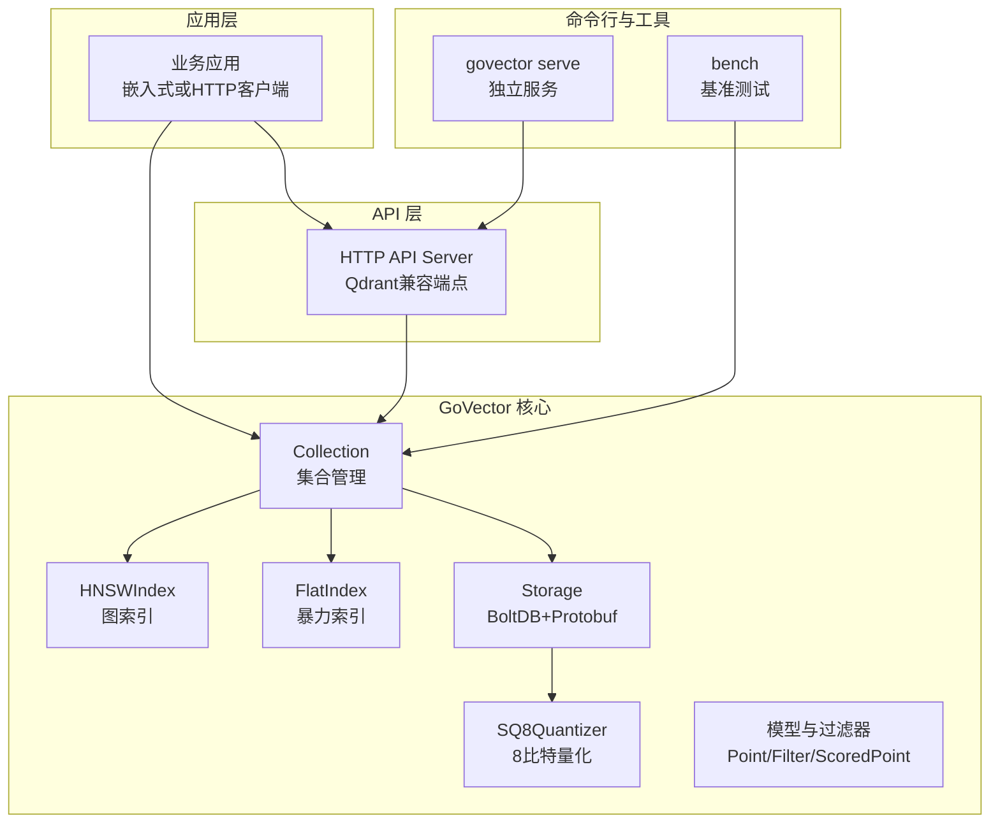
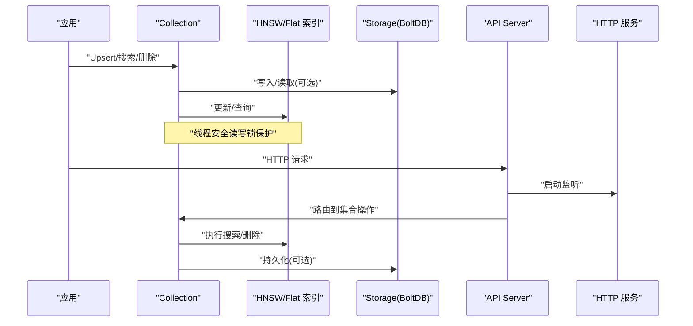
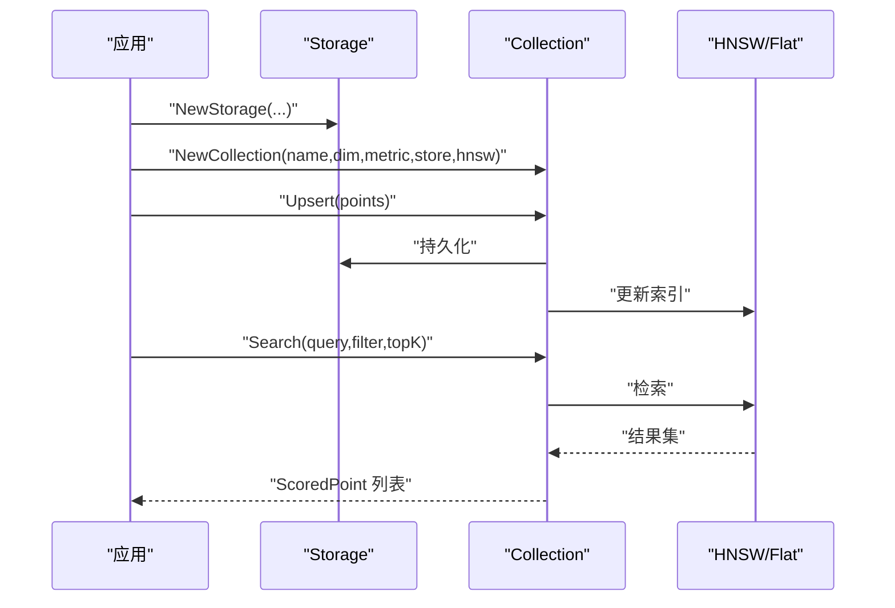
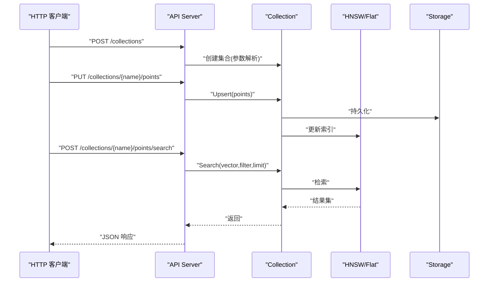
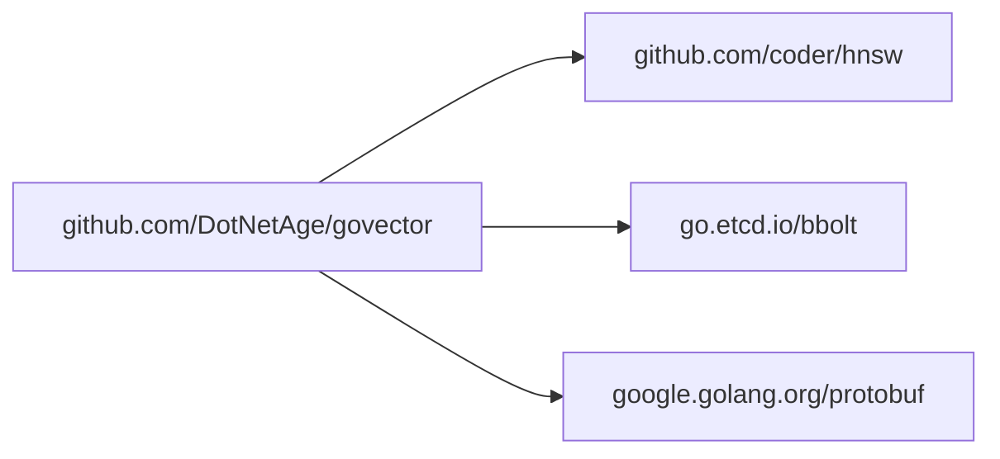
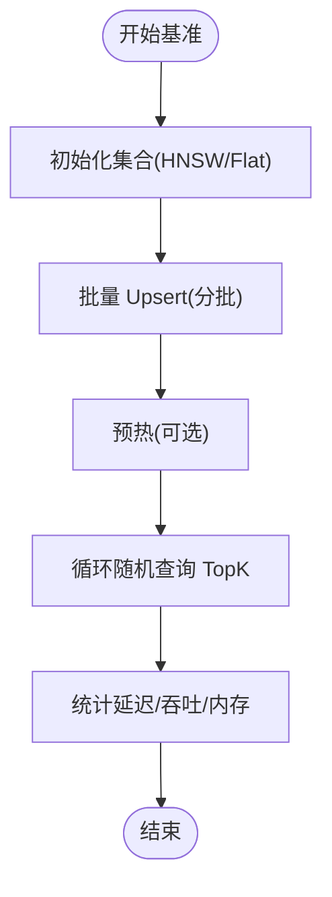

# 使用模式

<cite>
**本文引用的文件**
- [README.md](file://README.md)
- [example/embedded/main.go](file://example/embedded/main.go)
- [cmd/govector/main.go](file://cmd/govector/main.go)
- [cmd/bench/main.go](file://cmd/bench/main.go)
- [api/server.go](file://api/server.go)
- [core/collection.go](file://core/collection.go)
- [core/hnsw_index.go](file://core/hnsw_index.go)
- [core/flat_index.go](file://core/flat_index.go)
- [core/storage.go](file://core/storage.go)
- [core/models.go](file://core/models.go)
- [core/quantization.go](file://core/quantization.go)
- [core/proto/point.proto](file://core/proto/point.proto)
- [go.mod](file://go.mod)
- [Makefile](file://Makefile)
</cite>

## 目录
1. [简介](#简介)
2. [项目结构](#项目结构)
3. [核心组件](#核心组件)
4. [架构总览](#架构总览)
5. [详细组件分析](#详细组件分析)
6. [依赖关系分析](#依赖关系分析)
7. [性能考量](#性能考量)
8. [故障排查指南](#故障排查指南)
9. [结论](#结论)
10. [附录](#附录)

## 简介
本指南面向希望在不同项目形态中使用 GoVector 的开发者，系统讲解两种主要使用模式：嵌入式模式（零网络开销）与微服务模式（Qdrant 兼容 REST API）。文档覆盖从安装、配置、到集成示例、性能优化、批量与并发、优雅关闭、基准测试与分析的完整路径，并提供来自仓库的实际路径引用以便快速定位源码。

## 项目结构
仓库采用按“功能/层次”组织的方式：
- 核心库位于 core/，包含集合、索引、存储、量化、模型与过滤器等
- API 层位于 api/，提供 Qdrant 兼容的 HTTP 接口
- 命令行入口位于 cmd/，包含独立服务器与基准测试程序
- 示例位于 example/embedded/，演示嵌入式用法
- 协议定义位于 core/proto/，用于持久化序列化
- 构建与运行通过 Makefile 提供统一入口

图表来源
- [core/collection.go:1-198](file://core/collection.go#L1-L198)
- [core/hnsw_index.go:1-229](file://core/hnsw_index.go#L1-L229)
- [core/flat_index.go:1-124](file://core/flat_index.go#L1-L124)
- [core/storage.go:1-360](file://core/storage.go#L1-L360)
- [core/quantization.go:1-125](file://core/quantization.go#L1-L125)
- [api/server.go:1-424](file://api/server.go#L1-L424)
- [cmd/govector/main.go:1-92](file://cmd/govector/main.go#L1-L92)
- [cmd/bench/main.go:1-142](file://cmd/bench/main.go#L1-L142)

章节来源
- [README.md:16-42](file://README.md#L16-L42)
- [go.mod:1-19](file://go.mod#L1-L19)
- [Makefile:1-35](file://Makefile#L1-L35)

## 核心组件
- 集合 Collection：封装维度、度量、索引与持久化，提供 Upsert/Search/Delete 的线程安全接口
- 索引引擎：HNSWIndex（图索引，支持参数化）、FlatIndex（暴力索引）
- 存储 Storage：基于 bbolt 的本地持久化，配合 Protobuf 序列化；可选 SQ8 量化
- 模型与过滤：PointStruct/ScoredPoint、Filter/Condition、Payload
- API 服务器：提供 /collections、/points 的 Qdrant 兼容 REST 接口
- 基准测试：cmd/bench，支持不同规模与指标的吞吐/延迟评估

章节来源
- [core/collection.go:1-198](file://core/collection.go#L1-L198)
- [core/hnsw_index.go:1-229](file://core/hnsw_index.go#L1-L229)
- [core/flat_index.go:1-124](file://core/flat_index.go#L1-L124)
- [core/storage.go:1-360](file://core/storage.go#L1-L360)
- [core/models.go:1-280](file://core/models.go#L1-L280)
- [api/server.go:1-424](file://api/server.go#L1-L424)
- [cmd/bench/main.go:1-142](file://cmd/bench/main.go#L1-L142)

## 架构总览
下图展示了嵌入式与微服务两种模式下的数据流与控制流：

图表来源
- [core/collection.go:93-198](file://core/collection.go#L93-L198)
- [core/storage.go:144-187](file://core/storage.go#L144-L187)
- [api/server.go:64-95](file://api/server.go#L64-L95)

## 详细组件分析

### 嵌入式模式：零网络开销
适用场景
- 桌面应用、边缘设备、单机服务
- 对延迟敏感且无需跨进程/跨机器访问
- 希望最小化外部依赖与运维复杂度

关键要点
- 直接导入 core 包，初始化 Storage 与 Collection
- 通过 Collection 的 Upsert/Search/Delete 完成增删改查
- 可选启用 HNSW 以获得近似但低复杂度的检索性能

集成步骤与参考路径
- 初始化存储与集合：[example/embedded/main.go:14-24](file://example/embedded/main.go#L14-L24)
- 写入向量与元数据：[example/embedded/main.go:27-41](file://example/embedded/main.go#L27-L41)
- 执行过滤搜索：[example/embedded/main.go:44-61](file://example/embedded/main.go#L44-L61)
- 集合生命周期与一致性：[core/collection.go:93-133](file://core/collection.go#L93-L133)
- HNSW 参数与默认值：[core/hnsw_index.go:31-39](file://core/hnsw_index.go#L31-L39)

图表来源
- [example/embedded/main.go:14-61](file://example/embedded/main.go#L14-L61)
- [core/collection.go:93-147](file://core/collection.go#L93-L147)
- [core/storage.go:144-187](file://core/storage.go#L144-L187)

章节来源
- [example/embedded/main.go:1-63](file://example/embedded/main.go#L1-L63)
- [core/collection.go:22-91](file://core/collection.go#L22-L91)
- [core/hnsw_index.go:31-39](file://core/hnsw_index.go#L31-L39)

### 微服务模式：Qdrant 兼容 REST API
适用场景
- 多语言/多进程客户端访问
- 作为独立服务被其他服务调用
- 需要标准 REST 接口与可观察性

关键要点
- 启动 govector serve，绑定端口与数据库路径
- 通过 /collections 创建集合，设置维度、度量与 HNSW 参数
- 通过 /points 进行 Upsert/Search/Delete
- 支持优雅关闭与信号处理

集成步骤与参考路径
- 启动与信号处理：[cmd/govector/main.go:18-91](file://cmd/govector/main.go#L18-L91)
- API 路由与集合加载：[api/server.go:64-129](file://api/server.go#L64-L129)
- 创建集合（含参数解析）：[api/server.go:260-352](file://api/server.go#L260-L352)
- Upsert/Search/Delete 实现：[api/server.go:145-258](file://api/server.go#L145-L258)
- 优雅关闭流程：[api/server.go:131-143](file://api/server.go#L131-L143)

图表来源
- [api/server.go:64-258](file://api/server.go#L64-L258)
- [cmd/govector/main.go:52-88](file://cmd/govector/main.go#L52-L88)

章节来源
- [cmd/govector/main.go:1-92](file://cmd/govector/main.go#L1-L92)
- [api/server.go:1-424](file://api/server.go#L1-L424)

### 数据模型与过滤
- PointStruct/ScoredPoint：向量、版本号、元数据
- Filter/Condition：支持 Must/MustNot、精确匹配、范围、前缀、包含、正则
- Payload：键值对元数据，用于检索时过滤

参考路径
- 数据模型与过滤器定义：[core/models.go:5-280](file://core/models.go#L5-L280)
- 过滤匹配逻辑：[core/models.go:81-280](file://core/models.go#L81-L280)

章节来源
- [core/models.go:1-280](file://core/models.go#L1-L280)

### 存储与持久化
- Storage 基于 bbolt，每个集合一个桶
- 使用 Protobuf 序列化点，支持可选 SQ8 量化
- 自动保存/加载集合元信息，重启后恢复

参考路径
- 存储初始化与关闭：[core/storage.go:88-129](file://core/storage.go#L88-L129)
- 写入/读取与量化：[core/storage.go:144-235](file://core/storage.go#L144-L235)
- 元信息保存/加载：[core/storage.go:261-307](file://core/storage.go#L261-L307)

章节来源
- [core/storage.go:1-360](file://core/storage.go#L1-L360)

### 索引实现与参数
- HNSWIndex：支持自定义 M/EfConstruction/EfSearch/K
- FlatIndex：暴力检索，适合小规模或需要精确结果
- 搜索后过滤策略：HNSW 下为“过采样+后过滤”，以平衡性能与正确性

参考路径
- HNSW 参数与默认值：[core/hnsw_index.go:11-39](file://core/hnsw_index.go#L11-L39)
- HNSW 搜索与后过滤：[core/hnsw_index.go:126-176](file://core/hnsw_index.go#L126-L176)
- Flat 暴力搜索：[core/flat_index.go:40-74](file://core/flat_index.go#L40-L74)

章节来源
- [core/hnsw_index.go:1-229](file://core/hnsw_index.go#L1-L229)
- [core/flat_index.go:1-124](file://core/flat_index.go#L1-L124)

### 量化与内存优化
- SQ8 量化：将 32 位浮点向量压缩为 8 位整数，节省存储与内存
- 存储时压缩、加载时解压，自动处理元数据字段

参考路径
- 量化接口与实现：[core/quantization.go:5-125](file://core/quantization.go#L5-L125)
- 存储侧量化开关与处理：[core/storage.go:95-114](file://core/storage.go#L95-L114), [core/storage.go:162-175](file://core/storage.go#L162-L175)

章节来源
- [core/quantization.go:1-125](file://core/quantization.go#L1-L125)
- [core/storage.go:95-114](file://core/storage.go#L95-L114)

### 并发、批量与一致性
- Collection 使用 RWMutex 保证 Upsert/Search/Delete 的并发安全
- Upsert 先持久化再更新内存索引，失败时尽力回滚
- 批量写入建议分批，降低峰值内存占用

参考路径
- 并发与一致性：[core/collection.go:97-133](file://core/collection.go#L97-L133)
- 批量写入示例（基准）：[cmd/bench/main.go:52-82](file://cmd/bench/main.go#L52-L82)

章节来源
- [core/collection.go:93-133](file://core/collection.go#L93-L133)
- [cmd/bench/main.go:52-82](file://cmd/bench/main.go#L52-L82)

### 优雅关闭与信号处理
- 独立服务通过 os/signal 监听中断信号，使用 http.Server.Shutdown 实现优雅停机
- API Server 提供 Stop(ctx) 方法，支持超时控制

参考路径
- 信号与优雅关闭：[cmd/govector/main.go:66-88](file://cmd/govector/main.go#L66-L88)
- API Server 关闭：[api/server.go:131-143](file://api/server.go#L131-L143)

章节来源
- [cmd/govector/main.go:1-92](file://cmd/govector/main.go#L1-L92)
- [api/server.go:131-143](file://api/server.go#L131-L143)

## 依赖关系分析
- 核心依赖：coder/hnsw（HNSW 图算法）、go.etcd.io/bbolt（嵌入式 KV）、google.golang.org/protobuf（序列化）
- 版本与构建：go.mod 指定 Go 版本与依赖版本

图表来源
- [go.mod:5-18](file://go.mod#L5-L18)

章节来源
- [go.mod:1-19](file://go.mod#L1-L19)

## 性能考量
- 索引选择
  - 小规模/精确检索：FlatIndex
  - 大规模/近似检索：HNSWIndex，推荐开启
- HNSW 参数调优
  - M：节点最大连接数，影响索引密度与查询成本
  - EfConstruction：构建期候选列表大小
  - EfSearch：查询期候选列表大小，越大越准但越慢
  - K：返回前 K 个结果
  - 默认值参考：[core/hnsw_index.go:31-39](file://core/hnsw_index.go#L31-L39)
- 内存优化
  - 启用 SQ8 量化以减少存储与内存占用：[core/quantization.go:20-125](file://core/quantization.go#L20-L125)
  - 分批写入与查询，避免峰值内存：[cmd/bench/main.go:52-82](file://cmd/bench/main.go#L52-L82)
- 磁盘 I/O 优化
  - 使用 bbolt 顺序写入，减少随机写放大
  - 合理设置批量大小，降低事务次数
- 查询路径优化
  - HNSW 下的后过滤策略：先过采样再过滤，平衡准确率与性能：[core/hnsw_index.go:126-176](file://core/hnsw_index.go#L126-L176)

章节来源
- [core/hnsw_index.go:11-39](file://core/hnsw_index.go#L11-L39)
- [core/quantization.go:20-125](file://core/quantization.go#L20-L125)
- [cmd/bench/main.go:52-82](file://cmd/bench/main.go#L52-L82)
- [core/hnsw_index.go:126-176](file://core/hnsw_index.go#L126-L176)

## 故障排查指南
- 启动/关闭问题
  - 独立服务未优雅关闭：检查信号处理与 Shutdown 调用
  - 参考：[cmd/govector/main.go:66-88](file://cmd/govector/main.go#L66-L88), [api/server.go:131-143](file://api/server.go#L131-L143)
- 集合/数据问题
  - 维度不匹配：Upsert/Search 前确保向量维度一致
  - 参考：[core/collection.go:105-109](file://core/collection.go#L105-L109), [core/collection.go:139-141](file://core/collection.go#L139-L141)
- 过滤异常
  - 条件类型与值类型不匹配：检查 Condition 类型与 Payload 值类型
  - 参考：[core/models.go:108-129](file://core/models.go#L108-L129)
- 量化相关
  - 量化/反量化失败：确认启用状态与实现可用
  - 参考：[core/storage.go:162-175](file://core/storage.go#L162-L175), [core/quantization.go:78-104](file://core/quantization.go#L78-L104)

章节来源
- [cmd/govector/main.go:66-88](file://cmd/govector/main.go#L66-L88)
- [api/server.go:131-143](file://api/server.go#L131-L143)
- [core/collection.go:105-141](file://core/collection.go#L105-L141)
- [core/models.go:108-129](file://core/models.go#L108-L129)
- [core/storage.go:162-175](file://core/storage.go#L162-L175)
- [core/quantization.go:78-104](file://core/quantization.go#L78-L104)

## 结论
- 嵌入式模式适合对延迟与资源敏感的单机场景，直接导入 core 即可获得高性能检索与强一致的本地持久化
- 微服务模式提供标准 REST 接口，便于多语言/多进程协作与可观测性
- 通过 HNSW 参数、量化与批量策略，可在大规模场景下保持亚毫秒级延迟与高吞吐
- 建议结合基准测试工具进行容量规划与参数调优

## 附录

### 使用模式最佳实践清单
- 选择索引：小规模用 Flat，大规模用 HNSW
- 参数建议：M 16~32，EfConstruction 100~500，EfSearch 50~200，K 10~50
- 量化：启用 SQ8 以降低内存与存储占用
- 批量：分批写入/查询，控制峰值内存
- 并发：利用 Collection 的读写锁，避免热点竞争
- 优雅关闭：统一信号处理与超时控制

### 集成示例路径
- 嵌入式示例：[example/embedded/main.go:1-63](file://example/embedded/main.go#L1-L63)
- 独立服务启动：[cmd/govector/main.go:18-91](file://cmd/govector/main.go#L18-L91)
- API 端点使用：[api/server.go:64-258](file://api/server.go#L64-L258)

### 基准测试与分析
- 运行基准：[Makefile:24-26](file://Makefile#L24-L26)
- 基准实现：[cmd/bench/main.go:1-142](file://cmd/bench/main.go#L1-L142)
- 性能指标：构建时间、平均延迟、吞吐 QPS、内存分配

图表来源
- [cmd/bench/main.go:41-107](file://cmd/bench/main.go#L41-L107)