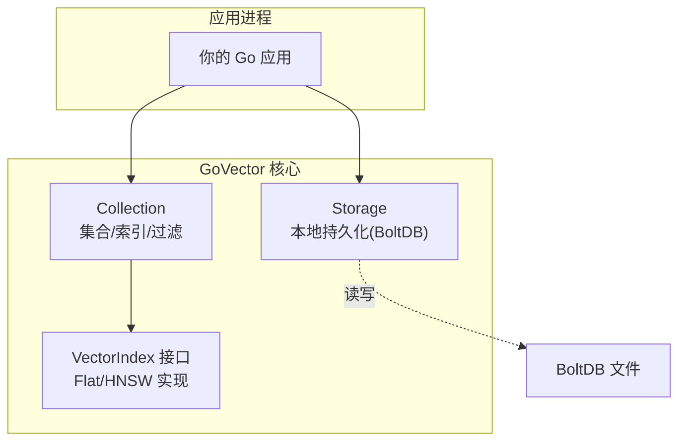
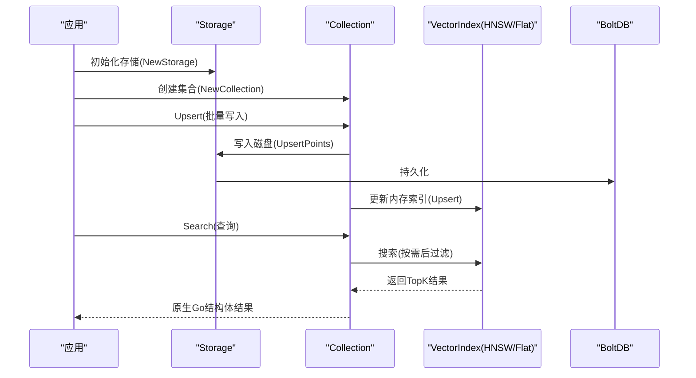
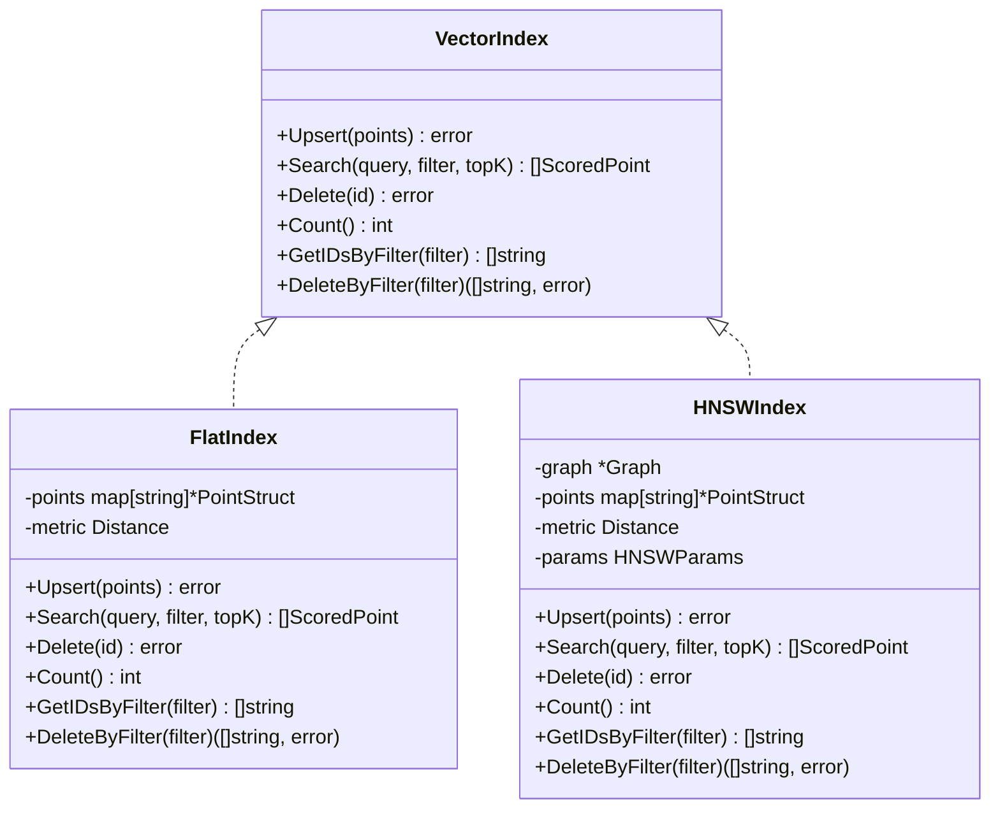
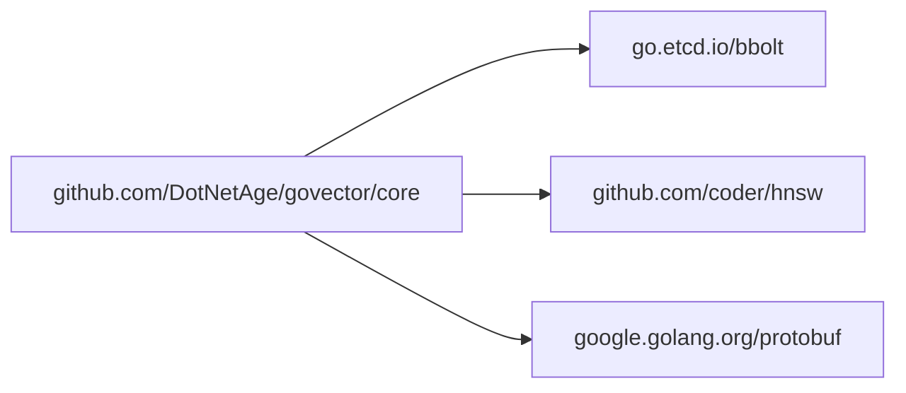
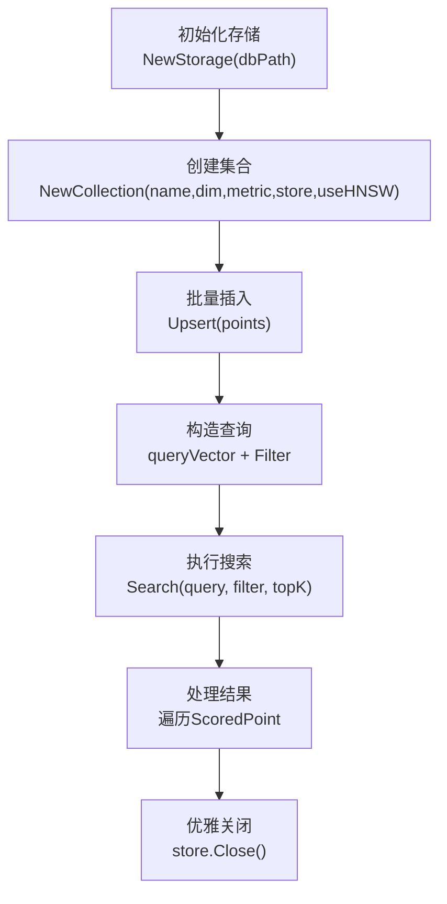

# 嵌入式模式

<cite>
**本文引用的文件列表**
- [README.md](file://README.md)
- [example/embedded/main.go](file://example/embedded/main.go)
- [core/storage.go](file://core/storage.go)
- [core/collection.go](file://core/collection.go)
- [core/models.go](file://core/models.go)
- [core/index.go](file://core/index.go)
- [core/hnsw_index.go](file://core/hnsw_index.go)
- [core/flat_index.go](file://core/flat_index.go)
- [go.mod](file://go.mod)
- [cmd/govector/main.go](file://cmd/govector/main.go)
- [core/collection_test.go](file://core/collection_test.go)
</cite>

## 目录
1. [简介](#简介)
2. [项目结构](#项目结构)
3. [核心组件](#核心组件)
4. [架构总览](#架构总览)
5. [详细组件解析](#详细组件解析)
6. [依赖关系分析](#依赖关系分析)
7. [性能与优势](#性能与优势)
8. [并发安全与内存管理](#并发安全与内存管理)
9. [集成与使用指南](#集成与使用指南)
10. [故障排查](#故障排查)
11. [结论](#结论)

## 简介
本指南面向希望在 Go 应用中以“嵌入式库”方式直接集成 GoVector 的开发者。你将学会：
- 初始化本地存储（BoltDB）与集合（Collection）
- 向集合插入向量数据（Upsert）
- 使用原生 Go 结构体进行查询与过滤
- 在不启动 HTTP 服务的前提下获得零网络开销的高性能向量检索
- 并发安全、内存管理与优雅关闭的最佳实践
- 实战案例与常见问题解决

## 项目结构
GoVector 提供两种使用模式：嵌入式库与独立微服务。嵌入式模式下，应用直接导入 core 包，通过 Storage 和 Collection 构建本地向量数据库；独立模式则通过 HTTP API 暴露 Qdrant 兼容接口。

图表来源
- [core/storage.go:88-114](file://core/storage.go#L88-L114)
- [core/collection.go:22-91](file://core/collection.go#L22-L91)
- [core/index.go:5-28](file://core/index.go#L5-L28)

章节来源
- [README.md:74-105](file://README.md#L74-L105)
- [go.mod:1-19](file://go.mod#L1-L19)

## 核心组件
- 存储引擎 Storage：负责本地持久化（BoltDB），提供集合创建、点写入/读取、元数据保存与列举等能力。
- 集合 Collection：封装集合维度、距离度量、索引策略与并发控制，提供 Upsert/Search/Delete 等操作。
- 索引 VectorIndex：抽象接口，支持 Flat（暴力）与 HNSW（近似）两种实现。
- 数据模型：PointStruct、ScoredPoint、Filter/Condition 等，用于描述向量、得分结果与过滤条件。

章节来源
- [core/storage.go:13-20](file://core/storage.go#L13-L20)
- [core/collection.go:9-20](file://core/collection.go#L9-L20)
- [core/models.go:5-25](file://core/models.go#L5-L25)
- [core/index.go:5-28](file://core/index.go#L5-L28)

## 架构总览
嵌入式模式下，应用直接调用 core 包，无需网络层，所有操作在进程内完成，具备更低延迟与更高吞吐潜力。

图表来源
- [core/storage.go:144-187](file://core/storage.go#L144-L187)
- [core/collection.go:93-147](file://core/collection.go#L93-L147)
- [core/hnsw_index.go:126-176](file://core/hnsw_index.go#L126-L176)
- [core/flat_index.go:40-74](file://core/flat_index.go#L40-L74)

## 详细组件解析

### 存储引擎 Storage
- 职责
  - 打开/关闭 BoltDB 文件
  - 确保集合桶存在
  - 批量 Upsert/删除点
  - 加载集合与元数据
  - 可选向量量化（SQ8）
- 关键点
  - 事务性读写（bbolt.Update/View）
  - Protobuf 序列化点数据
  - 量化时将压缩向量存入 Payload，并在加载时解压
  - 元数据存储于特殊桶 __collections_meta__

章节来源
- [core/storage.go:88-114](file://core/storage.go#L88-L114)
- [core/storage.go:131-142](file://core/storage.go#L131-L142)
- [core/storage.go:144-187](file://core/storage.go#L144-L187)
- [core/storage.go:189-235](file://core/storage.go#L189-L235)
- [core/storage.go:261-307](file://core/storage.go#L261-L307)
- [core/storage.go:338-359](file://core/storage.go#L338-L359)

### 集合 Collection
- 职责
  - 维护集合元信息与并发控制
  - 将 Upsert/Search/Delete 映射到索引与存储
  - 一致性保障：先落盘再更新内存索引；失败时尽力回滚
- 关键点
  - RWMutex 保护读写
  - 版本号基于纳秒时间戳生成，用于幂等与一致性
  - 支持 Flat/HNSW 透明切换

章节来源
- [core/collection.go:9-20](file://core/collection.go#L9-L20)
- [core/collection.go:22-91](file://core/collection.go#L22-L91)
- [core/collection.go:93-147](file://core/collection.go#L93-L147)
- [core/collection.go:156-197](file://core/collection.go#L156-L197)

### 索引 VectorIndex 与实现
- 接口定义：Upsert/Search/Delete/Count/GetIDsByFilter/DeleteByFilter
- FlatIndex：内存暴力搜索，适合小规模或需要精确结果的场景
- HNSWIndex：图结构近似搜索，支持自定义参数（M/EfConstruction/EfSearch/K）

图表来源
- [core/index.go:5-28](file://core/index.go#L5-L28)
- [core/flat_index.go:9-17](file://core/flat_index.go#L9-L17)
- [core/hnsw_index.go:41-50](file://core/hnsw_index.go#L41-L50)

章节来源
- [core/index.go:5-28](file://core/index.go#L5-L28)
- [core/flat_index.go:9-124](file://core/flat_index.go#L9-L124)
- [core/hnsw_index.go:41-229](file://core/hnsw_index.go#L41-L229)

### 数据模型与过滤
- PointStruct/ScoredPoint：承载向量、版本与元数据
- Filter/Condition：支持 Must/MustNot，条件类型包括 exact/range/prefix/contains/regex
- 过滤匹配逻辑：MatchFilter/matchCondition/matchRange/matchPrefix/matchContains/matchRegex

章节来源
- [core/models.go:5-25](file://core/models.go#L5-L25)
- [core/models.go:27-69](file://core/models.go#L27-L69)
- [core/models.go:81-279](file://core/models.go#L81-L279)

## 依赖关系分析
- go.mod 显示核心依赖：bbolt（本地存储）、hnsw（图索引）、protobuf（序列化）
- 嵌入式模式仅使用 core 包，不依赖 HTTP 层

图表来源
- [go.mod:5-18](file://go.mod#L5-L18)

章节来源
- [go.mod:1-19](file://go.mod#L1-L19)

## 性能与优势
- 无 HTTP 开销：直接调用本地函数，避免网络往返与序列化/反序列化成本
- 直接 Go 结构体访问：返回原生 Go 对象，便于二次处理
- HNSW 近似搜索：在百万级向量规模下仍保持亚毫秒级延迟
- 持久化与自动发现：重启后可恢复集合与点，减少冷启动成本

章节来源
- [README.md:30-42](file://README.md#L30-L42)
- [README.md:60-71](file://README.md#L60-L71)

## 并发安全与内存管理
- 并发控制
  - Collection 使用 RWMutex 保护 Upsert/Search/Delete
  - HNSWIndex/FlatIndex 内部也使用互斥锁
- 一致性保证
  - Upsert 先写存储，再更新内存索引；失败时尽力回滚（删除已写入的点）
- 内存管理
  - HNSWIndex 维护 points 映射表与图结构
  - FlatIndex 仅维护内存映射
  - 可选 SQ8 量化：写入时压缩，读取时解压，降低内存占用
- 优雅关闭
  - Storage.Close 关闭 bbolt
  - 服务器模式通过信号触发优雅停机

章节来源
- [core/collection.go:97-133](file://core/collection.go#L97-L133)
- [core/hnsw_index.go:44-50](file://core/hnsw_index.go#L44-L50)
- [core/flat_index.go:13-17](file://core/flat_index.go#L13-L17)
- [core/storage.go:116-129](file://core/storage.go#L116-L129)
- [cmd/govector/main.go:66-88](file://cmd/govector/main.go#L66-L88)

## 集成与使用指南

### 快速开始（嵌入式）
- 初始化存储：创建本地 BoltDB 文件
- 创建集合：指定维度、距离度量、是否启用 HNSW
- 插入数据：Upsert 批量写入
- 查询：构造 Filter 条件，调用 Search 获取 TopK 结果
- 关闭：确保 Storage.Close 正常收尾

参考示例路径
- [README.md:74-105](file://README.md#L74-L105)
- [example/embedded/main.go:10-62](file://example/embedded/main.go#L10-L62)

### 完整流程（从初始化到复杂查询）

图表来源
- [core/storage.go:88-114](file://core/storage.go#L88-L114)
- [core/collection.go:22-91](file://core/collection.go#L22-L91)
- [core/collection.go:93-147](file://core/collection.go#L93-L147)
- [core/models.go:27-69](file://core/models.go#L27-L69)

### 并发安全最佳实践
- 多 goroutine 访问同一 Collection 时，遵循 Upsert/Search/Delete 的互斥语义
- 批量 Upsert 建议分批提交，避免单次请求过大导致锁竞争
- 若需要跨进程共享，建议使用独立进程内的 HTTP 服务模式

章节来源
- [core/collection.go:97-147](file://core/collection.go#L97-L147)

### 内存管理与量化
- 启用 SQ8 量化可显著降低磁盘与内存占用
- 写入时压缩，读取时解压，注意 CPU 开销与精度权衡

章节来源
- [core/storage.go:95-114](file://core/storage.go#L95-L114)
- [core/storage.go:162-175](file://core/storage.go#L162-L175)
- [core/storage.go:215-224](file://core/storage.go#L215-L224)

### 优雅关闭
- 在应用退出前调用 Storage.Close，确保数据刷盘
- 服务器模式通过系统信号触发优雅停机，等待现有请求完成

章节来源
- [core/storage.go:116-129](file://core/storage.go#L116-L129)
- [cmd/govector/main.go:66-88](file://cmd/govector/main.go#L66-L88)

### 实际项目集成案例
- 桌面应用：将向量检索嵌入到本地服务，避免网络依赖
- 边缘计算：在资源受限设备上运行，使用 HNSW 保持低延迟
- 模型推理缓存：将相似样本快速召回，提升交互体验

章节来源
- [README.md:16-18](file://README.md#L16-L18)

## 故障排查
- “集合维度不匹配”
  - 现象：创建/加载集合时报错
  - 原因：写入点的向量维度与集合声明不一致
  - 解决：统一维度或重建集合
  - 参考
    - [core/collection.go:77-81](file://core/collection.go#L77-L81)
    - [core/collection_test.go:248-253](file://core/collection_test.go#L248-L253)

- “Upsert 失败且部分写入”
  - 现象：内存索引更新失败，但部分点已写入存储
  - 行为：尽力回滚（删除已写入的点）
  - 参考
    - [core/collection.go:118-130](file://core/collection.go#L118-L130)
    - [core/collection_test.go:277-291](file://core/collection_test.go#L277-L291)

- “查询向量维度不匹配”
  - 现象：Search 报错
  - 解决：确保 query 维度与集合一致
  - 参考
    - [core/collection.go:139-141](file://core/collection.go#L139-L141)

- “删除未指定目标”
  - 现象：Delete 报错
  - 解决：提供 points 或 filter 至少其一
  - 参考
    - [core/collection.go:173-175](file://core/collection.go#L173-L175)

- “HNSW 参数不当导致性能不佳”
  - 建议：根据数据规模调整 M/EfConstruction/EfSearch
  - 参考
    - [core/hnsw_index.go:11-39](file://core/hnsw_index.go#L11-L39)

- “过滤条件无效”
  - 现象：Filter 不生效
  - 检查：条件类型与值类型匹配（如数值范围、字符串前缀等）
  - 参考
    - [core/models.go:115-129](file://core/models.go#L115-L129)
    - [core/models.go:131-195](file://core/models.go#L131-L195)
    - [core/models.go:197-248](file://core/models.go#L197-L248)
    - [core/models.go:260-279](file://core/models.go#L260-L279)

## 结论
嵌入式模式让 GoVector 成为“零网络开销”的本地向量数据库，适合桌面应用、边缘设备与对延迟敏感的场景。通过 Storage + Collection + VectorIndex 的清晰分层，开发者可以快速构建从插入到检索的完整链路，并在保证一致性与性能的同时，获得原生 Go 结构体的便捷访问体验。