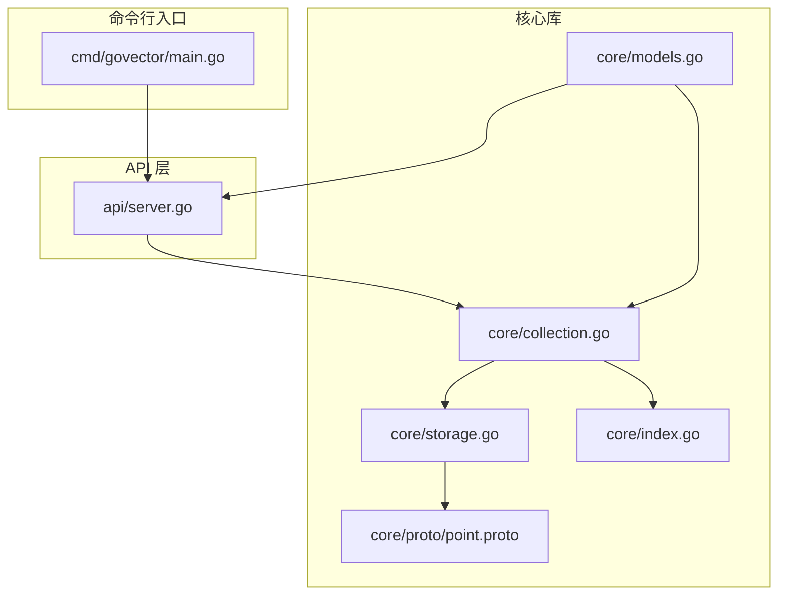
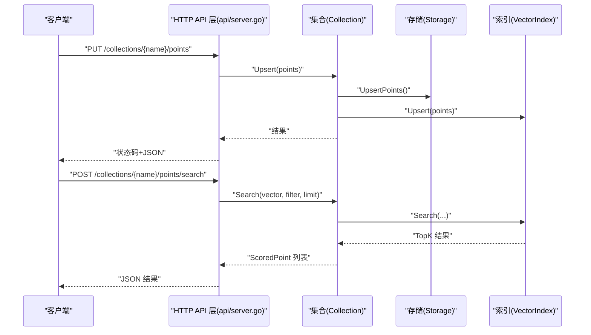
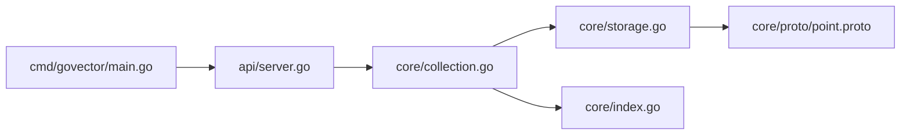

# 微服务模式

<cite>
**本文引用的文件列表**
- [README.md](file://README.md)
- [Makefile](file://Makefile)
- [cmd/govector/main.go](file://cmd/govector/main.go)
- [api/server.go](file://api/server.go)
- [core/models.go](file://core/models.go)
- [core/collection.go](file://core/collection.go)
- [core/storage.go](file://core/storage.go)
- [core/index.go](file://core/index.go)
- [core/proto/point.proto](file://core/proto/point.proto)
- [demo.sh](file://demo.sh)
- [go.mod](file://go.mod)
</cite>

## 目录
1. [简介](#简介)
2. [项目结构](#项目结构)
3. [核心组件](#核心组件)
4. [架构总览](#架构总览)
5. [详细组件分析](#详细组件分析)
6. [依赖关系分析](#依赖关系分析)
7. [性能与容量规划](#性能与容量规划)
8. [故障排查指南](#故障排查指南)
9. [结论](#结论)
10. [附录：API 参考与部署实践](#附录api-参考与部署实践)

## 简介
本指南面向希望以“微服务模式”运行 GoVector 的用户，提供从启动独立 HTTP API 服务器、配置参数、到调用集合管理、点操作、搜索查询等核心 API 的完整说明；并解释 GoVector 的 Qdrant 兼容 API 特点与优势，帮助用户快速迁移。同时涵盖部署最佳实践（含 Docker 与 Kubernetes）、负载均衡与监控集成建议，以及实际可复用的示例脚本。

## 项目结构
- 核心库位于 core 包，提供向量集合、索引、存储、模型定义等能力。
- API 层位于 api 包，提供 Qdrant 兼容的 HTTP REST 接口。
- 命令行入口位于 cmd/govector serve，作为独立微服务启动。
- 示例脚本 demo.sh 演示了完整的插入、搜索与过滤流程。
- Makefile 提供构建、运行、清理与发布脚本。

图表来源
- [cmd/govector/main.go:18-92](file://cmd/govector/main.go#L18-L92)
- [api/server.go:26-143](file://api/server.go#L26-L143)
- [core/collection.go:22-91](file://core/collection.go#L22-L91)
- [core/storage.go:88-114](file://core/storage.go#L88-L114)
- [core/index.go:5-28](file://core/index.go#L5-L28)
- [core/models.go:5-280](file://core/models.go#L5-L280)
- [core/proto/point.proto:1-49](file://core/proto/point.proto#L1-L49)

章节来源
- [README.md:16-42](file://README.md#L16-L42)
- [Makefile:9-17](file://Makefile#L9-L17)

## 核心组件
- 服务器与启动
  - 独立微服务通过命令行参数控制端口、数据库路径与索引类型。
  - 启动时加载或创建默认集合，并注册到 HTTP 服务器。
- API 层
  - 提供集合管理、点写入、搜索、删除等 Qdrant 兼容接口。
  - 内置优雅停机与并发安全。
- 核心库
  - Collection：集合抽象，封装索引与持久化，支持 Upsert/Search/Delete。
  - Storage：基于 bbolt 的本地持久化，支持 Protobuf 序列化与可选量化。
  - VectorIndex：统一索引接口，支持 Flat/HNSW 两种策略。
  - 模型与过滤：Payload、PointStruct、ScoredPoint、Filter/Condition 等。

章节来源
- [cmd/govector/main.go:18-92](file://cmd/govector/main.go#L18-L92)
- [api/server.go:16-143](file://api/server.go#L16-L143)
- [core/collection.go:9-91](file://core/collection.go#L9-L91)
- [core/storage.go:13-114](file://core/storage.go#L13-L114)
- [core/index.go:5-28](file://core/index.go#L5-L28)
- [core/models.go:5-79](file://core/models.go#L5-L79)

## 架构总览
下图展示了微服务模式下的整体交互：客户端通过 HTTP API 调用，API 层解析请求并委托给 Collection 执行业务逻辑，Collection 通过 Storage 与 VectorIndex 完成持久化与检索。

图表来源
- [api/server.go:145-218](file://api/server.go#L145-L218)
- [core/collection.go:93-147](file://core/collection.go#L93-L147)
- [core/storage.go:144-187](file://core/storage.go#L144-L187)
- [core/index.go:5-28](file://core/index.go#L5-L28)

## 详细组件分析

### 服务器启动与配置
- 启动方式
  - 支持直接运行命令行入口，或使用 Makefile 的 run 目标。
  - 默认监听端口为 18080，数据库文件路径为本地文件。
- 关键参数
  - -port：HTTP 服务监听端口，默认 18080。
  - -db：bbolt 存储文件路径，默认 govector.db。
  - -hnsw：是否启用 HNSW 索引（true 表示启用）。
- 初始化流程
  - 初始化 Storage（bbolt）。
  - 创建/加载默认集合（名称、维度、度量、索引类型）。
  - 注册集合到 API Server 并启动监听。
  - 支持优雅停机（信号处理与超时）。

章节来源
- [cmd/govector/main.go:18-92](file://cmd/govector/main.go#L18-L92)
- [Makefile:15-17](file://Makefile#L15-L17)

### API 端点与数据模型
- 集合管理
  - POST /collections：创建集合（支持指定 vector_size、distance、hnsw、parameters）。
  - DELETE /collections/{name}：删除集合。
  - GET /collections：列出所有集合。
  - GET /collections/{name}：获取集合信息。
- 点操作
  - PUT /collections/{name}/points：批量 Upsert。
  - POST /collections/{name}/points/search：向量搜索（支持 filter 与 limit）。
  - POST /collections/{name}/points/delete：按 ID 或过滤条件删除。
- 数据模型
  - PointStruct：id、vector、payload、version。
  - ScoredPoint：id、version、score、payload。
  - Filter/Condition：支持 must/must_not 条件，支持 exact、range、prefix、contains、regex。

章节来源
- [api/server.go:54-424](file://api/server.go#L54-L424)
- [core/models.go:5-79](file://core/models.go#L5-L79)
- [core/models.go:81-280](file://core/models.go#L81-L280)

### 集合与存储
- Collection
  - 统一封装 Upsert/Search/Delete，内部维护读写锁。
  - 支持 Flat/HNSW 索引切换，自动加载持久化数据。
- Storage
  - 基于 bbolt，每个集合一个桶；元数据保存在特殊桶中。
  - 使用 Protobuf 序列化点数据；支持可选 SQ8 量化。
  - 提供 Upsert/Load/List/Delete 等操作。
- 索引接口
  - VectorIndex 抽象了 Upsert/Search/Delete/Count/Filter 等能力，便于替换实现。

章节来源
- [core/collection.go:9-91](file://core/collection.go#L9-L91)
- [core/storage.go:13-360](file://core/storage.go#L13-L360)
- [core/index.go:5-28](file://core/index.go#L5-L28)

### Qdrant 兼容性与优势
- 兼容点
  - REST API 路径与语义与 Qdrant 类似，便于迁移。
  - Payload 过滤支持多种匹配类型，覆盖常见查询场景。
- 优势
  - 单机高性能：HNSW 提供近似最近邻搜索，延迟低、吞吐高。
  - 本地持久化：bbolt + Protobuf，无需外部依赖。
  - 可选量化：SQ8 降低磁盘占用，适合大规模数据。
  - 双模式：既可嵌入式使用，也可作为微服务独立部署。

章节来源
- [README.md:16-42](file://README.md#L16-L42)
- [api/server.go:260-352](file://api/server.go#L260-L352)
- [core/models.go:27-79](file://core/models.go#L27-L79)

## 依赖关系分析
- 外部依赖
  - bbolt：本地键值数据库。
  - protobuf：序列化模型。
  - hnsw：HNSW 索引实现。
- 内部模块
  - api 依赖 core 的 Collection/Storage/Index。
  - core 的 Collection 依赖 Storage 与 VectorIndex。
  - Storage 依赖 Protobuf 与 bbolt。

图表来源
- [api/server.go:16-143](file://api/server.go#L16-L143)
- [core/collection.go:22-91](file://core/collection.go#L22-L91)
- [core/storage.go:88-114](file://core/storage.go#L88-L114)
- [core/index.go:5-28](file://core/index.go#L5-L28)
- [core/proto/point.proto:1-49](file://core/proto/point.proto#L1-L49)
- [cmd/govector/main.go:18-92](file://cmd/govector/main.go#L18-L92)

章节来源
- [go.mod:5-18](file://go.mod#L5-L18)

## 性能与容量规划
- 索引选择
  - 小规模/开发环境：Flat 索引即可满足需求，启动快、内存占用低。
  - 生产环境：建议启用 HNSW，以获得更低的查询延迟与更高的吞吐。
- 向量维度与数量
  - 维度越高、数据量越大，内存与磁盘占用越高；可结合 SQ8 量化降低存储。
- I/O 与持久化
  - Upsert 顺序先落盘再更新内存索引，保证一致性；建议合理规划磁盘与备份策略。
- 并发与锁
  - Collection 内部使用读写锁保护，Upsert/Search/Delete 分别加锁，避免竞态。

章节来源
- [core/collection.go:93-198](file://core/collection.go#L93-L198)
- [core/storage.go:144-187](file://core/storage.go#L144-L187)
- [README.md:60-71](file://README.md#L60-L71)

## 故障排查指南
- 启动失败
  - 检查端口占用与权限；确认 -db 文件路径存在且可写。
  - 查看启动日志输出，定位初始化 Storage 或创建集合阶段的错误。
- API 返回 404/400/500
  - 404：集合不存在；请先创建集合或检查名称。
  - 400：请求体格式不正确或字段缺失；检查 JSON 结构与必填字段。
  - 500：内部错误；查看服务端日志，关注 Upsert/Search/Delete 的错误信息。
- 优雅停机
  - 服务收到中断信号后会尝试优雅关闭，若超时未完成，日志会提示；可适当延长超时时间。

章节来源
- [api/server.go:145-258](file://api/server.go#L145-L258)
- [cmd/govector/main.go:70-88](file://cmd/govector/main.go#L70-L88)

## 结论
GoVector 的微服务模式提供了与 Qdrant 兼容的 REST API，具备单机高性能、本地持久化与可选量化等优势。通过命令行参数即可快速启动独立服务，并通过标准 API 实现集合管理、点写入、搜索与删除。配合合理的索引选择与容量规划，可在生产环境中稳定运行。

## 附录：API 参考与部署实践

### 启动与基本配置
- 使用命令行参数
  - -port：HTTP 监听端口（默认 18080）
  - -db：bbolt 数据库文件路径（默认 govector.db）
  - -hnsw：是否启用 HNSW（默认启用）
- 使用 Makefile
  - make run：一键启动默认配置的服务。
  - make build：编译生成二进制文件至 bin/。

章节来源
- [cmd/govector/main.go:18-23](file://cmd/govector/main.go#L18-L23)
- [Makefile:9-17](file://Makefile#L9-L17)

### API 调用示例（REST）
以下示例基于 demo.sh 中的调用流程，展示集合管理、点写入、无过滤搜索与带过滤搜索的典型用法。请根据实际环境调整端口与集合名。

- 创建集合
  - 方法与路径：POST /collections
  - 请求体字段：name、vector_size、distance、hnsw、parameters
  - 成功响应：返回集合配置与参数
- 列出集合
  - 方法与路径：GET /collections
  - 成功响应：集合列表（名称、维度、距离度量、点数）
- 获取集合详情
  - 方法与路径：GET /collections/{name}
  - 成功响应：集合基本信息
- 删除集合
  - 方法与路径：DELETE /collections/{name}
  - 成功响应：操作完成标识
- 写入点
  - 方法与路径：PUT /collections/{name}/points
  - 请求体字段：points（数组，包含 id、vector、payload）
  - 成功响应：操作完成标识
- 搜索
  - 方法与路径：POST /collections/{name}/points/search
  - 请求体字段：vector、limit、filter（可选）
  - 成功响应：TopK 结果（包含 id、score、payload）
- 删除点
  - 方法与路径：POST /collections/{name}/points/delete
  - 请求体字段：points（按 ID 数组）或 filter（按条件）
  - 成功响应：操作完成与删除计数

章节来源
- [api/server.go:54-424](file://api/server.go#L54-L424)
- [demo.sh:11-39](file://demo.sh#L11-L39)

### Qdrant 兼容特性与迁移要点
- 路径与语义兼容：集合、点、搜索、删除等接口与 Qdrant 类似，便于迁移。
- Payload 过滤：支持 exact、range、prefix、contains、regex 等条件组合。
- 参数映射：distance 支持 cosine/euclidean/dot；HNSW 参数可通过 parameters 传入。

章节来源
- [api/server.go:260-352](file://api/server.go#L260-L352)
- [core/models.go:27-79](file://core/models.go#L27-L79)

### 部署最佳实践
- 单实例部署
  - 使用 systemd 或服务脚本守护进程，确保异常重启。
  - 将 -db 指向持久化卷，定期备份数据库文件。
- 负载均衡
  - 由于单实例采用本地 bbolt，不建议横向扩展；可通过多实例隔离集合或使用反向代理进行路由。
- 监控与日志
  - 开启系统日志与应用日志，记录启动、优雅停机与错误事件。
  - 可结合 Prometheus/Grafana 对服务可用性与响应时间进行观测。
- 容器化与编排
  - Docker：将二进制与配置打包为镜像，挂载持久化卷。
  - Kubernetes：使用 Deployment/StatefulSet 管理，配置 PersistentVolume 与 Service。

说明：本节为通用实践建议，不直接对应具体源码文件。

### 实际示例脚本
- demo.sh
  - 后台启动服务、插入测试数据、执行无过滤与带过滤搜索、最后关闭服务。
  - 可作为自动化测试与演示的基础模板。

章节来源
- [demo.sh:1-43](file://demo.sh#L1-L43)