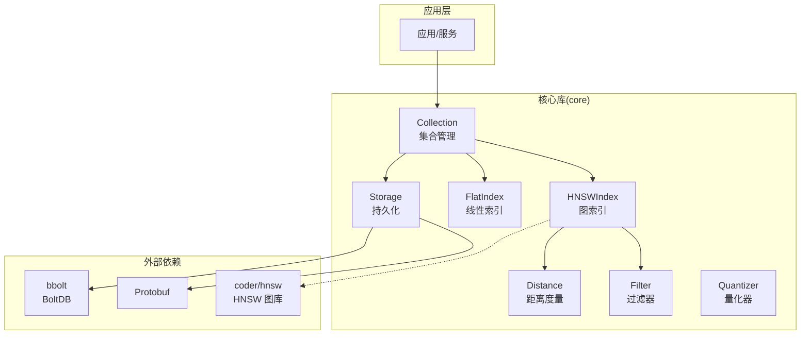
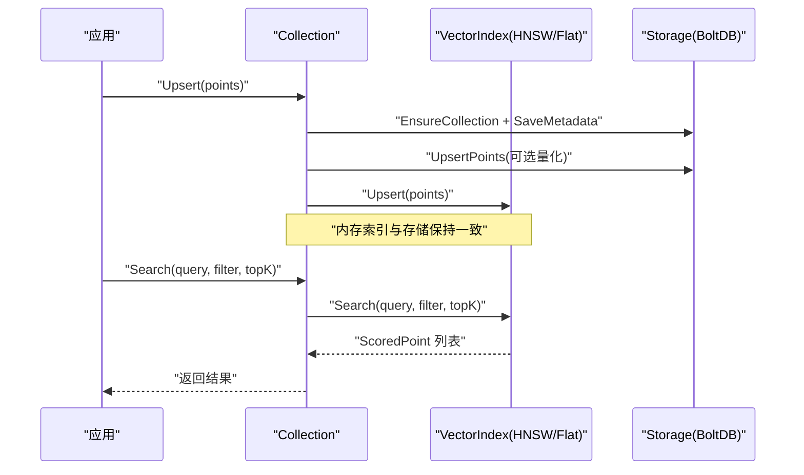
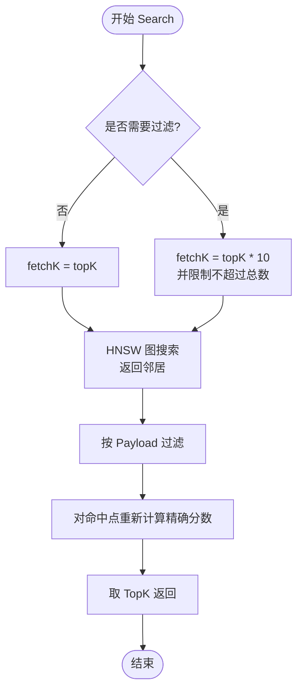
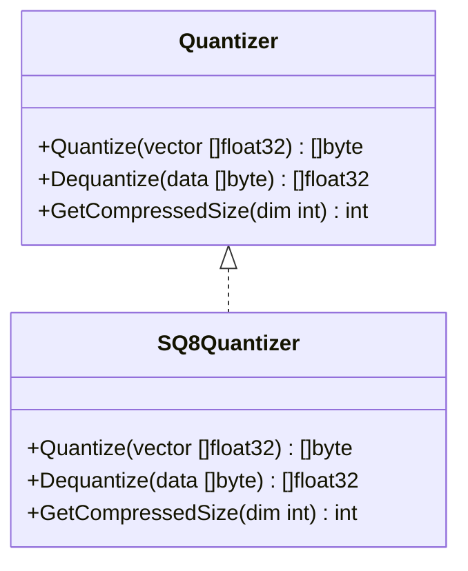
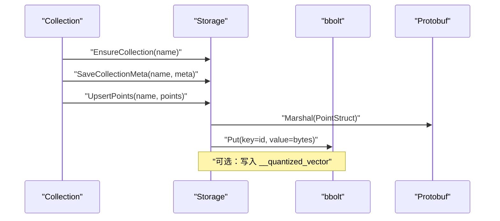
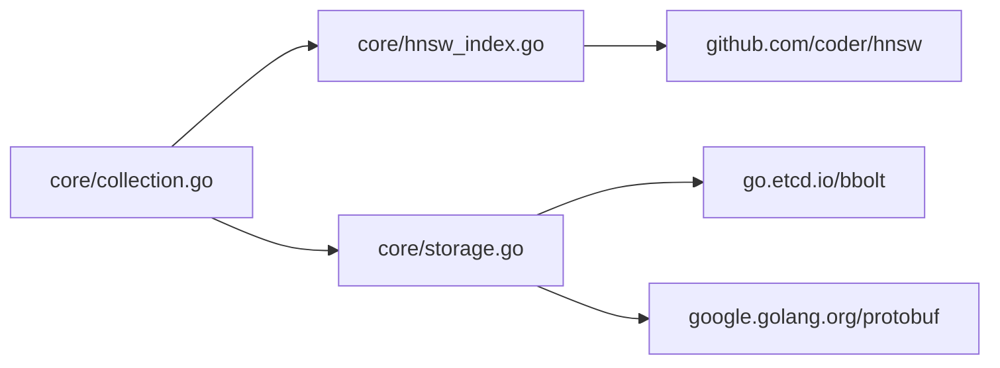

# 性能优化

<cite>
**本文引用的文件列表**
- [README.md](file://README.md)
- [go.mod](file://go.mod)
- [cmd/bench/main.go](file://cmd/bench/main.go)
- [core/collection.go](file://core/collection.go)
- [core/hnsw_index.go](file://core/hnsw_index.go)
- [core/quantization.go](file://core/quantization.go)
- [core/storage.go](file://core/storage.go)
- [core/models.go](file://core/models.go)
- [core/math.go](file://core/math.go)
- [core/hnsw_index_test.go](file://core/hnsw_index_test.go)
- [core/quantization_test.go](file://core/quantization_test.go)
</cite>

## 目录
1. [简介](#简介)
2. [项目结构](#项目结构)
3. [核心组件](#核心组件)
4. [架构总览](#架构总览)
5. [详细组件分析](#详细组件分析)
6. [依赖分析](#依赖分析)
7. [性能考量与优化策略](#性能考量与优化策略)
8. [故障排查指南](#故障排查指南)
9. [结论](#结论)
10. [附录：基准测试与案例](#附录基准测试与案例)

## 简介
本指南聚焦于 GoVector 的性能优化实践，围绕 HNSW 索引参数调优（M 值、efConstruction、efSearch）、内存使用优化（向量量化、缓存与垃圾回收）、磁盘 I/O 优化（批量写入、索引重建策略、存储格式）以及基准测试与性能分析方法展开。文档同时给出大规模数据处理与扩展性的建议，并结合仓库中的基准工具与实现细节进行实证说明。

## 项目结构
GoVector 采用“核心库 + 基准工具 + 存储引擎”的分层组织：
- 核心库：集合管理、HNSW/Flat 索引、距离度量、过滤器、量化器、存储接口
- 基准工具：命令行基准套件，支持不同规模与维度的构建与查询
- 存储引擎：基于 bbolt 的本地持久化，配合 Protobuf 序列化

图表来源
- [core/collection.go:12-91](file://core/collection.go#L12-L91)
- [core/hnsw_index.go:44-106](file://core/hnsw_index.go#L44-L106)
- [core/storage.go:13-114](file://core/storage.go#L13-L114)
- [go.mod:5-18](file://go.mod#L5-L18)

章节来源
- [README.md:122-127](file://README.md#L122-L127)
- [go.mod:5-18](file://go.mod#L5-L18)

## 核心组件
- 集合 Collection：统一管理向量维度、距离度量、索引类型（HNSW/Flat），并协调存储与内存索引的一致性
- HNSWIndex：封装底层 HNSW 图库，支持 Cosine/Euclid/Dot 三种距离度量，可配置 M、EfConstruction、EfSearch、TopK
- 存储 Storage：基于 bbolt 的本地持久化，支持 Protobuf 序列化与可选的向量量化压缩
- 量化器 SQ8Quantizer：将 32 位浮点向量压缩为 8 位整数，节省磁盘与内存占用
- 过滤器 Filter：支持精确匹配、范围、前缀、包含、正则等多种条件，用于检索时后过滤

章节来源
- [core/collection.go:12-91](file://core/collection.go#L12-L91)
- [core/hnsw_index.go:11-39](file://core/hnsw_index.go#L11-L39)
- [core/storage.go:13-114](file://core/storage.go#L13-L114)
- [core/quantization.go:5-18](file://core/quantization.go#L5-L18)
- [core/models.go:27-79](file://core/models.go#L27-L79)

## 架构总览
下图展示了从应用到索引再到存储的整体流程，以及关键参数在流程中的位置。

图表来源
- [core/collection.go:93-147](file://core/collection.go#L93-L147)
- [core/storage.go:144-187](file://core/storage.go#L144-L187)
- [core/hnsw_index.go:108-176](file://core/hnsw_index.go#L108-L176)

## 详细组件分析

### HNSW 参数与搜索流程
- 关键参数
  - M：每节点最大连接数，影响图密度与查询/构建复杂度
  - EfConstruction：构建阶段动态候选列表大小，越大越精细但构建更慢
  - EfSearch：查询阶段动态候选列表大小，越大召回越高但延迟上升
  - K：返回 TopK 结果数量
- 搜索流程要点
  - 查询前根据是否需要过滤决定 fetchK（后过滤策略），避免过滤导致的漏检
  - 先在 HNSW 图上过采样，再在内存映射中应用过滤与精确打分，最后取 TopK

图表来源
- [core/hnsw_index.go:129-176](file://core/hnsw_index.go#L129-L176)

章节来源
- [core/hnsw_index.go:11-39](file://core/hnsw_index.go#L11-L39)
- [core/hnsw_index.go:129-176](file://core/hnsw_index.go#L129-L176)

### 量化器 SQ8 实现与使用
- 压缩策略：每个向量独立计算 min/max，将元素映射到 [0,255] 区间，存储 8 字节元信息（min/max）+ 每维 1 字节
- 使用场景：启用量化时，写入存储前压缩，加载时解压；可显著降低磁盘占用与内存占用
- 注意事项：解压后会将压缩字段从 payload 中移除以节省内存

图表来源
- [core/quantization.go:9-18](file://core/quantization.go#L9-L18)
- [core/quantization.go:24-109](file://core/quantization.go#L24-L109)

章节来源
- [core/quantization.go:20-125](file://core/quantization.go#L20-L125)
- [core/storage.go:144-187](file://core/storage.go#L144-L187)

### 存储与序列化
- 存储引擎：bbolt（BoltDB）作为本地 KV 存储，集合以桶命名空间隔离
- 序列化：使用 Protobuf 对点结构进行序列化，支持多种数值与布尔类型
- 量化集成：当启用量化时，将压缩后的字节写入 payload 的专用键，读取时自动解压并清理该键

图表来源
- [core/storage.go:131-187](file://core/storage.go#L131-L187)
- [core/storage.go:189-235](file://core/storage.go#L189-L235)

章节来源
- [core/storage.go:13-360](file://core/storage.go#L13-L360)

### 距离度量与过滤器
- 距离度量：支持 Cosine、Euclid、Dot 三种，分别适用于不同场景
- 过滤器：支持 Must/MustNot 条件组合，涵盖精确、范围、前缀、包含、正则等

章节来源
- [core/math.go:5-79](file://core/math.go#L5-L79)
- [core/models.go:27-79](file://core/models.go#L27-L79)

## 依赖分析
- 外部库
  - coder/hnsw：HNSW 图库，提供高效的近似最近邻搜索
  - go.etcd.io/bbolt：嵌入式键值数据库，提供本地持久化能力
  - google.golang.org/protobuf：高性能序列化框架
- 内部耦合
  - Collection 统一编排索引与存储
  - HNSWIndex 封装 coder/hnsw 并暴露统一接口
  - Storage 与 Protobuf、bbolt 紧密耦合，负责序列化与落盘

图表来源
- [go.mod:5-18](file://go.mod#L5-L18)
- [core/collection.go:35-49](file://core/collection.go#L35-L49)
- [core/hnsw_index.go:62-90](file://core/hnsw_index.go#L62-L90)
- [core/storage.go:91-114](file://core/storage.go#L91-L114)

章节来源
- [go.mod:5-18](file://go.mod#L5-L18)

## 性能考量与优化策略

### HNSW 参数调优策略
- M（每节点最大连接数）
  - 影响：M 越大，图越稠密，召回率提升但内存与构建时间增加
  - 建议：默认 16；小规模或内存受限场景可降至 8~12；大规模高召回场景可尝试 24~32
- efConstruction（构建阶段候选列表）
  - 影响：越大构建越精细，索引质量更高，但构建时间显著增加
  - 建议：默认 200；对构建时延敏感场景可降至 100~150；对召回敏感场景可升至 300~500
- efSearch（查询阶段候选列表）
  - 影响：越大召回越高，平均延迟上升；与 TopK 成正比
  - 建议：默认 64；低延迟场景可降至 32~64；高召回场景可升至 128~256
- TopK（返回数量）
  - 影响：直接影响后过滤 fetchK 的规模与最终排序成本
  - 建议：按业务需求设定；若过滤较重，适当放大 fetchK 以保证召回

章节来源
- [core/hnsw_index.go:11-39](file://core/hnsw_index.go#L11-L39)
- [core/hnsw_index.go:129-176](file://core/hnsw_index.go#L129-L176)

### 内存使用优化
- 向量量化（SQ8）
  - 压缩比：每维 1 字节 + 8 字节元信息；典型 128 维向量从 512 字节降至约 136 字节
  - 使用建议：启用量化可显著降低内存与磁盘占用；加载时自动解压并清理压缩键
- 缓存策略
  - 索引层：HNSW 图本身即为内存缓存；通过合理 efSearch 控制命中率与延迟平衡
  - 应用层：对热点查询结果进行 LRU 缓存（可在上层自行实现）
- 垃圾回收调优
  - 基准工具中演示了在大规模运行后主动触发 GC 的做法，有助于稳定后续性能
  - 建议：在批量导入后、查询高峰前、系统空闲时段手动触发 GC，观察内存回落情况

章节来源
- [core/quantization.go:20-125](file://core/quantization.go#L20-L125)
- [core/storage.go:189-235](file://core/storage.go#L189-L235)
- [cmd/bench/main.go:138-140](file://cmd/bench/main.go#L138-L140)

### 磁盘 I/O 优化
- 批量写入
  - 基准工具采用固定批次大小批量 Upsert，减少事务开销与 I/O 频率
  - 建议：根据可用内存设置合理批次（例如 1 万条），避免一次性加载过多数据
- 索引重建策略
  - 当参数变更或数据结构变化时，可先清空旧索引，再批量导入；避免频繁增量更新
- 存储格式选择
  - 使用 Protobuf 序列化，体积小、解析快；结合量化进一步压缩
- 数据生命周期
  - 定期清理无效/过期数据，释放存储空间与索引节点

章节来源
- [cmd/bench/main.go:52-82](file://cmd/bench/main.go#L52-L82)
- [core/storage.go:144-187](file://core/storage.go#L144-L187)

### 基准测试与性能分析
- 基准工具功能
  - 支持不同规模（10K/100K/1M）与维度（默认 128）的构建与查询
  - 输出构建耗时、平均延迟、吞吐（QPS）与内存分配统计
  - 可切换 HNSW/Flat 模式对比性能差异
- 分析方法
  - 对比不同 efSearch 下的延迟与吞吐，找到延迟与召回的平衡点
  - 在相同 efSearch 下比较不同 M 值对内存与构建时间的影响
  - 观察 GC 后的内存回落与查询稳定性

章节来源
- [cmd/bench/main.go:41-107](file://cmd/bench/main.go#L41-L107)
- [README.md:60-71](file://README.md#L60-L71)

### 大规模数据处理与扩展性
- 单机扩展
  - 优先优化 HNSW 参数与量化；在内存充足前提下适度增大 efSearch 提升召回
  - 批量导入 + 合理批次大小，避免峰值内存压力
- 多实例/分片
  - 当单机无法满足时，可按业务维度拆分集合或进行水平分片（需在上层实现）
- API/服务模式
  - 通过命令行服务模式对外提供 Qdrant 兼容 API，便于集成现有生态

章节来源
- [README.md:109-118](file://README.md#L109-L118)
- [core/collection.go:22-41](file://core/collection.go#L22-L41)

## 故障排查指南
- 参数不生效
  - 确认通过 NewCollectionWithParams 或 NewHNSWIndexWithParams 设置参数
  - 检查参数范围与默认值，避免设置为 0 或负数
- 查询延迟异常
  - 检查过滤器是否过于宽泛导致 fetchK 过大；适当提高 efSearch 或缩小过滤范围
- 内存占用过高
  - 开启量化；确认加载后压缩键已清理；在批量导入后主动触发 GC
- 存储写入失败
  - 检查集合桶是否存在、序列化是否成功、bbolt 是否关闭
- 测试验证
  - 使用 HNSW 与量化相关测试用例验证正确性与精度

章节来源
- [core/hnsw_index.go:59-106](file://core/hnsw_index.go#L59-L106)
- [core/storage.go:144-187](file://core/storage.go#L144-L187)
- [core/hnsw_index_test.go:7-159](file://core/hnsw_index_test.go#L7-L159)
- [core/quantization_test.go:8-183](file://core/quantization_test.go#L8-L183)

## 结论
通过对 HNSW 参数、内存与磁盘 I/O 的系统性优化，结合基准工具与测试用例，GoVector 能在单机环境下实现亚毫秒级查询延迟与高吞吐。建议在生产环境中：
- 以 efSearch 为首要调优对象，兼顾延迟与召回
- 在内存与带宽允许的前提下启用量化，显著降低资源占用
- 采用批量导入与合理的批次大小，配合 GC 回收，维持稳定性能
- 建立参数调优基线与回归测试，持续监控性能指标

## 附录：基准测试与案例

### 基准工具使用方法
- 运行方式
  - 直接执行基准程序，自动输出不同规模下的构建耗时、查询延迟与吞吐
- 关键指标
  - Index Build Time：索引构建总耗时与平均每点耗时
  - Search Avg Latency：平均查询延迟
  - Search QPS：查询吞吐
  - Mem Alloc：内存分配统计（由基准工具打印）

章节来源
- [cmd/bench/main.go:41-107](file://cmd/bench/main.go#L41-L107)

### 性能测试案例与结果解读
- 案例一：不同 efSearch 对延迟与吞吐的影响
  - 步骤：固定 M 与 efConstruction，逐步提高 efSearch，记录平均延迟与 QPS
  - 解读：efSearch 增大通常带来更低的延迟与更高的吞吐，但资源消耗上升
- 案例二：启用量化与未启用量化的内存对比
  - 步骤：在相同数据规模下分别运行，观察内存分配与磁盘占用
  - 解读：量化可显著降低内存与磁盘占用，适合大规模部署
- 案例三：批量导入批次大小对构建性能的影响
  - 步骤：固定 efConstruction 与 efSearch，调整批次大小，记录构建耗时
  - 解读：适中的批次大小可平衡内存与 I/O，过大可能导致峰值内存压力

章节来源
- [cmd/bench/main.go:52-82](file://cmd/bench/main.go#L52-L82)
- [core/quantization.go:106-109](file://core/quantization.go#L106-L109)
- [core/storage.go:144-187](file://core/storage.go#L144-L187)