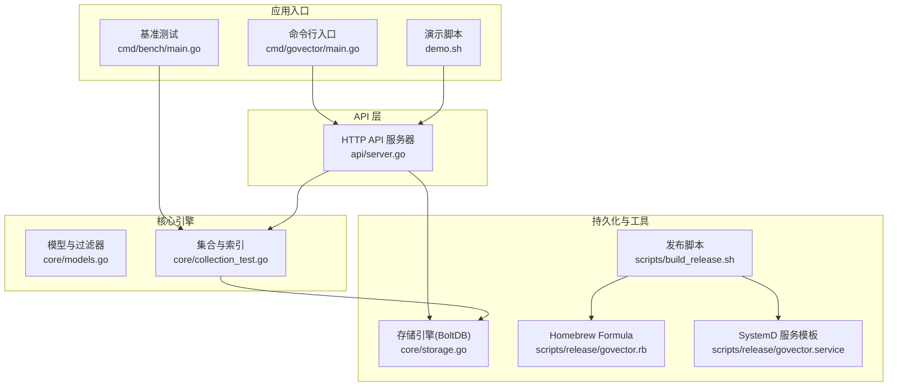
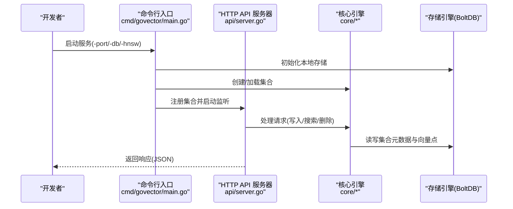
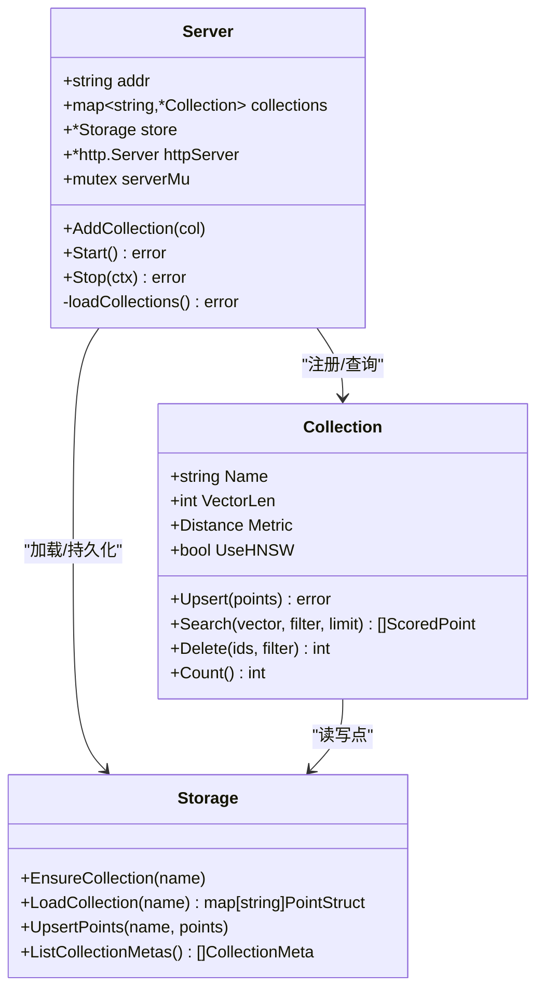
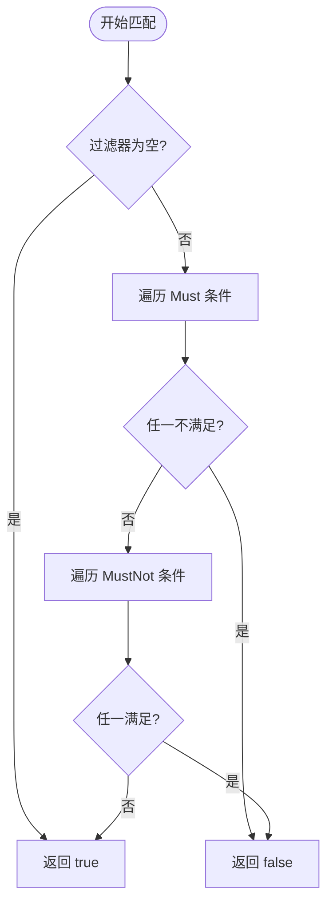
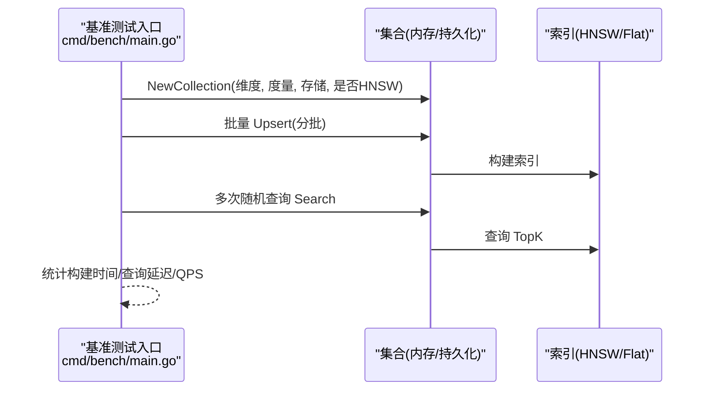
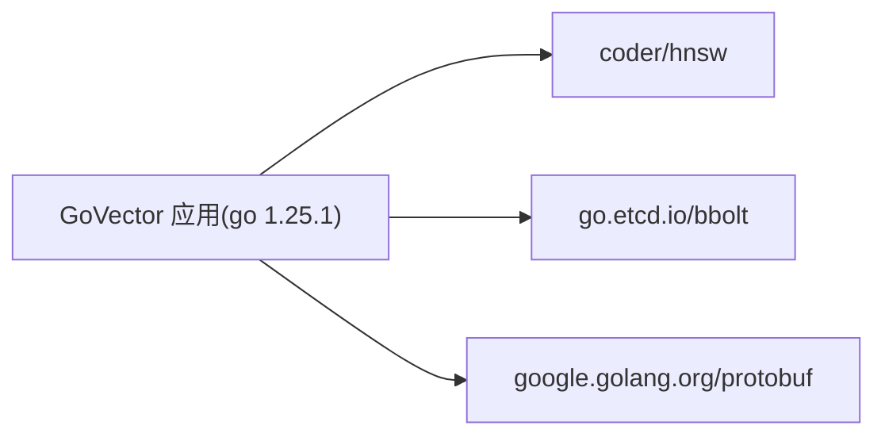
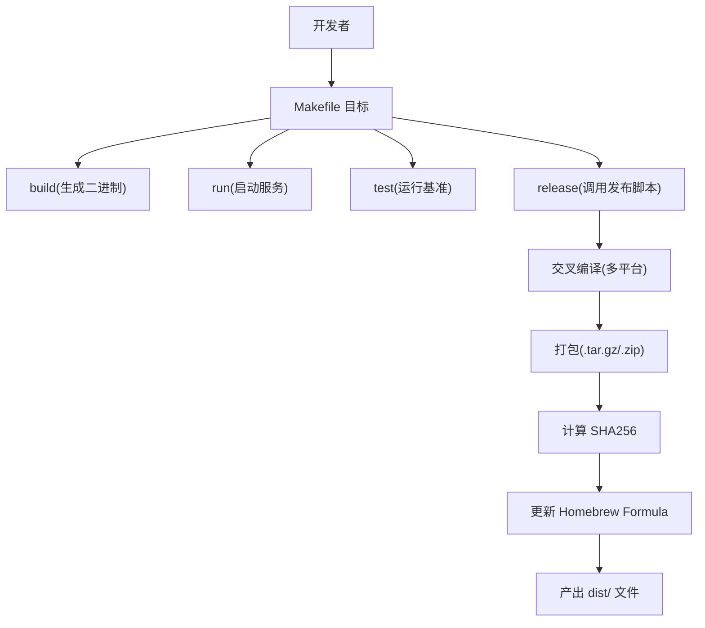

# 开发指南

<cite>
**本文引用的文件**
- [README.md](file://README.md)
- [go.mod](file://go.mod)
- [Makefile](file://Makefile)
- [.github/workflows/go.yml](file://.github/workflows/go.yml)
- [cmd/govector/main.go](file://cmd/govector/main.go)
- [api/server.go](file://api/server.go)
- [cmd/bench/main.go](file://cmd/bench/main.go)
- [codecov.yml](file://codecov.yml)
- [core/models.go](file://core/models.go)
- [core/collection_test.go](file://core/collection_test.go)
- [scripts/build_release.sh](file://scripts/build_release.sh)
- [scripts/release/govector.rb](file://scripts/release/govector.rb)
- [scripts/release/govector.service](file://scripts/release/govector.service)
- [demo.sh](file://demo.sh)
- [example/embedded/main.go](file://example/embedded/main.go)
</cite>

## 目录
1. [简介](#简介)
2. [项目结构](#项目结构)
3. [核心组件](#核心组件)
4. [架构总览](#架构总览)
5. [详细组件分析](#详细组件分析)
6. [依赖关系分析](#依赖关系分析)
7. [性能与测试策略](#性能与测试策略)
8. [调试与开发最佳实践](#调试与开发最佳实践)
9. [构建系统与发布流程](#构建系统与发布流程)
10. [故障排查指南](#故障排查指南)
11. [结论](#结论)
12. [附录](#附录)

## 简介
本指南面向贡献者与维护者，提供 GoVector 项目的完整开发流程说明，涵盖环境搭建、代码贡献流程、测试策略、调试技巧、构建与发布、以及持续集成配置。GoVector 是用纯 Go 实现的嵌入式向量数据库，支持 HNSW 近似最近邻检索、Qdrant 兼容 API、BoltDB 持久化与 8-bit 标量量化等特性。

## 项目结构
仓库采用按功能模块组织的结构，核心模块包括：
- 核心引擎与模型定义：core 包
- HTTP API 服务器：api 包
- 命令行入口：cmd/govector serve
- 基准测试：cmd/bench
- 示例与演示：example、demo.sh
- 构建与发布脚本：scripts、Makefile
- CI/CD：.github/workflows/go.yml
- 文档与许可证：README、LICENSE

图表来源
- [cmd/govector/main.go:1-92](file://cmd/govector/main.go#L1-L92)
- [api/server.go:1-424](file://api/server.go#L1-L424)
- [cmd/bench/main.go:1-142](file://cmd/bench/main.go#L1-L142)
- [core/models.go:1-280](file://core/models.go#L1-L280)
- [core/collection_test.go:1-292](file://core/collection_test.go#L1-L292)
- [scripts/build_release.sh:1-131](file://scripts/build_release.sh#L1-L131)
- [scripts/release/govector.rb:1-45](file://scripts/release/govector.rb#L1-L45)
- [scripts/release/govector.service:1-21](file://scripts/release/govector.service#L1-L21)

章节来源
- [README.md:1-135](file://README.md#L1-L135)
- [go.mod:1-19](file://go.mod#L1-L19)
- [Makefile:1-35](file://Makefile#L1-L35)

## 核心组件
- 存储层（BoltDB）：负责集合元数据与向量点的持久化，支持自动发现与重载集合。
- 集合与索引：提供向量插入、删除、查询接口；支持 Flat 与 HNSW 两种索引模式。
- 过滤器与 Payload：支持精确匹配、范围、前缀、包含、正则等多种过滤条件。
- HTTP API：提供与 Qdrant 兼容的 REST 接口，支持集合管理、点写入、搜索与删除。
- 基准测试：提供大规模向量构建与查询的性能评估工具。
- 发布与安装：支持多平台交叉编译、Homebrew Formula 与 SystemD 服务模板。

章节来源
- [core/models.go:1-280](file://core/models.go#L1-L280)
- [api/server.go:1-424](file://api/server.go#L1-L424)
- [cmd/bench/main.go:1-142](file://cmd/bench/main.go#L1-L142)
- [scripts/build_release.sh:1-131](file://scripts/build_release.sh#L1-L131)

## 架构总览
下图展示了从命令行到 API、再到核心引擎与存储的整体交互：

图表来源
- [cmd/govector/main.go:18-92](file://cmd/govector/main.go#L18-L92)
- [api/server.go:54-143](file://api/server.go#L54-L143)
- [core/models.go:1-280](file://core/models.go#L1-L280)

## 详细组件分析

### HTTP API 服务器
- 提供集合管理、点写入、搜索、删除等端点。
- 支持从存储自动加载集合，支持优雅关闭。
- 并发安全：内部使用互斥锁保护集合注册与 HTTP 服务器实例。

图表来源
- [api/server.go:18-143](file://api/server.go#L18-L143)
- [core/models.go:11-79](file://core/models.go#L11-L79)

章节来源
- [api/server.go:54-424](file://api/server.go#L54-L424)

### 过滤器与 Payload 匹配
- 支持 Must/MustNot 条件组合，覆盖精确、范围、前缀、包含、正则等类型。
- 内置正则编译与字符串包含判断，确保过滤性能与正确性。

图表来源
- [core/models.go:81-130](file://core/models.go#L81-L130)
- [core/models.go:131-279](file://core/models.go#L131-L279)

章节来源
- [core/models.go:1-280](file://core/models.go#L1-L280)

### 基准测试流程
- 生成随机向量批量插入，统计构建耗时与内存占用。
- 随机查询计算平均延迟与 QPS，并进行垃圾回收控制。

图表来源
- [cmd/bench/main.go:41-107](file://cmd/bench/main.go#L41-L107)

章节来源
- [cmd/bench/main.go:1-142](file://cmd/bench/main.go#L1-L142)

### 示例与演示
- 嵌入式示例：直接以 Go 结构体操作集合，无需网络开销。
- 演示脚本：启动服务并通过 HTTP API 完成写入、全局搜索与带过滤搜索。

章节来源
- [example/embedded/main.go:1-63](file://example/embedded/main.go#L1-L63)
- [demo.sh:1-43](file://demo.sh#L1-L43)

## 依赖关系分析
- Go 版本：1.25.1
- 主要外部依赖：HNSW 图库、BoltDB、Protocol Buffers
- 间接依赖：数学库、renameio、vek、exp 等

图表来源
- [go.mod:3-18](file://go.mod#L3-L18)

章节来源
- [go.mod:1-19](file://go.mod#L1-L19)

## 性能与测试策略
- 单元测试：覆盖集合创建、Upsert、Search、Delete、错误场景与 HNSW 参数持久化。
- 集成测试：通过 HTTP API 对服务进行端到端验证（创建集合、写入、搜索、删除）。
- 性能测试：基准套件支持不同规模与索引模式，输出构建时间、平均延迟与 QPS。
- 并发与竞态：CI 使用数据竞争检测；覆盖率报告上传至 Codecov。
- 覆盖率阈值：项目目标为 85%，忽略 cmd、example、proto 生成文件与第三方路径。

章节来源
- [core/collection_test.go:1-292](file://core/collection_test.go#L1-L292)
- [.github/workflows/go.yml:36-59](file://.github/workflows/go.yml#L36-L59)
- [codecov.yml:1-20](file://codecov.yml#L1-L20)
- [cmd/bench/main.go:1-142](file://cmd/bench/main.go#L1-L142)

## 调试与开发最佳实践
- 环境准备
  - 使用 Go 1.25.1 或以上版本。
  - 通过 go mod 下载并校验依赖。
- 本地运行
  - 使用命令行入口启动服务，指定端口、数据库路径与是否启用 HNSW。
  - 参考演示脚本进行快速验证。
- 调试技巧
  - 启动参数：端口、数据库文件路径、索引开关。
  - 日志：标准输出与错误日志可定位问题。
  - 并发安全：API 服务器对集合注册与 HTTP 服务器实例加锁，避免并发冲突。
- 代码质量
  - 使用 go test -race 检测竞态。
  - 使用 go test -coverprofile 生成覆盖率报告。
  - 遵循最小改动原则，优先在 core 包内扩展能力，保持 API 层稳定。

章节来源
- [cmd/govector/main.go:18-92](file://cmd/govector/main.go#L18-L92)
- [demo.sh:1-43](file://demo.sh#L1-L43)
- [api/server.go:18-143](file://api/server.go#L18-L143)

## 构建系统与发布流程
- 本地构建
  - Makefile 提供 build、run、release、test、clean 目标。
  - build 输出二进制到 bin/，run 直接运行服务，test 启动基准测试，release 调用脚本构建多平台包。
- 发布脚本
  - 支持 linux/amd64、linux/arm64、darwin/amd64、darwin/arm64 四平台交叉编译。
  - 生成压缩包并计算 SHA256，更新 Homebrew Formula 中的版本与校验和。
- Homebrew 与 SystemD
  - Homebrew Formula 定义下载地址与校验和，提供服务模板。
  - SystemD 服务模板定义工作目录、重启策略与日志路径。

图表来源
- [Makefile:9-34](file://Makefile#L9-L34)
- [scripts/build_release.sh:27-78](file://scripts/build_release.sh#L27-L78)
- [scripts/build_release.sh:80-115](file://scripts/build_release.sh#L80-L115)
- [scripts/release/govector.rb:1-45](file://scripts/release/govector.rb#L1-L45)

章节来源
- [Makefile:1-35](file://Makefile#L1-L35)
- [scripts/build_release.sh:1-131](file://scripts/build_release.sh#L1-L131)
- [scripts/release/govector.rb:1-45](file://scripts/release/govector.rb#L1-L45)
- [scripts/release/govector.service:1-21](file://scripts/release/govector.service#L1-L21)

## 故障排查指南
- 服务无法启动
  - 检查端口占用与权限；确认数据库路径存在且可写。
  - 查看标准输出与错误日志，关注存储初始化与集合加载阶段。
- API 返回 404/400/500
  - 404：集合不存在；确认集合名称与创建流程。
  - 400：JSON 解码失败或参数非法；检查请求体格式与字段。
  - 500：内部错误；查看服务端日志定位具体环节。
- 性能异常
  - 检查是否启用 HNSW；对比 Flat 与 HNSW 在不同规模下的表现。
  - 关注内存峰值与 GC 次数，必要时调整批次大小与查询 TopK。
- 覆盖率未达标
  - 关注被忽略路径与测试用例覆盖情况；优先补齐核心逻辑分支。

章节来源
- [api/server.go:148-258](file://api/server.go#L148-L258)
- [cmd/govector/main.go:18-92](file://cmd/govector/main.go#L18-L92)
- [codecov.yml:14-20](file://codecov.yml#L14-L20)

## 结论
本指南提供了从环境搭建、开发流程、测试与性能评估，到构建与发布的全链路实践建议。建议贡献者遵循最小变更原则、优先完善核心逻辑与边界条件的测试，并在 PR 中附上性能对比与回归验证结果，以保障 GoVector 的可靠性与可维护性。

## 附录
- 常用命令参考
  - 构建：make build
  - 运行：make run
  - 测试：make test
  - 清理：make clean
  - 发布：make release
- API 端点概览（来自服务器实现）
  - POST /collections：创建集合
  - DELETE /collections/{name}：删除集合
  - GET /collections：列出集合
  - GET /collections/{name}：获取集合信息
  - PUT /collections/{name}/points：写入点
  - POST /collections/{name}/points/search：搜索
  - POST /collections/{name}/points/delete：删除

章节来源
- [api/server.go:56-84](file://api/server.go#L56-L84)
- [Makefile:9-34](file://Makefile#L9-L34)