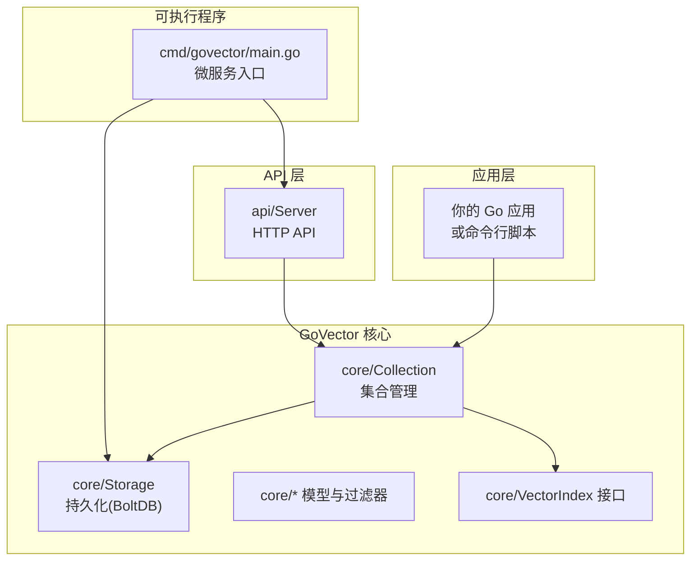
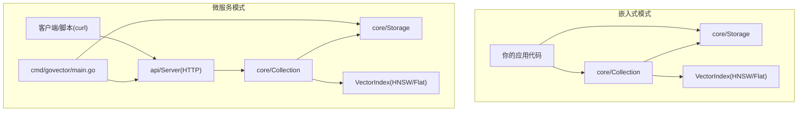
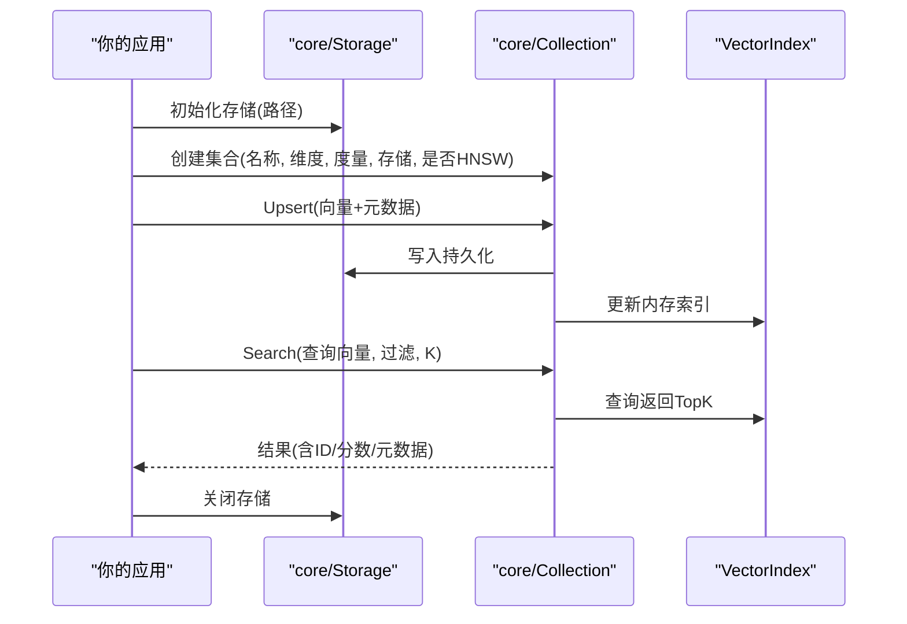
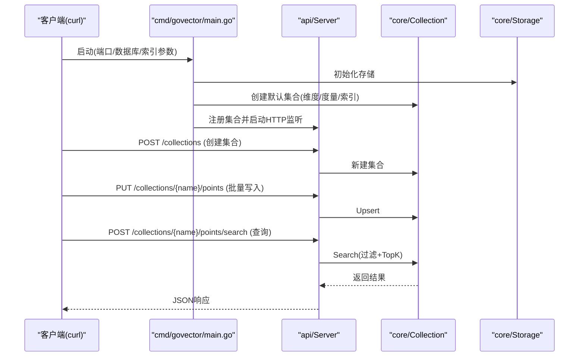
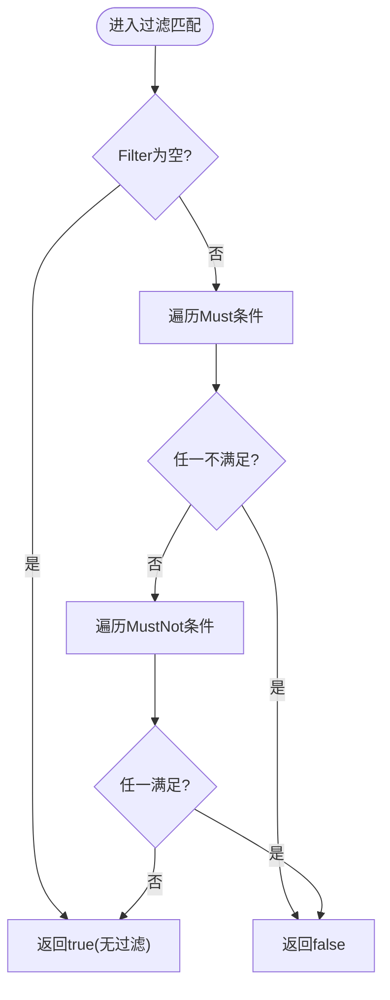
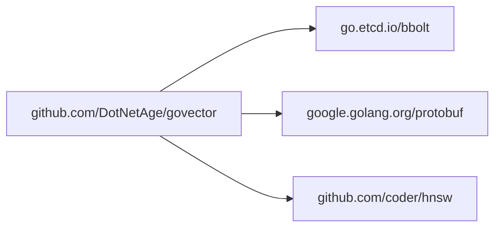

# 快速开始

<cite>
**本文引用的文件**
- [README.md](file://README.md)
- [go.mod](file://go.mod)
- [Makefile](file://Makefile)
- [cmd/govector/main.go](file://cmd/govector/main.go)
- [example/embedded/main.go](file://example/embedded/main.go)
- [scripts/release/govector.rb](file://scripts/release/govector.rb)
- [demo.sh](file://demo.sh)
- [core/storage.go](file://core/storage.go)
- [core/collection.go](file://core/collection.go)
- [core/models.go](file://core/models.go)
- [core/index.go](file://core/index.go)
- [api/server.go](file://api/server.go)
</cite>

## 目录
1. [简介](#简介)
2. [项目结构](#项目结构)
3. [核心组件](#核心组件)
4. [架构总览](#架构总览)
5. [详细组件分析](#详细组件分析)
6. [依赖关系分析](#依赖关系分析)
7. [性能与最佳实践](#性能与最佳实践)
8. [故障排除指南](#故障排除指南)
9. [结论](#结论)
10. [附录：命令与示例路径](#附录命令与示例路径)

## 简介
本指南面向首次接触 GoVector 的用户，目标是在约 15 分钟内完成环境搭建，并运行第一个向量搜索示例。内容覆盖：
- 作为 Go 库导入与 Homebrew 安装两种方式
- 嵌入式模式（零网络开销）的完整流程：初始化存储、创建集合、插入向量、查询与过滤
- 微服务模式（HTTP API）的启动与基础调用
- 常见初始化步骤、错误处理与最佳实践
- 故障排除与常见问题

## 项目结构
仓库采用按“功能域+层次”混合组织方式：
- 核心库位于 core/，提供存储、集合、索引、模型等能力
- API 层位于 api/，提供 Qdrant 兼容的 HTTP 接口
- 可执行程序位于 cmd/govector/main.go，作为独立服务
- 示例位于 example/embedded/main.go，展示嵌入式用法
- Homebrew 脚本位于 scripts/release/govector.rb
- 性能基准与脚本位于 cmd/bench/ 与 demo.sh

图表来源
- [core/storage.go:13-114](file://core/storage.go#L13-L114)
- [core/collection.go:9-91](file://core/collection.go#L9-L91)
- [api/server.go:16-44](file://api/server.go#L16-L44)
- [cmd/govector/main.go:18-55](file://cmd/govector/main.go#L18-L55)

章节来源
- [README.md:16-42](file://README.md#L16-L42)
- [go.mod:1-19](file://go.mod#L1-L19)

## 核心组件
- 存储引擎 Storage：基于 bbolt 的本地持久化，支持点的增删改查、集合元数据管理、可选向量量化
- 集合 Collection：逻辑集合，封装索引与存储，提供 Upsert/Search/Delete 等线程安全操作
- 模型与过滤：PointStruct、ScoredPoint、Filter、Condition 等，支持多种匹配类型
- 索引接口 VectorIndex：统一 Flat/HNSW 等不同索引策略
- API Server：提供 Qdrant 兼容的 REST 接口，支持集合管理与点操作

章节来源
- [core/storage.go:13-114](file://core/storage.go#L13-L114)
- [core/collection.go:9-91](file://core/collection.go#L9-L91)
- [core/models.go:5-79](file://core/models.go#L5-L79)
- [core/index.go:5-28](file://core/index.go#L5-L28)
- [api/server.go:16-44](file://api/server.go#L16-L44)

## 架构总览
下图展示了嵌入式与微服务两种模式的交互关系与数据流。

图表来源
- [cmd/govector/main.go:18-55](file://cmd/govector/main.go#L18-L55)
- [api/server.go:54-95](file://api/server.go#L54-L95)
- [core/collection.go:22-91](file://core/collection.go#L22-L91)
- [core/storage.go:88-114](file://core/storage.go#L88-L114)

## 详细组件分析

### 嵌入式模式：从零到一的完整示例
嵌入式模式适合直接在你的 Go 应用中使用，无需网络开销。典型流程如下：
1) 初始化本地存储（创建数据库文件）
2) 创建集合（指定维度、距离度量、是否启用 HNSW）
3) 批量写入向量（Upsert）
4) 执行相似度检索（Search），可带 Payload 过滤
5) 关闭存储释放资源

图表来源
- [example/embedded/main.go:10-62](file://example/embedded/main.go#L10-L62)
- [core/storage.go:88-114](file://core/storage.go#L88-L114)
- [core/collection.go:93-133](file://core/collection.go#L93-L133)

章节来源
- [example/embedded/main.go:10-62](file://example/embedded/main.go#L10-L62)
- [core/storage.go:88-114](file://core/storage.go#L88-L114)
- [core/collection.go:93-133](file://core/collection.go#L93-L133)

### 微服务模式：启动与基础 API 调用
微服务模式以 HTTP API 提供 Qdrant 兼容接口，适合独立部署或与其他语言服务集成。

- 启动命令与参数
  - 端口：-port，默认 18080
  - 数据库路径：-db，默认 govector.db
  - 索引策略：-hnsw=true 使用 HNSW，false 使用 Flat
- 基础 API 调用（参考 demo.sh）
  - 创建集合：POST /collections
  - 写入向量：PUT /collections/{name}/points
  - 搜索：POST /collections/{name}/points/search
  - 删除：POST /collections/{name}/points/delete
  - 列表/详情：GET /collections, GET /collections/{name}

图表来源
- [cmd/govector/main.go:18-55](file://cmd/govector/main.go#L18-L55)
- [api/server.go:54-95](file://api/server.go#L54-L95)
- [demo.sh:11-38](file://demo.sh#L11-L38)

章节来源
- [cmd/govector/main.go:18-55](file://cmd/govector/main.go#L18-L55)
- [api/server.go:54-95](file://api/server.go#L54-L95)
- [demo.sh:11-38](file://demo.sh#L11-L38)

### 数据模型与过滤机制
- PointStruct：包含 ID、向量、版本号、Payload
- ScoredPoint：查询结果，包含 ID、版本、分数、Payload
- Filter/Condition：支持 must/must_not，条件类型包括 exact、range、prefix、contains、regex
- 匹配规则：Must 全部满足且 MustNot 全不满足时才命中

图表来源
- [core/models.go:81-106](file://core/models.go#L81-L106)
- [core/models.go:108-129](file://core/models.go#L108-L129)
- [core/models.go:131-195](file://core/models.go#L131-L195)
- [core/models.go:197-214](file://core/models.go#L197-L214)
- [core/models.go:216-248](file://core/models.go#L216-L248)
- [core/models.go:260-279](file://core/models.go#L260-L279)

章节来源
- [core/models.go:5-79](file://core/models.go#L5-L79)
- [core/models.go:81-106](file://core/models.go#L81-L106)

## 依赖关系分析
- 外部依赖
  - bbolt：本地键值存储
  - protobuf：序列化点与元数据
  - hnsw：HNSW 图索引实现
- 内部模块
  - core：存储、集合、索引、模型
  - api：HTTP 服务器与路由
  - cmd/govector serve：微服务入口
  - example/embedded：嵌入式示例

图表来源
- [go.mod:5-18](file://go.mod#L5-L18)

章节来源
- [go.mod:1-19](file://go.mod#L1-L19)

## 性能与最佳实践
- 选择合适的索引
  - 小规模/开发环境：Flat 索引，简单稳定
  - 生产/大规模：HNSW 索引，亚线性搜索复杂度
- 维度与度量
  - 确保写入向量维度与集合一致
  - Cosine/Euclidean/Dot 在不同场景下表现不同
- 写入与一致性
  - Upsert 先落盘再更新内存索引；失败时尝试回滚
- 过滤与查询
  - 使用 Payload 过滤减少候选集，提升查询效率
- 量化
  - 可开启 SQ8 量化以降低磁盘占用，注意精度权衡

章节来源
- [core/collection.go:93-133](file://core/collection.go#L93-L133)
- [core/storage.go:144-187](file://core/storage.go#L144-L187)
- [README.md:39-41](file://README.md#L39-L41)

## 故障排除指南
- 启动微服务报错
  - 端口被占用：修改 -port 参数
  - 数据库路径权限不足：确保目录可读写
  - 索引参数非法：检查 -hnsw 与集合参数
- 写入失败
  - 向量维度不匹配：确认集合维度与向量长度一致
  - 存储关闭：确保未提前 Close
- 查询异常
  - 集合不存在：先创建集合或确认名称正确
  - 过滤语法错误：核对 JSON 结构与字段名
- Homebrew 安装
  - 权限问题：使用 sudo 或修正目录权限
  - 服务无法启动：查看日志路径 var/log/govector.log

章节来源
- [cmd/govector/main.go:18-55](file://cmd/govector/main.go#L18-L55)
- [api/server.go:145-176](file://api/server.go#L145-L176)
- [scripts/release/govector.rb:25-40](file://scripts/release/govector.rb#L25-L40)

## 结论
通过本指南，你可以在 15 分钟内完成 GoVector 的安装与首次运行，掌握嵌入式与微服务两种模式的核心用法。建议优先使用嵌入式模式进行本地开发与测试，生产环境推荐 HNSW 索引与合理的过滤策略，结合量化以平衡性能与存储成本。

## 附录：命令与示例路径
- 安装（Go 库）
  - 引入模块：go get github.com/DotNetAge/govector/core
  - 参考路径：[README.md:47-50](file://README.md#L47-L50)
- 安装（Homebrew）
  - brew tap DotNetAge/govector
  - brew install govector
  - 参考路径：[README.md:52-56](file://README.md#L52-L56)，[scripts/release/govector.rb:1-45](file://scripts/release/govector.rb#L1-L45)
- 嵌入式示例
  - 示例入口：example/embedded/main.go
  - 参考路径：[example/embedded/main.go:10-62](file://example/embedded/main.go#L10-L62)
- 微服务启动
  - 启动命令：go run cmd/govector/main.go -port 18080 -db ./govector.db -hnsw=true
  - 参考路径：[cmd/govector/main.go:18-55](file://cmd/govector/main.go#L18-L55)，[Makefile:15-17](file://Makefile#L15-L17)
- 基础 API 调用
  - demo 脚本：demo.sh
  - 参考路径：[demo.sh:11-38](file://demo.sh#L11-L38)
- 关键 API 文档
  - 集合管理：POST /collections, DELETE /collections/{name}, GET /collections, GET /collections/{name}
  - 点操作：PUT /collections/{name}/points, POST /collections/{name}/points/search, POST /collections/{name}/points/delete
  - 参考路径：[api/server.go:54-95](file://api/server.go#L54-L95)，[api/server.go:145-258](file://api/server.go#L145-L258)