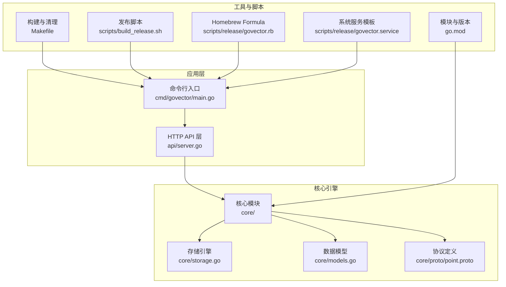
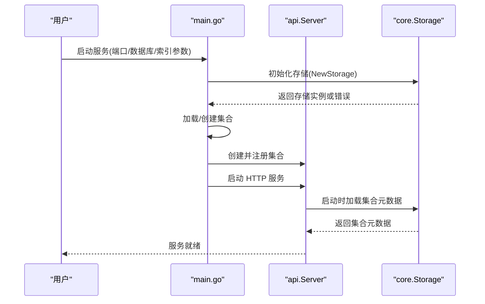
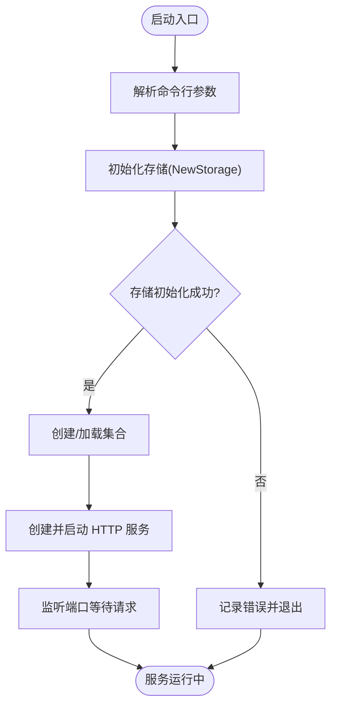
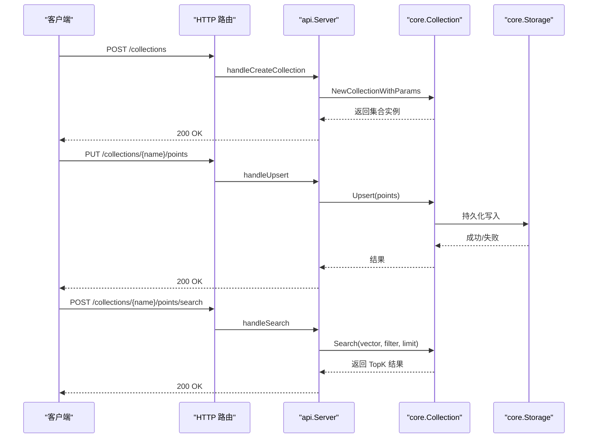
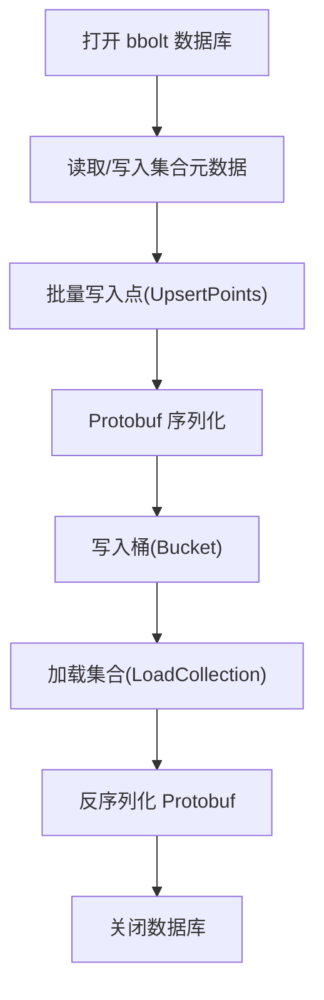
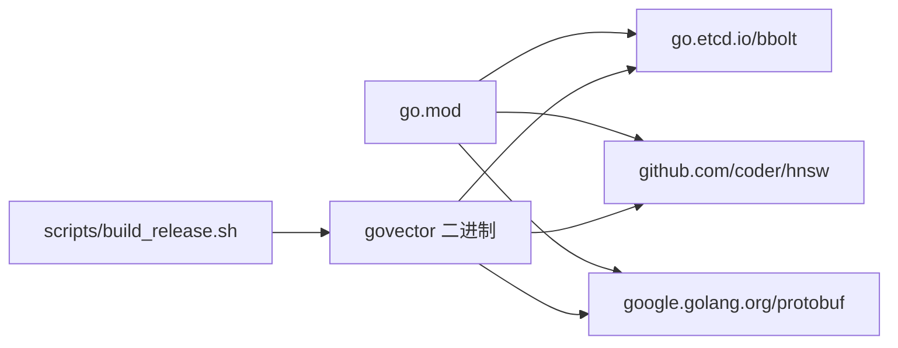

# 安装问题

<cite>
**本文引用的文件**
- [README.md](file://README.md)
- [go.mod](file://go.mod)
- [Makefile](file://Makefile)
- [cmd/govector/main.go](file://cmd/govector/main.go)
- [api/server.go](file://api/server.go)
- [core/storage.go](file://core/storage.go)
- [core/models.go](file://core/models.go)
- [core/proto/point.proto](file://core/proto/point.proto)
- [scripts/build_release.sh](file://scripts/build_release.sh)
- [scripts/release/govector.rb](file://scripts/release/govector.rb)
- [scripts/release/govector.service](file://scripts/release/govector.service)
</cite>

## 目录
1. [简介](#简介)
2. [项目结构](#项目结构)
3. [核心组件](#核心组件)
4. [架构总览](#架构总览)
5. [详细组件分析](#详细组件分析)
6. [依赖关系分析](#依赖关系分析)
7. [性能注意事项](#性能注意事项)
8. [故障排除指南](#故障排除指南)
9. [结论](#结论)
10. [附录](#附录)

## 简介
本指南聚焦于 GoVector 在不同操作系统上的安装与运行问题排查，覆盖以下典型场景：
- Go 版本不兼容导致的编译失败
- 依赖包下载失败或网络受限
- CGO 相关限制与构建失败
- 服务器启动失败与端口占用
- 依赖版本冲突与模块缓存问题
- 重新安装与清理步骤
- 常见错误信息解读与对应解决方法

GoVector 提供两种使用方式：
- 作为嵌入式 Go 库引入项目
- 以独立服务运行（支持 Homebrew 安装与系统服务）

## 项目结构
GoVector 采用模块化组织，核心目录与职责如下：
- cmd/govector serve：独立服务入口，提供 HTTP API
- api：HTTP API 层，实现集合管理与向量操作
- core：核心引擎，包含存储、索引、模型定义与量化
- scripts：构建与发布脚本，含 Homebrew Formula 与 systemd 服务模板
- go.mod：模块与依赖声明
- Makefile：常用构建、运行、清理命令



**图表来源**
- [cmd/govector/main.go:1-92](file://cmd/govector/main.go#L1-L92)
- [api/server.go:1-424](file://api/server.go#L1-L424)
- [core/storage.go:1-360](file://core/storage.go#L1-L360)
- [core/models.go:1-280](file://core/models.go#L1-L280)
- [core/proto/point.proto:1-49](file://core/proto/point.proto#L1-L49)
- [go.mod:1-19](file://go.mod#L1-L19)
- [Makefile:1-35](file://Makefile#L1-L35)
- [scripts/build_release.sh:1-131](file://scripts/build_release.sh#L1-L131)
- [scripts/release/govector.rb:1-45](file://scripts/release/govector.rb#L1-L45)
- [scripts/release/govector.service:1-21](file://scripts/release/govector.service#L1-L21)

**章节来源**
- [README.md:1-135](file://README.md#L1-L135)
- [go.mod:1-19](file://go.mod#L1-L19)
- [Makefile:1-35](file://Makefile#L1-L35)

## 核心组件
- 服务入口与参数解析：命令行参数用于指定端口、数据库路径与索引类型，初始化存储与集合，并启动 HTTP 服务器。
- API 层：提供集合创建/删除、点写入、检索与删除等接口；支持从持久化加载集合元数据。
- 存储层：基于 bbolt 的本地持久化，结合 Protobuf 序列化；支持可选的向量量化。
- 数据模型：与 Qdrant 兼容的数据结构，包含过滤条件、范围匹配、正则表达式等。

**章节来源**
- [cmd/govector/main.go:18-91](file://cmd/govector/main.go#L18-L91)
- [api/server.go:26-143](file://api/server.go#L26-L143)
- [core/storage.go:88-114](file://core/storage.go#L88-L114)
- [core/models.go:5-280](file://core/models.go#L5-L280)

## 架构总览
下图展示从命令行到 API 再到存储的整体流程，以及关键错误点：



**图表来源**
- [cmd/govector/main.go:27-64](file://cmd/govector/main.go#L27-L64)
- [api/server.go:64-129](file://api/server.go#L64-L129)
- [core/storage.go:262-307](file://core/storage.go#L262-L307)

## 详细组件分析

### 组件一：命令行入口与服务启动
- 参数解析：端口、数据库路径、是否启用 HNSW 索引
- 存储初始化：打开 bbolt 数据库文件，若不存在会自动创建
- 集合加载/创建：根据参数创建默认集合或从持久化恢复
- HTTP 服务：启动监听，处理集合与点操作请求



**图表来源**
- [cmd/govector/main.go:18-64](file://cmd/govector/main.go#L18-L64)

**章节来源**
- [cmd/govector/main.go:18-91](file://cmd/govector/main.go#L18-L91)

### 组件二：API 层与集合管理
- 集合管理：创建、删除、列出、查询集合元信息
- 点操作：批量写入、检索、按 ID 或过滤器删除
- 启动时加载：从存储读取集合元数据并重建内存集合



**图表来源**
- [api/server.go:260-352](file://api/server.go#L260-L352)
- [api/server.go:145-218](file://api/server.go#L145-L218)
- [api/server.go:97-129](file://api/server.go#L97-L129)

**章节来源**
- [api/server.go:26-143](file://api/server.go#L26-L143)

### 组件三：存储层与持久化
- 存储初始化：打开 bbolt 数据库文件，权限与并发控制
- 集合与元数据：每个集合为独立桶；元数据保存在特殊桶中
- 点写入/读取：Protobuf 序列化；可选量化压缩
- 关闭与清理：优雅关闭数据库连接



**图表来源**
- [core/storage.go:88-114](file://core/storage.go#L88-L114)
- [core/storage.go:144-187](file://core/storage.go#L144-L187)
- [core/storage.go:189-235](file://core/storage.go#L189-L235)

**章节来源**
- [core/storage.go:88-360](file://core/storage.go#L88-L360)

### 组件四：数据模型与过滤
- 模型定义：点结构、评分点、过滤器、条件类型
- 过滤逻辑：精确匹配、范围、前缀、包含、正则
- 兼容性：与 Qdrant 的数据模型保持一致

```mermaid
classDiagram
class PointStruct {
+string ID
+uint64 Version
+[]float32 Vector
+Payload Payload
}
class Filter {
+[]Condition Must
+[]Condition MustNot
}
class Condition {
+string Key
+ConditionType Type
+MatchValue Match
+RangeValue Range
}
class MatchValue {
+interface{} Value
}
class RangeValue {
+interface{} GT
+interface{} GTE
+interface{} LT
+interface{} LTE
}
Filter --> Condition : "包含"
PointStruct --> Payload : "携带"
```

**图表来源**
- [core/models.go:9-69](file://core/models.go#L9-L69)

**章节来源**
- [core/models.go:5-280](file://core/models.go#L5-L280)

## 依赖关系分析
- 模块与版本：go.mod 指定 Go 版本与直接/间接依赖
- 关键依赖：
  - go.etcd.io/bbolt：本地持久化存储
  - github.com/coder/hnsw：HNSW 图索引
  - google.golang.org/protobuf：Protobuf 序列化
- 构建脚本：scripts/build_release.sh 使用 CGO_ENABLED=0 进行无 CGO 构建，确保跨平台二进制可用



**图表来源**
- [go.mod:5-18](file://go.mod#L5-L18)
- [scripts/build_release.sh:44-48](file://scripts/build_release.sh#L44-L48)

**章节来源**
- [go.mod:1-19](file://go.mod#L1-L19)
- [scripts/build_release.sh:1-131](file://scripts/build_release.sh#L1-L131)

## 性能注意事项
- 无 CGO 构建：发布脚本强制 CGO_ENABLED=0，避免系统依赖，提升可移植性
- 量化存储：可选 SQ8 量化减少磁盘占用，适合大规模数据
- HNSW 索引：提供近似最近邻检索，降低查询复杂度

[本节为通用建议，不直接分析具体文件]

## 故障排除指南

### 一、Go 版本不兼容
症状
- 编译报错，提示 Go 版本过低或不支持的特性
- go.mod 中声明的 Go 版本高于当前环境

排查与解决
- 检查当前 Go 版本与 go.mod 声明版本
  - 参考：[go.mod](file://go.mod#L3)
- 升级 Go 至满足要求的版本后重试
- 若使用容器或 CI，确保镜像包含正确版本的 Go

**章节来源**
- [go.mod](file://go.mod#L3)

### 二、依赖包下载失败（网络/代理）
症状
- go mod download 或 go build 报网络超时、证书错误或被墙
- 依赖拉取缓慢或中断

排查与解决
- 使用代理或更换 GOPROXY
  - 示例：设置 GOPROXY 与 GOSUMDB
- 清理模块缓存后重试
  - 参考：[Makefile:28-34](file://Makefile#L28-L34)
- 确认 go.mod 中依赖版本未被锁定到不可用源
  - 参考：[go.mod:5-18](file://go.mod#L5-L18)

**章节来源**
- [Makefile:28-34](file://Makefile#L28-L34)
- [go.mod:5-18](file://go.mod#L5-L18)

### 三、CGO 相关问题（构建失败）
症状
- 报错提示找不到 C 编译器或 CGO 相关链接错误
- 交叉编译失败或二进制不可用

排查与解决
- 发布脚本已强制 CGO_ENABLED=0，确保无 CGO 依赖
  - 参考：[scripts/build_release.sh:44-48](file://scripts/build_release.sh#L44-L48)
- 若自行构建，请确认环境变量 CGO_ENABLED=0
- Windows/macOS/Linux 均可正常构建，无需 C 工具链

**章节来源**
- [scripts/build_release.sh:44-48](file://scripts/build_release.sh#L44-L48)

### 四、服务器启动失败与端口占用
症状
- 启动后立即退出或报端口被占用
- 无法访问 http://localhost:端口

排查与解决
- 检查端口是否被占用，更换端口参数
  - 参考：[cmd/govector/main.go](file://cmd/govector/main.go#L20)
- 查看日志输出，确认存储初始化与集合加载是否成功
  - 参考：[cmd/govector/main.go:27-50](file://cmd/govector/main.go#L27-L50)
- 确保数据库文件路径存在且可写
  - 参考：[cmd/govector/main.go](file://cmd/govector/main.go#L21)

**章节来源**
- [cmd/govector/main.go:18-64](file://cmd/govector/main.go#L18-L64)

### 五、依赖版本冲突
症状
- 多个模块对同一依赖的不同版本产生冲突
- go build 报版本不一致或循环依赖

排查与解决
- 使用 go mod tidy 修复与整理依赖
  - 参考：[Makefile:28-34](file://Makefile#L28-L34)
- 清理 go.sum 并重新下载依赖
  - 参考：[go.mod:1-19](file://go.mod#L1-L19)
- 如需固定版本，统一升级到兼容版本后再构建

**章节来源**
- [Makefile:28-34](file://Makefile#L28-L34)
- [go.mod:1-19](file://go.mod#L1-L19)

### 六、Homebrew 安装与服务问题（macOS/Linux）
症状
- brew tap 或 brew install 失败
- 服务无法启动或日志为空

排查与解决
- 确认 Homebrew Formula 与发布版本匹配
  - 参考：[scripts/release/govector.rb:4-23](file://scripts/release/govector.rb#L4-L23)
- 使用服务模板启动并检查日志路径
  - 参考：[scripts/release/govector.service:1-21](file://scripts/release/govector.service#L1-L21)
- 通过 brew services start/stop 控制服务生命周期
  - 参考：[scripts/release/govector.rb:32-39](file://scripts/release/govector.rb#L32-L39)

**章节来源**
- [scripts/release/govector.rb:1-45](file://scripts/release/govector.rb#L1-L45)
- [scripts/release/govector.service:1-21](file://scripts/release/govector.service#L1-L21)

### 七、重新安装与清理步骤
建议按顺序执行，确保环境干净：
- 清理构建产物与临时文件
  - 参考：[Makefile:28-34](file://Makefile#L28-L34)
- 删除数据库文件与日志
  - 参考：[Makefile:28-34](file://Makefile#L28-L34)
- 清理模块缓存（如仍失败）
  - 参考：[go.mod:1-19](file://go.mod#L1-L19)
- 重新拉取依赖并构建
  - 参考：[go.mod:5-18](file://go.mod#L5-L18)

**章节来源**
- [Makefile:28-34](file://Makefile#L28-L34)
- [go.mod:1-19](file://go.mod#L1-L19)

### 八、常见错误信息与解决
- “failed to open bbolt database”
  - 可能原因：数据库文件路径不存在或权限不足
  - 解决：确认路径存在且具备读写权限
  - 参考：[core/storage.go:99-102](file://core/storage.go#L99-L102)
- “Collection ... not found”
  - 可能原因：集合尚未创建或持久化未加载
  - 解决：先创建集合或确认服务启动时已加载元数据
  - 参考：[api/server.go:153-156](file://api/server.go#L153-L156)
- “Invalid JSON payload”
  - 可能原因：请求体格式不正确
  - 解决：检查请求体结构与字段类型
  - 参考：[api/server.go:161-164](file://api/server.go#L161-L164)
- “failed to load collections on start”
  - 可能原因：元数据损坏或版本不兼容
  - 解决：备份并清理旧数据库后重启
  - 参考：[api/server.go:67-69](file://api/server.go#L67-L69)

**章节来源**
- [core/storage.go:99-102](file://core/storage.go#L99-L102)
- [api/server.go:148-176](file://api/server.go#L148-L176)
- [api/server.go:64-95](file://api/server.go#L64-L95)

## 结论
- GoVector 强调“无 CGO”与跨平台可移植性，安装与运行问题多集中在 Go 版本、网络与依赖版本上
- 通过统一 Go 版本、合理设置代理、清理模块缓存与构建产物，可有效规避大多数安装失败
- 对于服务模式，建议优先使用 Homebrew 或 systemd 模板，配合日志定位问题
- 出现持久化相关错误时，优先检查数据库文件路径与权限

[本节为总结，不直接分析具体文件]

## 附录

### A. 不同操作系统安装要点
- Linux
  - 使用发行版包管理器或直接下载二进制
  - 确保可执行权限与工作目录权限
- macOS
  - 推荐使用 Homebrew，便于服务管理
  - 若手动安装，注意沙盒与权限问题
- Windows
  - 使用 zip 包解压后运行
  - 确保端口未被占用，必要时以管理员身份运行

[本节为通用建议，不直接分析具体文件]

### B. 快速检查清单
- Go 版本满足 go.mod 要求
- 网络可访问依赖源或配置 GOPROXY
- CGO_ENABLED=0（发布脚本已内置）
- 数据库路径存在且可写
- 端口未被占用
- 清理过构建产物与模块缓存

[本节为通用建议，不直接分析具体文件]