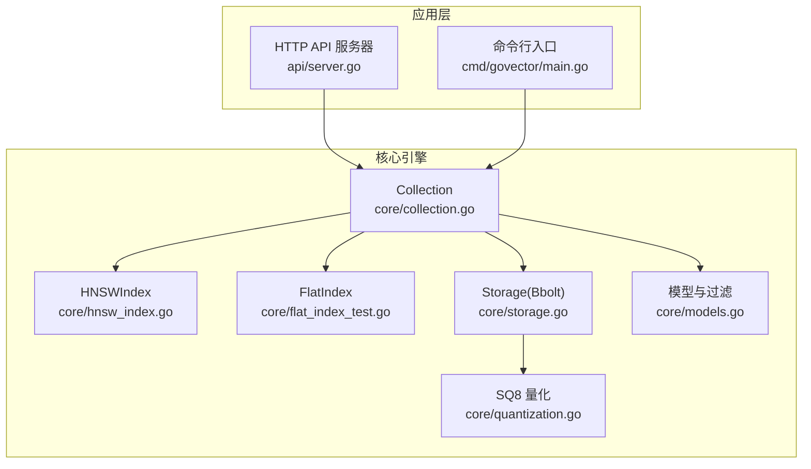
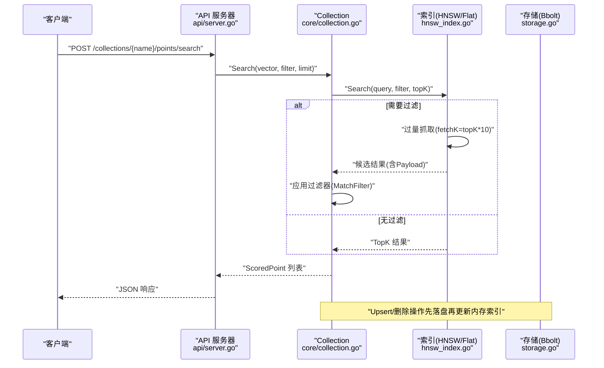
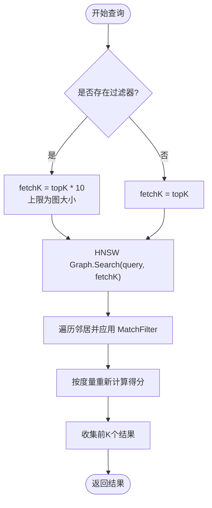
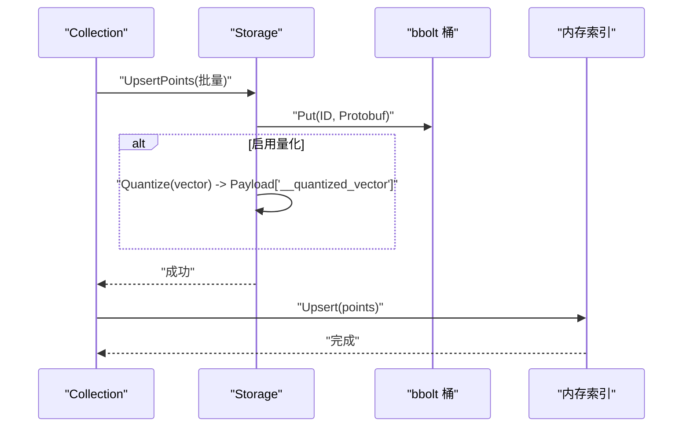
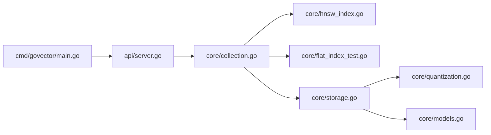

# 性能问题

<cite>
**本文引用的文件**
- [README.md](file://README.md)
- [cmd/bench/main.go](file://cmd/bench/main.go)
- [cmd/govector/main.go](file://cmd/govector/main.go)
- [api/server.go](file://api/server.go)
- [core/collection.go](file://core/collection.go)
- [core/hnsw_index.go](file://core/hnsw_index.go)
- [core/storage.go](file://core/storage.go)
- [core/quantization.go](file://core/quantization.go)
- [core/models.go](file://core/models.go)
- [core/hnsw_index_test.go](file://core/hnsw_index_test.go)
- [core/flat_index_test.go](file://core/flat_index_test.go)
</cite>

## 目录
1. [简介](#简介)
2. [项目结构](#项目结构)
3. [核心组件](#核心组件)
4. [架构总览](#架构总览)
5. [详细组件分析](#详细组件分析)
6. [依赖关系分析](#依赖关系分析)
7. [性能考量与优化建议](#性能考量与优化建议)
8. [故障排除指南](#故障排除指南)
9. [结论](#结论)
10. [附录：基准测试与监控](#附录基准测试与监控)

## 简介
本指南聚焦于 GoVector 的性能问题系统化排查，覆盖内存使用过高、磁盘 I/O 延迟、查询响应慢等问题的诊断与解决路径，并提供性能监控指标解读、HNSW 参数调优、存储配置优化、查询优化策略、基准测试工具使用与瓶颈识别技巧，以及不同规模数据集下的优化建议。

## 项目结构
GoVector 采用“嵌入式向量数据库”设计，核心由以下模块组成：
- 存储层：基于 bbolt（BoltDB）持久化，支持集合元数据与点数据的读写。
- 索引层：支持扁平索引与 HNSW 图索引，按需选择以平衡构建成本与查询延迟。
- 模型与过滤：统一的数据模型与过滤器，支持多种匹配类型与范围条件。
- 量化：内置 SQ8 8-bit 量化，降低磁盘占用与内存压力。
- 服务层：提供 Qdrant 兼容的 REST API，支持集合管理、点写入、搜索与删除。

图表来源
- [api/server.go:16-424](file://api/server.go#L16-L424)
- [cmd/govector/main.go:18-92](file://cmd/govector/main.go#L18-L92)
- [core/collection.go:12-198](file://core/collection.go#L12-L198)
- [core/hnsw_index.go:44-229](file://core/hnsw_index.go#L44-L229)
- [core/storage.go:15-360](file://core/storage.go#L15-L360)
- [core/quantization.go:24-125](file://core/quantization.go#L24-L125)
- [core/models.go:5-280](file://core/models.go#L5-L280)

章节来源
- [README.md:16-42](file://README.md#L16-L42)
- [api/server.go:54-95](file://api/server.go#L54-L95)
- [cmd/govector/main.go:18-51](file://cmd/govector/main.go#L18-L51)

## 核心组件
- Collection：封装集合的 Upsert/Search/Delete 操作，协调内存索引与持久化存储，保证一致性。
- HNSWIndex：基于外部图库的近似最近邻索引，支持 Cosine/Euclidean/Dot 距离度量与可调参数。
- Storage：Bbolt 封装，负责集合桶、元数据、点序列化与加载、批量删除等。
- SQ8 量化：将浮点向量压缩为 8bit 表示，减少磁盘与内存占用。
- 过滤器与模型：统一的 Payload 结构与多类型匹配条件，支持精确、范围、前缀、包含、正则。

章节来源
- [core/collection.go:22-91](file://core/collection.go#L22-L91)
- [core/hnsw_index.go:44-106](file://core/hnsw_index.go#L44-L106)
- [core/storage.go:15-114](file://core/storage.go#L15-L114)
- [core/quantization.go:9-29](file://core/quantization.go#L9-L29)
- [core/models.go:5-79](file://core/models.go#L5-L79)

## 架构总览
下图展示从 API 请求到索引与存储的关键交互路径，以及查询时的后过滤策略。

图表来源
- [api/server.go:178-218](file://api/server.go#L178-L218)
- [core/collection.go:135-147](file://core/collection.go#L135-L147)
- [core/hnsw_index.go:129-176](file://core/hnsw_index.go#L129-L176)
- [core/storage.go:144-187](file://core/storage.go#L144-L187)

## 详细组件分析

### HNSW 索引参数与行为
- 关键参数
  - M：每个节点的最大连接数，影响图密度与查询精度/速度权衡。
  - EfConstruction：构建阶段动态候选列表大小，越大越准但构建更慢。
  - EfSearch：查询阶段动态候选列表大小，越大召回越高但延迟上升。
  - K：返回 TopK 数量，影响后过滤抓取倍数。
- 查询策略
  - 当存在过滤器时，采用“过量抓取 + 后过滤”策略，抓取数量为 topK 的若干倍，再在内存中应用过滤器，最后取前 K 个。
- 并发控制
  - 使用读写锁保护图与映射，避免并发读写导致不一致。

图表来源
- [core/hnsw_index.go:129-176](file://core/hnsw_index.go#L129-L176)
- [core/models.go:81-106](file://core/models.go#L81-L106)

章节来源
- [core/hnsw_index.go:11-39](file://core/hnsw_index.go#L11-L39)
- [core/hnsw_index.go:129-176](file://core/hnsw_index.go#L129-L176)

### 存储与持久化
- 写入流程
  - 先写入 bbolt 集合桶，键为点 ID，值为 Protobuf 序列化后的点；若启用量化，则将原始向量替换为压缩字节并存入 Payload。
  - 成功后再更新内存索引，失败时尝试回滚删除已写入的点。
- 读取流程
  - 从集合桶遍历所有点，反序列化为内存对象；若启用量化，从 Payload 中读取压缩字节并解压回浮点向量。
- 元数据
  - 集合元信息保存在特殊桶中，重启时自动加载并重建 Collection 与索引。

图表来源
- [core/collection.go:97-133](file://core/collection.go#L97-L133)
- [core/storage.go:144-187](file://core/storage.go#L144-L187)
- [core/storage.go:189-235](file://core/storage.go#L189-L235)

章节来源
- [core/storage.go:144-187](file://core/storage.go#L144-L187)
- [core/storage.go:189-235](file://core/storage.go#L189-L235)

### 查询优化策略
- 减少后过滤开销
  - 在高过滤率场景，适当提高 EfSearch 以提升召回，同时通过合理的 TopK 与 fetch 倍数控制内存与 CPU 占用。
  - 对高频过滤字段建立合适的 Payload 结构，避免复杂正则或大范围扫描。
- 批量写入
  - 使用较大的批量 Upsert，减少 bbolt 事务次数与序列化开销。
- 量化与内存
  - 在满足精度要求的前提下开启 SQ8 量化，显著降低内存与磁盘占用，提升冷启动与大规模加载效率。

章节来源
- [core/hnsw_index.go:129-176](file://core/hnsw_index.go#L129-L176)
- [core/storage.go:144-187](file://core/storage.go#L144-L187)
- [core/quantization.go:31-76](file://core/quantization.go#L31-L76)

## 依赖关系分析
- 外部依赖
  - HNSW 图库：用于构建与查询 HNSW 索引。
  - bbolt：轻量级键值数据库，提供集合桶与元数据存储。
  - Protobuf：序列化点与元数据。
- 内部耦合
  - Collection 依赖 Storage 与 Index 接口，向上暴露统一的 Upsert/Search/Delete。
  - HNSWIndex 维护图与点映射，Search 时需要并发安全访问。
  - Storage 与 Collection 共同保证数据一致性。

图表来源
- [api/server.go:16-424](file://api/server.go#L16-L424)
- [cmd/govector/main.go:18-92](file://cmd/govector/main.go#L18-L92)
- [core/collection.go:12-198](file://core/collection.go#L12-L198)
- [core/hnsw_index.go:44-229](file://core/hnsw_index.go#L44-L229)
- [core/storage.go:15-360](file://core/storage.go#L15-L360)
- [core/quantization.go:24-125](file://core/quantization.go#L24-L125)
- [core/models.go:5-280](file://core/models.go#L5-L280)

## 性能考量与优化建议

### 内存使用过高
- 现象
  - GC 次数增多、Alloc/Sys 上升、查询延迟抖动。
- 可能原因
  - 过量抓取导致中间结果膨胀；未启用量化导致向量占用过大；小批量 Upsert 导致频繁分配。
- 优化手段
  - 启用 SQ8 量化（存储与加载均支持），降低内存与磁盘占用。
  - 调整 HNSW 参数：适度降低 EfSearch 或增大 M，以平衡精度与内存。
  - 批量写入：增大 Upsert 批大小，减少临时对象与拷贝。
  - 控制 TopK 与 fetch 倍数：在满足召回前提下尽量减小 fetchK。

章节来源
- [core/quantization.go:31-76](file://core/quantization.go#L31-L76)
- [core/hnsw_index.go:129-176](file://core/hnsw_index.go#L129-L176)
- [cmd/bench/main.go:41-107](file://cmd/bench/main.go#L41-L107)

### 磁盘 I/O 延迟
- 现象
  - Upsert 延迟高、加载集合耗时长、删除操作卡顿。
- 可能原因
  - 写放大：每条记录多次序列化；小批量事务导致 I/O 频繁提交。
  - 未启用量化：向量直接存储为浮点数组，体积大。
- 优化手段
  - 开启 SQ8 量化，减少单条记录体积与写放大。
  - 批量 Upsert：参考基准工具中的批处理模式，减少事务次数。
  - 选择合适磁盘：SSD 优于 HDD；确保文件系统缓存与预读策略合理。

章节来源
- [core/storage.go:144-187](file://core/storage.go#L144-L187)
- [core/quantization.go:31-76](file://core/quantization.go#L31-L76)
- [cmd/bench/main.go:52-82](file://cmd/bench/main.go#L52-L82)

### 查询响应慢
- 现象
  - 平均延迟上升、P95/P99 明显升高、吞吐下降。
- 可能原因
  - 高过滤率导致后过滤开销大；EfSearch 不足导致召回不足；索引规模大但参数不当。
- 优化手段
  - 提升 EfSearch：在可接受范围内提高查询候选列表大小。
  - 合理设置 M：增大 M 提高图稠密性，但会增加内存与构建时间。
  - 优化过滤器：避免全表正则扫描；优先使用高选择性的字段。
  - 评估是否需要 HNSW：百万级规模下 HNSW 已具备亚毫秒级延迟。

章节来源
- [core/hnsw_index.go:129-176](file://core/hnsw_index.go#L129-L176)
- [core/models.go:81-106](file://core/models.go#L81-L106)
- [README.md:60-71](file://README.md#L60-L71)

### HNSW 参数调优
- M
  - 增大：召回更好、内存更高；减小：内存更低、召回略降。
- EfConstruction
  - 增大：构建更准、耗时更久；默认值通常较合理。
- EfSearch
  - 增大：召回更好、延迟更高；根据 SLA 调整。
- K
  - 影响 fetch 倍数与后过滤成本；与 TopK 保持一致。

章节来源
- [core/hnsw_index.go:11-39](file://core/hnsw_index.go#L11-L39)
- [api/server.go:306-321](file://api/server.go#L306-L321)

### 存储配置优化
- 量化开关
  - 在构造 Storage 时启用量化，或通过 API 创建集合时传入参数。
- 元数据与集合桶
  - 自动发现集合与元数据，重启后自动恢复。
- 删除策略
  - 先删存储再删索引，保证一致性。

章节来源
- [core/storage.go:95-114](file://core/storage.go#L95-L114)
- [api/server.go:323-351](file://api/server.go#L323-L351)
- [core/storage.go:338-360](file://core/storage.go#L338-L360)

### 查询优化策略
- 后过滤策略
  - 高过滤率场景下，先过量抓取再过滤，避免在图上做复杂过滤。
- Payload 设计
  - 为高频过滤字段提供合适的数据类型与索引友好的结构。
- 距离度量
  - Cosine 在大多数嵌入场景表现稳定；根据任务选择 Euclid/Dot。

章节来源
- [core/hnsw_index.go:129-176](file://core/hnsw_index.go#L129-L176)
- [core/models.go:81-106](file://core/models.go#L81-L106)

## 故障排除指南

### 内存问题排查
- 步骤
  - 使用基准工具观察内存指标变化，确认是否为批量生成导致峰值。
  - 检查是否启用量化；如未启用，考虑开启 SQ8。
  - 降低 EfSearch 或增大 M，观察内存与延迟变化。
- 关注点
  - Alloc/TotalAlloc/Sys/GC 次数；关注 GC 前后的内存回落情况。

章节来源
- [cmd/bench/main.go:34-39](file://cmd/bench/main.go#L34-L39)
- [cmd/bench/main.go:41-107](file://cmd/bench/main.go#L41-L107)
- [core/quantization.go:31-76](file://core/quantization.go#L31-L76)

### 磁盘 I/O 问题排查
- 步骤
  - 观察 Upsert 时的写入耗时；对比启用/关闭量化前后的差异。
  - 检查批大小与事务提交频率；尽量使用较大批次。
  - 确认磁盘介质与文件系统配置。
- 关注点
  - 写放大与单条记录体积；I/O 延迟分布。

章节来源
- [core/storage.go:144-187](file://core/storage.go#L144-L187)
- [cmd/bench/main.go:52-82](file://cmd/bench/main.go#L52-L82)

### 查询慢排查
- 步骤
  - 分析过滤器复杂度；避免全表正则与大范围扫描。
  - 调整 EfSearch 与 M；评估 TopK 设置是否合理。
  - 对比 HNSW 与 Flat 的延迟与吞吐，确认是否需要切换索引。
- 关注点
  - 平均延迟与尾延迟；吞吐与错误率。

章节来源
- [core/hnsw_index.go:129-176](file://core/hnsw_index.go#L129-L176)
- [core/models.go:81-106](file://core/models.go#L81-L106)
- [README.md:60-71](file://README.md#L60-L71)

### 数据一致性与错误处理
- Upsert 先落盘再更新索引；失败时尝试回滚删除，保证一致性。
- 删除操作遵循“先删存储，再删索引”的顺序。
- 集合元数据保存在专用桶，重启后自动加载。

章节来源
- [core/collection.go:97-133](file://core/collection.go#L97-L133)
- [core/collection.go:162-197](file://core/collection.go#L162-L197)
- [core/storage.go:261-307](file://core/storage.go#L261-L307)

## 结论
通过量化、合理的 HNSW 参数、批量写入与过滤器优化，GoVector 能在百万级规模下维持亚毫秒级查询延迟与稳定的吞吐。建议在生产环境中结合基准测试工具持续监控内存、磁盘与 CPU 指标，针对不同数据规模与查询负载进行参数微调与容量规划。

## 附录：基准测试与监控

### 基准测试工具使用
- 工具位置：[cmd/bench/main.go](file://cmd/bench/main.go)
- 功能要点
  - 支持不同规模（10K/100K/1M）与维度（默认 128）的基准运行。
  - 输出索引构建耗时、平均查询延迟、QPS 与内存使用（Alloc/TotalAlloc/Sys/NumGC）。
  - 默认使用 Cosine 距离与 TopK=10。
- 使用建议
  - 在不同数据规模下对比 HNSW 与 Flat 的延迟与吞吐。
  - 针对不同 EfSearch/M/EfConstruction 进行参数扫描，定位最优组合。
  - 在每次调整后触发 GC 并记录内存指标。

章节来源
- [cmd/bench/main.go:109-142](file://cmd/bench/main.go#L109-L142)
- [cmd/bench/main.go:41-107](file://cmd/bench/main.go#L41-L107)

### 性能监控指标解读
- 内存使用率
  - Alloc：当前分配的堆内存量；峰值通常出现在批量生成与索引构建阶段。
  - Sys：操作系统分配给 Go 进程的总内存；反映进程整体内存占用。
  - NumGC：GC 次数；频繁 GC 可能意味着内存压力或对象短生命周期过多。
- 磁盘读写速度
  - Upsert 吞吐（条/秒）：衡量写入能力；受批大小、量化与磁盘 I/O 影响。
  - 加载集合耗时：反映存储层读取与反序列化效率。
- CPU 利用率
  - 查询延迟与吞吐的函数关系：在高并发下 CPU 可能成为瓶颈，需结合线程与锁竞争分析。

章节来源
- [cmd/bench/main.go:34-39](file://cmd/bench/main.go#L34-L39)
- [README.md:60-71](file://README.md#L60-L71)

### 不同规模数据集的优化建议
- 小规模（10K）
  - 可使用 Flat 索引验证流程；或使用 HNSW 作为长期方案。
  - 关注过滤器设计与批量大小，避免不必要的 GC。
- 中规模（100K）
  - 推荐 HNSW；适当提高 EfSearch 以提升召回。
  - 启用量化以降低内存与磁盘占用。
- 大规模（1M）
  - HNSW 已具备亚毫秒级延迟；重点在于参数微调与资源隔离。
  - 严格控制过滤器复杂度与 TopK 设置，避免后过滤成为瓶颈。

章节来源
- [README.md:60-71](file://README.md#L60-L71)
- [core/hnsw_index.go:129-176](file://core/hnsw_index.go#L129-L176)