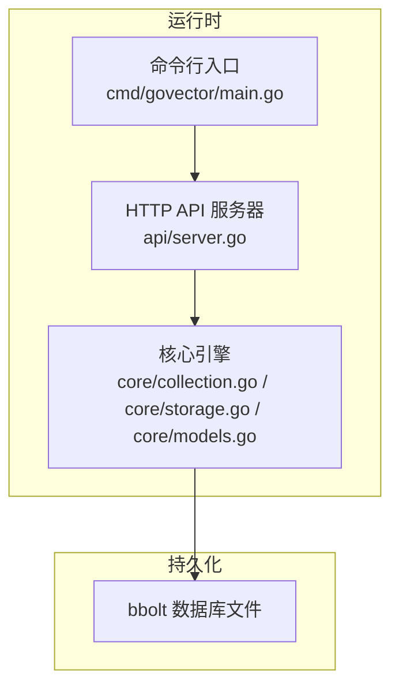
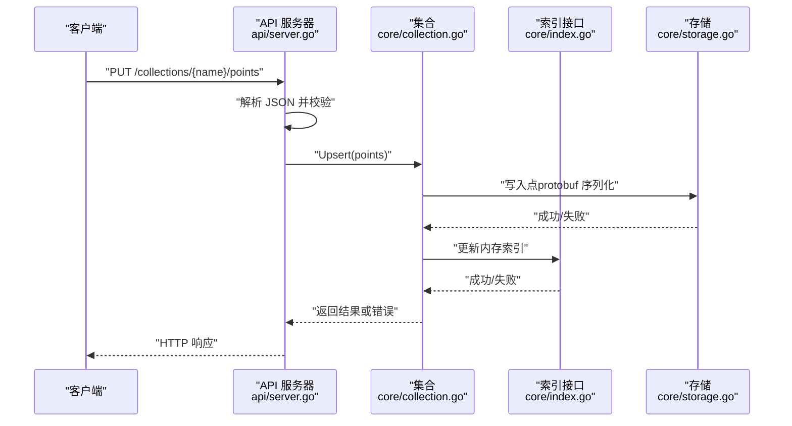
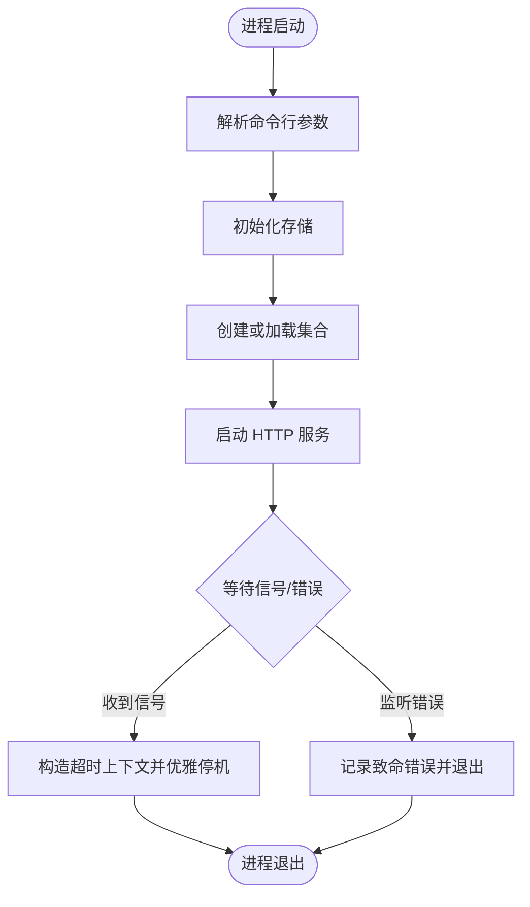
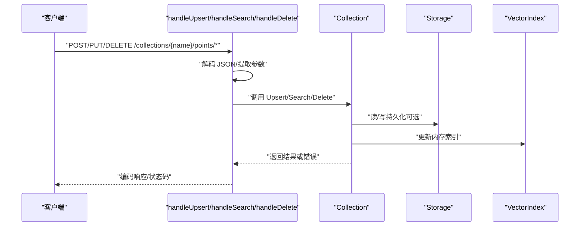
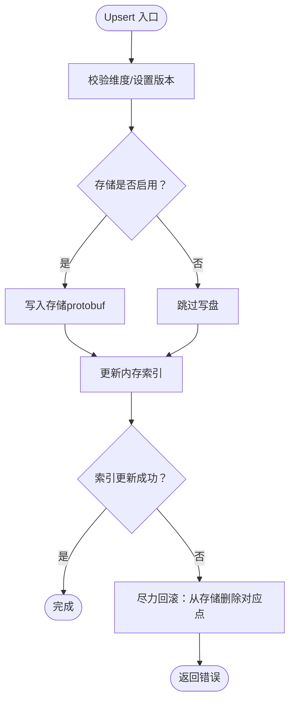
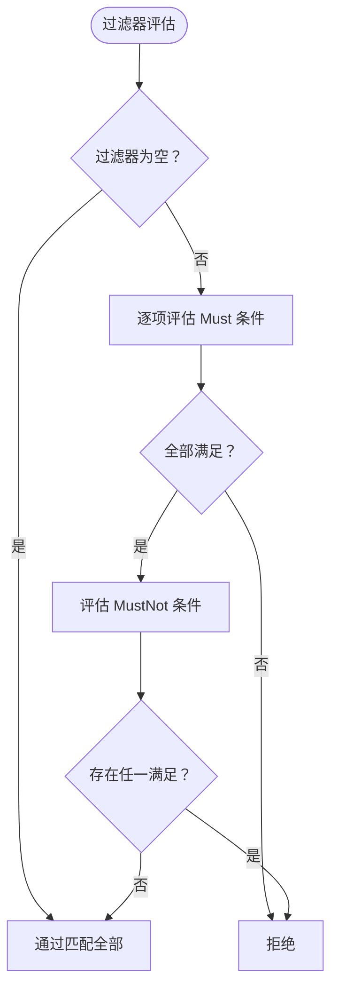
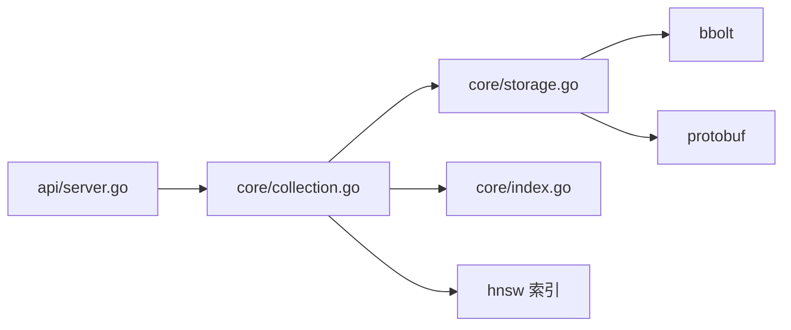

# 故障排除

<cite>
**本文引用的文件**
- [README.md](file://README.md)
- [go.mod](file://go.mod)
- [cmd/govector/main.go](file://cmd/govector/main.go)
- [api/server.go](file://api/server.go)
- [core/collection.go](file://core/collection.go)
- [core/storage.go](file://core/storage.go)
- [core/models.go](file://core/models.go)
- [core/index.go](file://core/index.go)
- [core/collection_test.go](file://core/collection_test.go)
- [example/embedded/main.go](file://example/embedded/main.go)
- [demo.sh](file://demo.sh)
- [scripts/build_release.sh](file://scripts/build_release.sh)
</cite>

## 目录
1. [简介](#简介)
2. [项目结构](#项目结构)
3. [核心组件](#核心组件)
4. [架构总览](#架构总览)
5. [详细组件分析](#详细组件分析)
6. [依赖分析](#依赖分析)
7. [性能考虑](#性能考虑)
8. [故障排除指南](#故障排除指南)
9. [结论](#结论)
10. [附录](#附录)

## 简介
本指南面向运维与开发人员，系统化地梳理 GoVector 在生产环境中的常见问题与排障路径，覆盖安装与部署、配置错误、性能问题、数据一致性、日志与定位技巧、以及社区支持与问题上报流程。GoVector 提供嵌入式库与独立微服务两种模式，均以 Qdrant 兼容 API 为入口，底层基于 BoltDB（bbolt）持久化与 HNSW/Flat 索引。

## 项目结构
- 顶层模块与依赖：模块定义、Go 版本要求与外部依赖（bbolt、protobuf、hnsw）。
- 服务端入口：命令行参数解析、存储初始化、集合加载、HTTP 服务器启动与优雅停机。
- API 层：提供 /collections、/points 的增删改查接口，负责请求解析、路由与响应。
- 核心引擎：Collection 负责 Upsert/Search/Delete；Storage 负责 bbolt 存取与元数据；模型与过滤器定义。
- 示例与脚本：嵌入式用法示例、服务端演示脚本、发布打包脚本。

图表来源
- [cmd/govector/main.go:18-91](file://cmd/govector/main.go#L18-L91)
- [api/server.go:54-95](file://api/server.go#L54-L95)
- [core/collection.go:22-91](file://core/collection.go#L22-L91)
- [core/storage.go:88-114](file://core/storage.go#L88-L114)

章节来源
- [go.mod:1-19](file://go.mod#L1-L19)
- [cmd/govector/main.go:18-91](file://cmd/govector/main.go#L18-L91)
- [api/server.go:54-95](file://api/server.go#L54-L95)
- [core/collection.go:22-91](file://core/collection.go#L22-L91)
- [core/storage.go:88-114](file://core/storage.go#L88-L114)

## 核心组件
- 服务器与命令行
  - 解析端口、数据库路径、索引类型等参数，初始化存储与集合，启动 HTTP 服务，并处理信号进行优雅停机。
- API 层
  - 提供集合管理与点操作接口；对请求进行解码、校验与错误映射；调用 Collection 执行业务逻辑。
- Collection
  - 维护线程安全的内存索引与可选持久化；Upsert 保证先落盘再更新索引；Delete 支持按 ID 或过滤器删除。
- Storage
  - 基于 bbolt 的桶式存储；支持集合元数据、点序列化（protobuf）、量化/反量化（SQ8）。
- 模型与过滤
  - Payload、PointStruct、Filter、Condition、Range/Regex/Pref/Contain/Exact 等匹配规则。

章节来源
- [cmd/govector/main.go:18-91](file://cmd/govector/main.go#L18-L91)
- [api/server.go:145-258](file://api/server.go#L145-L258)
- [core/collection.go:93-197](file://core/collection.go#L93-L197)
- [core/storage.go:131-360](file://core/storage.go#L131-L360)
- [core/models.go:5-280](file://core/models.go#L5-L280)

## 架构总览
下图展示从客户端到存储的完整调用链路与一致性保障策略。

图表来源
- [api/server.go:145-176](file://api/server.go#L145-L176)
- [core/collection.go:93-133](file://core/collection.go#L93-L133)
- [core/storage.go:144-187](file://core/storage.go#L144-L187)
- [core/index.go:5-29](file://core/index.go#L5-L29)

## 详细组件分析

### 服务器与优雅停机
- 启动阶段：解析参数、初始化存储、创建/加载集合、注册路由、启动监听。
- 停机阶段：捕获系统信号，构造超时上下文，调用 http.Server.Shutdown 平滑结束。

图表来源
- [cmd/govector/main.go:18-91](file://cmd/govector/main.go#L18-L91)
- [api/server.go:131-143](file://api/server.go#L131-L143)

章节来源
- [cmd/govector/main.go:18-91](file://cmd/govector/main.go#L18-L91)
- [api/server.go:131-143](file://api/server.go#L131-L143)

### API 请求处理与错误映射
- Upsert/Search/Delete：解析请求体、校验集合存在性、调用 Collection 方法、根据错误返回 4xx/5xx。
- 错误映射：无效 JSON 返回 400；集合不存在返回 404；内部错误返回 500。

图表来源
- [api/server.go:145-258](file://api/server.go#L145-L258)
- [core/collection.go:93-197](file://core/collection.go#L93-L197)
- [core/storage.go:144-187](file://core/storage.go#L144-L187)
- [core/index.go:5-29](file://core/index.go#L5-L29)

章节来源
- [api/server.go:145-258](file://api/server.go#L145-L258)

### 数据一致性与回滚策略
- Upsert 顺序：先持久化，后更新索引；若索引更新失败，尝试从存储中删除对应点（尽力而为）。
- 删除：先删存储，后删索引；按 ID 或过滤器两种方式。
- 加载：集合创建时会从存储加载历史点并校验维度一致性。

图表来源
- [core/collection.go:93-133](file://core/collection.go#L93-L133)
- [core/storage.go:144-187](file://core/storage.go#L144-L187)

章节来源
- [core/collection.go:93-133](file://core/collection.go#L93-L133)
- [core/collection_test.go:255-291](file://core/collection_test.go#L255-L291)

### 过滤器与查询
- 支持 Must/MustNot 条件，键值匹配（Exact/Range/Pref/Contain/Regex），范围比较与正则匹配。
- 查询时将过滤器传递给索引层执行。

图表来源
- [core/models.go:81-106](file://core/models.go#L81-L106)
- [core/models.go:108-279](file://core/models.go#L108-L279)

章节来源
- [core/models.go:81-106](file://core/models.go#L81-L106)
- [core/models.go:108-279](file://core/models.go#L108-L279)

## 依赖分析
- 外部依赖
  - bbolt：本地键值数据库，提供桶与事务能力。
  - protobuf：点结构序列化。
  - hnsw：HNSW 图索引实现。
- 内部耦合
  - API 依赖 Collection；Collection 依赖 Storage 与 VectorIndex 接口；Storage 依赖 bbolt 与 protobuf。
- 循环依赖
  - 未发现循环导入；模块边界清晰。

图表来源
- [go.mod:5-9](file://go.mod#L5-L9)
- [api/server.go:13-14](file://api/server.go#L13-L14)
- [core/collection.go:12-20](file://core/collection.go#L12-L20)
- [core/storage.go:3-11](file://core/storage.go#L3-L11)

章节来源
- [go.mod:1-19](file://go.mod#L1-L19)
- [api/server.go:13-14](file://api/server.go#L13-L14)
- [core/collection.go:12-20](file://core/collection.go#L12-L20)
- [core/storage.go:3-11](file://core/storage.go#L3-L11)

## 性能考虑
- 索引选择
  - HNSW：适合大规模高维向量，近似检索吞吐更高；Flat：小规模或低维场景，精确但较慢。
- 量化（SQ8）
  - 存储层支持向量量化，降低磁盘占用与加载成本，查询时自动反量化。
- 并发与锁
  - Collection 对外提供读写锁保护，避免并发写导致的数据竞争。
- I/O 与序列化
  - Protobuf 序列化/反序列化开销可控；批量 Upsert 可减少事务次数。
- 监控建议
  - CPU/内存/磁盘 I/O：结合系统工具与应用日志。
  - 网络延迟：压测工具模拟真实流量，观察 P95/P99 延迟。

章节来源
- [README.md:34-38](file://README.md#L34-L38)
- [core/storage.go:95-114](file://core/storage.go#L95-L114)
- [core/collection.go:17-20](file://core/collection.go#L17-L20)

## 故障排除指南

### 一、安装与部署问题
- 症状：无法启动服务端或找不到可执行文件
  - 排查要点
    - 确认已安装 Go 并满足版本要求。
    - 使用正确的构建命令或发行包。
  - 参考路径
    - [go.mod:3](file://go.mod#L3)
    - [scripts/build_release.sh:45-48](file://scripts/build_release.sh#L45-L48)

- 症状：Homebrew 安装失败或版本异常
  - 排查要点
    - 检查 formula 中的版本号与校验和是否与最新发布一致。
  - 参考路径
    - [scripts/build_release.sh:80-115](file://scripts/build_release.sh#L80-L115)

- 症状：权限不足导致无法写入数据库文件
  - 排查要点
    - 确保运行用户对数据库文件所在目录具有读写权限。
  - 参考路径
    - [core/storage.go:88-114](file://core/storage.go#L88-L114)

章节来源
- [go.mod:3](file://go.mod#L3)
- [scripts/build_release.sh:45-48](file://scripts/build_release.sh#L45-L48)
- [scripts/build_release.sh:80-115](file://scripts/build_release.sh#L80-L115)
- [core/storage.go:88-114](file://core/storage.go#L88-L114)

### 二、配置错误
- 症状：创建集合时报错“距离度量非法”
  - 排查要点
    - 仅允许 cosine/euclidean/dot（大小写不敏感）。
  - 参考路径
    - [api/server.go:292-304](file://api/server.go#L292-L304)

- 症状：集合参数（如 M/ef_construction/ef_search/k）无效
  - 排查要点
    - 参数需为数值类型；服务端会做类型转换与默认值处理。
  - 参考路径
    - [api/server.go:306-321](file://api/server.go#L306-L321)

- 症状：集合已存在导致创建失败
  - 排查要点
    - 删除已有集合或更换名称。
  - 参考路径
    - [api/server.go:277-284](file://api/server.go#L277-L284)

- 症状：集合维度不匹配或查询向量维度不一致
  - 排查要点
    - 新建集合时指定的维度必须与点向量一致；查询向量维度也必须一致。
  - 参考路径
    - [core/collection.go:105-109](file://core/collection.go#L105-L109)
    - [core/collection.go:139-141](file://core/collection.go#L139-L141)

章节来源
- [api/server.go:292-304](file://api/server.go#L292-L304)
- [api/server.go:306-321](file://api/server.go#L306-L321)
- [api/server.go:277-284](file://api/server.go#L277-L284)
- [core/collection.go:105-109](file://core/collection.go#L105-L109)
- [core/collection.go:139-141](file://core/collection.go#L139-L141)

### 三、性能问题
- 症状：写入吞吐低
  - 排查要点
    - 使用 HNSW 索引；批量写入；检查磁盘写入速度与队列深度。
  - 参考路径
    - [README.md:64-70](file://README.md#L64-L70)
    - [core/collection.go:93-133](file://core/collection.go#L93-L133)

- 症状：查询延迟高
  - 排查要点
    - 检查 ef_search、M 等参数；确认过滤器是否命中索引；避免全表扫描。
  - 参考路径
    - [api/server.go:306-321](file://api/server.go#L306-L321)
    - [core/models.go:81-106](file://core/models.go#L81-L106)

- 症状：内存占用异常
  - 排查要点
    - 关注 HNSW 参数与点数量；开启/关闭量化（SQ8）对比内存使用。
  - 参考路径
    - [core/storage.go:95-114](file://core/storage.go#L95-L114)

- 症状：磁盘 I/O 抖动
  - 排查要点
    - 观察 bbolt 文件大小变化；批量写入合并事务；避免频繁小事务。
  - 参考路径
    - [core/storage.go:144-187](file://core/storage.go#L144-L187)

- 症状：网络延迟抖动
  - 排查要点
    - 使用压测工具模拟峰值流量；关注连接数与超时设置；检查防火墙与代理。
  - 参考路径
    - [demo.sh:22-38](file://demo.sh#L22-L38)

章节来源
- [README.md:64-70](file://README.md#L64-L70)
- [core/collection.go:93-133](file://core/collection.go#L93-L133)
- [api/server.go:306-321](file://api/server.go#L306-L321)
- [core/models.go:81-106](file://core/models.go#L81-L106)
- [core/storage.go:95-114](file://core/storage.go#L95-L114)
- [core/storage.go:144-187](file://core/storage.go#L144-L187)
- [demo.sh:22-38](file://demo.sh#L22-L38)

### 四、数据不一致
- 症状：Upsert 后查询不到新增点
  - 排查要点
    - 确认存储写入成功；检查索引更新是否成功；必要时重试或重建索引。
  - 参考路径
    - [core/collection.go:111-130](file://core/collection.go#L111-L130)

- 症状：删除后仍可见
  - 排查要点
    - 确认删除 ID/过滤器正确；检查存储与索引是否都已更新。
  - 参考路径
    - [core/collection.go:162-197](file://core/collection.go#L162-L197)

- 症状：重启后集合元数据丢失
  - 排查要点
    - 确认元数据桶存在且可读；检查 bbolt 文件完整性。
  - 参考路径
    - [core/storage.go:261-280](file://core/storage.go#L261-L280)
    - [core/storage.go:282-307](file://core/storage.go#L282-L307)

- 症状：加载历史点时维度不一致报错
  - 排查要点
    - 修正集合维度或清理不一致数据；避免混合不同维度的点。
  - 参考路径
    - [core/collection.go:74-81](file://core/collection.go#L74-L81)
    - [core/collection_test.go:248-253](file://core/collection_test.go#L248-L253)

章节来源
- [core/collection.go:111-130](file://core/collection.go#L111-L130)
- [core/collection.go:162-197](file://core/collection.go#L162-L197)
- [core/storage.go:261-280](file://core/storage.go#L261-L280)
- [core/storage.go:282-307](file://core/storage.go#L282-L307)
- [core/collection.go:74-81](file://core/collection.go#L74-L81)
- [core/collection_test.go:248-253](file://core/collection_test.go#L248-L253)

### 五、错误日志分析与问题定位
- 服务器启动/停止日志
  - 启动成功、优雅停机、非正常关闭等日志位置。
  - 参考路径
    - [cmd/govector/main.go:25-36](file://cmd/govector/main.go#L25-L36)
    - [cmd/govector/main.go:77-88](file://cmd/govector/main.go#L77-L88)
    - [api/server.go:138-142](file://api/server.go#L138-L142)

- API 层错误码映射
  - 400：无效 JSON；404：集合不存在；500：内部错误。
  - 参考路径
    - [api/server.go:161-168](file://api/server.go#L161-L168)
    - [api/server.go:188-190](file://api/server.go#L188-L190)
    - [api/server.go:240-248](file://api/server.go#L240-L248)

- 存储层错误
  - bbolt 打开失败、桶不存在、序列化失败、删除失败等。
  - 参考路径
    - [core/storage.go:99-102](file://core/storage.go#L99-L102)
    - [core/storage.go:153-157](file://core/storage.go#L153-L157)
    - [core/storage.go:177-183](file://core/storage.go#L177-L183)
    - [core/storage.go:341-359](file://core/storage.go#L341-L359)

- 嵌入式用法定位
  - 使用示例程序快速复现问题，缩小范围至 API/存储/索引。
  - 参考路径
    - [example/embedded/main.go:10-62](file://example/embedded/main.go#L10-L62)

章节来源
- [cmd/govector/main.go:25-36](file://cmd/govector/main.go#L25-L36)
- [cmd/govector/main.go:77-88](file://cmd/govector/main.go#L77-L88)
- [api/server.go:138-142](file://api/server.go#L138-L142)
- [api/server.go:161-168](file://api/server.go#L161-L168)
- [api/server.go:188-190](file://api/server.go#L188-L190)
- [api/server.go:240-248](file://api/server.go#L240-L248)
- [core/storage.go:99-102](file://core/storage.go#L99-L102)
- [core/storage.go:153-157](file://core/storage.go#L153-L157)
- [core/storage.go:177-183](file://core/storage.go#L177-L183)
- [core/storage.go:341-359](file://core/storage.go#L341-L359)
- [example/embedded/main.go:10-62](file://example/embedded/main.go#L10-L62)

### 六、社区支持与问题报告流程
- 社区渠道
  - 仓库首页提供了贡献与许可证信息，建议通过 Issues/PR 参与。
  - 参考路径
    - [README.md:128-134](file://README.md#L128-L134)

- 问题报告建议
  - 提供最小可复现实例（嵌入式或服务端）。
  - 附带日志片段、配置参数、数据规模与硬件环境。
  - 明确期望行为与实际行为差异。

章节来源
- [README.md:128-134](file://README.md#L128-L134)

## 结论
通过本指南，运维与开发人员可以系统化地定位与解决 GoVector 在安装、配置、性能与数据一致性方面的常见问题。建议在生产环境中：
- 使用 HNSW 并合理设置参数；
- 启用量化以降低资源占用；
- 建立完善的日志与监控体系；
- 采用批量写入与压测验证；
- 出现不一致时优先检查存储与索引的双写顺序与回滚策略。

## 附录

### A. 常见问题速查表
- 启动失败：检查数据库路径权限与 bbolt 可用性。
- 写入失败：检查 JSON 结构、集合维度与存储写入日志。
- 查询异常：核对 ef_search、过滤器键值与 Must/MustNot 语义。
- 删除无效：确认目标 ID/过滤器命中情况与存储删除日志。
- 重启后数据丢失：检查元数据桶与集合元数据读取。

章节来源
- [core/storage.go:88-114](file://core/storage.go#L88-L114)
- [api/server.go:145-258](file://api/server.go#L145-L258)
- [core/models.go:81-106](file://core/models.go#L81-L106)
- [core/storage.go:261-307](file://core/storage.go#L261-L307)

### B. 快速验证脚本
- 使用演示脚本快速验证服务端可用性与基本功能。
- 参考路径
  - [demo.sh:1-43](file://demo.sh#L1-L43)

章节来源
- [demo.sh:1-43](file://demo.sh#L1-L43)