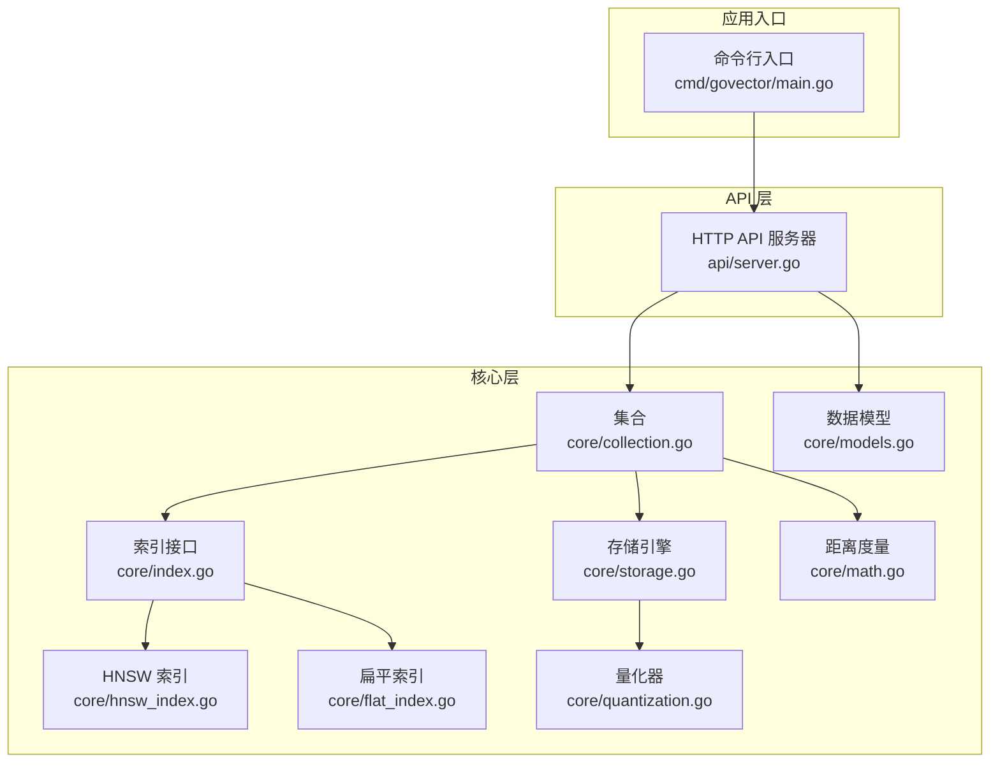
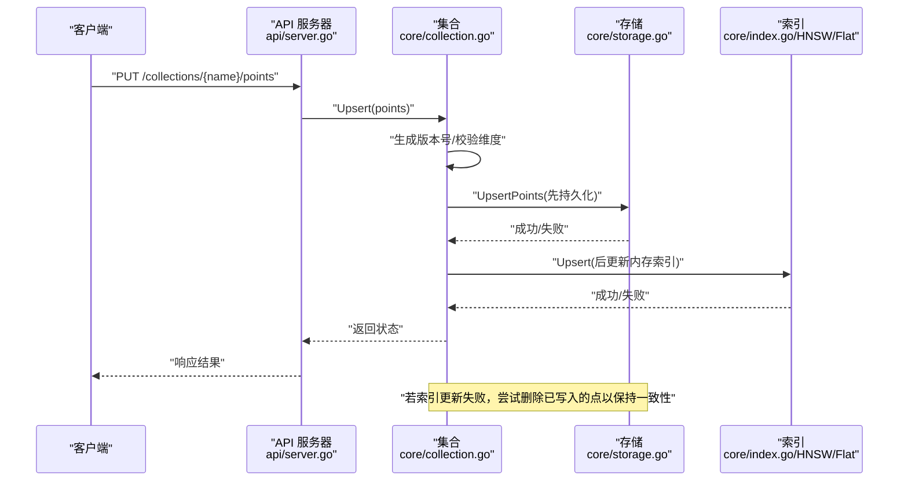
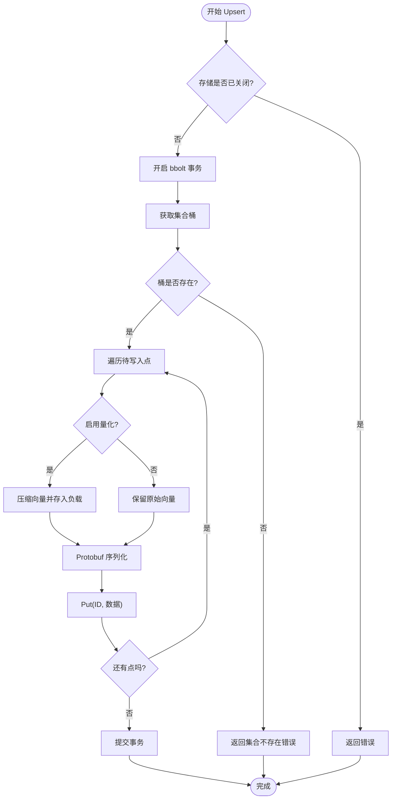
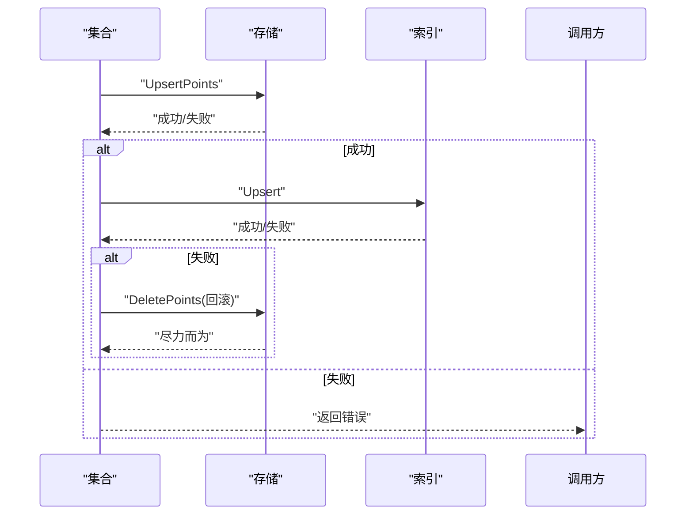
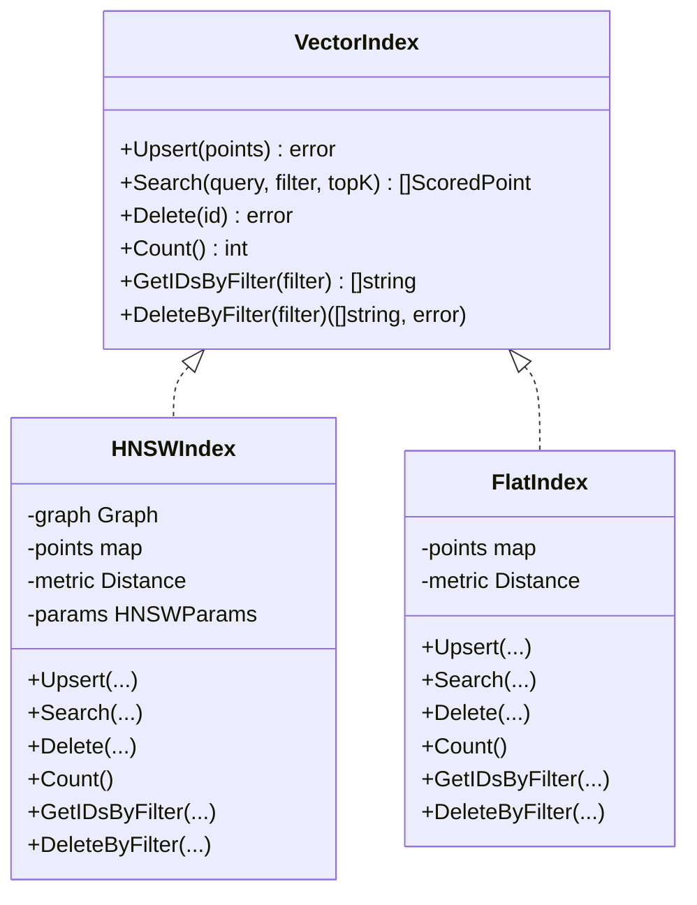
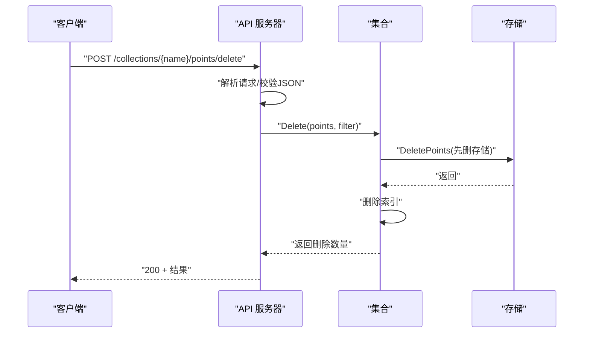
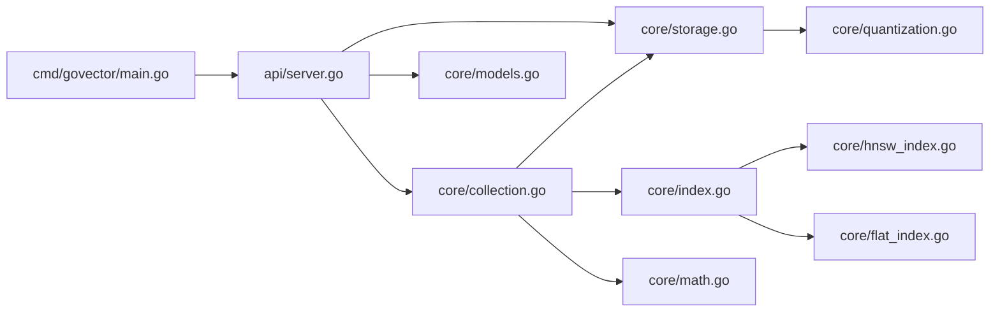

# 数据一致性问题

<cite>
**本文引用的文件**
- [README.md](file://README.md)
- [cmd/govector/main.go](file://cmd/govector/main.go)
- [api/server.go](file://api/server.go)
- [core/storage.go](file://core/storage.go)
- [core/collection.go](file://core/collection.go)
- [core/models.go](file://core/models.go)
- [core/index.go](file://core/index.go)
- [core/hnsw_index.go](file://core/hnsw_index.go)
- [core/flat_index.go](file://core/flat_index.go)
- [core/quantization.go](file://core/quantization.go)
- [core/math.go](file://core/math.go)
- [core/collection_test.go](file://core/collection_test.go)
- [core/storage_test.go](file://core/storage_test.go)
- [core/hnsw_index_test.go](file://core/hnsw_index_test.go)
- [core/flat_index_test.go](file://core/flat_index_test.go)
</cite>

## 目录
1. [简介](#简介)
2. [项目结构](#项目结构)
3. [核心组件](#核心组件)
4. [架构总览](#架构总览)
5. [详细组件分析](#详细组件分析)
6. [依赖关系分析](#依赖关系分析)
7. [性能考量](#性能考量)
8. [故障排除指南](#故障排除指南)
9. [结论](#结论)
10. [附录](#附录)

## 简介
本指南聚焦于 GoVector 的数据一致性问题，涵盖数据丢失、重复数据、索引不一致等完整性问题的诊断与修复方法；提供基于 BoltDB 的备份与恢复策略（含维护与修复）；详解事务处理、并发访问控制与数据同步机制；给出数据校验工具使用与修复流程；并总结预防性最佳实践与监控建议。

## 项目结构
GoVector 采用分层清晰的模块化设计：
- 命令行入口负责启动服务、加载存储与集合，并注册 HTTP API。
- API 层提供与 Qdrant 兼容的 REST 接口，管理集合与点位操作。
- 核心层包含集合、索引、存储、量化与数学计算等模块。
- 存储层以 BoltDB 为持久化后端，结合 Protobuf 序列化实现高可靠本地存储。

**图表来源**
- [cmd/govector/main.go:18-92](file://cmd/govector/main.go#L18-L92)
- [api/server.go:26-143](file://api/server.go#L26-L143)
- [core/collection.go:22-91](file://core/collection.go#L22-L91)
- [core/storage.go:88-114](file://core/storage.go#L88-L114)
- [core/hnsw_index.go:41-106](file://core/hnsw_index.go#L41-L106)
- [core/flat_index.go:9-25](file://core/flat_index.go#L9-L25)
- [core/quantization.go:5-18](file://core/quantization.go#L5-L18)
- [core/math.go:24-38](file://core/math.go#L24-L38)
- [core/models.go:5-25](file://core/models.go#L5-L25)

**章节来源**
- [README.md:122-127](file://README.md#L122-L127)
- [cmd/govector/main.go:18-92](file://cmd/govector/main.go#L18-L92)
- [api/server.go:26-143](file://api/server.go#L26-L143)

## 核心组件
- 集合（Collection）：线程安全的向量集合，负责版本号生成、先持久化再更新内存索引、删除时的双写一致性与回滚。
- 存储（Storage）：基于 BoltDB 的持久化层，提供集合桶、元数据桶、批量插入/删除、列表与加载能力；支持可选的向量量化。
- 索引（VectorIndex）：统一接口，支持 HNSW 与扁平索引，提供增删改查与过滤能力。
- API 服务器（Server）：提供 Qdrant 兼容 REST 接口，管理集合与点位操作，支持优雅关闭。
- 模型与过滤（Models）：定义点结构、评分结果、过滤条件与匹配逻辑。
- 数学与量化（Math/Quantization）：提供距离度量与 8-bit 标量量化，兼顾精度与空间效率。

**章节来源**
- [core/collection.go:93-133](file://core/collection.go#L93-L133)
- [core/storage.go:144-187](file://core/storage.go#L144-L187)
- [core/index.go:5-28](file://core/index.go#L5-L28)
- [api/server.go:145-258](file://api/server.go#L145-L258)
- [core/models.go:81-106](file://core/models.go#L81-L106)
- [core/math.go:24-38](file://core/math.go#L24-L38)
- [core/quantization.go:9-18](file://core/quantization.go#L9-L18)

## 架构总览
下图展示从 API 请求到持久化与索引更新的完整链路，以及错误回滚与一致性保障的关键节点。

**图表来源**
- [api/server.go:145-176](file://api/server.go#L145-L176)
- [core/collection.go:97-133](file://core/collection.go#L97-L133)
- [core/storage.go:144-187](file://core/storage.go#L144-L187)
- [core/index.go:7-28](file://core/index.go#L7-L28)

## 详细组件分析

### 存储与持久化（BoltDB）
- 集合桶：每个集合对应一个桶，键为点 ID，值为 Protobuf 序列化的点对象。
- 元数据桶：保存集合配置与参数，用于重启后自动重建集合。
- 批量操作：UpsertPoints/DeletePoints 在单个事务中执行，保证原子性。
- 关闭语义：Close 幂等且可多次调用，确保数据刷盘。

**图表来源**
- [core/storage.go:144-187](file://core/storage.go#L144-L187)
- [core/storage.go:131-142](file://core/storage.go#L131-L142)
- [core/storage.go:261-280](file://core/storage.go#L261-L280)

**章节来源**
- [core/storage.go:131-187](file://core/storage.go#L131-L187)
- [core/storage.go:261-336](file://core/storage.go#L261-L336)

### 集合与一致性（Upsert/删除）
- 版本号：每次 Upsert 生成纳秒级时间戳作为版本号，便于后续审计与排序。
- 写入顺序：先写存储，再更新索引；若索引更新失败，尝试删除已写入的点，尽力回滚。
- 删除策略：先删存储，再删索引；若索引删除失败，保留存储中的残留点，避免数据丢失。

**图表来源**
- [core/collection.go:97-133](file://core/collection.go#L97-L133)
- [core/storage.go:144-187](file://core/storage.go#L144-L187)
- [core/index.go:7-28](file://core/index.go#L7-L28)

**章节来源**
- [core/collection.go:97-133](file://core/collection.go#L97-L133)
- [core/collection_test.go:255-291](file://core/collection_test.go#L255-L291)

### 索引与过滤（HNSW/Flat）
- HNSW：支持 Cosine/Euclid/Dot 距离函数；搜索阶段采用“过采样 + 后过滤”策略，保证过滤准确性。
- 扁平索引：暴力检索，适合小规模或需要精确结果的场景。
- 过滤：通过 MatchFilter 对负载字段进行精确/范围/前缀/包含/正则匹配。

**图表来源**
- [core/index.go:5-28](file://core/index.go#L5-L28)
- [core/hnsw_index.go:41-106](file://core/hnsw_index.go#L41-L106)
- [core/flat_index.go:9-25](file://core/flat_index.go#L9-L25)

**章节来源**
- [core/hnsw_index.go:126-176](file://core/hnsw_index.go#L126-L176)
- [core/flat_index.go:40-74](file://core/flat_index.go#L40-L74)
- [core/models.go:81-106](file://core/models.go#L81-L106)

### API 与并发控制
- API 服务器在内部集合映射上加锁，保证集合注册与查询的线程安全。
- HTTP 层对请求解析失败返回 400，业务错误返回 500，未找到集合返回 404。
- 优雅关闭：支持超时上下文，确保在关闭期间仍有足够时间完成收尾。

**图表来源**
- [api/server.go:220-258](file://api/server.go#L220-L258)
- [core/collection.go:162-197](file://core/collection.go#L162-L197)
- [core/storage.go:338-360](file://core/storage.go#L338-L360)

**章节来源**
- [api/server.go:131-143](file://api/server.go#L131-L143)
- [api/server.go:220-258](file://api/server.go#L220-L258)

## 依赖关系分析
- 存储依赖 bbolt 与 Protobuf；可选依赖量化器。
- 集合依赖存储与索引接口；索引实现依赖数学度量。
- API 服务器依赖集合与存储；命令行入口依赖 API 与存储。

**图表来源**
- [api/server.go:26-143](file://api/server.go#L26-L143)
- [core/collection.go:22-91](file://core/collection.go#L22-L91)
- [core/storage.go:88-114](file://core/storage.go#L88-L114)
- [core/hnsw_index.go:41-106](file://core/hnsw_index.go#L41-L106)
- [core/flat_index.go:9-25](file://core/flat_index.go#L9-L25)
- [core/quantization.go:5-18](file://core/quantization.go#L5-L18)
- [core/math.go:24-38](file://core/math.go#L24-L38)
- [core/models.go:5-25](file://core/models.go#L5-L25)
- [cmd/govector/main.go:18-92](file://cmd/govector/main.go#L18-L92)

**章节来源**
- [core/storage.go:88-114](file://core/storage.go#L88-L114)
- [core/collection.go:22-91](file://core/collection.go#L22-L91)
- [api/server.go:26-143](file://api/server.go#L26-L143)

## 性能考量
- HNSW 提供近似最近邻搜索，复杂度接近 O(log N)，适合大规模向量检索。
- 扁平索引提供精确结果，适合小规模或对召回率敏感的场景。
- 量化（SQ8）降低存储与内存占用，但会引入精度损失，需权衡。
- 并发：集合与索引均使用读写锁保护，API 层对集合映射加锁，避免竞态。

[本节为通用性能讨论，无需列出具体文件来源]

## 故障排除指南

### 一、数据丢失排查与修复
常见症状
- 搜索结果缺失、计数异常、删除无效。
- 重启后集合内容不完整。

诊断步骤
1. 检查存储文件是否被意外删除或覆盖。
2. 使用存储层的列表与加载功能验证集合桶与元数据桶存在性与内容。
3. 对比集合计数与存储桶内键数量，确认索引与存储一致性。

修复流程
- 若仅索引不一致：重新加载集合（由服务启动时自动完成），或手动触发集合重建。
- 若存储损坏：停止服务，备份当前数据库文件，按“备份与恢复”章节进行恢复。

**章节来源**
- [core/storage.go:237-259](file://core/storage.go#L237-L259)
- [core/storage.go:189-235](file://core/storage.go#L189-L235)
- [api/server.go:97-129](file://api/server.go#L97-L129)

### 二、重复数据与版本冲突
现象
- 同一 ID 出现多条记录，或版本号不一致导致排序异常。

原因与定位
- 插入时未遵循“先持久化再索引”的顺序，或事务中断导致部分写入。
- 版本号生成依赖纳秒级时间戳，同一批次内可能相同，需确保每批唯一性。

修复建议
- 强制幂等插入：以点 ID 为键，覆盖写入；确保存储层 Put 原子性。
- 严格顺序：集合 Upsert 中先存储后索引，失败即回滚。

**章节来源**
- [core/collection.go:97-133](file://core/collection.go#L97-L133)

### 三、索引不一致（HNSW/Flat）
现象
- 搜索结果与存储不一致，或删除后仍可见。

诊断
- 比较集合计数与索引计数，检查过滤后的结果数量。
- 验证过滤条件是否正确匹配负载字段。

修复
- 重新构建索引：删除并重建集合（注意停机窗口）。
- 使用“按过滤删除”清理残留点。

**章节来源**
- [core/hnsw_index.go:178-189](file://core/hnsw_index.go#L178-L189)
- [core/flat_index.go:76-87](file://core/flat_index.go#L76-L87)
- [core/models.go:81-106](file://core/models.go#L81-L106)

### 四、BoltDB 维护与修复
备份策略
- 停止服务后复制数据库文件（推荐使用文件系统快照或数据库关闭时复制）。
- 定期导出集合元数据与关键点集，验证一致性。

恢复流程
- 将备份文件恢复到原路径，启动服务；服务会在启动时自动加载元数据并重建集合。
- 如遇集合维度不匹配或序列化错误，需修正后重启。

BoltDB 修复
- 若出现页损坏，优先使用备份恢复；如无备份，尝试使用 bbolt 工具进行只读检查，但不建议在线修复。

**章节来源**
- [core/storage.go:261-336](file://core/storage.go#L261-L336)
- [api/server.go:97-129](file://api/server.go#L97-L129)

### 五、事务处理与并发控制
- 存储层：所有写操作在单个 bbolt 事务中执行，保证原子性。
- 集合层：Upsert/删除在集合级互斥锁保护下执行，避免并发写竞争。
- API 层：对集合映射加锁，防止并发注册/删除导致的竞态。

最佳实践
- 批量写入时尽量合并为一次 Upsert 调用，减少锁竞争。
- 避免在持有锁期间执行耗时操作（如网络 I/O）。

**章节来源**
- [core/storage.go:144-187](file://core/storage.go#L144-L187)
- [core/collection.go:97-133](file://core/collection.go#L97-L133)
- [api/server.go:131-143](file://api/server.go#L131-L143)

### 六、数据校验与修复流程
校验工具与方法
- 列表集合与元数据：确认集合存在与参数一致。
- 加载集合：逐点反序列化并校验维度与类型。
- 计数对比：集合计数与存储桶键数一致。
- 过滤校验：构造典型过滤条件，验证结果一致性。

修复流程
- 发现不一致：先回滚到最近可用备份，再逐步重放增量数据。
- 量化相关：若启用量化，确认向量还原误差在可接受范围内。

**章节来源**
- [core/storage_test.go:32-162](file://core/storage_test.go#L32-L162)
- [core/collection_test.go:96-191](file://core/collection_test.go#L96-L191)
- [core/hnsw_index_test.go:7-90](file://core/hnsw_index_test.go#L7-L90)
- [core/flat_index_test.go:7-88](file://core/flat_index_test.go#L7-L88)

### 七、预防数据不一致的最佳实践
- 严格遵循“先持久化再索引”的顺序，失败即回滚。
- 使用幂等写入，以点 ID 为键覆盖写入。
- 合理设置 HNSW 参数，平衡召回与性能。
- 定期备份数据库文件与元数据，验证恢复流程。
- 监控集合计数、存储大小与索引命中率，及时发现异常。

[本节为通用最佳实践，无需列出具体文件来源]

## 结论
GoVector 通过严格的“先存储后索引”顺序、事务化存储与读写锁保护，实现了嵌入式向量数据库的数据一致性。配合 BoltDB 的可靠持久化与可选量化，可在性能与精度之间取得良好平衡。建议在生产环境中严格执行备份与校验流程，并持续监控关键指标，以尽早发现并解决问题。

[本节为总结性内容，无需列出具体文件来源]

## 附录

### A. 常见错误与处理对照
- 集合维度不匹配：创建集合时指定的维度与存储中已有点不一致会导致加载失败。解决：修正维度或重建集合。
- 查询/插入向量长度不匹配：会直接返回错误。解决：确保输入向量维度与集合一致。
- 删除无目标：未提供 ID 或过滤条件会导致错误。解决：至少提供其一。

**章节来源**
- [core/collection_test.go:230-253](file://core/collection_test.go#L230-L253)
- [core/collection.go:135-147](file://core/collection.go#L135-L147)

### B. 命令行与服务启动要点
- 启动参数：端口、数据库路径、是否启用 HNSW。
- 优雅关闭：支持信号捕获与超时上下文，确保服务平滑退出。

**章节来源**
- [cmd/govector/main.go:18-92](file://cmd/govector/main.go#L18-L92)