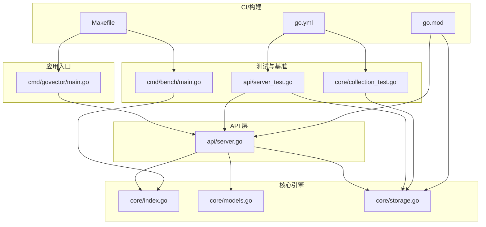
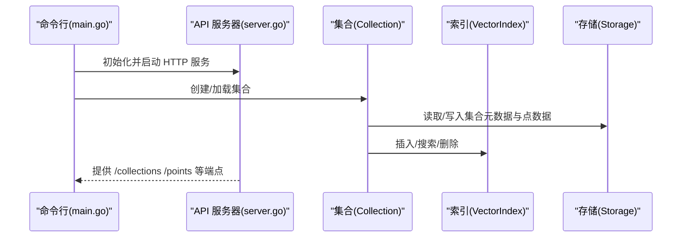
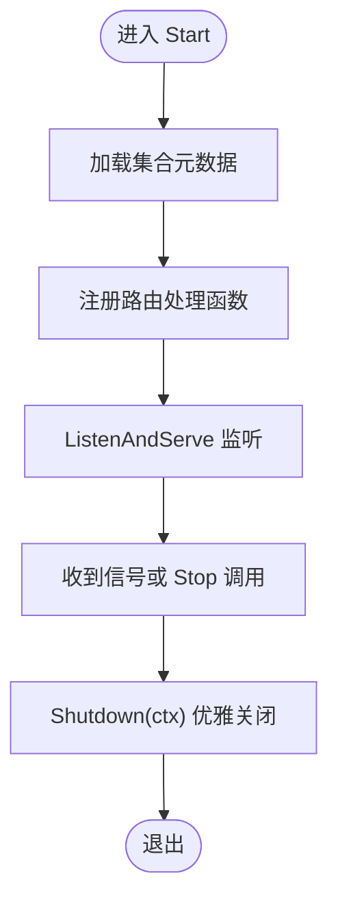
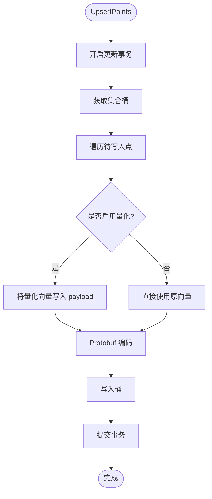
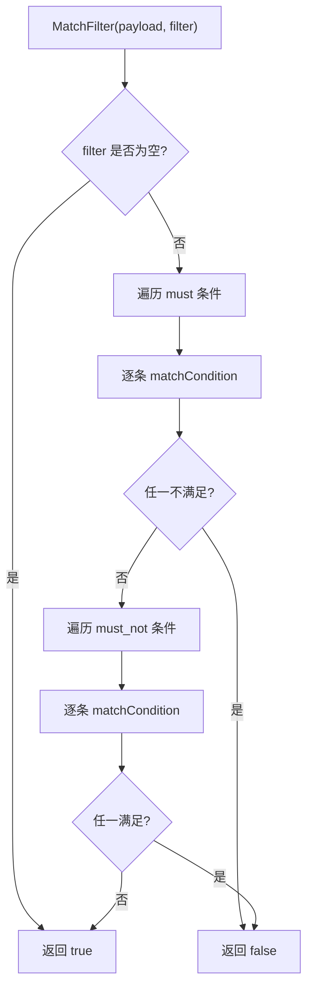
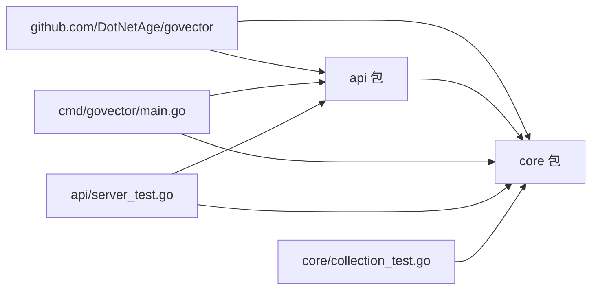
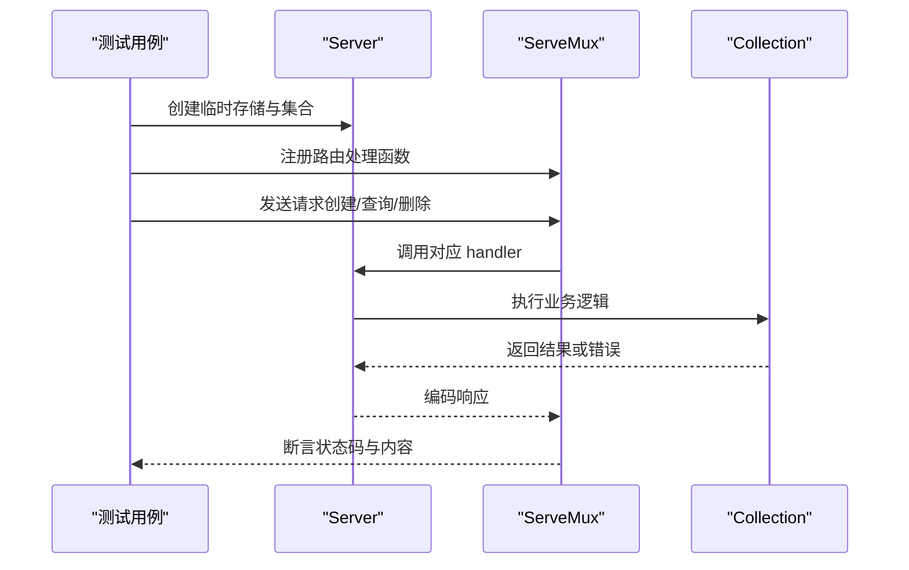

# 调试工具和技巧

<cite>
**本文引用的文件**
- [README.md](file://README.md)
- [go.mod](file://go.mod)
- [Makefile](file://Makefile)
- [.github/workflows/go.yml](file://.github/workflows/go.yml)
- [cmd/govector/main.go](file://cmd/govector/main.go)
- [api/server.go](file://api/server.go)
- [api/server_test.go](file://api/server_test.go)
- [api/test_helpers.go](file://api/test_helpers.go)
- [core/index.go](file://core/index.go)
- [core/models.go](file://core/models.go)
- [core/storage.go](file://core/storage.go)
- [core/collection_test.go](file://core/collection_test.go)
- [cmd/bench/main.go](file://cmd/bench/main.go)
</cite>

## 目录
1. [简介](#简介)
2. [项目结构](#项目结构)
3. [核心组件](#核心组件)
4. [架构总览](#架构总览)
5. [详细组件分析](#详细组件分析)
6. [依赖分析](#依赖分析)
7. [性能与内存调试](#性能与内存调试)
8. [日志与错误分析](#日志与错误分析)
9. [单元测试与集成测试调试](#单元测试与集成测试调试)
10. [网络请求与 API 调试](#网络请求与-api-调试)
11. [生产环境安全与最佳实践](#生产环境安全与最佳实践)
12. [结论](#结论)

## 简介
本指南面向 GoVector 的使用者与维护者，系统讲解如何在开发、测试与生产环境中高效使用 Go 标准调试工具（dlv、pprof）进行性能分析与内存泄漏检测；如何通过日志与错误码定位问题；如何利用单元与集成测试中的模拟对象与测试辅助方法进行调试；以及如何对网络请求与 API 调用进行追踪与分析。同时给出生产环境调试的安全注意事项与最佳实践。

## 项目结构
GoVector 采用模块化分层组织：
- cmd/govector serve：服务入口，负责解析参数、初始化存储与集合、启动 HTTP 服务器与优雅关闭。
- api：HTTP API 层，提供集合管理与向量操作接口，内部持有集合映射与存储实例。
- core：核心引擎，包含索引接口、数据模型、存储与量化等能力。
- cmd/bench：基准测试脚本，用于评估不同规模下的构建与查询性能。
- .github/workflows/go.yml：CI 流水线，包含测试、竞态检测与覆盖率上报。
- go.mod：模块与依赖声明。
- Makefile：常用构建、运行、清理与基准测试命令。

图表来源
- [cmd/govector/main.go:18-92](file://cmd/govector/main.go#L18-L92)
- [api/server.go:26-143](file://api/server.go#L26-L143)
- [core/storage.go:88-129](file://core/storage.go#L88-L129)
- [core/models.go:1-280](file://core/models.go#L1-L280)
- [core/index.go:1-29](file://core/index.go#L1-L29)
- [.github/workflows/go.yml:10-59](file://.github/workflows/go.yml#L10-L59)
- [go.mod:1-19](file://go.mod#L1-L19)
- [Makefile:1-35](file://Makefile#L1-L35)

章节来源
- [README.md:1-135](file://README.md#L1-L135)
- [go.mod:1-19](file://go.mod#L1-L19)
- [Makefile:1-35](file://Makefile#L1-L35)
- [.github/workflows/go.yml:10-59](file://.github/workflows/go.yml#L10-L59)

## 核心组件
- 服务端（Server）：封装 HTTP 服务器、集合注册、加载持久化集合、优雅关闭。
- 存储（Storage）：基于 bbolt 的本地持久化，支持集合元数据与点数据的读写、量化开关。
- 数据模型（models）：点结构、过滤器、匹配条件、范围条件、评分点等。
- 索引接口（index）：统一的向量索引接口，支持插入、搜索、删除、统计等。
- 基准测试（bench）：生成随机向量，批量插入与查询，输出构建耗时、平均延迟与 QPS。
- 测试（api/server_test.go、core/collection_test.go）：覆盖集合生命周期、Upsert/Search/Delete、错误路径与回滚行为。

章节来源
- [api/server.go:16-143](file://api/server.go#L16-L143)
- [core/storage.go:13-129](file://core/storage.go#L13-L129)
- [core/models.go:5-280](file://core/models.go#L5-L280)
- [core/index.go:5-29](file://core/index.go#L5-L29)
- [cmd/bench/main.go:41-107](file://cmd/bench/main.go#L41-L107)
- [api/server_test.go:18-68](file://api/server_test.go#L18-L68)
- [core/collection_test.go:9-94](file://core/collection_test.go#L9-L94)

## 架构总览
下图展示从命令行入口到 API 层、再到核心存储与索引的整体调用链路与职责边界。

图表来源
- [cmd/govector/main.go:27-55](file://cmd/govector/main.go#L27-L55)
- [api/server.go:54-95](file://api/server.go#L54-L95)
- [core/storage.go:131-187](file://core/storage.go#L131-L187)
- [core/index.go:7-28](file://core/index.go#L7-L28)

## 详细组件分析

### 服务端（Server）调试要点
- 并发安全：集合映射与 http.Server 的访问均受互斥锁保护，避免竞态。
- 启停流程：Start 注册路由并阻塞监听；Stop 使用上下文控制优雅关闭。
- 日志位置：启动、停止、加载集合、错误返回均打印日志，便于定位问题。
- 关键路径：handleCreateCollection/handleUpsert/handleSearch/handleDelete 的输入校验与错误码返回。

图表来源
- [api/server.go:54-95](file://api/server.go#L54-L95)
- [api/server.go:131-143](file://api/server.go#L131-L143)
- [cmd/govector/main.go:61-88](file://cmd/govector/main.go#L61-L88)

章节来源
- [api/server.go:54-143](file://api/server.go#L54-L143)
- [cmd/govector/main.go:18-92](file://cmd/govector/main.go#L18-L92)

### 存储（Storage）调试要点
- 事务与桶：使用 bbolt 的 View/Update 事务，集合以桶命名；元数据保存在特殊桶中。
- 序列化：点数据通过 Protobuf 序列化；量化开启时将向量压缩后放入 payload。
- 错误传播：打开数据库、写入、删除、反序列化失败均返回带上下文的错误。
- 关闭语义：Close 可幂等，防止重复关闭。

图表来源
- [core/storage.go:144-187](file://core/storage.go#L144-L187)
- [core/storage.go:189-235](file://core/storage.go#L189-L235)
- [core/storage.go:261-307](file://core/storage.go#L261-L307)

章节来源
- [core/storage.go:88-129](file://core/storage.go#L88-L129)
- [core/storage.go:131-187](file://core/storage.go#L131-L187)
- [core/storage.go:189-235](file://core/storage.go#L189-L235)
- [core/storage.go:261-307](file://core/storage.go#L261-L307)

### 数据模型与过滤器调试要点
- Payload 结构：键值对形式，支持多种类型；匹配时按类型分支处理。
- 条件类型：精确匹配、范围、前缀、包含、正则；注意非法类型默认回退为精确匹配。
- 正则编译：编译失败时判定不匹配，避免异常传播。

图表来源
- [core/models.go:81-106](file://core/models.go#L81-L106)
- [core/models.go:108-129](file://core/models.go#L108-L129)
- [core/models.go:260-279](file://core/models.go#L260-L279)

章节来源
- [core/models.go:5-280](file://core/models.go#L5-L280)

### 索引接口调试要点
- 统一接口：Upsert/Search/Delete/Count/GetIDsByFilter/DeleteByFilter。
- 实现切换：Flat 与 HNSW 可透明替换，便于对比性能与正确性。

章节来源
- [core/index.go:5-29](file://core/index.go#L5-L29)

### 基准测试（bench）调试要点
- 内存统计：打印 Alloc/TotalAlloc/Sys/NumGC，便于观察内存增长与 GC 行为。
- 批量插入：分批生成向量并插入，降低峰值内存占用。
- 查询统计：计算平均延迟与 QPS，便于横向比较 Flat/HNSW 不同规模表现。

章节来源
- [cmd/bench/main.go:34-107](file://cmd/bench/main.go#L34-L107)

## 依赖分析
- 外部依赖：bbolt（持久化）、protobuf（序列化）、hnsw（索引）。
- 模块关系：api 依赖 core；cmd/govector serve 依赖 api 与 core；测试依赖 api 与 core。

图表来源
- [go.mod:5-9](file://go.mod#L5-L9)
- [api/server.go:5-14](file://api/server.go#L5-L14)
- [core/storage.go:3-11](file://core/storage.go#L3-L11)
- [cmd/govector/main.go:3-16](file://cmd/govector/main.go#L3-L16)

章节来源
- [go.mod:1-19](file://go.mod#L1-L19)

## 性能与内存调试
- 使用 dlv 进行断点与单步调试
  - 在服务启动处设置断点，逐步观察集合加载、索引构建与查询路径。
  - 在 Upsert/Search/Delete 关键路径设置断点，检查输入参数与返回状态。
  - 在存储层断点验证序列化/反序列化与 bbolt 事务执行情况。
- 使用 pprof 进行 CPU/内存分析
  - 启动服务后，使用 go tool pprof 获取 CPU/heap 分析数据，定位热点函数与内存分配点。
  - 结合基准测试脚本，对不同规模与索引策略进行对比分析。
- 内存泄漏检测
  - 使用 -race 参数运行测试与服务，结合 pprof heap 分析，排查未释放的引用与大对象常驻。
  - 关注存储层的点数据加载/卸载与量化缓冲区的生命周期。

章节来源
- [cmd/bench/main.go:34-107](file://cmd/bench/main.go#L34-L107)
- [.github/workflows/go.yml:40-42](file://.github/workflows/go.yml#L40-L42)

## 日志与错误分析
- 服务端日志
  - 启动/停止、加载集合、错误返回（如 404/400/500）均有明确日志输出，便于快速定位问题。
- 错误码解读
  - 400：无效 JSON、无效参数（如距离度量、向量维度）。
  - 404：集合不存在。
  - 409：集合已存在（创建集合）。
  - 500：内部错误（如索引/存储失败）。
- 常见错误场景
  - 集合元数据缺失或损坏导致加载失败。
  - 存储关闭后仍尝试写入。
  - 查询/插入向量维度与集合配置不一致。

章节来源
- [api/server.go:148-176](file://api/server.go#L148-L176)
- [api/server.go:178-218](file://api/server.go#L178-L218)
- [api/server.go:220-258](file://api/server.go#L220-L258)
- [api/server.go:260-352](file://api/server.go#L260-L352)
- [api/server.go:354-423](file://api/server.go#L354-L423)

## 单元测试与集成测试调试
- 测试辅助
  - 使用 httptest 快速构造请求与响应，覆盖创建/删除/列表/查询/删除等端点。
  - 通过 test_helpers 提供的 GetCollection/GetCollectionsMapSize 安全访问集合状态。
- 模拟对象
  - MockIndex 在集合 Upsert 失败时触发回滚逻辑，验证存储一致性。
- 关键调试点
  - 输入校验：无效 JSON、不存在的集合、非法参数。
  - 业务流程：Upsert 后 Count 增加、Search 返回预期数量、Delete 删除指定 ID 或满足过滤条件的点。
  - 错误回滚：当索引层失败时，确保存储层未残留半成品数据。

图表来源
- [api/server_test.go:18-68](file://api/server_test.go#L18-L68)
- [api/server_test.go:158-258](file://api/server_test.go#L158-L258)
- [api/server_test.go:339-428](file://api/server_test.go#L339-L428)
- [api/server_test.go:430-483](file://api/server_test.go#L430-L483)
- [api/test_helpers.go:7-18](file://api/test_helpers.go#L7-L18)
- [core/collection_test.go:264-291](file://core/collection_test.go#L264-L291)

章节来源
- [api/server_test.go:18-68](file://api/server_test.go#L18-L68)
- [api/server_test.go:158-258](file://api/server_test.go#L158-L258)
- [api/server_test.go:339-428](file://api/server_test.go#L339-L428)
- [api/server_test.go:430-483](file://api/server_test.go#L430-L483)
- [api/test_helpers.go:7-18](file://api/test_helpers.go#L7-L18)
- [core/collection_test.go:264-291](file://core/collection_test.go#L264-L291)

## 网络请求与 API 调试
- 使用 curl 或 Postman 对以下端点进行手动验证：
  - 创建集合：POST /collections
  - 列表与详情：GET /collections、GET /collections/{name}
  - 写入点：PUT /collections/{name}/points
  - 搜索：POST /collections/{name}/points/search
  - 删除点：POST /collections/{name}/points/delete
- 关键字段与校验
  - 创建集合：name/vector_size/distance/hnsw/parameters（m、ef_construction、ef_search、k）。
  - 搜索：vector/filter/limit（默认 limit=10）。
  - 删除：points 或 filter 二选一。
- 常见问题
  - 400：JSON 格式错误或参数非法。
  - 404：集合不存在。
  - 500：内部错误（索引/存储异常）。

章节来源
- [api/server.go:56-84](file://api/server.go#L56-L84)
- [api/server.go:260-352](file://api/server.go#L260-L352)
- [api/server.go:354-423](file://api/server.go#L354-L423)
- [api/server.go:148-176](file://api/server.go#L148-L176)
- [api/server.go:178-218](file://api/server.go#L178-L218)
- [api/server.go:220-258](file://api/server.go#L220-L258)

## 生产环境安全与最佳实践
- 安全注意事项
  - 限制暴露端口与网段，避免直接对外暴露。
  - 使用只读权限的数据库文件路径，避免被意外修改。
  - 在容器/CI 中禁用 -race/-cover 等调试开销较大的选项，除非必要。
- 最佳实践
  - 使用优雅关闭：在收到信号后等待请求处理完毕再退出。
  - 记录关键事件：启动、停止、集合变更、错误发生。
  - 分离日志：区分访问日志与应用日志，便于审计与排障。
  - 压测前置：在发布前使用基准测试脚本评估不同规模与索引策略的性能与资源消耗。
  - CI 强制：启用竞态检测与覆盖率上报，保证质量门禁。

章节来源
- [cmd/govector/main.go:66-88](file://cmd/govector/main.go#L66-L88)
- [.github/workflows/go.yml:40-42](file://.github/workflows/go.yml#L40-L42)
- [Makefile:24-26](file://Makefile#L24-L26)

## 结论
通过结合 dlv 断点调试、pprof 性能与内存分析、完善的日志与错误码体系、严谨的单元与集成测试，以及规范的生产环境安全与最佳实践，可以高效地定位与解决 GoVector 在开发与运维过程中的各类问题，并持续优化其性能与稳定性。