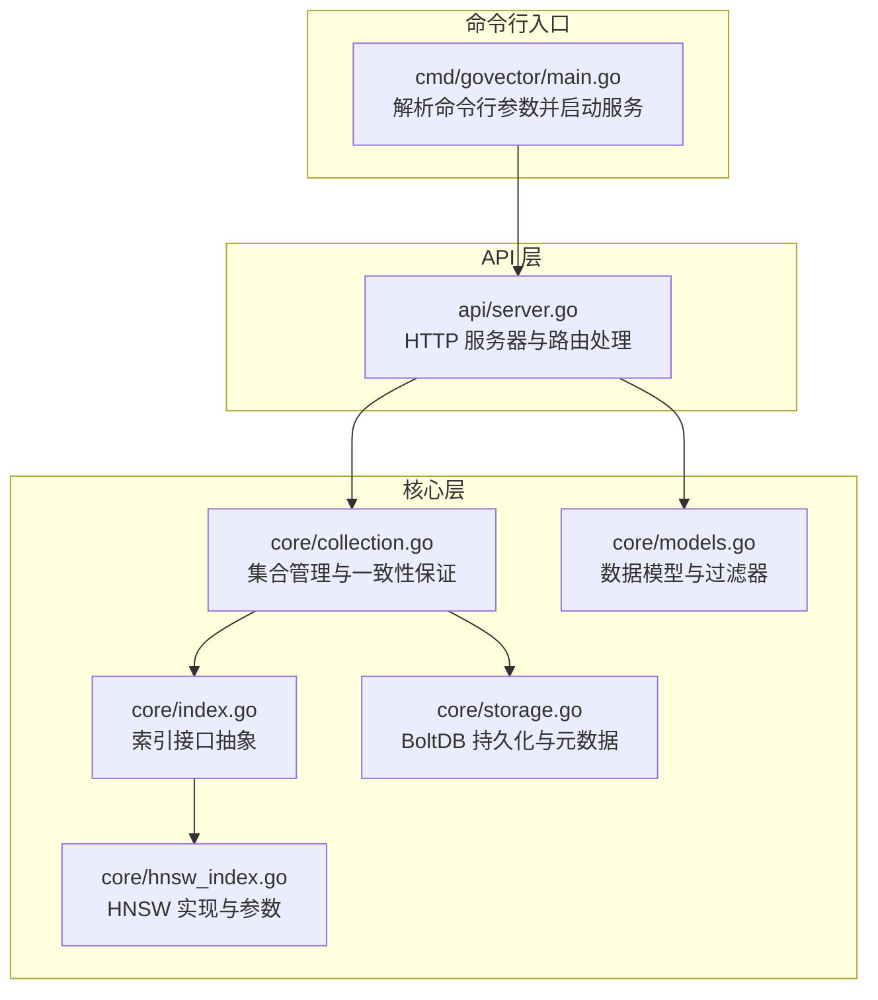
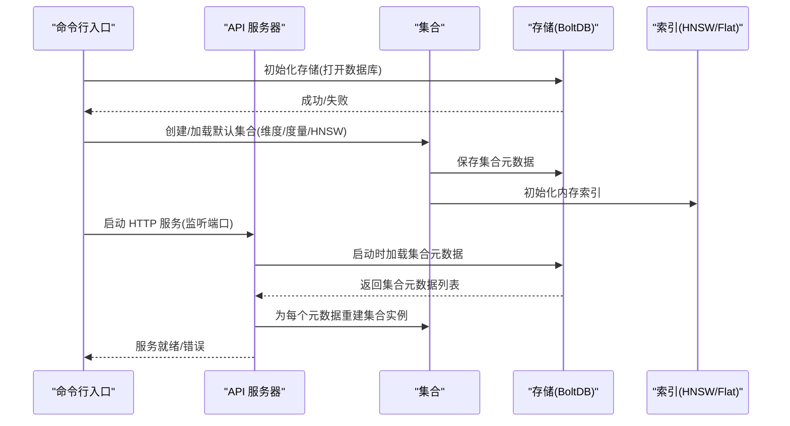
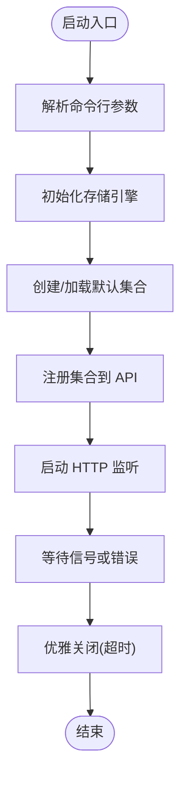
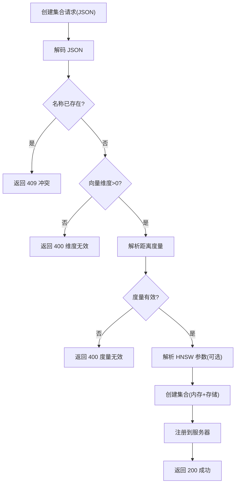
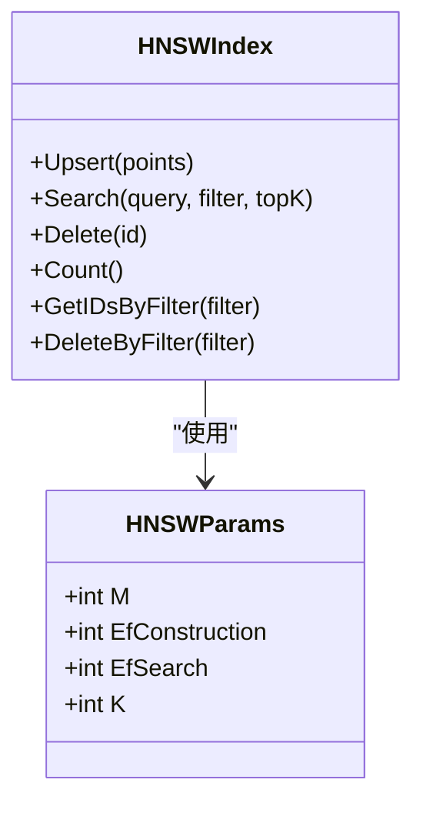
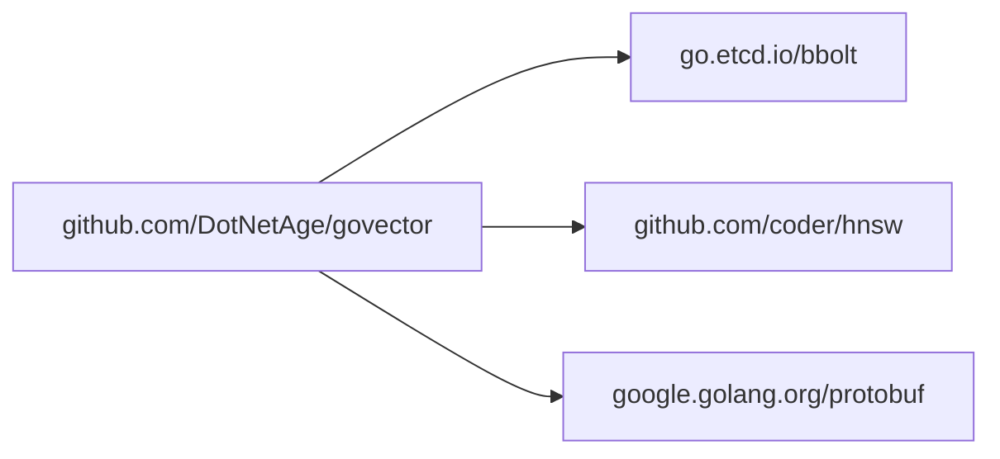

# 配置问题

<cite>
**本文引用的文件**   
- [cmd/govector/main.go](file://cmd/govector/main.go)
- [api/server.go](file://api/server.go)
- [core/collection.go](file://core/collection.go)
- [core/storage.go](file://core/storage.go)
- [core/models.go](file://core/models.go)
- [core/index.go](file://core/index.go)
- [core/hnsw_index.go](file://core/hnsw_index.go)
- [api/server_test.go](file://api/server_test.go)
- [go.mod](file://go.mod)
- [README.md](file://README.md)
</cite>

## 目录
1. [简介](#简介)
2. [项目结构](#项目结构)
3. [核心组件](#核心组件)
4. [架构总览](#架构总览)
5. [详细组件分析](#详细组件分析)
6. [依赖分析](#依赖分析)
7. [性能考虑](#性能考虑)
8. [故障排除指南](#故障排除指南)
9. [结论](#结论)
10. [附录](#附录)

## 简介
本指南聚焦于 GoVector 的配置问题排查与修复，覆盖以下方面：
- 配置文件格式错误（如 JSON 无效）
- 参数设置不当（如向量维度、距离度量、HNSW 参数）
- 端口冲突与服务启动失败
- 服务器配置、集合配置、索引配置的验证方法
- 配置语法检查与参数有效性校验
- 日志诊断与配置回滚、修复策略
- 配置模板与最佳实践

## 项目结构
GoVector 提供两种使用模式：嵌入式库与独立微服务。微服务模式由命令行入口启动，加载存储引擎与默认集合，并对外暴露 Qdrant 兼容的 HTTP API。

**图表来源**
- [cmd/govector/main.go:18-92](file://cmd/govector/main.go#L18-L92)
- [api/server.go:26-143](file://api/server.go#L26-L143)
- [core/collection.go:22-91](file://core/collection.go#L22-L91)
- [core/index.go:5-29](file://core/index.go#L5-L29)
- [core/hnsw_index.go:41-106](file://core/hnsw_index.go#L41-L106)
- [core/storage.go:88-114](file://core/storage.go#L88-L114)
- [core/models.go:5-79](file://core/models.go#L5-L79)

**章节来源**
- [cmd/govector/main.go:18-92](file://cmd/govector/main.go#L18-L92)
- [api/server.go:26-143](file://api/server.go#L26-L143)
- [core/collection.go:22-91](file://core/collection.go#L22-L91)
- [core/storage.go:88-114](file://core/storage.go#L88-L114)
- [core/models.go:5-79](file://core/models.go#L5-L79)

## 核心组件
- 命令行入口负责解析端口、数据库路径、是否启用 HNSW 等参数，并初始化存储、默认集合与 HTTP 服务。
- API 层负责加载持久化的集合元数据、注册集合、提供集合与点操作的 REST 接口。
- 存储层基于 BoltDB，提供集合桶、元数据桶、点序列化与量化支持。
- 集合层负责维度校验、内存索引与存储的一致性写入。
- HNSW 索引层提供可调参数（M、EfConstruction、EfSearch、K）与不同距离度量的适配。

**章节来源**
- [cmd/govector/main.go:18-92](file://cmd/govector/main.go#L18-L92)
- [api/server.go:64-143](file://api/server.go#L64-L143)
- [core/collection.go:22-91](file://core/collection.go#L22-L91)
- [core/storage.go:261-336](file://core/storage.go#L261-L336)
- [core/hnsw_index.go:11-39](file://core/hnsw_index.go#L11-L39)

## 架构总览
下图展示从命令行到 API、再到存储与索引的整体流程，以及关键错误点与日志位置。

**图表来源**
- [cmd/govector/main.go:27-55](file://cmd/govector/main.go#L27-L55)
- [api/server.go:97-129](file://api/server.go#L97-L129)
- [core/storage.go:261-336](file://core/storage.go#L261-L336)
- [core/collection.go:51-90](file://core/collection.go#L51-L90)

## 详细组件分析

### 服务器配置与启动流程
- 命令行参数：
  - 端口：默认值与取值范围未在代码中显式限制，需结合系统端口可用性与权限。
  - 数据库路径：用于 bbolt 文件路径，需确保目录存在且有读写权限。
  - 是否启用 HNSW：影响默认集合的索引类型。
- 启动顺序：
  - 初始化存储 → 加载/创建默认集合 → 注册集合到 API → 启动 HTTP 服务 → 监听信号优雅关闭。

**图表来源**
- [cmd/govector/main.go:18-92](file://cmd/govector/main.go#L18-L92)

**章节来源**
- [cmd/govector/main.go:18-92](file://cmd/govector/main.go#L18-L92)

### 集合配置与参数校验
- 必填字段与约束：
  - 名称：唯一标识，创建时若已存在返回冲突。
  - 向量维度：必须为正数；查询/插入时也会校验维度一致性。
  - 距离度量：支持欧氏、点积、余弦；未知值返回错误。
  - HNSW 开关：布尔值；可选参数对象包含 M、EfConstruction、EfSearch、K。
- 元数据持久化：
  - 集合元数据保存在特殊桶中；重启时自动加载并重建集合实例。

**图表来源**
- [api/server.go:263-352](file://api/server.go#L263-L352)
- [core/collection.go:51-90](file://core/collection.go#L51-L90)
- [core/storage.go:261-336](file://core/storage.go#L261-L336)

**章节来源**
- [api/server.go:263-352](file://api/server.go#L263-L352)
- [core/collection.go:51-90](file://core/collection.go#L51-L90)
- [core/storage.go:261-336](file://core/storage.go#L261-L336)

### 索引配置与参数
- HNSW 参数：
  - M：每节点最大连接数，默认 16。
  - EfConstruction：构建阶段候选列表大小，默认 200。
  - EfSearch：搜索阶段候选列表大小，默认 64。
  - K：返回近邻数量，默认 10。
- 距离度量：
  - 欧氏、点积、余弦；点积需要取负以适配底层库最小化距离的约定。
- 参数生效路径：
  - 通过集合创建接口传入参数对象；或使用默认参数。

**图表来源**
- [core/hnsw_index.go:11-39](file://core/hnsw_index.go#L11-L39)
- [core/hnsw_index.go:41-106](file://core/hnsw_index.go#L41-L106)

**章节来源**
- [core/hnsw_index.go:11-39](file://core/hnsw_index.go#L11-L39)
- [core/hnsw_index.go:41-106](file://core/hnsw_index.go#L41-L106)

### 数据模型与过滤器
- 点结构包含 ID、版本、向量与可选负载。
- 过滤器支持精确匹配、范围、前缀、包含、正则等条件类型。
- 匹配逻辑在服务端执行，注意正则编译失败会直接判定不匹配。

**章节来源**
- [core/models.go:5-79](file://core/models.go#L5-L79)
- [core/models.go:81-279](file://core/models.go#L81-L279)

## 依赖分析
- 外部依赖：
  - bbolt：本地键值存储。
  - hnsw：HNSW 图搜索库。
  - protobuf：点结构序列化。
- 内部模块：
  - api：HTTP 服务与路由。
  - core：集合、索引、存储、模型。

**图表来源**
- [go.mod:5-9](file://go.mod#L5-L9)

**章节来源**
- [go.mod:5-9](file://go.mod#L5-L9)

## 性能考虑
- HNSW 默认参数适合大多数场景；当数据规模大、延迟敏感时，可调整 EfConstruction/EfSearch/K。
- 点积距离在 HNSW 中取负以满足底层库“最小化距离”的假设。
- 存储层支持可选量化，降低磁盘占用但可能牺牲精度。

[本节为通用指导，无需具体文件引用]

## 故障排除指南

### 一、配置文件格式错误
- 现象
  - 创建集合或写入点时返回 400，提示 JSON 无效。
- 原因定位
  - 请求体不是合法 JSON；API 层在解码时直接返回 400。
- 排查步骤
  - 使用 curl 或 Postman 发送最小有效请求体，逐步添加字段确认问题。
  - 参考集合创建接口的 JSON 字段定义与示例。
- 修复建议
  - 确保 JSON 结构完整、键名正确、数值类型符合预期（如整型参数应为数字而非字符串）。

**章节来源**
- [api/server.go:161-164](file://api/server.go#L161-L164)
- [api/server.go:272-275](file://api/server.go#L272-L275)
- [api/server_test.go:250-257](file://api/server_test.go#L250-L257)

### 二、参数设置不当
- 向量维度无效
  - 现象：创建集合返回 400，提示维度必须为正数；或写入点时报维度不一致。
  - 排查：核对请求中的 vector_size 与实际向量长度一致。
  - 修复：统一维度，确保所有点的向量长度与集合一致。
- 距离度量非法
  - 现象：创建集合返回 400，提示度量无效。
  - 排查：仅允许 euclidean、dot、cosine（大小写不敏感）。
  - 修复：使用受支持的度量名称。
- HNSW 参数越界或类型错误
  - 现象：参数未按预期生效或导致异常。
  - 排查：确认参数键名与类型（整数），默认值与合理范围。
  - 修复：使用默认参数或按需调整 M、EfConstruction、EfSearch、K。

**章节来源**
- [api/server.go:286-304](file://api/server.go#L286-L304)
- [api/server.go:306-321](file://api/server.go#L306-L321)
- [core/collection.go:104-109](file://core/collection.go#L104-L109)
- [core/hnsw_index.go:92-99](file://core/hnsw_index.go#L92-L99)

### 三、端口冲突与服务启动失败
- 现象
  - 启动后立即报错，或优雅关闭时出现超时。
- 原因定位
  - 端口被占用；或监听器未成功绑定。
- 排查步骤
  - 更换端口参数；确认端口范围与权限；查看日志输出的服务地址。
  - 观察启动日志与错误通道返回值。
- 修复建议
  - 选择空闲端口；在容器/守护进程环境中确保端口放开。

**章节来源**
- [cmd/govector/main.go:53-64](file://cmd/govector/main.go#L53-L64)
- [cmd/govector/main.go:71-88](file://cmd/govector/main.go#L71-L88)

### 四、集合配置验证方法
- 通过 API 列出集合与获取集合详情，确认维度、度量、点数等信息。
- 在创建集合后，尝试写入少量点并执行搜索，验证索引与过滤器工作正常。

**章节来源**
- [api/server.go:382-423](file://api/server.go#L382-L423)
- [api/server_test.go:288-337](file://api/server_test.go#L288-L337)

### 五、索引配置验证方法
- 通过集合元数据确认是否使用 HNSW 与参数值。
- 对比 Flat 与 HNSW 的写入/搜索行为与性能表现。

**章节来源**
- [core/storage.go:261-336](file://core/storage.go#L261-L336)
- [core/hnsw_index.go:41-106](file://core/hnsw_index.go#L41-L106)

### 六、配置语法检查与参数有效性验证
- 语法检查
  - 使用 curl/postman 发送最小请求体，逐步增加字段，定位 JSON 语法问题。
- 参数有效性
  - 使用单元测试用例思路构造边界输入（零维、负数、非法度量、非法参数键名/类型）。

**章节来源**
- [api/server_test.go:158-258](file://api/server_test.go#L158-L258)
- [api/server_test.go:288-337](file://api/server_test.go#L288-L337)

### 七、日志诊断配置错误
- 启动日志
  - 存储引擎加载、默认集合加载、API 服务器监听地址。
- 错误日志
  - 存储打开失败、集合加载失败、HTTP 监听错误、优雅关闭超时。
- 建议
  - 将日志输出重定向到文件，结合时间戳定位问题发生时刻。

**章节来源**
- [cmd/govector/main.go:25-36](file://cmd/govector/main.go#L25-L36)
- [api/server.go:97-129](file://api/server.go#L97-L129)
- [core/storage.go:99-102](file://core/storage.go#L99-L102)

### 八、配置回滚与修复
- 回滚策略
  - 关闭服务；备份数据库文件；恢复到上一个稳定版本的数据库。
- 修复步骤
  - 修正参数（维度、度量、HNSW 参数）；删除错误集合后重新创建；重新导入数据。
- 注意
  - 删除集合会清空数据；建议先导出再删除。

**章节来源**
- [api/server.go:354-380](file://api/server.go#L354-L380)
- [core/storage.go:338-359](file://core/storage.go#L338-L359)

### 九、配置模板与最佳实践
- 配置模板（集合创建）
  - 字段：name、vector_size、distance、hnsw（可选）、parameters（可选）。
  - 示例参考：测试用例中的 JSON 结构。
- 最佳实践
  - 明确向量维度并保持一致；优先使用余弦距离；根据数据规模调整 EfConstruction/EfSearch；避免使用非法度量名称；定期备份数据库文件。

**章节来源**
- [api/server_test.go:158-258](file://api/server_test.go#L158-L258)
- [README.md:109-118](file://README.md#L109-L118)

## 结论
- GoVector 的配置问题多集中在 JSON 格式、参数合法性与端口占用三类。
- 通过 API 的集合与点操作接口可快速验证配置；结合日志与单元测试用例可高效定位问题。
- 建议在生产环境遵循统一的配置模板与参数调优策略，并做好数据备份与回滚预案。

[本节为总结，无需具体文件引用]

## 附录

### A. 常见错误码与含义
- 400：请求体无效（JSON 语法错误、参数非法）
- 404：集合不存在
- 409：集合已存在
- 500：内部错误（存储失败、索引更新失败等）

**章节来源**
- [api/server.go:158-169](file://api/server.go#L158-L169)
- [api/server.go:182-211](file://api/server.go#L182-L211)
- [api/server.go:214-258](file://api/server.go#L214-L258)
- [api/server.go:263-352](file://api/server.go#L263-L352)

### B. 命令行参数一览
- -port：HTTP 服务监听端口（默认 18080）
- -db：bbolt 数据库文件路径（默认 govector.db）
- -hnsw：是否启用 HNSW（默认 true）

**章节来源**
- [cmd/govector/main.go:20-23](file://cmd/govector/main.go#L20-L23)