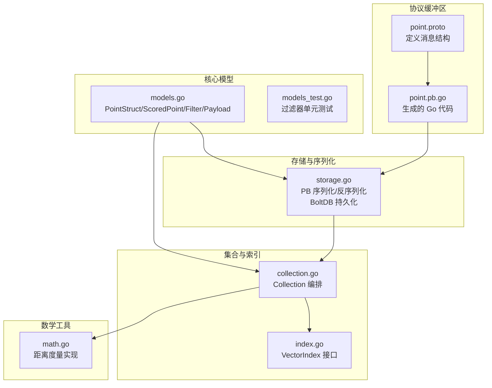
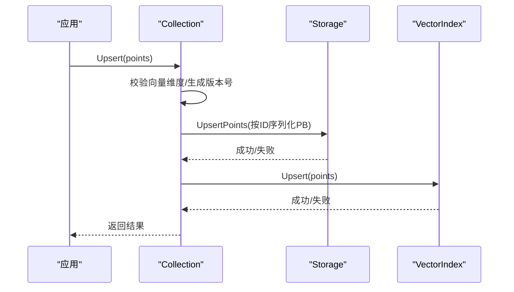
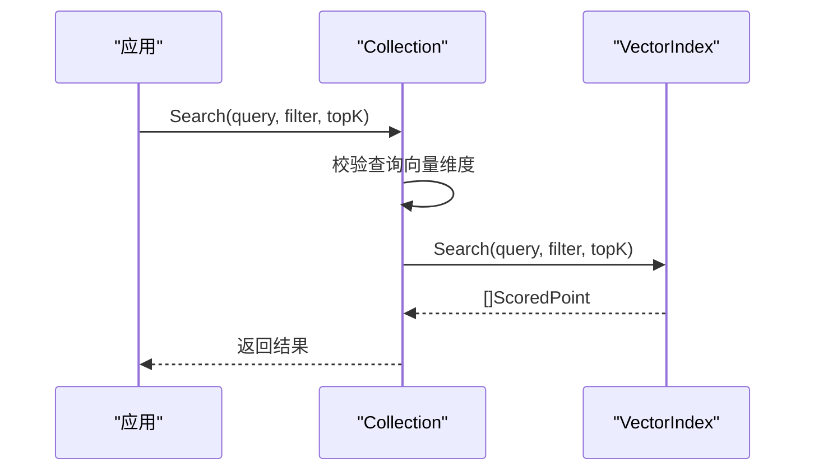
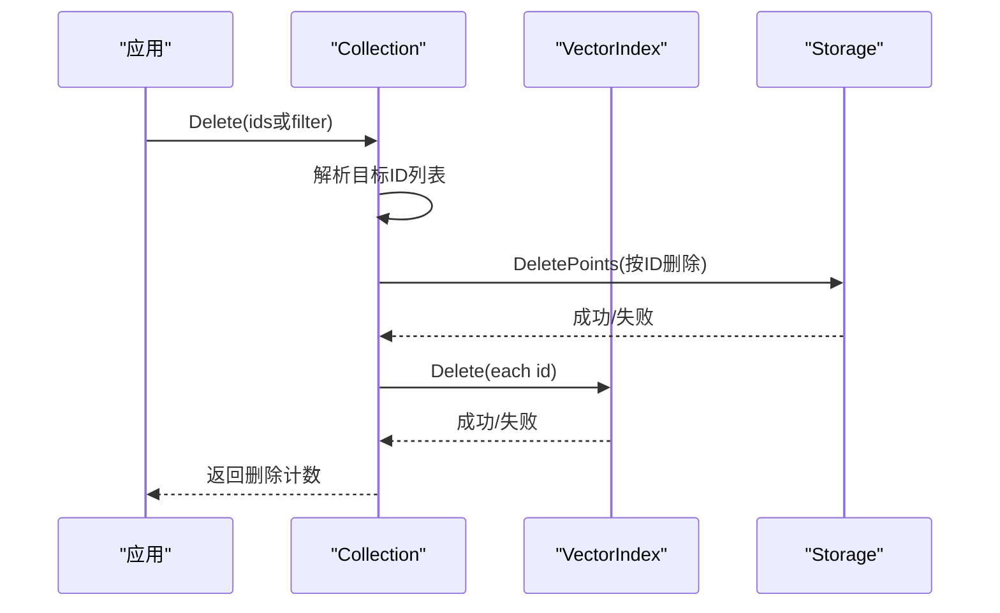
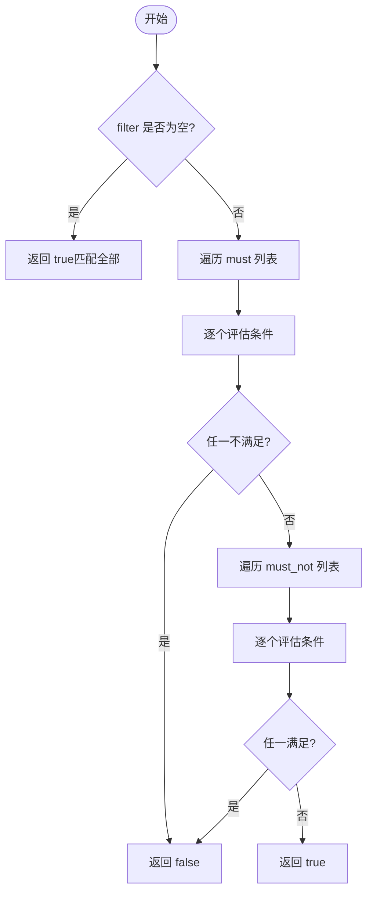

# 数据模型

<cite>
**本文引用的文件**
- [core/proto/point.proto](file://core/proto/point.proto)
- [core/proto/point.pb.go](file://core/proto/point.pb.go)
- [core/models.go](file://core/models.go)
- [core/models_test.go](file://core/models_test.go)
- [core/storage.go](file://core/storage.go)
- [core/index.go](file://core/index.go)
- [core/collection.go](file://core/collection.go)
- [core/math.go](file://core/math.go)
- [README.md](file://README.md)
</cite>

## 目录
1. [简介](#简介)
2. [项目结构与数据模型定位](#项目结构与数据模型定位)
3. [核心数据结构总览](#核心数据结构总览)
4. [协议缓冲区（Protocol Buffers）定义](#协议缓冲区协议缓冲区定义)
5. [数据模型详解](#数据模型详解)
6. [数据流与生命周期](#数据流与生命周期)
7. [架构关系图](#架构关系图)
8. [过滤器与查询逻辑](#过滤器与查询逻辑)
9. [性能与存储优化](#性能与存储优化)
10. [最佳实践与常见问题](#最佳实践与常见问题)
11. [结论](#结论)

## 简介
本文件系统性梳理 GoVector 的数据模型，重点围绕以下核心结构展开：PointStruct、ScoredPoint、Filter、Payload 及其在协议缓冲区中的映射；解释字段语义、数据类型、验证规则与业务约束；说明协议缓冲区的消息格式、序列化机制与版本兼容性；展示向量、元数据、过滤条件的组合使用方式；并给出数据生命周期管理、缓存策略与性能考量，以及实际使用建议与排错指引。

## 项目结构与数据模型定位
- 协议缓冲区定义位于 core/proto/point.proto，生成的 Go 代码为 core/proto/point.pb.go。
- 核心 Go 数据模型位于 core/models.go，包含与 protobuf 对应的 Go 结构体及过滤器逻辑。
- 存储层负责持久化与反持久化，涉及 Protobuf 序列化、BoltDB 存取、可选的向量量化。
- 集合层 Collection 负责索引选择、Upsert/Search/Delete 等操作的编排。
- 数学工具提供距离度量（Cosine/Euclid/Dot），用于相似度计算与排序。



图表来源
- [core/proto/point.proto:1-49](file://core/proto/point.proto#L1-L49)
- [core/proto/point.pb.go:1-120](file://core/proto/point.pb.go#L1-L120)
- [core/models.go:1-280](file://core/models.go#L1-L280)
- [core/storage.go:1-360](file://core/storage.go#L1-L360)
- [core/collection.go:1-198](file://core/collection.go#L1-L198)
- [core/index.go:1-29](file://core/index.go#L1-L29)
- [core/math.go:1-78](file://core/math.go#L1-L78)

章节来源
- [core/proto/point.proto:1-49](file://core/proto/point.proto#L1-L49)
- [core/models.go:1-280](file://core/models.go#L1-L280)
- [core/storage.go:1-360](file://core/storage.go#L1-L360)
- [core/collection.go:1-198](file://core/collection.go#L1-L198)
- [core/index.go:1-29](file://core/index.go#L1-L29)
- [core/math.go:1-78](file://core/math.go#L1-L78)

## 核心数据结构总览
- PointStruct：单条向量记录，包含唯一标识、向量数组、版本号与可选元数据。
- ScoredPoint：检索结果，包含匹配点的标识、版本、相似度分数与元数据。
- Filter：过滤条件容器，支持 must/must_not 条件列表。
- Payload：键值对元数据，值类型为 interface{}，在持久化时通过 Protobuf oneof 映射到具体类型。
- Condition/MatchValue/RangeValue：过滤器的条件定义，支持精确匹配、范围、前缀、包含、正则等。

章节来源
- [core/models.go:9-69](file://core/models.go#L9-L69)

## 协议缓冲区（Protocol Buffers）定义
- 消息结构
  - PointStruct：包含 id、vector（float 列表）、payload（字符串到 Value 的映射）。
  - Value：oneof 包含 string/int64/double/bool/bytes 六种基础类型。
  - ScoredPoint：包含 id、version、score、payload。
  - Condition：包含 key 与 MatchValue。
  - MatchValue：oneof 包含 string/int64/double/bool/bytes。
  - Filter：包含 must 与 must_not 两个 Condition 列表。
- 序列化与反序列化
  - 存储层使用 google.golang.org/protobuf/proto 进行 Marshal/Unmarshal。
  - 读取时先从 BoltDB 读取字节，再 Unmarshal 至 PB 消息，再转换为 Go 结构体。
  - 写入时先将 Go 结构体转换为 PB 消息，再 Marshal 为字节写入。
- 版本兼容性
  - 使用 proto3 语法，新增字段以可选方式添加，不破坏现有二进制格式。
  - oneof 字段确保同一时刻仅设置一种类型，避免歧义。
  - 生成的 point.pb.go 提供标准的序列化接口与字段访问器。

章节来源
- [core/proto/point.proto:1-49](file://core/proto/point.proto#L1-L49)
- [core/proto/point.pb.go:1-120](file://core/proto/point.pb.go#L1-L120)
- [core/storage.go:22-86](file://core/storage.go#L22-L86)
- [core/storage.go:144-187](file://core/storage.go#L144-L187)
- [core/storage.go:200-235](file://core/storage.go#L200-L235)

## 数据模型详解

### PointStruct（向量记录）
- 字段与类型
  - id: string，唯一标识符（建议使用稳定字符串或数字字符串）。
  - version: uint64，版本号，用于一致性与并发控制。
  - vector: []float32，向量嵌入，维度需与集合配置一致。
  - payload: map[string]interface{}，可选元数据，支持任意 JSON 兼容类型。
- 业务约束
  - 向量长度必须与集合的 VectorLen 一致，否则插入会失败。
  - 版本号由 Upsert 流程统一生成，保证幂等与顺序。
  - payload 在持久化时会被转换为 Protobuf Value，仅 oneof 支持的类型会被保留。
- 验证规则
  - 插入前校验向量维度；持久化时忽略不支持类型。
- 性能影响
  - 大向量会增加内存与磁盘占用；可结合 SQ8 量化降低存储体积。

章节来源
- [core/models.go:11-16](file://core/models.go#L11-L16)
- [core/collection.go:101-109](file://core/collection.go#L101-L109)
- [core/storage.go:22-56](file://core/storage.go#L22-L56)

### ScoredPoint（检索结果）
- 字段与类型
  - id: string，匹配点的标识。
  - version: uint64，匹配点的版本。
  - score: float32，相似度或距离分数（由所选度量决定“越小/越大”更相似）。
  - payload: map[string]interface{}，可选元数据。
- 业务约束
  - score 由底层索引根据 Metric 计算，Cosine/Dot 越大越相似，Euclid 越小越相似。
  - 返回数量受 topK 限制。
- 性能影响
  - 结果集大小直接影响内存与网络传输开销。

章节来源
- [core/models.go:20-25](file://core/models.go#L20-L25)
- [core/math.go:24-38](file://core/math.go#L24-L38)

### Filter（过滤器）
- 组成
  - must: []Condition，所有条件都必须满足。
  - must_not: []Condition，任何条件都不允许满足。
- Condition
  - key: string，payload 中的键名。
  - type: 枚举，支持 exact、range、prefix、contains、regex。
  - match: MatchValue，用于精确匹配或前缀/包含/正则的值。
  - range: RangeValue，用于数值范围匹配（gt/gte/lt/lte）。
- 评估规则
  - 若 filter 为空，视为匹配全部。
  - must 列表中任一不满足即整体不匹配。
  - must_not 列表中任一满足即整体不匹配。
  - 不存在的 key 在 must 中视为不匹配，在 must_not 中视为匹配（即“非存在即通过”）。
- 性能影响
  - 过滤器在索引层执行，must_not 通常更昂贵，建议尽量用 must 限定范围。

章节来源
- [core/models.go:27-69](file://core/models.go#L27-L69)
- [core/models.go:81-106](file://core/models.go#L81-L106)
- [core/models.go:108-129](file://core/models.go#L108-L129)
- [core/models_test.go:7-219](file://core/models_test.go#L7-L219)

### Payload（元数据）
- 类型与用途
  - map[string]interface{}，用于检索过滤与二次处理。
  - 在持久化时转换为 Protobuf Value，仅 oneof 支持的类型会被保存。
- 常见键建议
  - 分类、价格、布尔状态、标签数组、时间戳等。
- 注意事项
  - 不支持类型在持久化时会被忽略。
  - 过滤器对非字符串值的前缀/正则/包含匹配有特定行为（见下节）。

章节来源
- [core/models.go:5-7](file://core/models.go#L5-L7)
- [core/storage.go:22-56](file://core/storage.go#L22-L56)
- [core/storage.go:58-86](file://core/storage.go#L58-L86)

## 数据流与生命周期

### 插入流程（Upsert）


图表来源
- [core/collection.go:97-133](file://core/collection.go#L97-L133)
- [core/storage.go:144-187](file://core/storage.go#L144-L187)
- [core/index.go:7-28](file://core/index.go#L7-L28)

### 检索流程（Search）


图表来源
- [core/collection.go:135-147](file://core/collection.go#L135-L147)
- [core/index.go:12-14](file://core/index.go#L12-L14)

### 删除流程（Delete）


图表来源
- [core/collection.go:162-197](file://core/collection.go#L162-L197)
- [core/storage.go:338-359](file://core/storage.go#L338-L359)
- [core/index.go:16-18](file://core/index.go#L16-L18)

### 加载与恢复
- 启动时加载集合元数据与点集，校验维度一致性，批量重建内存索引。
- 若启用量化，加载时自动解量化向量。

章节来源
- [core/collection.go:35-91](file://core/collection.go#L35-L91)
- [core/storage.go:261-307](file://core/storage.go#L261-L307)
- [core/storage.go:189-235](file://core/storage.go#L189-L235)

## 架构关系图
```mermaid
classDiagram
class PointStruct {
+string id
+uint64 version
+[]float32 vector
+Payload payload
}
class ScoredPoint {
+string id
+uint64 version
+float32 score
+Payload payload
}
class Filter {
+[]Condition must
+[]Condition must_not
}
class Condition {
+string key
+ConditionType type
+MatchValue match
+RangeValue range
}
class MatchValue {
+interface{} value
}
class RangeValue {
+interface{} gt
+interface{} gte
+interface{} lt
+interface{} lte
}
class Payload {
<<map[string]interface{}>>
}
PointStruct --> Payload : "包含"
ScoredPoint --> Payload : "包含"
Filter --> Condition : "包含"
Condition --> MatchValue : "使用"
Condition --> RangeValue : "使用"
```

图表来源
- [core/models.go:9-69](file://core/models.go#L9-L69)

## 过滤器与查询逻辑

### 过滤器评估算法


图表来源
- [core/models.go:81-106](file://core/models.go#L81-L106)

### 条件类型与匹配规则
- exact：严格相等比较。
- range：支持整数与浮点数，同时接受 int/float64 混合比较；gt/gte/lt/lte 可组合。
- prefix：仅对字符串有效，要求前缀长度不超过字符串长度。
- contains：支持 []interface{}、[]string、[]int、string；空串在字符串场景下不匹配。
- regex：仅对字符串有效，非法正则表达式视为不匹配。

章节来源
- [core/models.go:34-69](file://core/models.go#L34-L69)
- [core/models.go:108-279](file://core/models.go#L108-L279)
- [core/models_test.go:132-219](file://core/models_test.go#L132-L219)

## 性能与存储优化

### 距离度量与排序
- Cosine/Dot：值越大越相似；适合归一化向量与方向敏感任务。
- Euclid：值越小越相似；适合绝对距离敏感任务。
- 默认度量为 Cosine。

章节来源
- [core/math.go:5-22](file://core/math.go#L5-L22)
- [core/math.go:24-78](file://core/math.go#L24-L78)

### 索引策略
- Flat：暴力搜索，适合小规模或低延迟要求的场景。
- HNSW：近似最近邻，支持大规模高维向量，吞吐更高、延迟更低。

章节来源
- [README.md:34-36](file://README.md#L34-L36)
- [core/collection.go:22-41](file://core/collection.go#L22-L41)

### 持久化与序列化
- 使用 Protobuf 将 PointStruct 序列化为字节，写入 BoltDB。
- 读取时反序列化为 PB 消息，再转回 Go 结构体。
- 不支持类型在持久化时被忽略，注意数据完整性。

章节来源
- [core/storage.go:144-187](file://core/storage.go#L144-L187)
- [core/storage.go:200-235](file://core/storage.go#L200-L235)
- [core/storage.go:22-86](file://core/storage.go#L22-L86)

### 量化（SQ8）
- 可选启用，将向量压缩存储，减少磁盘占用。
- 加载时自动解量化，不影响检索精度与性能。

章节来源
- [README.md:37-37](file://README.md#L37-L37)
- [core/storage.go:95-114](file://core/storage.go#L95-L114)
- [core/storage.go:162-175](file://core/storage.go#L162-L175)
- [core/storage.go:215-224](file://core/storage.go#L215-L224)

### 并发与一致性
- Collection 使用读写锁保护内部状态。
- Upsert 先持久化后更新索引，失败时尝试回滚持久化以保持一致性。
- 版本号基于纳秒时间戳，保证插入顺序与幂等。

章节来源
- [core/collection.go:17-20](file://core/collection.go#L17-L20)
- [core/collection.go:97-133](file://core/collection.go#L97-L133)

## 最佳实践与常见问题

### 字段设计建议
- id：建议使用稳定字符串（如业务主键），避免频繁变更。
- vector：确保与集合配置的维度一致；预归一化向量以提升 Cosine 效果。
- payload：键名简洁明确；数值范围使用 range；文本匹配优先 exact/prefix/contains/regex。

### 过滤器使用建议
- 优先使用 must 限定范围，减少 must_not 的使用。
- 对高频过滤键建立索引（若未来扩展）。
- 正则表达式复杂度较高，谨慎使用。

### 性能调优
- 大规模数据优先选择 HNSW 索引。
- 启用 SQ8 量化以降低存储与IO压力。
- 控制 topK 与过滤器复杂度，避免全表扫描。

### 常见问题排查
- 插入报错“维度不匹配”：检查集合 VectorLen 与向量长度是否一致。
- 过滤不生效：确认 key 名称正确且类型匹配；must_not 对不存在键默认通过。
- 查询超时：检查索引类型与参数；适当缩小过滤范围或降低 topK。

章节来源
- [core/collection.go:74-81](file://core/collection.go#L74-L81)
- [core/models_test.go:110-130](file://core/models_test.go#L110-L130)
- [core/models.go:131-195](file://core/models.go#L131-L195)

## 结论
GoVector 的数据模型以 PointStruct/ScoredPoint/Filter/Payload 为核心，通过 Protobuf 实现跨语言与跨进程的稳定序列化，并结合 BoltDB 提供持久化能力。配合 HNSW 索引与 SQ8 量化，可在大规模场景下实现高性能与低资源占用。合理设计 id/向量/元数据与过滤器，遵循 Upsert/Search/Delete 的生命周期流程，可获得稳定可靠的检索体验。