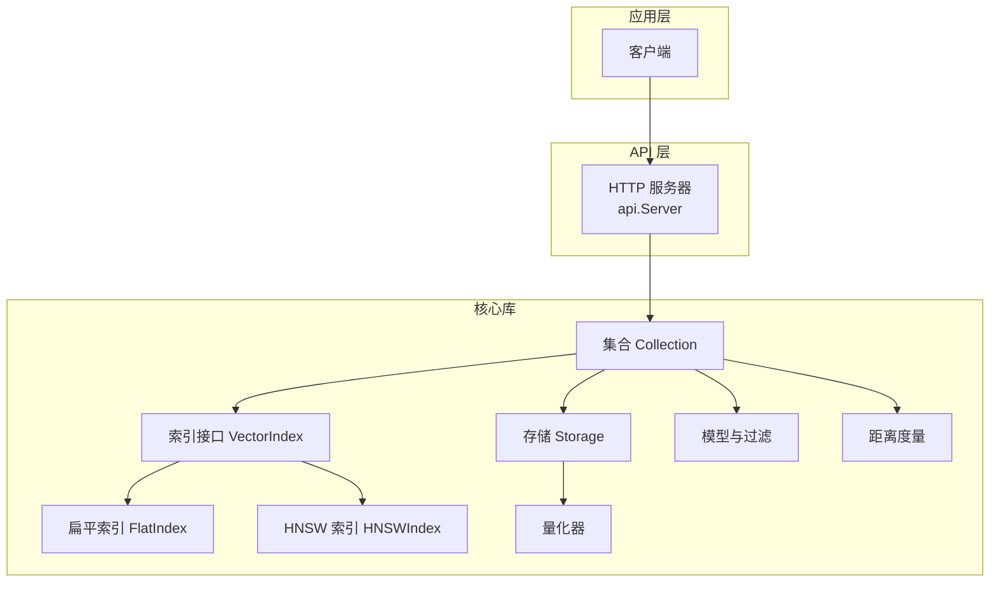
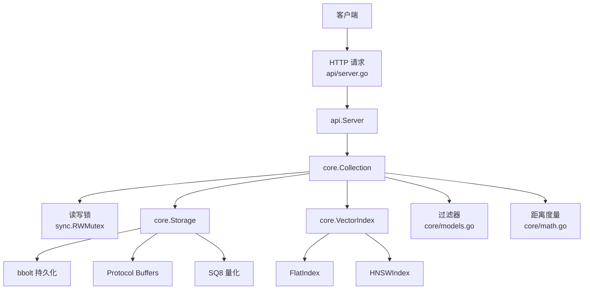
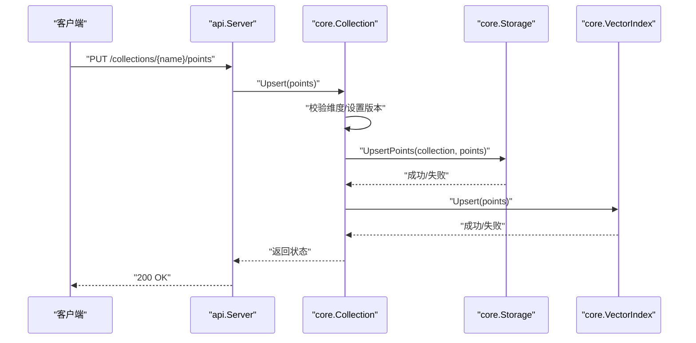
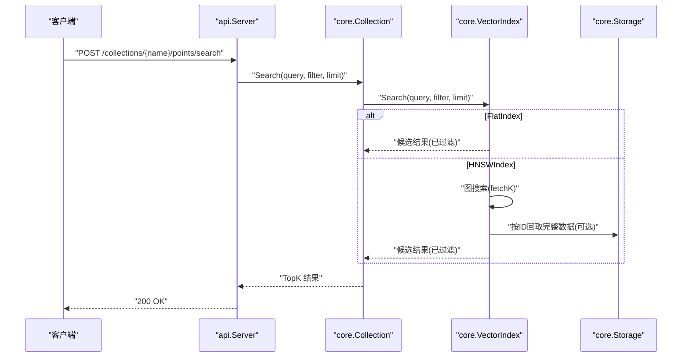
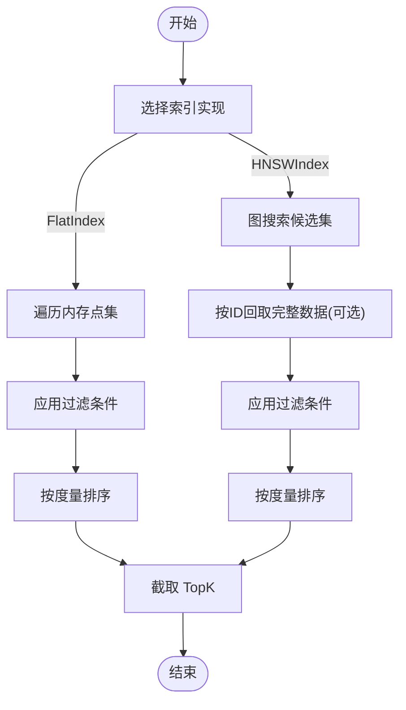
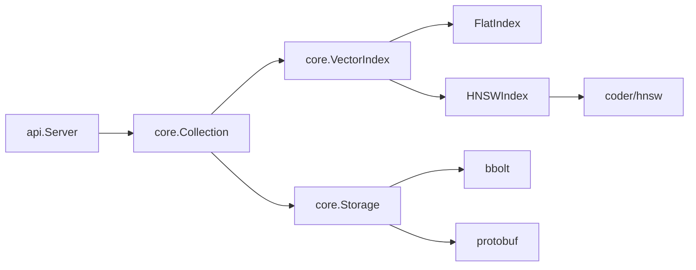

# 数据流分析

<cite>
**本文档引用的文件**
- [README.md](file://README.md)
- [collection.go](file://core/collection.go)
- [storage.go](file://core/storage.go)
- [index.go](file://core/index.go)
- [flat_index.go](file://core/flat_index.go)
- [hnsw_index.go](file://core/hnsw_index.go)
- [models.go](file://core/models.go)
- [math.go](file://core/math.go)
- [quantization.go](file://core/quantization.go)
- [server.go](file://api/server.go)
- [main.go](file://cmd/govector/main.go)
- [collection_test.go](file://core/collection_test.go)
- [server_test.go](file://api/server_test.go)
</cite>

## 目录
1. [简介](#简介)
2. [项目结构](#项目结构)
3. [核心组件](#核心组件)
4. [架构总览](#架构总览)
5. [详细组件分析](#详细组件分析)
6. [依赖分析](#依赖分析)
7. [性能考虑](#性能考虑)
8. [故障排查指南](#故障排查指南)
9. [结论](#结论)

## 简介
本文件面向 GoVector 的数据流与并发控制进行系统化分析，覆盖三种主要数据流路径：
- 写入流程：客户端请求 → Server → Collection → Storage → Index
- 查询流程：客户端请求 → Server → Collection → Index → Storage
- 过滤流程：Index 返回候选 → Storage 获取完整数据 → 应用过滤条件

同时，文档解释了并发控制机制（读写锁）与数据一致性保障策略，并提供时序图与流程图帮助开发者理解复杂场景下的数据处理逻辑。

## 项目结构
GoVector 采用分层清晰的模块化设计：
- 核心库 core：集合管理、索引接口与实现、存储引擎、模型与工具函数
- API 层 api：HTTP 服务端，提供 Qdrant 兼容 REST 接口
- 命令行入口 cmd/govector serve：独立微服务启动器
- 示例与测试：embedded 示例、单元测试与集成测试

图表来源
- [server.go:16-24](file://api/server.go#L16-L24)
- [collection.go:12-20](file://core/collection.go#L12-L20)
- [storage.go:15-20](file://core/storage.go#L15-L20)
- [index.go:5-28](file://core/index.go#L5-L28)
- [flat_index.go:13-17](file://core/flat_index.go#L13-L17)
- [hnsw_index.go:44-50](file://core/hnsw_index.go#L44-L50)
- [models.go:5-25](file://core/models.go#L5-L25)
- [math.go:5-22](file://core/math.go#L5-L22)
- [quantization.go:5-18](file://core/quantization.go#L5-L18)

章节来源
- [README.md:122-127](file://README.md#L122-L127)
- [server.go:16-24](file://api/server.go#L16-L24)
- [collection.go:12-20](file://core/collection.go#L12-L20)
- [storage.go:15-20](file://core/storage.go#L15-L20)
- [index.go:5-28](file://core/index.go#L5-L28)

## 核心组件
- 集合 Collection：线程安全的集合管理器，负责写入、查询、删除操作；内部持有读写锁，协调存储与索引的一致性。
- 存储 Storage：基于 bbolt 的持久化引擎，支持向量量化、元数据存储与批量读写。
- 索引 VectorIndex：统一接口，支持 FlatIndex（暴力搜索）与 HNSWIndex（近似最近邻）。
- 模型与过滤：PointStruct、Filter、Condition 等，支持多种过滤类型（精确、范围、前缀、包含、正则）。
- 距离度量：支持 Cosine、Euclid、Dot 三种度量，用于相似度计算与排序。
- 量化器：SQ8 量化器，将浮点向量压缩为 8 位整数，降低磁盘占用与内存压力。

章节来源
- [collection.go:12-20](file://core/collection.go#L12-L20)
- [storage.go:15-20](file://core/storage.go#L15-L20)
- [index.go:5-28](file://core/index.go#L5-L28)
- [models.go:5-25](file://core/models.go#L5-L25)
- [math.go:5-22](file://core/math.go#L5-L22)
- [quantization.go:5-18](file://core/quantization.go#L5-L18)

## 架构总览
下图展示从客户端到存储与索引的整体交互路径，以及各组件间的依赖关系。

图表来源
- [server.go:16-24](file://api/server.go#L16-L24)
- [collection.go:17-19](file://core/collection.go#L17-L19)
- [storage.go:15-20](file://core/storage.go#L15-L20)
- [flat_index.go:13-17](file://core/flat_index.go#L13-L17)
- [hnsw_index.go:44-50](file://core/hnsw_index.go#L44-L50)
- [models.go:27-32](file://core/models.go#L27-L32)
- [math.go:24-38](file://core/math.go#L24-L38)

## 详细组件分析

### 写入流程：客户端请求 → Server → Collection → Storage → Index
写入流程确保“先持久化、后索引”的顺序，以保证数据一致性；若索引更新失败，会尝试回滚存储层变更。

图表来源
- [server.go:148-176](file://api/server.go#L148-L176)
- [collection.go:97-133](file://core/collection.go#L97-L133)
- [storage.go:148-187](file://core/storage.go#L148-L187)
- [flat_index.go:29-38](file://core/flat_index.go#L29-L38)
- [hnsw_index.go:110-124](file://core/hnsw_index.go#L110-L124)

要点与验证
- 维度校验与版本号设置在 Collection.Upsert 中完成，确保写入前的数据合法性。
- 持久化优先于索引更新，失败时尝试回滚存储层（best-effort），避免不一致。
- 并发控制：Collection 使用 RWMutex，Upsert 获取写锁，保证同一时间只有一个写入操作。

章节来源
- [collection.go:97-133](file://core/collection.go#L97-L133)
- [collection_test.go:167-190](file://core/collection_test.go#L167-L190)

### 查询流程：客户端请求 → Server → Collection → Index → Storage
查询流程采用“索引优先、必要时回取存储”的策略。FlatIndex 直接在内存中遍历并过滤；HNSWIndex 使用图搜索，结合后过滤策略。

图表来源
- [server.go:182-218](file://api/server.go#L182-L218)
- [collection.go:138-147](file://core/collection.go#L138-L147)
- [flat_index.go:44-74](file://core/flat_index.go#L44-L74)
- [hnsw_index.go:129-176](file://core/hnsw_index.go#L129-L176)

要点与验证
- FlatIndex 在内存中对所有点执行过滤与距离计算，排序后截断 TopK。
- HNSWIndex 采用“过采样 + 后过滤”策略：根据过滤需求扩大 fetchK，再对候选集应用过滤与评分，最后返回 TopK。
- 并发控制：查询使用读锁，允许多个并发查询同时进行。

章节来源
- [flat_index.go:44-74](file://core/flat_index.go#L44-L74)
- [hnsw_index.go:129-176](file://core/hnsw_index.go#L129-L176)
- [models.go:81-106](file://core/models.go#L81-L106)

### 过滤流程：Index 返回候选 → Storage 获取完整数据 → 应用过滤条件
过滤流程强调“先索引候选、后应用过滤”。对于 FlatIndex，过滤在内存中直接完成；对于 HNSWIndex，需要从存储或内存映射中获取完整数据后再应用过滤。

图表来源
- [flat_index.go:44-74](file://core/flat_index.go#L44-L74)
- [hnsw_index.go:129-176](file://core/hnsw_index.go#L129-L176)
- [models.go:81-106](file://core/models.go#L81-L106)

要点与验证
- MatchFilter 支持 Must/MustNot 条件组合，涵盖精确匹配、范围、前缀、包含、正则等类型。
- HNSWIndex 的后过滤策略通过扩大 fetchK 来补偿过滤导致的候选不足问题。

章节来源
- [models.go:81-106](file://core/models.go#L81-L106)
- [models.go:197-279](file://core/models.go#L197-L279)

### 并发控制与一致性
- Collection 使用 sync.RWMutex：
  - 写入（Upsert/Delete）：写锁，保证持久化与索引更新的原子性。
  - 查询（Search/Count）：读锁，允许多个并发查询。
- Server 对 collections 映射使用互斥锁保护，避免并发注册/删除集合时的竞争。
- 存储层使用 bbolt 的事务语义（View/Update）保证读写隔离与一致性。
- 量化器在存储层透明工作，不影响上层接口一致性。

章节来源
- [collection.go:17-19](file://core/collection.go#L17-L19)
- [server.go:23-24](file://api/server.go#L23-L24)
- [storage.go:138-142](file://core/storage.go#L138-L142)
- [flat_index.go:16-17](file://core/flat_index.go#L16-L17)
- [hnsw_index.go:49-50](file://core/hnsw_index.go#L49-L50)

### 数据转换与序列化
- 协议序列化：PointStruct 通过 Protocol Buffers 编解码，支持字符串、整数、浮点、布尔、字节数组等类型。
- 量化存储：启用量化时，向量被压缩并存储在 Payload 中，加载时自动解压恢复。
- 距离计算：根据配置的度量（Cosine/Euclid/Dot）计算相似度或距离，用于排序与返回。

章节来源
- [storage.go:22-86](file://core/storage.go#L22-L86)
- [storage.go:148-187](file://core/storage.go#L148-L187)
- [storage.go:193-235](file://core/storage.go#L193-L235)
- [quantization.go:32-76](file://core/quantization.go#L32-L76)
- [quantization.go:78-104](file://core/quantization.go#L78-L104)
- [math.go:24-38](file://core/math.go#L24-L38)

## 依赖分析
- 组件耦合
  - Collection 依赖 Storage 与 VectorIndex，二者通过接口解耦，便于替换实现。
  - Index 实现（Flat/HNSW）依赖 Collection 的 Payload 与 ID 映射，以支持过滤与回取。
  - Server 仅依赖 Collection 接口，通过 collections 映射管理多个集合。
- 外部依赖
  - bbolt：本地键值数据库，提供事务与持久化能力。
  - coder/hnsw：HNSW 图搜索库，提供高效近似最近邻搜索。
  - protobuf：跨语言序列化协议，用于点结构与元数据存储。

图表来源
- [server.go:18-24](file://api/server.go#L18-L24)
- [collection.go:12-20](file://core/collection.go#L12-L20)
- [storage.go:15-20](file://core/storage.go#L15-L20)
- [hnsw_index.go:8-9](file://core/hnsw_index.go#L8-L9)

章节来源
- [README.md:124-126](file://README.md#L124-L126)
- [hnsw_index.go:62-90](file://core/hnsw_index.go#L62-L90)

## 性能考虑
- 索引选择
  - FlatIndex：适合小规模数据，O(n) 查询，无需训练与维护开销。
  - HNSWIndex：适合大规模数据，近似搜索，支持参数调优（M、EfSearch 等）。
- 过滤策略
  - HNSWIndex 采用“过采样 + 后过滤”，在高过滤率场景下提升命中率。
- 量化
  - SQ8 量化显著降低磁盘与内存占用，适合大规模向量存储。
- 并发
  - 查询使用读锁，支持高并发读；写入使用写锁，避免阻塞读路径。

章节来源
- [hnsw_index.go:129-142](file://core/hnsw_index.go#L129-L142)
- [quantization.go:106-109](file://core/quantization.go#L106-L109)
- [collection.go:143-144](file://core/collection.go#L143-L144)

## 故障排查指南
- 写入失败回滚
  - 现象：索引更新失败但部分数据已写入存储。
  - 处理：Collection.Upsert 在索引失败时尝试删除存储中的对应点（best-effort），保持一致性。
- 过滤结果为空
  - 现象：查询返回空结果。
  - 排查：确认 Filter 的 Must/MustNot 条件是否正确；检查 Payload 类型与键名。
- 维度不匹配
  - 现象：Upsert/Search 报错“维度不匹配”。
  - 处理：确保点向量维度与集合创建时指定的维度一致。
- 服务器启动与关闭
  - 现象：服务无法启动或优雅关闭失败。
  - 处理：检查端口占用、数据库路径权限；使用 Stop(ctx) 提供超时上下文。

章节来源
- [collection.go:118-130](file://core/collection.go#L118-L130)
- [models.go:81-106](file://core/models.go#L81-L106)
- [collection_test.go:167-190](file://core/collection_test.go#L167-L190)
- [server_test.go:100-131](file://api/server_test.go#L100-L131)

## 结论
GoVector 通过明确的数据流边界与严格的并发控制，实现了高性能、可扩展且一致的向量检索系统。写入流程保证持久化优先，查询流程在 Flat 与 HNSW 之间灵活切换，过滤流程通过后过滤策略平衡准确性与性能。配合量化与参数化索引，可在不同规模与场景下取得良好表现。