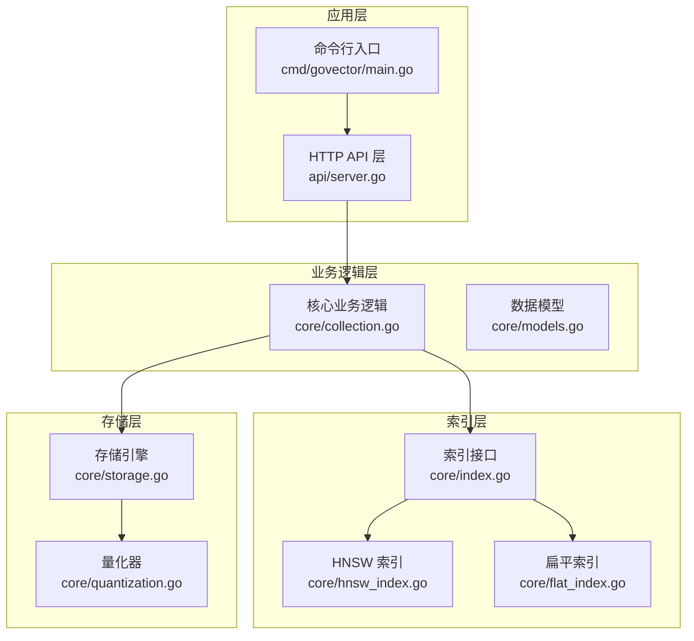
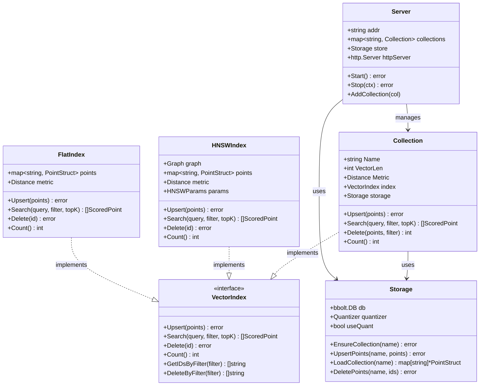
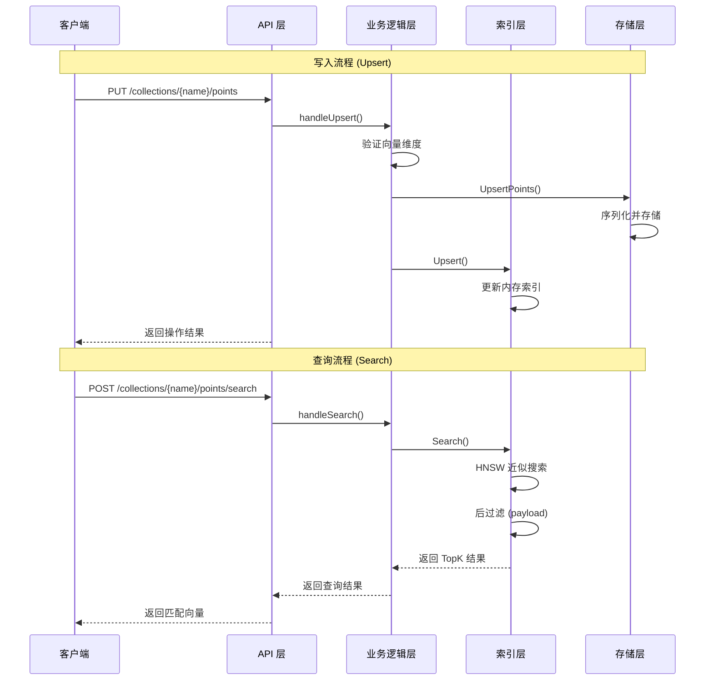
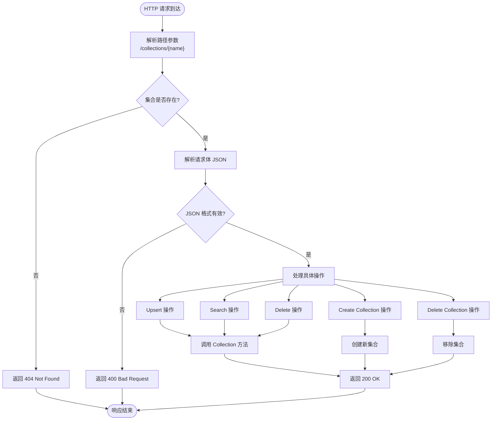
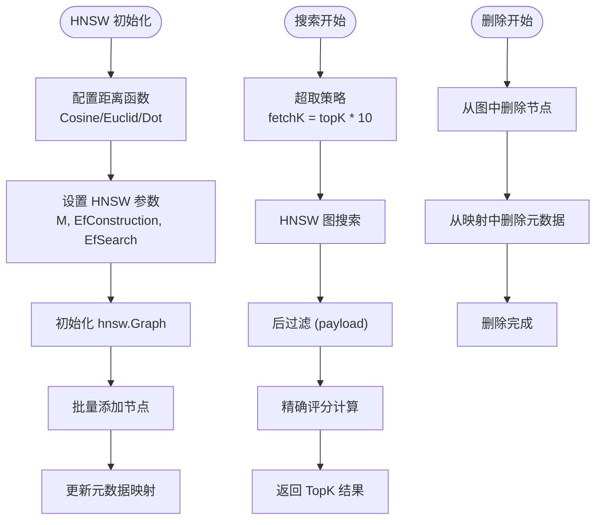
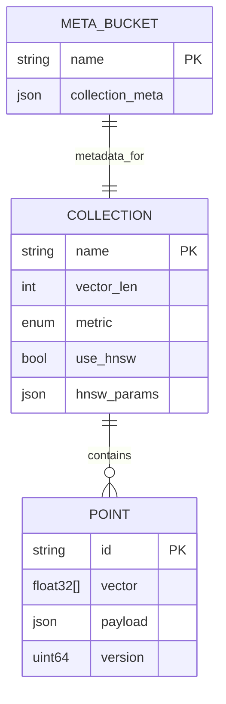
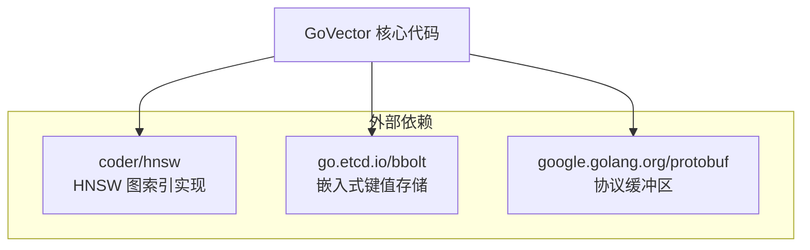
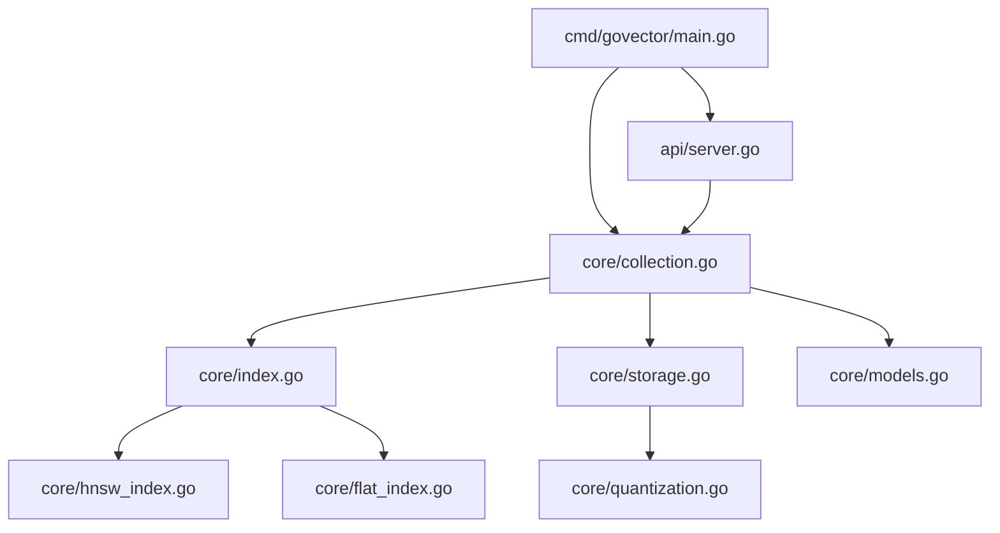

# 整体架构概览

<cite>
**本文档引用的文件**
- [README.md](file://README.md)
- [go.mod](file://go.mod)
- [cmd/govector/main.go](file://cmd/govector/main.go)
- [api/server.go](file://api/server.go)
- [core/collection.go](file://core/collection.go)
- [core/index.go](file://core/index.go)
- [core/hnsw_index.go](file://core/hnsw_index.go)
- [core/flat_index.go](file://core/flat_index.go)
- [core/storage.go](file://core/storage.go)
- [core/models.go](file://core/models.go)
- [core/quantization.go](file://core/quantization.go)
- [api/server_test.go](file://api/server_test.go)
- [core/collection_test.go](file://core/collection_test.go)
</cite>

## 目录
1. [简介](#简介)
2. [项目结构](#项目结构)
3. [核心组件](#核心组件)
4. [架构总览](#架构总览)
5. [详细组件分析](#详细组件分析)
6. [依赖关系分析](#依赖关系分析)
7. [性能考量](#性能考量)
8. [故障排除指南](#故障排除指南)
9. [结论](#结论)

## 简介

GoVector 是一个用纯 Go 编写的轻量级、可嵌入向量数据库，旨在为本地 AI 应用、桌面应用和边缘计算场景提供高性能的向量相似性搜索能力。它提供了与 Qdrant 兼容的 REST API，并采用 HNSW 图索引实现近似最近邻搜索，同时通过 BoltDB 实现持久化存储。

该系统的核心设计理念是：
- **分层解耦**：清晰的四层架构，每层职责明确且相互独立
- **接口抽象**：通过 VectorIndex 接口实现索引策略的透明切换
- **可扩展性**：支持多种距离度量、过滤条件和存储后端
- **可靠性**：基于 bbolt 的事务性持久化，保证数据一致性

## 项目结构

GoVector 采用模块化的目录结构，按照功能层次组织代码：



**图表来源**
- [cmd/govector/main.go:18-92](file://cmd/govector/main.go#L18-L92)
- [api/server.go:16-424](file://api/server.go#L16-L424)
- [core/collection.go:9-198](file://core/collection.go#L9-L198)
- [core/index.go:5-29](file://core/index.go#L5-L29)

**章节来源**
- [README.md:122-127](file://README.md#L122-L127)
- [go.mod:1-19](file://go.mod#L1-L19)

## 核心组件

### 四层架构设计

GoVector 采用经典的四层架构模式：

1. **API 层**：提供 RESTful HTTP 接口，处理客户端请求
2. **业务逻辑层**：封装 Collection 抽象，管理向量集合的生命周期
3. **索引层**：实现 VectorIndex 接口，支持 HNSW 和扁平索引两种策略
4. **存储层**：基于 bbolt 的持久化存储，支持向量量化压缩

### 关键数据模型

系统使用以下核心数据结构：



**图表来源**
- [core/collection.go:9-198](file://core/collection.go#L9-L198)
- [core/index.go:5-29](file://core/index.go#L5-L29)
- [core/hnsw_index.go:41-229](file://core/hnsw_index.go#L41-L229)
- [core/flat_index.go:9-124](file://core/flat_index.go#L9-L124)
- [core/storage.go:13-360](file://core/storage.go#L13-L360)
- [api/server.go:16-424](file://api/server.go#L16-L424)

**章节来源**
- [core/models.go:5-280](file://core/models.go#L5-L280)
- [core/index.go:5-29](file://core/index.go#L5-L29)

## 架构总览

### 数据流完整流程

从客户端请求到数据持久化的完整数据流如下：



**图表来源**
- [api/server.go:145-176](file://api/server.go#L145-L176)
- [api/server.go:178-218](file://api/server.go#L178-L218)
- [core/collection.go:93-133](file://core/collection.go#L93-L133)
- [core/collection.go:135-147](file://core/collection.go#L135-L147)

### 架构设计原则

1. **分层解耦**：每层都有明确的职责边界，层间通过接口通信
2. **接口抽象**：VectorIndex 接口允许透明切换不同的索引策略
3. **可扩展性**：支持多种距离度量（余弦、欧几里得、点积）
4. **可靠性**：基于 bbolt 的事务性操作确保数据一致性
5. **性能优化**：HNSW 索引提供近似但高效的搜索能力

## 详细组件分析

### API 层分析

API 层负责处理 HTTP 请求，提供与 Qdrant 兼容的 REST API：



**图表来源**
- [api/server.go:145-258](file://api/server.go#L145-L258)
- [api/server.go:260-352](file://api/server.go#L260-L352)

**章节来源**
- [api/server.go:54-95](file://api/server.go#L54-L95)
- [api/server.go:145-258](file://api/server.go#L145-L258)

### 业务逻辑层分析

Collection 类是业务逻辑的核心，封装了向量集合的所有操作：

```mermaid
classDiagram
class Collection {
+string Name
+int VectorLen
+Distance Metric
+VectorIndex index
+Storage storage
+RWMutex mu
+NewCollection(name, dim, metric, store, useHNSW)
+NewCollectionWithParams(name, dim, metric, store, useHNSW, params)
+Upsert(points) error
+Search(query, filter, topK) []ScoredPoint
+Delete(points, filter) int
+Count() int
}
note for Collection : "线程安全的向量集合管理器"
class UpsertProcess {
+验证向量维度
+设置版本号
+持久化到磁盘
+更新内存索引
+错误回滚
}
class SearchProcess {
+验证查询向量维度
+读锁保护
+委托给索引层
}
class DeleteProcess {
+确定删除目标ID
+先删除磁盘数据
+再删除内存索引
+统计成功数量
}
Collection --> UpsertProcess : 包含
Collection --> SearchProcess : 包含
Collection --> DeleteProcess : 包含
```

**图表来源**
- [core/collection.go:22-91](file://core/collection.go#L22-L91)
- [core/collection.go:93-133](file://core/collection.go#L93-L133)
- [core/collection.go:135-147](file://core/collection.go#L135-L147)
- [core/collection.go:162-197](file://core/collection.go#L162-L197)

**章节来源**
- [core/collection.go:9-198](file://core/collection.go#L9-L198)

### 索引层分析

索引层实现了 VectorIndex 接口，提供两种不同的索引策略：

#### HNSW 索引实现

HNSW（Hierarchical Navigable Small World）是一种高效的图结构索引：



**图表来源**
- [core/hnsw_index.go:52-106](file://core/hnsw_index.go#L52-L106)
- [core/hnsw_index.go:126-176](file://core/hnsw_index.go#L126-L176)
- [core/hnsw_index.go:178-189](file://core/hnsw_index.go#L178-L189)

#### 扁平索引实现

扁平索引提供精确但低效的暴力搜索：

**章节来源**
- [core/hnsw_index.go:41-229](file://core/hnsw_index.go#L41-L229)
- [core/flat_index.go:9-124](file://core/flat_index.go#L9-L124)

### 存储层分析

存储层基于 bbolt 提供持久化能力，支持向量量化压缩：



**图表来源**
- [core/storage.go:131-142](file://core/storage.go#L131-L142)
- [core/storage.go:144-187](file://core/storage.go#L144-L187)
- [core/storage.go:189-235](file://core/storage.go#L189-L235)
- [core/storage.go:261-280](file://core/storage.go#L261-L280)

**章节来源**
- [core/storage.go:13-360](file://core/storage.go#L13-L360)

### 技术选型权衡

#### 为什么选择 HNSW 索引而非其他算法？

1. **性能优势**：HNSW 提供 O(log N) 的搜索复杂度，相比扁平索引的 O(n) 性能提升显著
2. **工业级成熟度**：HNSW 在多个生产环境中得到验证，稳定性可靠
3. **参数可调性**：通过 M、EfConstruction、EfSearch 等参数可以针对不同场景进行优化
4. **内存效率**：相比完全图结构，HNSW 的分层结构更节省内存

#### 为什么采用嵌入式存储？

1. **部署简单**：无需额外的数据库服务，单文件即可运行
2. **可靠性高**：基于 bbolt 的事务性操作，保证数据一致性
3. **跨平台**：纯 Go 实现，支持多平台编译
4. **零依赖**：避免复杂的 C/C++ 依赖问题

**章节来源**
- [README.md:34-37](file://README.md#L34-L37)
- [README.md:124-126](file://README.md#L124-L126)

## 依赖关系分析

### 外部依赖

GoVector 的外部依赖相对简洁，主要包含三个核心库：



**图表来源**
- [go.mod:5-18](file://go.mod#L5-L18)

### 内部模块依赖



**图表来源**
- [cmd/govector/main.go:14-16](file://cmd/govector/main.go#L14-L16)
- [api/server.go:13](file://api/server.go#L13)
- [core/collection.go:3](file://core/collection.go#L3)

**章节来源**
- [go.mod:1-19](file://go.mod#L1-L19)

## 性能考量

### 索引性能对比

根据项目文档中的基准测试数据：

| 索引类型 | 规模(N) | 构建时间 | 平均延迟 | 吞吐量(QPS) | 内存占用 |
|---------|--------|----------|----------|------------|----------|
| **扁平** | 100K | 186ms | 54.46ms | 18 QPS | 59MB |
| **HNSW** | 100K | 20.9s | **0.08ms** | **11,812 QPS** | 311MB |
| **HNSW** | 1M | 4m 17s | **0.11ms** | **8,709 QPS** | 3.32GB |

### 量化压缩效果

系统支持 SQ8 8位标量量化，可以显著减少存储空间：

- **压缩比**：每个维度从 4 字节减少到 1 字节 + 8 字节元信息
- **精度损失**：通过最小值和最大值范围控制，保持合理的精度
- **性能影响**：量化在加载时进行解压，不影响查询性能

## 故障排除指南

### 常见问题及解决方案

#### 1. 收集器创建失败

**症状**：创建集合时报错
**可能原因**：
- 集合名称已存在
- 向量维度无效
- 距离度量不支持
- 存储初始化失败

**解决方法**：
- 检查集合名称唯一性
- 验证向量维度必须为正数
- 确认距离度量字符串正确
- 检查数据库文件权限

#### 2. 数据持久化异常

**症状**：Upsert 操作后数据丢失
**可能原因**：
- 存储层写入失败
- 内存索引更新后回滚
- 数据库连接中断

**解决方法**：
- 检查磁盘空间和权限
- 验证数据库文件完整性
- 查看存储层错误日志

#### 3. 搜索结果异常

**症状**：搜索结果为空或不准确
**可能原因**：
- 查询向量维度不匹配
- 过滤条件过于严格
- HNSW 参数配置不当

**解决方法**：
- 确认查询向量维度与集合一致
- 调整过滤条件
- 优化 HNSW 参数（M、EfSearch）

**章节来源**
- [api/server.go:260-352](file://api/server.go#L260-L352)
- [core/collection.go:93-133](file://core/collection.go#L93-L133)
- [core/storage.go:144-187](file://core/storage.go#L144-L187)

## 结论

GoVector 通过清晰的四层架构设计，成功地将复杂的向量搜索功能封装为易于使用的嵌入式数据库。其核心优势包括：

1. **架构清晰**：分层解耦的设计使得系统易于理解和维护
2. **性能优异**：HNSW 索引提供接近实时的搜索性能
3. **部署简单**：单文件部署，零依赖运行
4. **功能完整**：支持完整的向量搜索、过滤和持久化功能

该架构为构建本地 AI 应用、桌面程序和边缘计算场景提供了理想的基础设施，既满足了性能需求，又保持了开发的便利性。