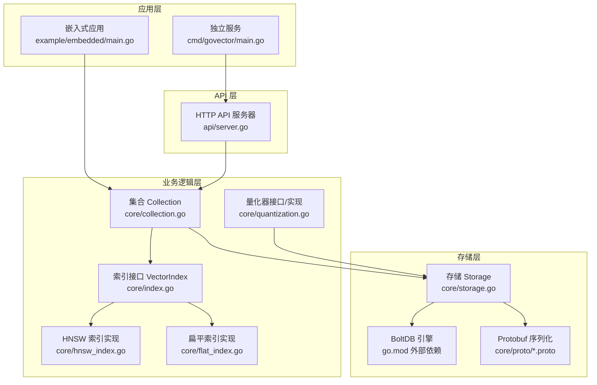
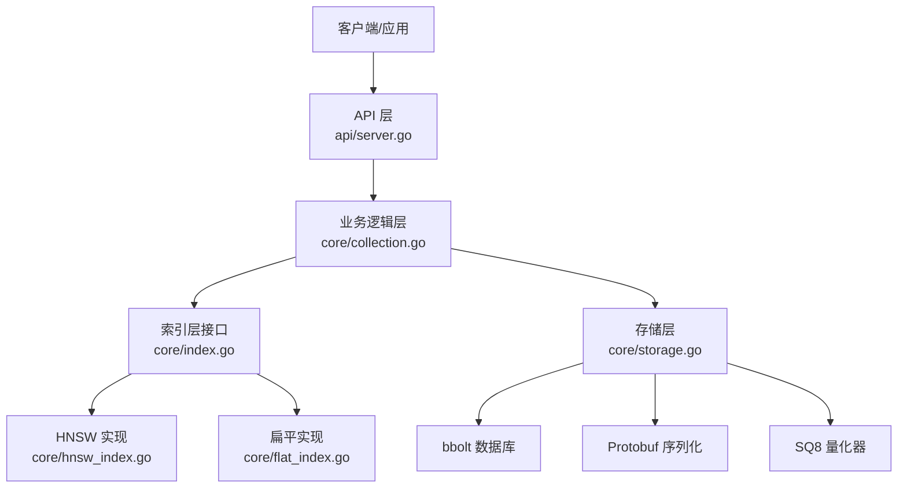
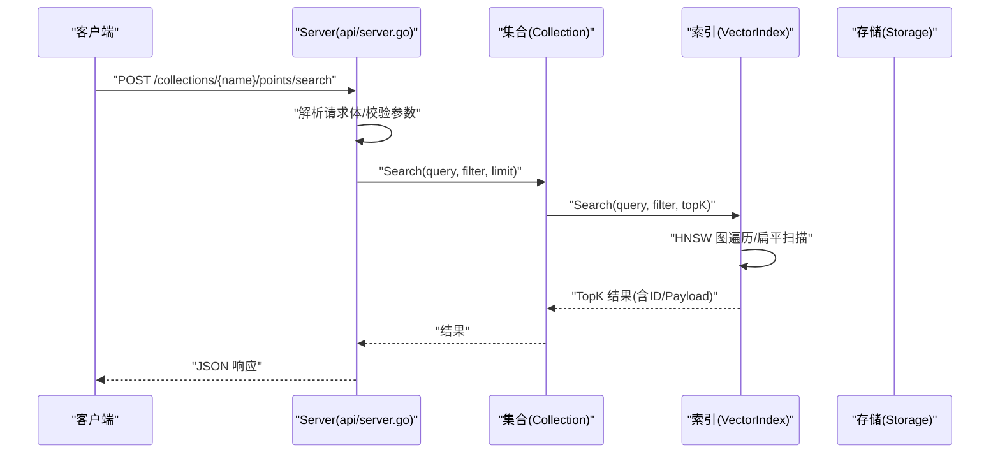
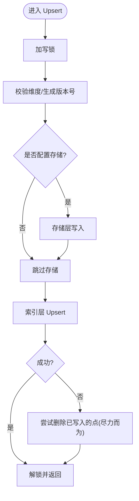
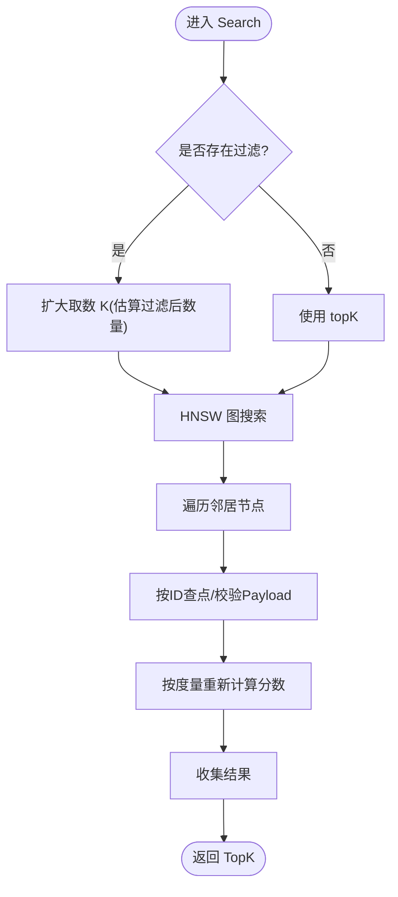
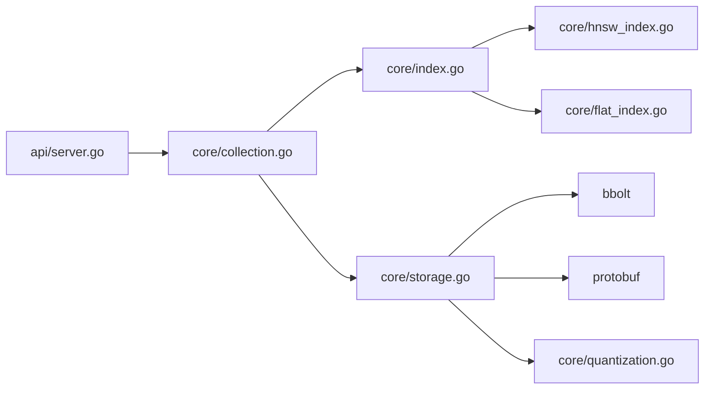

# 架构设计

<cite>
**本文引用的文件列表**
- [README.md](file://README.md)
- [go.mod](file://go.mod)
- [cmd/govector/main.go](file://cmd/govector/main.go)
- [api/server.go](file://api/server.go)
- [core/collection.go](file://core/collection.go)
- [core/hnsw_index.go](file://core/hnsw_index.go)
- [core/flat_index.go](file://core/flat_index.go)
- [core/storage.go](file://core/storage.go)
- [core/index.go](file://core/index.go)
- [core/models.go](file://core/models.go)
- [core/quantization.go](file://core/quantization.go)
- [example/embedded/main.go](file://example/embedded/main.go)
</cite>

## 目录
1. [简介](#简介)
2. [项目结构](#项目结构)
3. [核心组件](#核心组件)
4. [架构总览](#架构总览)
5. [详细组件分析](#详细组件分析)
6. [依赖关系分析](#依赖关系分析)
7. [性能与可扩展性](#性能与可扩展性)
8. [安全与运维](#安全与运维)
9. [故障排查指南](#故障排查指南)
10. [结论](#结论)

## 简介
本项目是一个用纯 Go 实现的轻量级嵌入式向量数据库，目标是为本地应用、桌面程序和边缘设备提供高性能、低延迟的向量相似度检索能力。它提供：
- Qdrant 兼容的 REST API（可选微服务模式）
- 内嵌库模式：零网络开销，直接在应用中使用
- HNSW 近似最近邻索引，支持子线性搜索复杂度
- 基于 BoltDB 的持久化，使用 Protobuf 序列化
- 支持多种距离度量（余弦、欧氏、点积）
- 高级元数据过滤（精确、范围、前缀、正则、包含）
- 可选 8 位标量量化以降低磁盘占用

## 项目结构
仓库采用按“功能域”组织的分层结构：
- cmd/govector serve：独立服务入口，启动 HTTP API 服务器
- api：HTTP API 层，暴露 Qdrant 兼容接口
- core：核心引擎层，包含集合管理、索引、存储、模型与量化
- example/embedded：嵌入式库使用示例
- 资源与脚本：构建、发布与演示脚本

图表来源
- [cmd/govector/main.go:18-92](file://cmd/govector/main.go#L18-L92)
- [api/server.go:26-95](file://api/server.go#L26-L95)
- [core/collection.go:22-91](file://core/collection.go#L22-L91)
- [core/hnsw_index.go:41-106](file://core/hnsw_index.go#L41-L106)
- [core/flat_index.go:9-25](file://core/flat_index.go#L9-L25)
- [core/storage.go:13-20](file://core/storage.go#L13-L20)
- [go.mod:5-9](file://go.mod#L5-L9)

章节来源
- [README.md:16-42](file://README.md#L16-L42)
- [go.mod:1-19](file://go.mod#L1-19)

## 核心组件
- 存储层（Storage）：基于 bbolt 的键值存储，每个集合一个桶；集合元数据保存在特殊桶中；使用 Protobuf 序列化点数据；支持可选的 8 位标量量化（SQ8）
- 索引层（VectorIndex 接口及其实现）：统一抽象，支持扁平暴力索引（FlatIndex）与 HNSW 图索引（HNSWIndex），运行时透明切换
- 业务逻辑层（Collection）：封装集合维度、距离度量、并发控制、持久化一致性保证；提供 Upsert/Search/Delete
- API 层（Server）：提供 Qdrant 兼容 REST 接口，负责路由、参数解析、错误处理与结果编码；支持自动加载持久化集合

章节来源
- [core/storage.go:13-20](file://core/storage.go#L13-L20)
- [core/index.go:5-28](file://core/index.go#L5-L28)
- [core/hnsw_index.go:41-106](file://core/hnsw_index.go#L41-L106)
- [core/flat_index.go:9-25](file://core/flat_index.go#L9-L25)
- [core/collection.go:9-20](file://core/collection.go#L9-L20)
- [api/server.go:16-24](file://api/server.go#L16-L24)

## 架构总览
系统采用“存储层-索引层-业务逻辑层-API 层”的四层架构，结合“嵌入式库模式”和“独立服务模式”，满足不同部署场景的需求。

图表来源
- [api/server.go:54-95](file://api/server.go#L54-L95)
- [core/collection.go:93-133](file://core/collection.go#L93-L133)
- [core/hnsw_index.go:41-106](file://core/hnsw_index.go#L41-L106)
- [core/flat_index.go:9-25](file://core/flat_index.go#L9-L25)
- [core/storage.go:13-20](file://core/storage.go#L13-L20)
- [core/quantization.go:5-18](file://core/quantization.go#L5-L18)

## 详细组件分析

### API 层（HTTP 服务器）
职责与特性：
- 提供 Qdrant 兼容端点：集合管理、点写入、查询、删除
- 自动从存储加载集合元数据并初始化内存索引
- 并发安全：内部使用互斥锁保护 HTTP 服务器与集合映射
- 错误处理：对无效 JSON、不存在集合、内部错误返回标准状态码

关键流程（以搜索为例）：

图表来源
- [api/server.go:178-218](file://api/server.go#L178-L218)
- [core/collection.go:135-147](file://core/collection.go#L135-L147)
- [core/hnsw_index.go:126-176](file://core/hnsw_index.go#L126-L176)
- [core/flat_index.go:40-74](file://core/flat_index.go#L40-L74)

章节来源
- [api/server.go:54-95](file://api/server.go#L54-L95)
- [api/server.go:178-218](file://api/server.go#L178-L218)
- [api/server.go:260-352](file://api/server.go#L260-L352)

### 业务逻辑层（Collection）
职责与特性：
- 统一管理集合维度、距离度量、并发读写
- 在创建时保存集合元数据并在存储中确保集合桶存在
- Upsert 严格遵循“先持久化、后更新内存索引”的顺序，失败时尽力回滚
- Search/Count/Delete 对外暴露一致的接口，内部通过索引层执行

Upsert 流程（带持久化一致性）：

图表来源
- [core/collection.go:93-133](file://core/collection.go#L93-L133)
- [core/storage.go:144-187](file://core/storage.go#L144-L187)
- [core/hnsw_index.go:108-124](file://core/hnsw_index.go#L108-L124)
- [core/flat_index.go:27-38](file://core/flat_index.go#L27-L38)

章节来源
- [core/collection.go:22-91](file://core/collection.go#L22-L91)
- [core/collection.go:93-133](file://core/collection.go#L93-L133)

### 索引层（VectorIndex 抽象与实现）
- 抽象接口：统一 Upsert/Search/Delete/Count/按条件筛选等能力
- HNSW 实现：基于外部库，支持自定义 M、EfSearch 等参数；根据距离度量设置距离函数；支持按过滤条件后过滤（当前策略）
- 扁平实现：内存中维护点映射，暴力计算距离，适合小规模或需要精确检索的场景

HNSW 搜索流程（含后过滤）：

图表来源
- [core/hnsw_index.go:126-176](file://core/hnsw_index.go#L126-L176)
- [core/models.go:81-106](file://core/models.go#L81-L106)

章节来源
- [core/index.go:5-28](file://core/index.go#L5-L28)
- [core/hnsw_index.go:41-106](file://core/hnsw_index.go#L41-L106)
- [core/flat_index.go:9-25](file://core/flat_index.go#L9-L25)

### 存储层（Storage）
- 持久化模型：每个集合一个桶；集合元数据保存在特殊桶中
- 序列化：使用 Protobuf 将点结构序列化为字节，支持多类型负载
- 量化：可选 SQ8 量化，写入时压缩、读取时解压
- 并发：基于 bbolt 的事务模型，提供只读/读写事务

章节来源
- [core/storage.go:13-20](file://core/storage.go#L13-L20)
- [core/storage.go:144-187](file://core/storage.go#L144-L187)
- [core/storage.go:189-235](file://core/storage.go#L189-L235)
- [core/storage.go:261-336](file://core/storage.go#L261-L336)
- [core/quantization.go:5-18](file://core/quantization.go#L5-L18)

### 数据模型与过滤
- PointStruct/SimplePoint：包含 ID、版本、向量、负载
- Filter/Condition：支持 Must/MustNot、多种匹配类型（精确、范围、前缀、包含、正则）
- 匹配算法：针对字符串、数组、数值等类型分别处理，支持正则编译与匹配

章节来源
- [core/models.go:5-280](file://core/models.go#L5-L280)

### 独立服务与嵌入式模式
- 独立服务：命令行启动 HTTP 服务器，加载默认集合，注册到 API 服务器
- 嵌入式库：应用直接导入 core 包，创建 Storage/Collection，进行 Upsert/Search

章节来源
- [cmd/govector/main.go:18-92](file://cmd/govector/main.go#L18-L92)
- [example/embedded/main.go:10-63](file://example/embedded/main.go#L10-L63)

## 依赖关系分析
- 外部依赖
  - HNSW 图库：用于近似最近邻搜索
  - bbolt：嵌入式键值数据库
  - Protobuf：结构化序列化
- 内部耦合
  - API 层依赖 Collection
  - Collection 依赖 VectorIndex 接口与 Storage
  - HNSW/Flat 实现依赖 Collection 的数据结构
  - Storage 依赖 Protobuf 定义与 bbolt

图表来源
- [api/server.go:16-24](file://api/server.go#L16-L24)
- [core/collection.go:9-20](file://core/collection.go#L9-L20)
- [core/hnsw_index.go:41-106](file://core/hnsw_index.go#L41-L106)
- [core/flat_index.go:9-25](file://core/flat_index.go#L9-L25)
- [core/storage.go:13-20](file://core/storage.go#L13-L20)
- [core/quantization.go:5-18](file://core/quantization.go#L5-L18)
- [go.mod:5-9](file://go.mod#L5-L9)

章节来源
- [go.mod:1-19](file://go.mod#L1-19)

## 性能与可扩展性
- 索引选择
  - HNSW：支持子线性搜索复杂度，适合大规模数据；可通过参数调优（M、EfSearch、EfConstruction、K）
  - 扁平索引：O(n) 暴力搜索，适合小规模或需要精确检索的场景
- 持久化与序列化
  - 使用 bbolt 与 Protobuf，兼顾吞吐与可靠性
  - SQ8 量化显著降低磁盘占用，适合大规模向量存储
- 并发与一致性
  - Collection 使用读写锁，API 层也对集合映射加锁，避免竞态
  - Upsert 严格遵循“先持久化、后更新索引”的顺序，失败时尽力回滚
- 可扩展性建议
  - 水平扩展：当前为单机嵌入式设计，不支持分布式复制；若需水平扩展，可在应用层拆分集合或引入代理层
  - 参数调优：根据数据规模与查询特征调整 HNSW 参数；启用量化以节省空间
  - 缓存：可在外层增加查询缓存（注意与版本/更新同步）

章节来源
- [core/hnsw_index.go:11-29](file://core/hnsw_index.go#L11-L29)
- [core/storage.go:144-187](file://core/storage.go#L144-L187)
- [core/collection.go:93-133](file://core/collection.go#L93-L133)
- [README.md:60-71](file://README.md#L60-L71)

## 安全与运维
- 安全
  - 当前未内置认证/授权与 TLS；建议在反向代理层添加鉴权与加密
  - 输入校验：API 层对 JSON、集合名、维度、度量等进行校验
- 监控
  - 可在 API 层增加请求计数、耗时、错误率指标；结合日志输出
- 灾难恢复
  - bbolt 文件即数据文件，定期备份；支持重启后自动加载集合元数据与点
  - Upsert 失败时尽力回滚，减少不一致风险

章节来源
- [api/server.go:260-352](file://api/server.go#L260-L352)
- [core/storage.go:261-336](file://core/storage.go#L261-L336)
- [core/collection.go:93-133](file://core/collection.go#L93-L133)

## 故障排查指南
- 启动失败
  - 检查 bbolt 数据库文件权限与路径
  - 查看存储层打开错误与集合元数据加载错误
- 查询异常
  - 确认查询向量维度与集合维度一致
  - 检查过滤条件是否正确（Must/MustNot、匹配类型）
- 写入失败
  - 关注 Upsert 的持久化与索引更新顺序；查看回滚日志
- 服务关闭
  - 使用优雅关闭，等待连接完成或超时

章节来源
- [cmd/govector/main.go:27-36](file://cmd/govector/main.go#L27-L36)
- [api/server.go:148-176](file://api/server.go#L148-L176)
- [core/collection.go:93-133](file://core/collection.go#L93-L133)

## 结论
本项目以清晰的分层架构实现了“嵌入式向量数据库”的核心能力：高性能检索（HNSW）、可靠持久化（bbolt+Protobuf）、灵活过滤与双模式部署（嵌入式/微服务）。通过抽象化的索引接口与严格的持久化顺序，系统在可用性与一致性之间取得良好平衡。未来可在查询过滤下推、水平扩展与可观测性方面进一步演进。