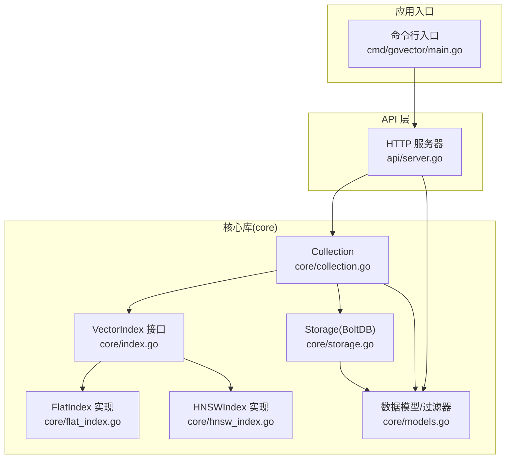
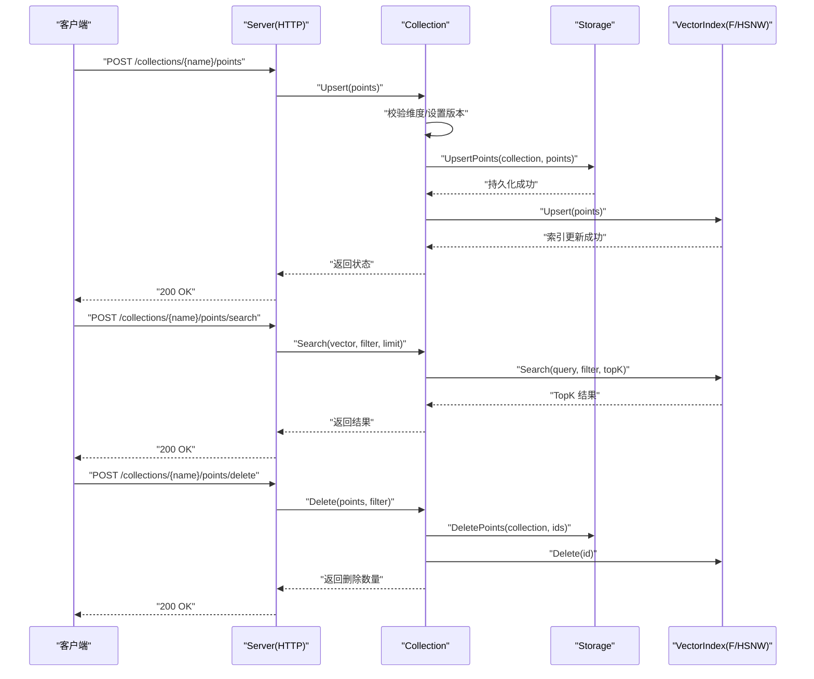
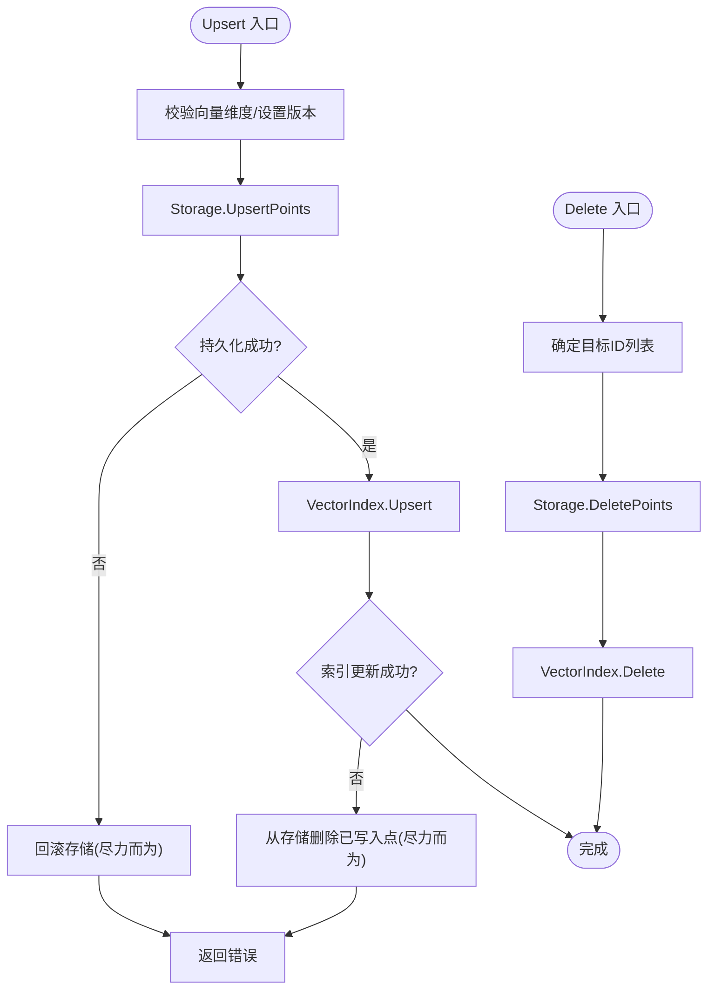
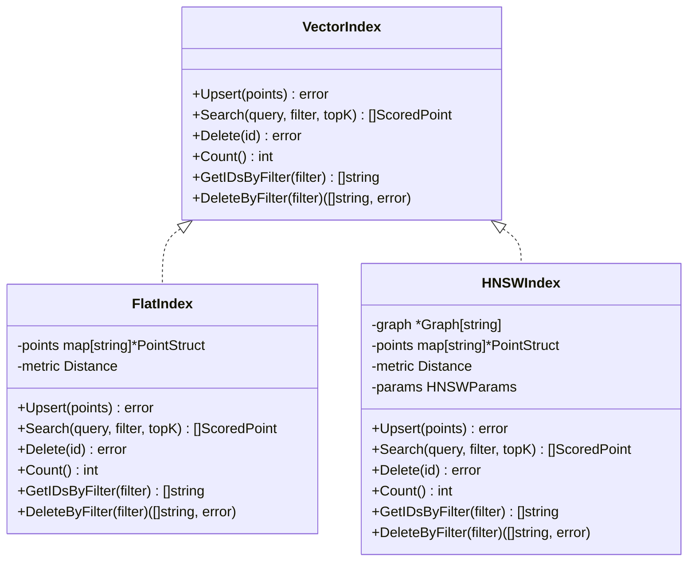
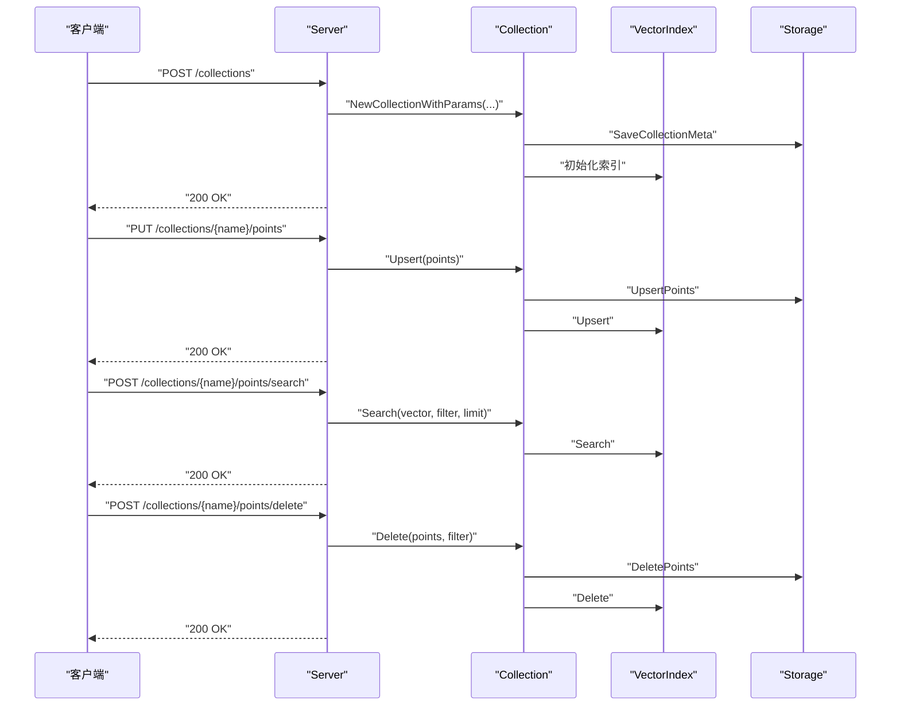
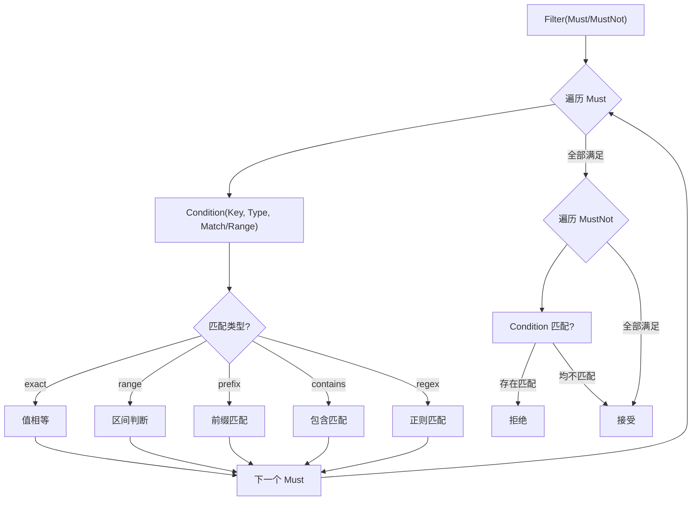
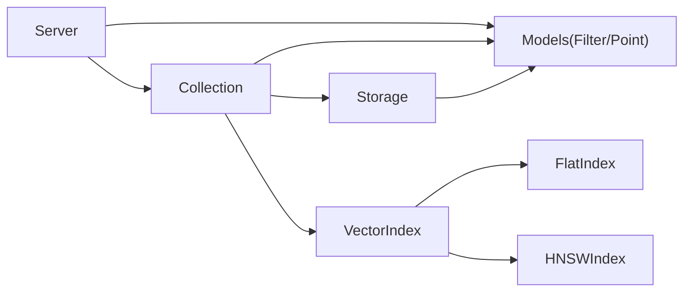

# 组件交互关系

<cite>
**本文档引用的文件**
- [README.md](file://README.md)
- [collection.go](file://core/collection.go)
- [storage.go](file://core/storage.go)
- [index.go](file://core/index.go)
- [flat_index.go](file://core/flat_index.go)
- [hnsw_index.go](file://core/hnsw_index.go)
- [models.go](file://core/models.go)
- [server.go](file://api/server.go)
- [main.go](file://cmd/govector/main.go)
- [collection_test.go](file://core/collection_test.go)
- [server_test.go](file://api/server_test.go)
</cite>

## 目录
1. [简介](#简介)
2. [项目结构](#项目结构)
3. [核心组件](#核心组件)
4. [架构总览](#架构总览)
5. [详细组件分析](#详细组件分析)
6. [依赖关系分析](#依赖关系分析)
7. [性能考量](#性能考量)
8. [故障排查指南](#故障排查指南)
9. [结论](#结论)

## 简介
本文件系统性梳理 GoVector 的组件交互关系，重点阐述以下方面：
- Collection 与 Storage 的持久化交互流程（写入顺序、一致性保障、回滚策略）
- Collection 与 VectorIndex 的索引操作协作（透明切换 Flat/HNSW）
- Server 与 Collection 的业务逻辑调用（REST API 到内部方法的映射）
- 接口抽象设计理念（VectorIndex 如何支持多策略切换）
- 组件间通信协议与数据传递格式（JSON/Protobuf）
- 典型操作场景的交互时序图
- 解耦设计原则与扩展性考虑

## 项目结构
GoVector 采用清晰的分层组织：核心库 core 提供向量集合、索引、存储与模型定义；api 层提供 Qdrant 兼容的 HTTP 服务；cmd/govector serve 提供独立微服务入口；示例与测试覆盖关键路径。

图表来源
- [main.go:18-92](file://cmd/govector/main.go#L18-L92)
- [server.go:16-424](file://api/server.go#L16-L424)
- [collection.go:9-198](file://core/collection.go#L9-L198)
- [storage.go:13-360](file://core/storage.go#L13-L360)
- [index.go:5-29](file://core/index.go#L5-L29)
- [flat_index.go:9-124](file://core/flat_index.go#L9-L124)
- [hnsw_index.go:41-229](file://core/hnsw_index.go#L41-L229)
- [models.go:5-280](file://core/models.go#L5-L280)

章节来源
- [README.md:122-127](file://README.md#L122-L127)
- [main.go:18-92](file://cmd/govector/main.go#L18-L92)
- [server.go:16-424](file://api/server.go#L16-L424)
- [collection.go:9-198](file://core/collection.go#L9-L198)
- [storage.go:13-360](file://core/storage.go#L13-L360)
- [index.go:5-29](file://core/index.go#L5-L29)
- [flat_index.go:9-124](file://core/flat_index.go#L9-L124)
- [hnsw_index.go:41-229](file://core/hnsw_index.go#L41-L229)
- [models.go:5-280](file://core/models.go#L5-L280)

## 核心组件
- Collection：面向用户的逻辑容器，封装 Upsert/Search/Delete 操作，协调 Storage 与 VectorIndex，保证持久化与内存索引的一致性。
- Storage：基于 bbolt 的本地持久化，负责 Collection 元数据与点数据的读写，支持可选的向量量化。
- VectorIndex 接口：统一的索引抽象，屏蔽 Flat 与 HNSW 的差异，实现策略透明切换。
- FlatIndex：内存中的暴力搜索，适合中小规模数据，提供精确结果。
- HNSWIndex：基于图的近似最近邻搜索，适合大规模数据，提供亚线性复杂度。
- Server：提供 Qdrant 兼容的 REST API，管理 Collection 并转发请求到 Collection。
- 数据模型与过滤器：PointStruct、ScoredPoint、Filter、Condition 等，支撑数据结构与查询过滤。

章节来源
- [collection.go:9-198](file://core/collection.go#L9-L198)
- [storage.go:13-360](file://core/storage.go#L13-L360)
- [index.go:5-29](file://core/index.go#L5-L29)
- [flat_index.go:9-124](file://core/flat_index.go#L9-L124)
- [hnsw_index.go:41-229](file://core/hnsw_index.go#L41-L229)
- [models.go:5-280](file://core/models.go#L5-L280)
- [server.go:16-424](file://api/server.go#L16-L424)

## 架构总览
下图展示了从 HTTP 请求到内部处理再到持久化的完整链路，以及 Collection 内部的 Upsert/删除流程。

图表来源
- [server.go:145-258](file://api/server.go#L145-L258)
- [collection.go:93-197](file://core/collection.go#L93-L197)
- [storage.go:144-187](file://core/storage.go#L144-L187)
- [flat_index.go:27-74](file://core/flat_index.go#L27-L74)
- [hnsw_index.go:108-176](file://core/hnsw_index.go#L108-L176)

## 详细组件分析

### Collection 与 Storage 的持久化交互
- 写入顺序与一致性
  - Upsert：先持久化再更新索引，失败时尝试从存储中删除已写入的点（尽力而为的回滚）。
  - 删除：先删除存储中的点，再删除索引中的点。
- 存储元数据
  - Collection 元信息保存在特殊桶中，重启后通过元信息重建 Collection。
- 协议与格式
  - 点数据使用 Protobuf 序列化；元数据使用 JSON。
  - 可选向量量化：存储前压缩，加载时解压。

图表来源
- [collection.go:93-133](file://core/collection.go#L93-L133)
- [storage.go:144-187](file://core/storage.go#L144-L187)
- [storage.go:338-359](file://core/storage.go#L338-L359)

章节来源
- [collection.go:93-133](file://core/collection.go#L93-L133)
- [storage.go:144-187](file://core/storage.go#L144-L187)
- [storage.go:338-359](file://core/storage.go#L338-L359)

### Collection 与 VectorIndex 的索引操作
- 接口抽象
  - VectorIndex 定义了 Upsert/Search/Delete/Count/按过滤器取ID/按过滤器删除等能力，屏蔽具体实现差异。
- 策略切换
  - NewCollection/NewCollectionWithParams 根据 useHNSW 参数选择 FlatIndex 或 HNSWIndex。
  - HNSW 支持参数化配置（M、EfConstruction、EfSearch、K），FlatIndex 仅需距离度量。
- 过滤与排序
  - FlatIndex 在内存中对所有点计算距离并排序。
  - HNSW 使用图搜索，结合后过滤策略（超取+过滤）以满足过滤需求。

图表来源
- [index.go:5-29](file://core/index.go#L5-L29)
- [flat_index.go:9-124](file://core/flat_index.go#L9-L124)
- [hnsw_index.go:41-229](file://core/hnsw_index.go#L41-L229)

章节来源
- [index.go:5-29](file://core/index.go#L5-L29)
- [flat_index.go:9-124](file://core/flat_index.go#L9-L124)
- [hnsw_index.go:41-229](file://core/hnsw_index.go#L41-L229)

### Server 与 Collection 的业务逻辑调用
- 路由与端点
  - /collections、/collections/{name}、/collections/{name}/points、/collections/{name}/points/search、/collections/{name}/points/delete。
- 请求解析与转发
  - handleUpsert/handleSearch/handleDelete 将 JSON 请求解析为内部结构，调用对应 Collection 方法。
- 启动与恢复
  - Start 自动加载存储中的 Collection 元信息并重建 Collection。
- 错误处理
  - 对不存在的集合返回 404，无效 JSON 返回 400，内部错误返回 500。

图表来源
- [server.go:54-95](file://api/server.go#L54-L95)
- [server.go:260-352](file://api/server.go#L260-L352)
- [server.go:145-258](file://api/server.go#L145-L258)
- [collection.go:93-197](file://core/collection.go#L93-L197)

章节来源
- [server.go:54-95](file://api/server.go#L54-L95)
- [server.go:145-258](file://api/server.go#L145-L258)
- [server.go:260-352](file://api/server.go#L260-L352)

### 数据模型与过滤器
- PointStruct/ScoredPoint：承载向量、版本号与元数据。
- Filter/Condition：支持 must/must_not 条件，类型包括 exact、range、prefix、contains、regex。
- 匹配算法：MatchFilter 遍历 must/must_not，逐条件匹配；范围、前缀、包含、正则分别有专用函数。

图表来源
- [models.go:27-280](file://core/models.go#L27-L280)

章节来源
- [models.go:5-280](file://core/models.go#L5-L280)

## 依赖关系分析
- 组件耦合与内聚
  - Collection 与 Storage、VectorIndex 之间通过接口耦合，内聚于“集合”语义，职责清晰。
  - Server 仅依赖 Collection 接口，不直接关心底层存储或索引实现。
- 外部依赖
  - bbolt 用于持久化；coder/hnsw 用于 HNSW 图搜索；Protobuf 用于序列化。
- 循环依赖
  - 未发现循环依赖，模块边界清晰。

图表来源
- [server.go:16-424](file://api/server.go#L16-L424)
- [collection.go:9-198](file://core/collection.go#L9-L198)
- [index.go:5-29](file://core/index.go#L5-L29)
- [flat_index.go:9-124](file://core/flat_index.go#L9-L124)
- [hnsw_index.go:41-229](file://core/hnsw_index.go#L41-L229)
- [models.go:5-280](file://core/models.go#L5-L280)
- [storage.go:13-360](file://core/storage.go#L13-L360)

章节来源
- [server.go:16-424](file://api/server.go#L16-L424)
- [collection.go:9-198](file://core/collection.go#L9-L198)
- [index.go:5-29](file://core/index.go#L5-L29)
- [flat_index.go:9-124](file://core/flat_index.go#L9-L124)
- [hnsw_index.go:41-229](file://core/hnsw_index.go#L41-L229)
- [models.go:5-280](file://core/models.go#L5-L280)
- [storage.go:13-360](file://core/storage.go#L13-L360)

## 性能考量
- 索引选择
  - 小规模数据建议 FlatIndex，避免构建开销；大规模数据建议 HNSWIndex，并根据场景调整参数（M、EfConstruction、EfSearch、K）。
- 写入路径
  - Upsert 先持久化再更新索引，确保崩溃后数据不丢失；但可能产生短暂不一致窗口，建议在高并发场景配合幂等策略。
- 查询路径
  - HNSW 使用后过滤策略，过滤越重，fetchK 需要更大以减少漏筛；可考虑在图遍历阶段加入过滤（当前实现为后过滤）。
- 存储优化
  - 启用 SQ8 量化可显著降低磁盘占用，加载时自动解压，注意 CPU 压力与精度权衡。

## 故障排查指南
- 常见错误与定位
  - 集合不存在：Server 在处理 /points/* 时若找不到集合返回 404。
  - JSON 解析失败：handleUpsert/handleSearch/handleDelete 对无效 JSON 返回 400。
  - 写入失败：Collection.Upsert 若索引更新失败会尽力回滚存储侧写入。
  - 维度不匹配：Upsert/Search/Delete 前会校验向量维度，不匹配返回错误。
- 测试参考
  - Collection 测试覆盖了无存储/有存储、Upsert/搜索/删除、错误场景。
  - Server 测试覆盖了创建/删除/列举/获取集合、Upsert/Search/Delete 的端到端验证。

章节来源
- [server.go:145-258](file://api/server.go#L145-L258)
- [collection.go:93-197](file://core/collection.go#L93-L197)
- [collection_test.go:9-292](file://core/collection_test.go#L9-L292)
- [server_test.go:158-492](file://api/server_test.go#L158-L492)

## 结论
GoVector 通过清晰的接口抽象与分层设计，实现了“嵌入式向量数据库”的高可用与高性能：
- VectorIndex 接口让 Flat/HNSW 策略透明切换，便于按规模演进。
- Collection 与 Storage 的严格写入顺序与回滚策略，保障数据一致性。
- Server 以 Qdrant 兼容 API 作为统一入口，便于集成与迁移。
- 扩展性方面，可通过新增 VectorIndex 实现（如 IVF/PQ）或替换存储后端（如 LSM）来满足不同场景需求。