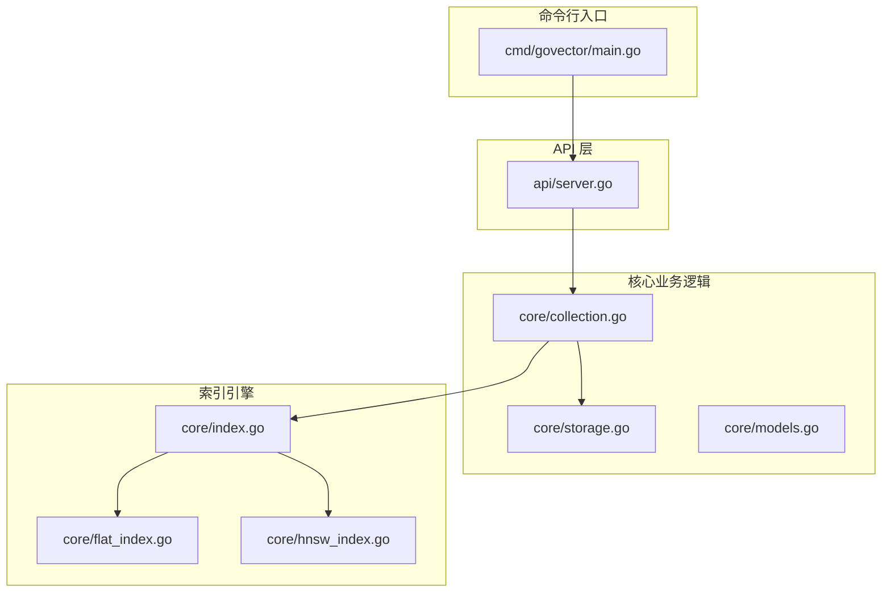
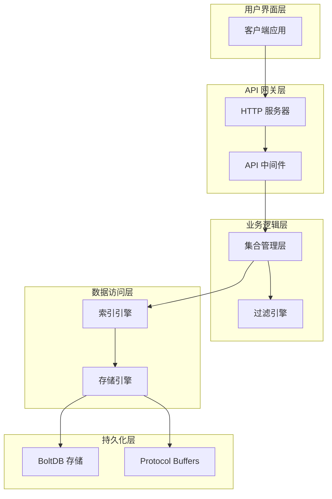
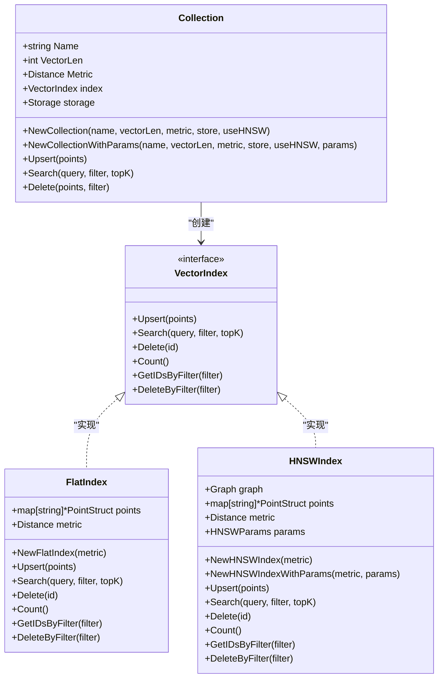
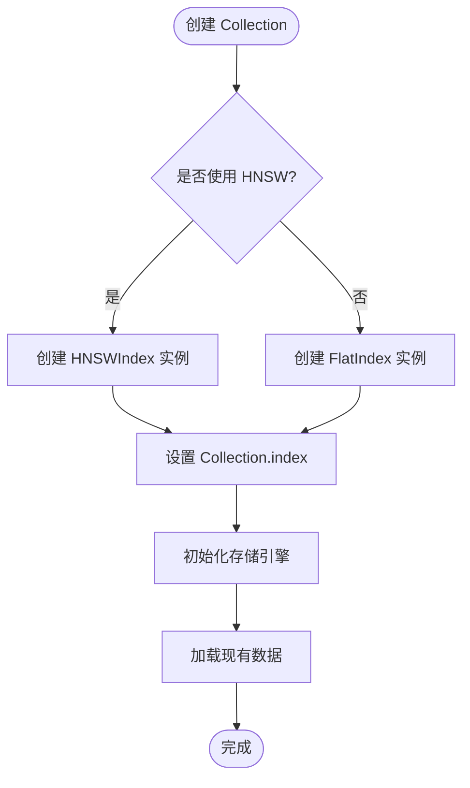
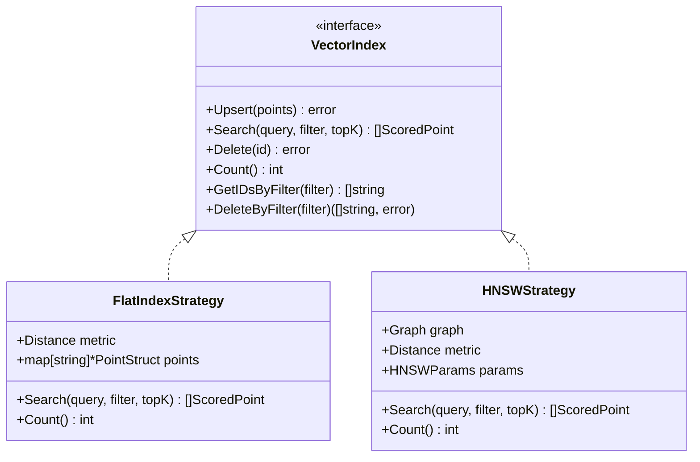
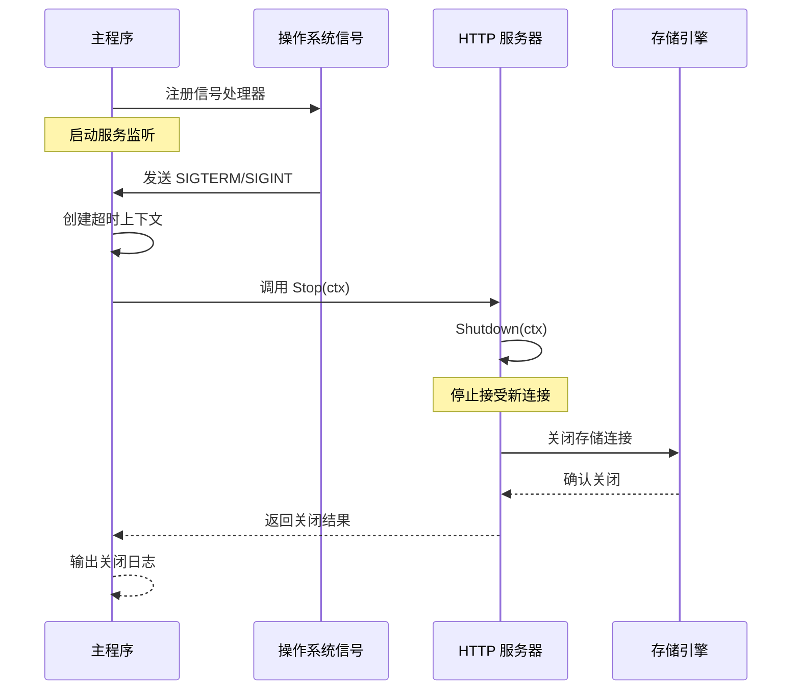
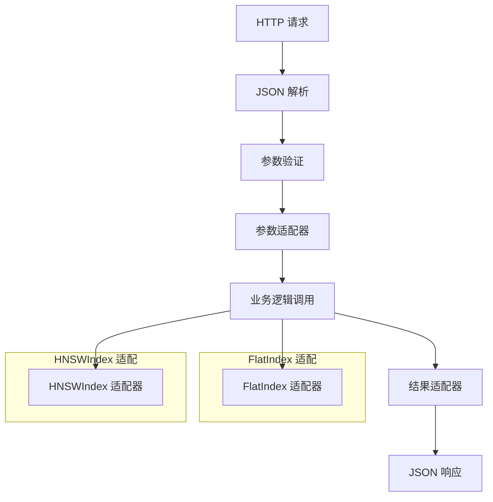
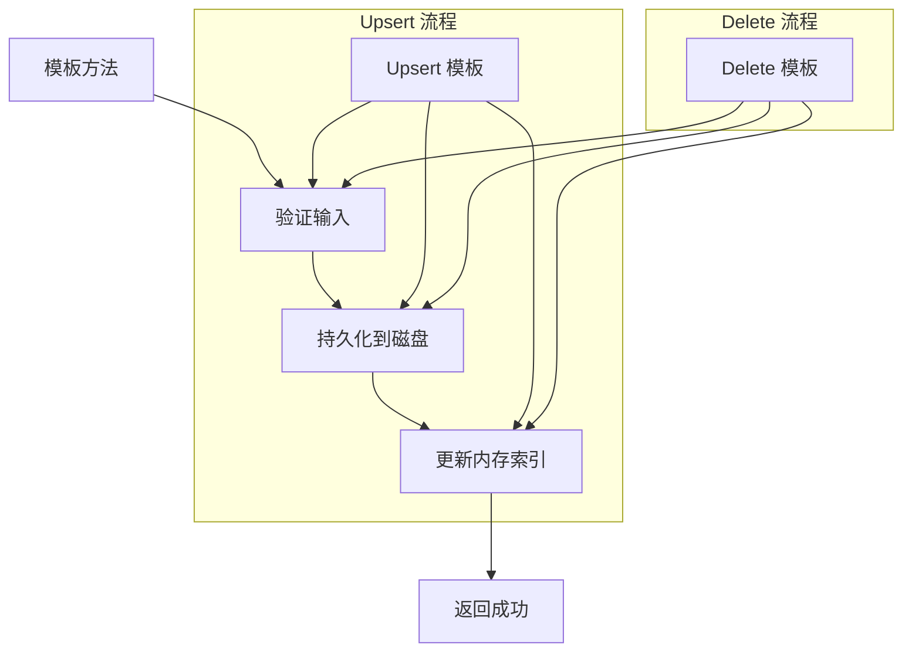
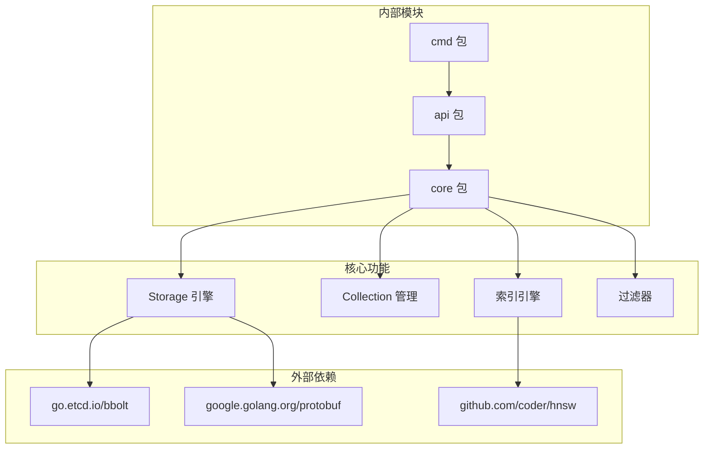

# 设计模式应用

<cite>
**本文档引用的文件**
- [cmd/govector/main.go](file://cmd/govector/main.go)
- [api/server.go](file://api/server.go)
- [core/collection.go](file://core/collection.go)
- [core/index.go](file://core/index.go)
- [core/flat_index.go](file://core/flat_index.go)
- [core/hnsw_index.go](file://core/hnsw_index.go)
- [core/storage.go](file://core/storage.go)
- [core/models.go](file://core/models.go)
- [core/mock_index_test.go](file://core/mock_index_test.go)
- [README.md](file://README.md)
</cite>

## 目录
1. [引言](#引言)
2. [项目结构](#项目结构)
3. [核心组件](#核心组件)
4. [架构概览](#架构概览)
5. [详细组件分析](#详细组件分析)
6. [依赖关系分析](#依赖关系分析)
7. [性能考虑](#性能考虑)
8. [故障排除指南](#故障排除指南)
9. [结论](#结论)

## 引言

GoVector 是一个用纯 Go 编写的轻量级嵌入式向量数据库，提供了类似于 Qdrant 的 REST API 接口。该项目展示了多种设计模式的实际应用，包括工厂模式、策略模式、观察者模式和适配器模式。这些设计模式的选择不仅提高了代码的可维护性和可扩展性，还为不同规模的应用场景提供了灵活的解决方案。

## 项目结构

GoVector 采用模块化的项目结构，清晰地分离了不同的关注点：

**图表来源**
- [cmd/govector/main.go:18-92](file://cmd/govector/main.go#L18-L92)
- [api/server.go:18-424](file://api/server.go#L18-L424)
- [core/collection.go:12-198](file://core/collection.go#L12-L198)

**章节来源**
- [cmd/govector/main.go:1-92](file://cmd/govector/main.go#L1-L92)
- [api/server.go:1-424](file://api/server.go#L1-L424)
- [core/collection.go:1-198](file://core/collection.go#L1-L198)

## 核心组件

GoVector 的核心组件围绕着向量集合（Collection）构建，每个集合代表一个逻辑上的向量组，类似于 SQL 数据库中的表。组件之间的协作通过接口抽象实现了高度的解耦。

**章节来源**
- [core/collection.go:9-21](file://core/collection.go#L9-L21)
- [core/models.go:9-25](file://core/models.go#L9-L25)

## 架构概览

GoVector 采用了分层架构设计，从底层存储到上层 API 的每一层都有明确的职责分工：

**图表来源**
- [api/server.go:54-95](file://api/server.go#L54-L95)
- [core/collection.go:93-133](file://core/collection.go#L93-L133)
- [core/storage.go:13-20](file://core/storage.go#L13-L20)

## 详细组件分析

### 工厂模式：Collection 和 Index 的创建

GoVector 在多个地方应用了工厂模式来创建复杂的对象实例，特别是 Collection 和各种索引类型。

#### Collection 工厂方法

Collection 类使用工厂方法模式来创建不同类型的索引实例：

**图表来源**
- [core/collection.go:26-91](file://core/collection.go#L26-L91)
- [core/index.go:7-28](file://core/index.go#L7-L28)
- [core/flat_index.go:19-25](file://core/flat_index.go#L19-L25)
- [core/hnsw_index.go:52-106](file://core/hnsw_index.go#L52-L106)

#### 索引工厂实现

工厂模式的核心在于根据配置动态选择合适的索引实现：

**图表来源**
- [core/collection.go:35-91](file://core/collection.go#L35-L91)

**章节来源**
- [core/collection.go:26-91](file://core/collection.go#L26-L91)
- [core/flat_index.go:19-25](file://core/flat_index.go#L19-L25)
- [core/hnsw_index.go:52-106](file://core/hnsw_index.go#L52-L106)

### 策略模式：VectorIndex 接口的多实现

VectorIndex 接口定义了统一的策略接口，使得 FlatIndex 和 HNSWIndex 可以作为不同的搜索策略被透明地使用。

#### 策略接口设计

**图表来源**
- [core/index.go:7-28](file://core/index.go#L7-L28)
- [core/flat_index.go:44-74](file://core/flat_index.go#L44-L74)
- [core/hnsw_index.go:129-176](file://core/hnsw_index.go#L129-L176)

#### 策略切换机制

策略模式允许在运行时根据需求切换不同的搜索算法：

**章节来源**
- [core/index.go:7-28](file://core/index.go#L7-L28)
- [core/flat_index.go:44-74](file://core/flat_index.go#L44-L74)
- [core/hnsw_index.go:129-176](file://core/hnsw_index.go#L129-L176)

### 观察者模式：优雅关闭和信号处理

GoVector 使用观察者模式来处理系统信号，实现优雅的关闭流程。

#### 信号处理流程

**图表来源**
- [cmd/govector/main.go:67-88](file://cmd/govector/main.go#L67-L88)
- [api/server.go:133-143](file://api/server.go#L133-L143)

#### 优雅关闭实现

观察者模式在 GoVector 中的具体实现包括：

1. **信号注册**：使用 `signal.Notify` 注册操作系统信号
2. **异步处理**：通过 goroutine 处理服务器启动
3. **超时控制**：使用 `context.WithTimeout` 控制关闭时间
4. **资源清理**：确保所有资源按正确顺序释放

**章节来源**
- [cmd/govector/main.go:67-88](file://cmd/govector/main.go#L67-L88)
- [api/server.go:133-143](file://api/server.go#L133-L143)

### 适配器模式：API 层与业务逻辑层的适配

API 层与业务逻辑层之间使用适配器模式进行解耦，HTTP 请求被转换为业务逻辑所需的参数格式。

#### API 适配器流程

**图表来源**
- [api/server.go:148-176](file://api/server.go#L148-L176)
- [api/server.go:182-218](file://api/server.go#L182-L218)
- [api/server.go:224-258](file://api/server.go#L224-L258)

#### 具体适配实现

API 层通过以下方式适配业务逻辑：

1. **请求解析**：将 HTTP 请求体解析为 Go 结构体
2. **参数转换**：将字符串参数转换为内部枚举值
3. **错误处理**：将业务逻辑错误转换为 HTTP 状态码
4. **响应封装**：将业务结果封装为标准 JSON 格式

**章节来源**
- [api/server.go:148-176](file://api/server.go#L148-L176)
- [api/server.go:182-218](file://api/server.go#L182-L218)
- [api/server.go:224-258](file://api/server.go#L224-L258)

### 模板方法模式：Collection 的操作流程

Collection 类使用模板方法模式定义了 Upsert 和 Delete 操作的标准流程，同时允许子类重写特定步骤。

#### 模板方法流程

**图表来源**
- [core/collection.go:97-133](file://core/collection.go#L97-L133)
- [core/collection.go:162-197](file://core/collection.go#L162-L197)

**章节来源**
- [core/collection.go:97-133](file://core/collection.go#L97-L133)
- [core/collection.go:162-197](file://core/collection.go#L162-L197)

## 依赖关系分析

GoVector 的依赖关系体现了清晰的分层架构和松耦合设计：

**图表来源**
- [core/storage.go:88-114](file://core/storage.go#L88-L114)
- [core/hnsw_index.go:55-106](file://core/hnsw_index.go#L55-L106)

**章节来源**
- [core/storage.go:88-114](file://core/storage.go#L88-L114)
- [core/hnsw_index.go:55-106](file://core/hnsw_index.go#L55-L106)

## 性能考虑

### 设计模式的性能影响

1. **工厂模式**：创建对象的开销很小，主要影响在运行时的内存分配
2. **策略模式**：接口调用有轻微的性能开销，但换来了解耦的优势
3. **观察者模式**：信号处理的性能影响可以忽略不计
4. **适配器模式**：JSON 序列化/反序列化的性能成本相对较高

### 性能优化建议

1. **批量操作**：利用 Collection 的批量 Upsert 功能减少存储开销
2. **索引选择**：根据数据规模选择合适的索引类型
3. **内存管理**：合理配置 HNSW 参数以平衡精度和性能
4. **并发控制**：使用读写锁优化高并发场景下的性能

## 故障排除指南

### 常见问题及解决方案

1. **索引创建失败**：检查 VectorLen 是否与存储的数据一致
2. **查询性能问题**：考虑切换到 HNSW 索引或调整 HNSW 参数
3. **存储空间不足**：启用向量量化功能减少存储空间
4. **优雅关闭失败**：检查是否有长时间运行的操作阻塞

**章节来源**
- [core/collection.go:77-80](file://core/collection.go#L77-L80)
- [core/storage.go:163-175](file://core/storage.go#L163-L175)

## 结论

GoVector 项目展示了设计模式在实际项目中的最佳实践应用。通过工厂模式、策略模式、观察者模式和适配器模式的有机结合，项目实现了：

1. **高度的可扩展性**：新的索引类型可以轻松添加
2. **良好的可维护性**：模块间的职责清晰分离
3. **优秀的性能表现**：根据场景选择最优的实现策略
4. **强大的兼容性**：支持多种使用模式和部署方式

这些设计模式的选择充分考虑了项目的实际需求，在保证功能完整性的同时，最大化地提升了代码质量和开发效率。对于类似的嵌入式向量数据库项目，GoVector 提供了一个优秀的参考范例。