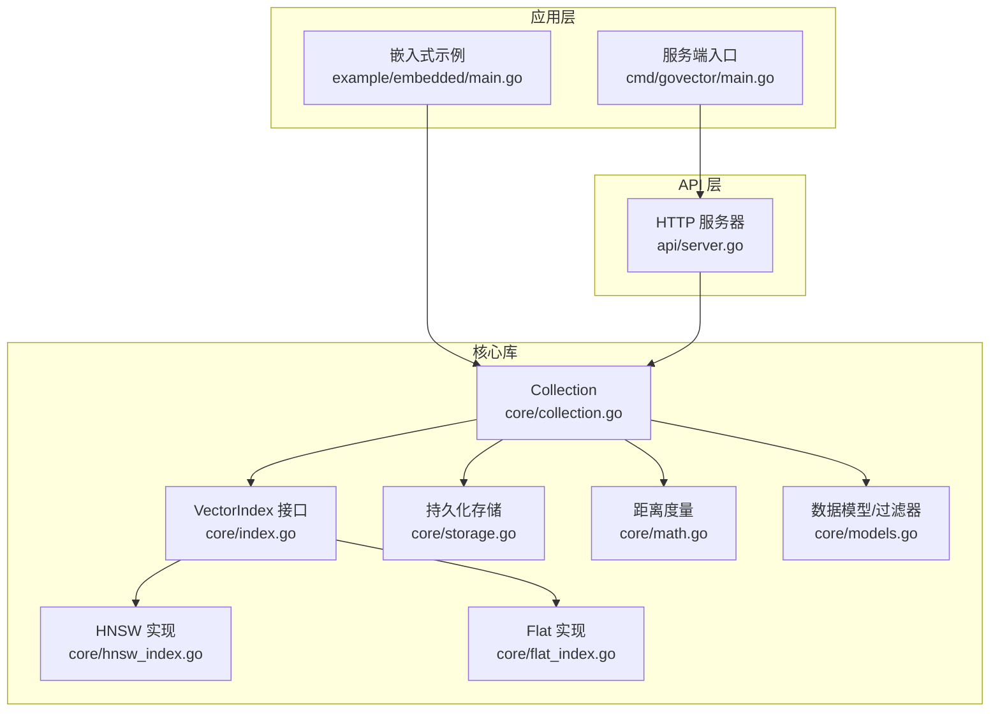
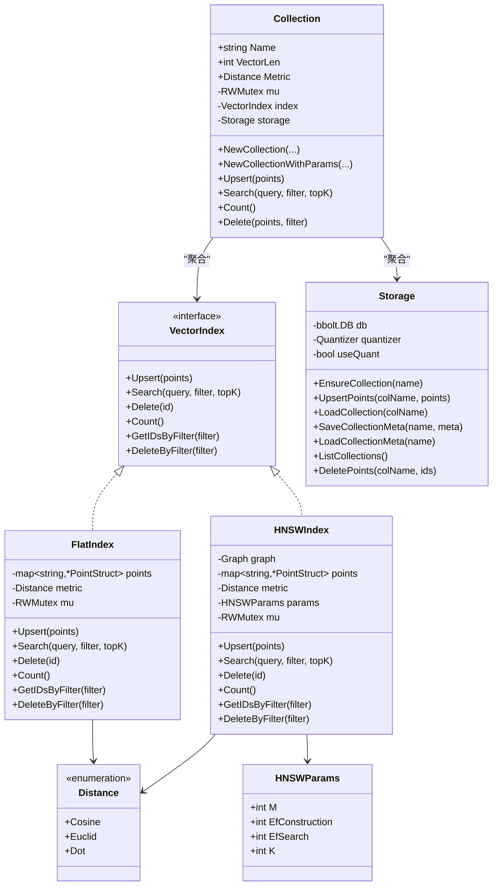
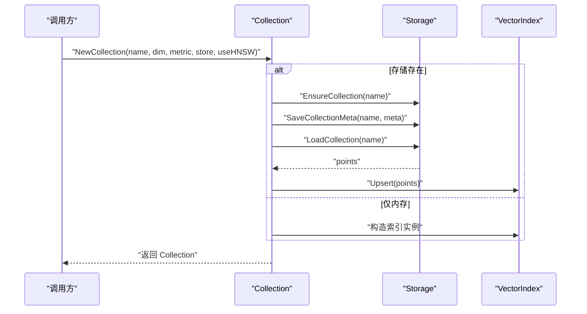
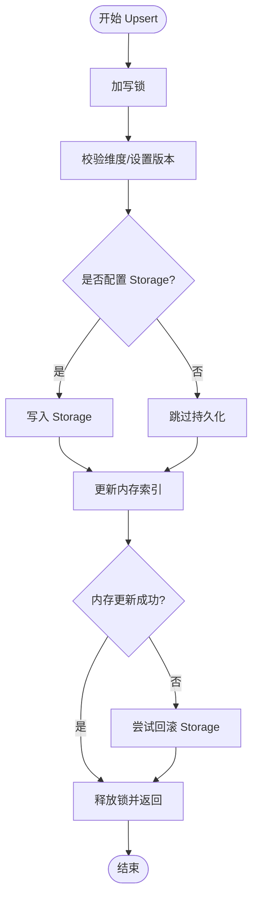
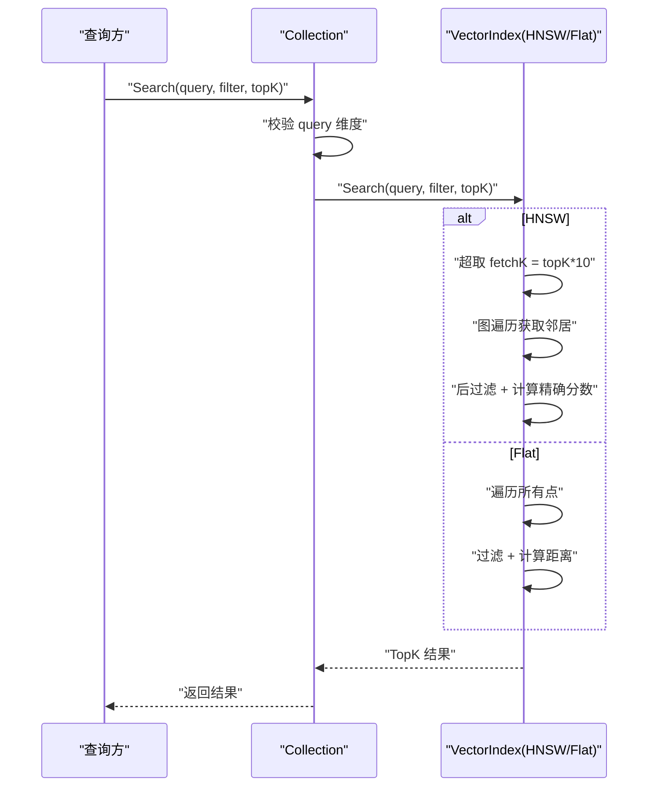
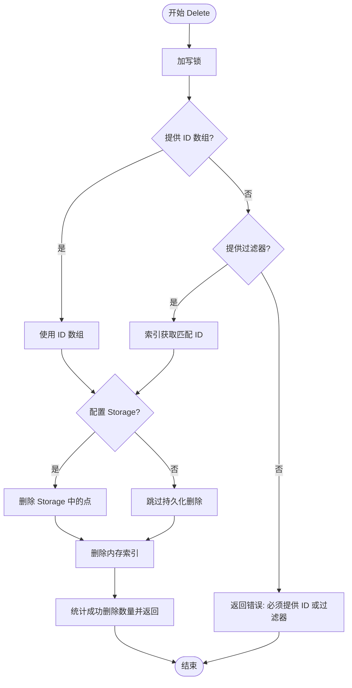
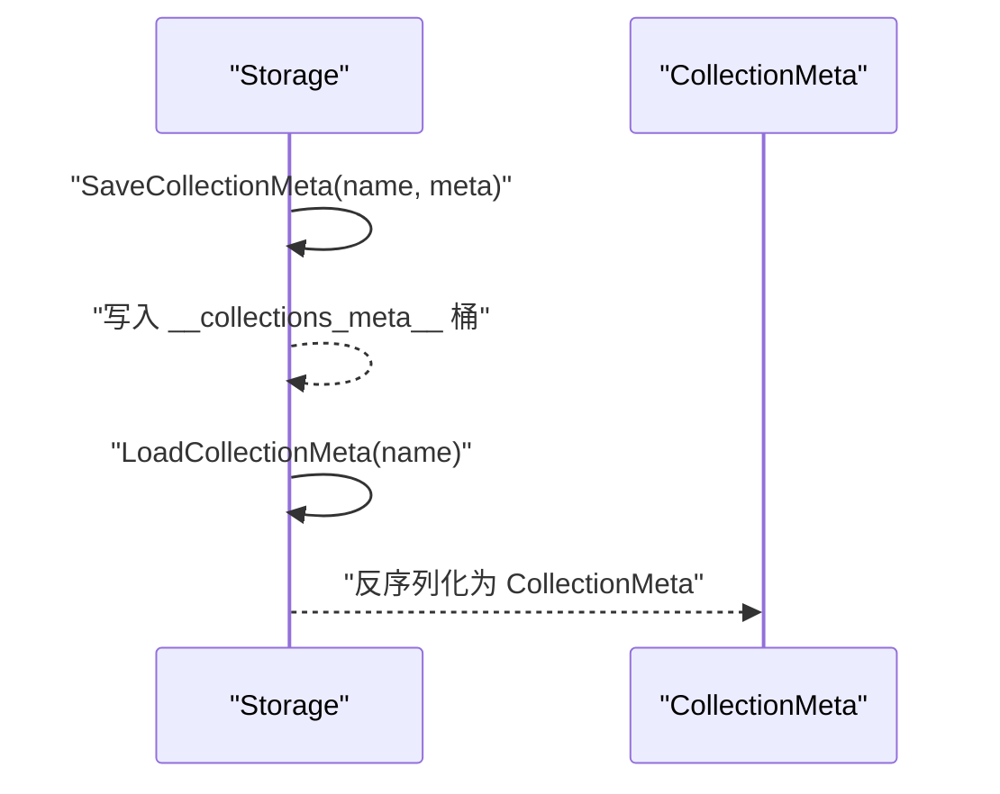
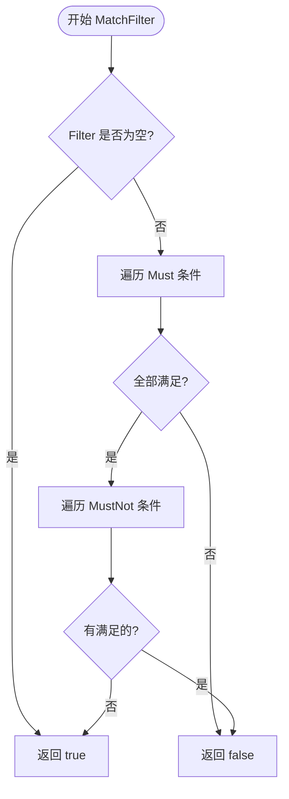
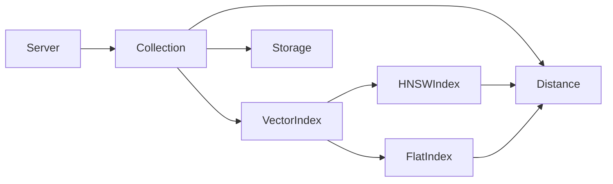

# Collection 集合管理

<cite>
**本文引用的文件列表**
- [collection.go](file://core/collection.go)
- [models.go](file://core/models.go)
- [index.go](file://core/index.go)
- [hnsw_index.go](file://core/hnsw_index.go)
- [flat_index.go](file://core/flat_index.go)
- [storage.go](file://core/storage.go)
- [math.go](file://core/math.go)
- [server.go](file://api/server.go)
- [main.go](file://cmd/govector/main.go)
- [main.go](file://example/embedded/main.go)
- [collection_test.go](file://core/collection_test.go)
- [README.md](file://README.md)
</cite>

## 目录
1. [简介](#简介)
2. [项目结构](#项目结构)
3. [核心组件](#核心组件)
4. [架构总览](#架构总览)
5. [详细组件分析](#详细组件分析)
6. [依赖关系分析](#依赖关系分析)
7. [性能与内存特征](#性能与内存特征)
8. [故障排查指南](#故障排查指南)
9. [结论](#结论)
10. [附录：使用示例与最佳实践](#附录使用示例与最佳实践)

## 简介
本文件系统性阐述 Collection 集合管理模块的设计理念与实现细节，覆盖向量集合的创建、配置与生命周期管理；Upsert 插入更新、Search 搜索查询、Delete 删除操作的实现机制与线程安全保证；集合元数据管理、HNSW/HNSW 参数配置、向量维度验证等关键特性。文档同时提供面向初学者的概念解释与面向专家的实现细节与扩展指南，并通过图示与路径引用帮助读者快速定位源码位置。

## 项目结构
本项目采用“核心库 + 可选服务端 + 示例”的分层组织方式：
- 核心库（core）：包含 Collection、索引接口与实现（HNSW/Flat）、存储（BoltDB+Protobuf）、距离度量、过滤器模型等。
- API 层（api）：提供 Qdrant 兼容的 HTTP 接口，负责路由、请求解析与调用核心 Collection。
- 命令行服务（cmd/govector serve）：以微服务形式启动本地 API 服务。
- 示例（example/embedded）：嵌入式库使用示例，直接调用 core 包进行集合管理与检索。
- 测试（core/collection_test.go）：覆盖 Collection 的基本行为、错误处理与参数加载。

图表来源
- [collection.go:12-20](file://core/collection.go#L12-L20)
- [index.go:7-28](file://core/index.go#L7-L28)
- [hnsw_index.go:44-50](file://core/hnsw_index.go#L44-L50)
- [flat_index.go:13-17](file://core/flat_index.go#L13-L17)
- [storage.go:15-20](file://core/storage.go#L15-L20)
- [math.go:5-22](file://core/math.go#L5-L22)
- [models.go:5-25](file://core/models.go#L5-L25)
- [server.go:18-24](file://api/server.go#L18-L24)
- [main.go:18-55](file://cmd/govector/main.go#L18-L55)
- [main.go:10-24](file://example/embedded/main.go#L10-L24)

章节来源
- [README.md:16-42](file://README.md#L16-L42)
- [collection.go:1-198](file://core/collection.go#L1-L198)
- [index.go:1-29](file://core/index.go#L1-L29)
- [hnsw_index.go:1-229](file://core/hnsw_index.go#L1-L229)
- [flat_index.go:1-124](file://core/flat_index.go#L1-L124)
- [storage.go:1-360](file://core/storage.go#L1-L360)
- [math.go:1-79](file://core/math.go#L1-L79)
- [models.go:1-280](file://core/models.go#L1-L280)
- [server.go:1-200](file://api/server.go#L1-L200)
- [main.go:1-92](file://cmd/govector/main.go#L1-L92)
- [main.go:1-63](file://example/embedded/main.go#L1-L63)

## 核心组件
- Collection：逻辑上的向量集合，封装了名称、维度、距离度量、索引引擎与持久化存储；提供 Upsert/Search/Delete 三类核心操作，并在内部维护读写锁保障并发安全。
- VectorIndex 接口：抽象出统一的索引能力（Upsert/Search/Delete/Count/按过滤器取ID/按过滤器删除），支持透明切换 Flat 与 HNSW。
- HNSWIndex：基于 coder/hnsw 图的近似最近邻索引，支持自定义 M/EfConstruction/EfSearch/K 等参数，适合大规模高维向量检索。
- FlatIndex：内存中的暴力检索实现，适合小中规模数据或需要精确结果的场景。
- Storage：基于 bbolt+BoltDB 的本地持久化，使用 Protobuf 序列化点数据，支持可选的向量量化压缩。
- 距离度量与过滤器：支持 Cosine/Euclid/Dot 三种度量；Filter/Condition 支持 Must/MustNot 条件组合，涵盖 exact/range/prefix/contains/regex 等匹配类型。

章节来源
- [collection.go:12-20](file://core/collection.go#L12-L20)
- [index.go:7-28](file://core/index.go#L7-L28)
- [hnsw_index.go:44-50](file://core/hnsw_index.go#L44-L50)
- [flat_index.go:13-17](file://core/flat_index.go#L13-L17)
- [storage.go:15-20](file://core/storage.go#L15-L20)
- [math.go:5-22](file://core/math.go#L5-L22)
- [models.go:27-79](file://core/models.go#L27-L79)

## 架构总览
Collection 作为门面，协调存储与索引两部分。初始化时根据 useHNSW 决定使用 HNSW 或 Flat；当提供 Storage 时，会自动保存/加载集合元数据与点集，确保重启后一致性。

图表来源
- [collection.go:12-20](file://core/collection.go#L12-L20)
- [index.go:7-28](file://core/index.go#L7-L28)
- [hnsw_index.go:44-50](file://core/hnsw_index.go#L44-L50)
- [flat_index.go:13-17](file://core/flat_index.go#L13-L17)
- [storage.go:15-20](file://core/storage.go#L15-L20)
- [math.go:9-22](file://core/math.go#L9-L22)
- [models.go:71-79](file://core/models.go#L71-L79)

## 详细组件分析

### Collection 设计与生命周期
- 角色定位：Collection 是逻辑上的“表”，承载固定维度与距离度量，内部持有 VectorIndex 与 Storage，负责对外暴露 Upsert/Search/Delete。
- 初始化流程：
  - NewCollection/NewCollectionWithParams：根据 useHNSW 选择 HNSWIndex 或 FlatIndex；若提供 Storage，则先 EnsureCollection，再 SaveCollectionMeta，最后 LoadCollection 并批量 Upsert 到内存索引。
  - 维度校验：加载时对每个点的向量长度进行校验，不一致则报错，避免脏数据进入索引。
- 生命周期：
  - 创建：设置元数据并持久化。
  - 运行：并发读写通过 RWMutex 保护。
  - 关闭：由上层调用者负责关闭 Storage，确保数据落盘。

图表来源
- [collection.go:35-91](file://core/collection.go#L35-L91)
- [storage.go:133-142](file://core/storage.go#L133-L142)
- [storage.go:262-280](file://core/storage.go#L262-L280)
- [storage.go:193-235](file://core/storage.go#L193-L235)

章节来源
- [collection.go:22-91](file://core/collection.go#L22-L91)
- [storage.go:133-142](file://core/storage.go#L133-L142)
- [storage.go:262-280](file://core/storage.go#L262-L280)
- [storage.go:193-235](file://core/storage.go#L193-L235)

### Upsert 插入/更新
- 并发与一致性：
  - 使用写锁保护；先校验每个点的向量维度与版本号，再持久化到 Storage（如配置），最后更新内存索引。
  - 若内存索引更新失败，尝试回滚 Storage 中已写入的点，尽力保持一致性。
- 版本号策略：以纳秒级时间戳生成版本号，便于后续一致性控制与变更追踪。

图表来源
- [collection.go:97-133](file://core/collection.go#L97-L133)

章节来源
- [collection.go:97-133](file://core/collection.go#L97-L133)

### Search 搜索查询
- 查询前校验：查询向量维度必须与集合维度一致。
- 并发访问：读锁保护，直接委托给 VectorIndex.Search。
- 过滤策略（HNSW 实现）：
  - 若存在过滤条件，采用“超取 + 后过滤”策略：先按 topK*10 获取候选，再从候选集中应用过滤与评分，最终取前 topK。
  - 这种策略在 MVP 阶段简化实现，未来可考虑将过滤下推至图遍历以提升性能。
- Flat 实现：对所有点计算距离，应用过滤后排序，返回前 topK。

图表来源
- [collection.go:138-147](file://core/collection.go#L138-L147)
- [hnsw_index.go:129-176](file://core/hnsw_index.go#L129-L176)
- [flat_index.go:44-74](file://core/flat_index.go#L44-L74)

章节来源
- [collection.go:138-147](file://core/collection.go#L138-L147)
- [hnsw_index.go:129-176](file://core/hnsw_index.go#L129-L176)
- [flat_index.go:44-74](file://core/flat_index.go#L44-L74)

### Delete 删除
- 删除策略：
  - 若传入具体 ID 数组：直接删除对应 ID。
  - 若传入过滤器：先通过索引获取匹配 ID，再逐个删除。
  - 两种路径均优先删除 Storage（如配置），再删除内存索引。
- 错误处理：未提供 ID 或过滤器时返回错误；空 ID 列表直接返回 0 删除数。

图表来源
- [collection.go:162-197](file://core/collection.go#L162-L197)

章节来源
- [collection.go:162-197](file://core/collection.go#L162-L197)

### 元数据管理与 HNSW 参数
- 元数据结构：CollectionMeta 包含集合名、向量维度、距离度量、是否使用 HNSW 以及 HNSWParams。
- 元数据持久化：通过 Storage 的特殊桶保存/加载集合元数据，服务启动时自动发现并重建集合。
- HNSW 参数：HNSWParams 提供 M、EfConstruction、EfSearch、K 等参数，默认值来自 DefaultHNSWParams；可在 NewCollectionWithParams 中传入自定义参数。

图表来源
- [storage.go:262-307](file://core/storage.go#L262-L307)
- [models.go:71-79](file://core/models.go#L71-L79)

章节来源
- [storage.go:262-307](file://core/storage.go#L262-L307)
- [models.go:71-79](file://core/models.go#L71-L79)
- [hnsw_index.go:31-39](file://core/hnsw_index.go#L31-L39)

### 过滤器与 Payload 匹配
- Filter/Condition 支持 Must/MustNot 条件组合，ConditionType 包括 exact/range/prefix/contains/regex。
- MatchFilter 对 Must 全部满足且 MustNot 全不满足时返回 true。
- 具体匹配函数：
  - matchRange：支持 int/float64 的 GT/GTE/LT/LTE。
  - matchPrefix：字符串前缀匹配。
  - matchContains：数组/字符串包含匹配。
  - matchRegex：正则表达式匹配。

图表来源
- [models.go:86-106](file://core/models.go#L86-L106)
- [models.go:108-129](file://core/models.go#L108-L129)
- [models.go:131-195](file://core/models.go#L131-L195)
- [models.go:197-214](file://core/models.go#L197-L214)
- [models.go:216-248](file://core/models.go#L216-L248)
- [models.go:260-279](file://core/models.go#L260-L279)

章节来源
- [models.go:27-79](file://core/models.go#L27-L79)
- [models.go:86-279](file://core/models.go#L86-L279)

## 依赖关系分析
- Collection 依赖 VectorIndex 接口，从而与 HNSWIndex/FlatIndex 解耦。
- Storage 与 Collection 通过集合名关联，Collection 在初始化时读取/写入 CollectionMeta。
- Distance 与 VectorIndex/HNSWIndex/FlatIndex 共同决定相似度计算方式。
- API 层通过 Server 将 HTTP 请求映射到 Collection 的 Upsert/Search/Delete。

图表来源
- [collection.go:12-20](file://core/collection.go#L12-L20)
- [index.go:7-28](file://core/index.go#L7-L28)
- [hnsw_index.go:44-50](file://core/hnsw_index.go#L44-L50)
- [flat_index.go:13-17](file://core/flat_index.go#L13-L17)
- [storage.go:15-20](file://core/storage.go#L15-L20)
- [math.go:5-22](file://core/math.go#L5-L22)
- [server.go:18-24](file://api/server.go#L18-L24)

章节来源
- [collection.go:12-20](file://core/collection.go#L12-L20)
- [index.go:7-28](file://core/index.go#L7-L28)
- [hnsw_index.go:44-50](file://core/hnsw_index.go#L44-L50)
- [flat_index.go:13-17](file://core/flat_index.go#L13-L17)
- [storage.go:15-20](file://core/storage.go#L15-L20)
- [math.go:5-22](file://core/math.go#L5-L22)
- [server.go:18-24](file://api/server.go#L18-L24)

## 性能与内存特征
- 索引复杂度：
  - Flat：O(n) 暴力检索，适合小规模或需要精确结果的场景。
  - HNSW：图遍历近似检索，查询复杂度近似 O(log N)，适合大规模高维向量。
- 性能基准（参考 README）：
  - 100K 规模：Flat 平均延迟 ~54ms，HNSW 平均延迟 ~0.08ms，吞吐可达 ~11,812 QPS。
  - 1M 规模：HNSW 仍维持亚毫秒级延迟，吞吐 ~8,709 QPS。
- 内存使用：
  - HNSWIndex 维护图结构与本地点映射，内存占用随点数增长；FlatIndex 仅维护点映射。
  - Storage 支持可选向量量化（SQ8），显著降低磁盘占用与加载成本。
- 线程安全：
  - Collection 与各索引实现均使用 RWMutex 保护读写，避免竞态；Upsert/Delete 采用写锁，Search 使用读锁。

章节来源
- [README.md:60-71](file://README.md#L60-L71)
- [hnsw_index.go:44-50](file://core/hnsw_index.go#L44-L50)
- [flat_index.go:13-17](file://core/flat_index.go#L13-L17)
- [storage.go:95-114](file://core/storage.go#L95-L114)

## 故障排查指南
- 维度不匹配：
  - Upsert/Search/Delete 均会对向量维度进行校验，不一致会报错。请确认集合创建时的维度与实际向量一致。
- 存储加载异常：
  - 若历史数据中存在维度不一致的点，重新创建集合会失败。需清理或修复存储中的点后再创建。
- 内存索引更新失败：
  - Upsert 失败时会尝试回滚 Storage 中已写入的点，若回滚失败不影响一致性但可能残留部分数据。
- 过滤器无效：
  - 确认 Filter 的 Must/MustNot 条件键名与 Payload 一致；范围/正则等条件需满足类型要求。
- HNSW 参数不当：
  - EfConstruction/EfSearch 过小可能导致召回下降；M 过大增加内存与构建时间。建议结合数据规模与查询需求调整。

章节来源
- [collection.go:76-81](file://core/collection.go#L76-L81)
- [collection.go:104-109](file://core/collection.go#L104-L109)
- [collection.go:138-141](file://core/collection.go#L138-L141)
- [collection.go:162-175](file://core/collection.go#L162-L175)
- [collection_test.go:166-190](file://core/collection_test.go#L166-L190)
- [collection_test.go:230-253](file://core/collection_test.go#L230-L253)

## 结论
Collection 集合管理模块以清晰的职责划分与强一致的存储优先策略，实现了从创建、运行到持久化的完整闭环。通过 VectorIndex 抽象，用户可在 Flat 与 HNSW 之间无缝切换；借助完善的过滤器与元数据管理，系统既满足入门易用也兼顾专业扩展。结合 README 的性能报告与本节的分析，HNSW 在大规模场景下具备显著优势，而 Flat 则适用于小规模或精确检索需求。

## 附录：使用示例与最佳实践
- 嵌入式库使用（零网络开销）
  - 初始化 Storage，创建 Collection，直接调用 Upsert/Search/Delete。
  - 示例路径：[embedded 示例:10-62](file://example/embedded/main.go#L10-L62)
- 服务端模式（Qdrant 兼容 API）
  - 启动服务端，注册集合，通过 HTTP 接口进行 Upsert/Search/Delete。
  - 示例路径：[服务端入口:18-91](file://cmd/govector/main.go#L18-L91)
- API 层对接
  - Server 自动从 Storage 加载集合元数据并重建 Collection；提供 /collections、/points 等端点。
  - 示例路径：[API 服务器:54-95](file://api/server.go#L54-L95)
- 最佳实践
  - 选择索引：大规模高维向量优先 HNSW；小规模或精确检索可用 Flat。
  - 参数调优：根据数据规模与查询延迟目标调整 HNSWParams。
  - 数据治理：严格校验向量维度与 Payload 键名；合理使用过滤器减少检索空间。
  - 持久化：定期备份 Storage 文件；启用量化以节省磁盘空间。

章节来源
- [main.go:10-62](file://example/embedded/main.go#L10-L62)
- [main.go:18-91](file://cmd/govector/main.go#L18-L91)
- [server.go:54-95](file://api/server.go#L54-L95)
- [README.md:30-42](file://README.md#L30-L42)