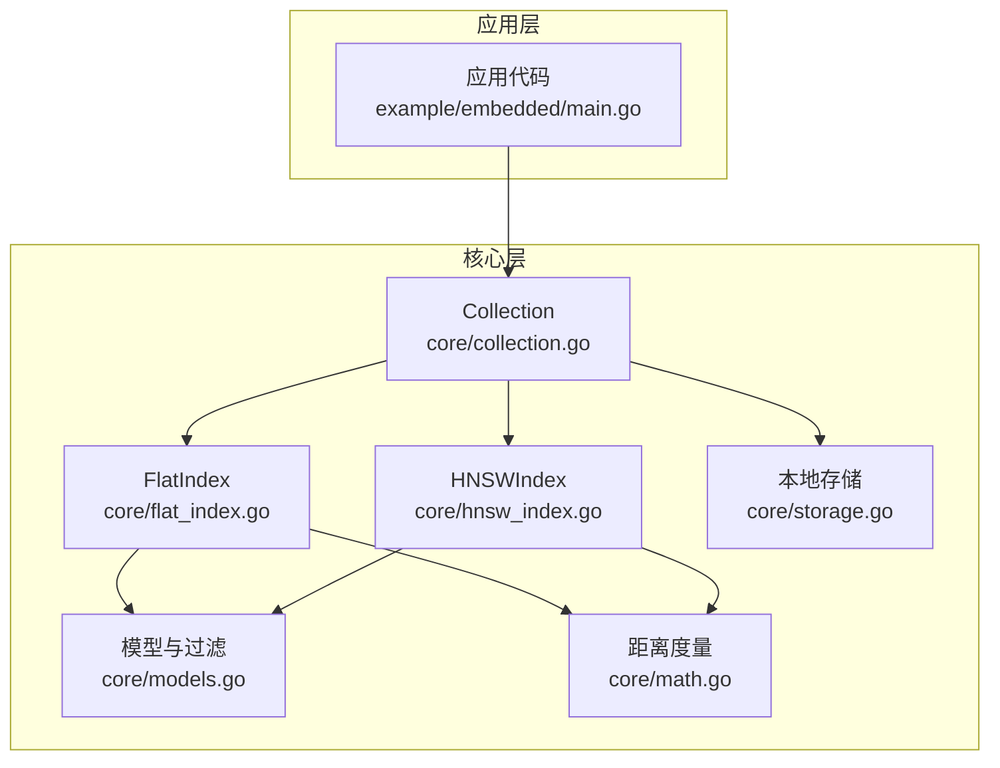
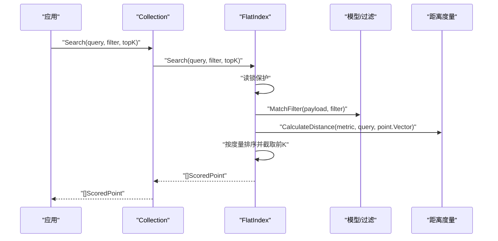
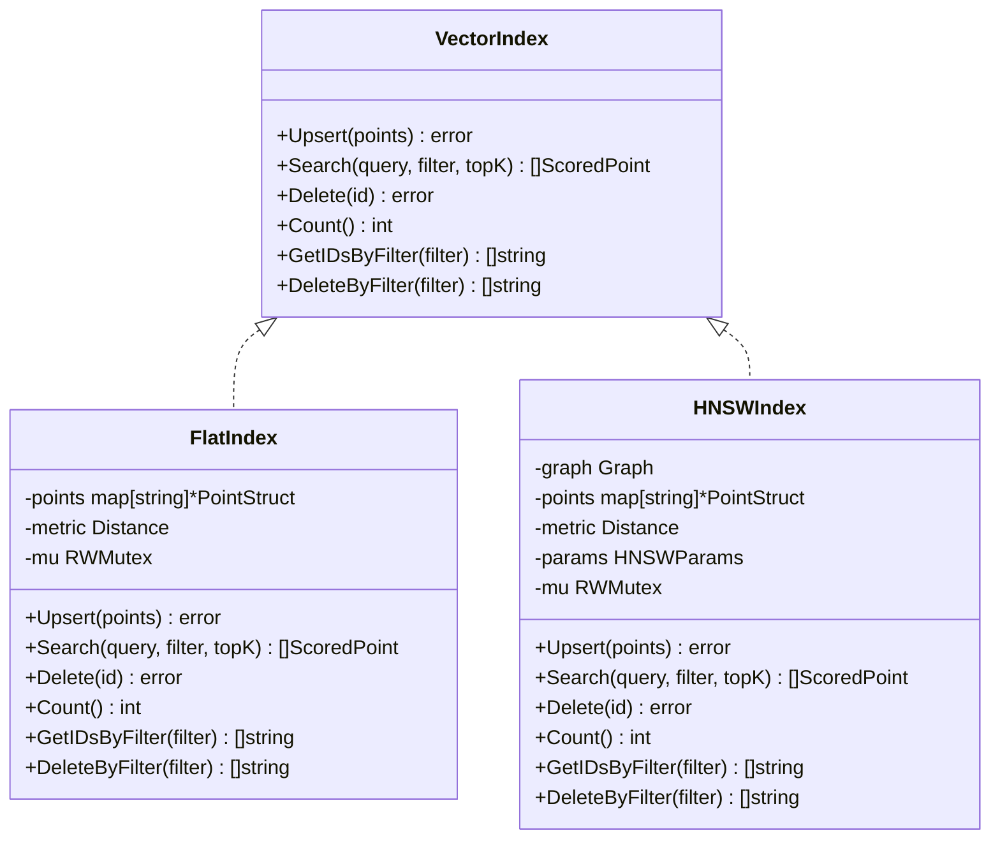
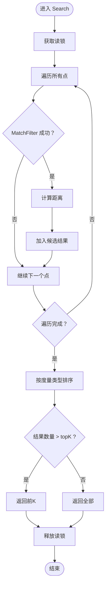
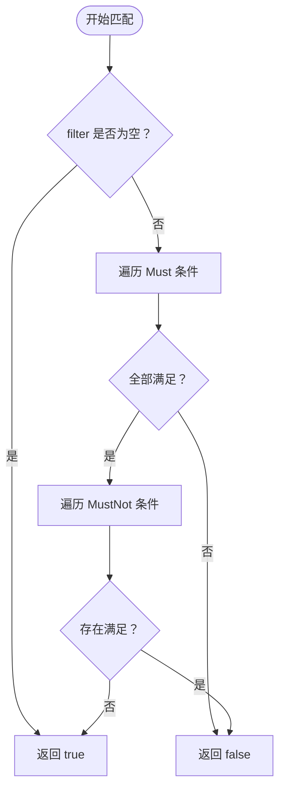
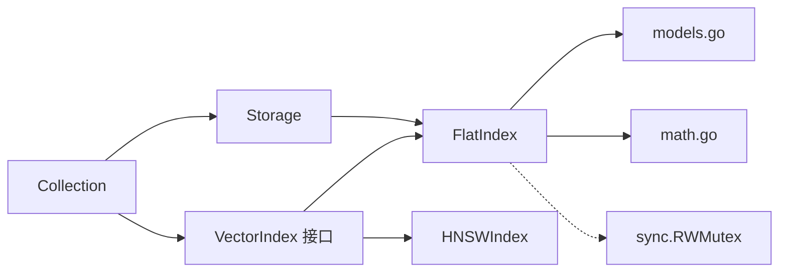

# FlatIndex 扁平索引

<cite>
**本文引用的文件**
- [core/flat_index.go](file://core/flat_index.go)
- [core/flat_index_test.go](file://core/flat_index_test.go)
- [core/index.go](file://core/index.go)
- [core/models.go](file://core/models.go)
- [core/math.go](file://core/math.go)
- [core/hnsw_index.go](file://core/hnsw_index.go)
- [core/collection.go](file://core/collection.go)
- [core/storage.go](file://core/storage.go)
- [cmd/bench/main.go](file://cmd/bench/main.go)
- [README.md](file://README.md)
- [example/embedded/main.go](file://example/embedded/main.go)
</cite>

## 目录
1. [简介](#简介)
2. [项目结构](#项目结构)
3. [核心组件](#核心组件)
4. [架构总览](#架构总览)
5. [详细组件分析](#详细组件分析)
6. [依赖分析](#依赖分析)
7. [性能考虑](#性能考虑)
8. [故障排查指南](#故障排查指南)
9. [结论](#结论)
10. [附录：使用示例与最佳实践](#附录使用示例与最佳实践)

## 简介
本节介绍 FlatIndex 扁平索引的基本概念与适用场景。FlatIndex 是一种基于“全量扫描”的向量检索策略：它将所有向量存储在内存中，查询时对每个候选向量计算距离并根据过滤条件筛选，最终返回前 K 个最相似的结果。该策略具有实现简单、无需训练/构建开销、结果精确等优点；但其时间复杂度为 O(N)，在大规模数据集上会显著影响查询延迟与吞吐。

FlatIndex 适合以下场景：
- 小到中等规模的数据集（例如数万级以内）
- 对查询精度有严格要求且可接受线性扫描成本
- 需要快速原型验证或低运维成本部署
- 过滤条件较为简单或过滤比例较高导致全量扫描仍可接受

相对地，当数据规模达到百万级及以上时，FlatIndex 的性能劣势会变得明显；此时可考虑 HNSW 近似索引以换取更低的查询延迟与更高的吞吐。

## 项目结构
FlatIndex 所在的核心模块位于 core 包中，配合 Collection 抽象统一对外提供向量插入、检索与删除能力，并通过 Storage 提供持久化支持。下图展示了 FlatIndex 在整体系统中的位置与交互关系。

图表来源
- [core/collection.go:22-91](file://core/collection.go#L22-L91)
- [core/flat_index.go:9-124](file://core/flat_index.go#L9-L124)
- [core/hnsw_index.go:41-106](file://core/hnsw_index.go#L41-L106)
- [core/models.go:5-280](file://core/models.go#L5-L280)
- [core/math.go:5-79](file://core/math.go#L5-L79)
- [core/storage.go:13-360](file://core/storage.go#L13-L360)
- [example/embedded/main.go:10-62](file://example/embedded/main.go#L10-L62)

章节来源
- [core/collection.go:9-91](file://core/collection.go#L9-L91)
- [core/flat_index.go:9-124](file://core/flat_index.go#L9-L124)
- [core/hnsw_index.go:41-106](file://core/hnsw_index.go#L41-L106)
- [core/models.go:5-280](file://core/models.go#L5-L280)
- [core/math.go:5-79](file://core/math.go#L5-L79)
- [core/storage.go:13-360](file://core/storage.go#L13-L360)
- [example/embedded/main.go:10-62](file://example/embedded/main.go#L10-L62)

## 核心组件
- VectorIndex 接口：定义了统一的索引能力抽象，包括 Upsert、Search、Delete、Count、GetIDsByFilter、DeleteByFilter 等方法，使 FlatIndex 与 HNSWIndex 可以无缝替换。
- FlatIndex 结构体：实现 VectorIndex 接口，内部以 map 存储点，提供全量扫描检索、过滤与删除能力。
- Collection 抽象：封装 Collection 名称、维度、度量类型、索引引擎与存储引擎，负责一致性写入与透明索引切换。
- 模型与过滤：PointStruct、ScoredPoint、Filter、Condition 等结构体及匹配逻辑，支持多种过滤条件（精确、范围、前缀、包含、正则）。
- 距离度量：cosine、euclidean、dot 三种度量，用于排序方向与相似度计算。
- 存储：BoltDB + Protobuf，提供持久化与元数据管理。

章节来源
- [core/index.go:5-28](file://core/index.go#L5-L28)
- [core/flat_index.go:13-124](file://core/flat_index.go#L13-L124)
- [core/collection.go:12-91](file://core/collection.go#L12-L91)
- [core/models.go:9-280](file://core/models.go#L9-L280)
- [core/math.go:5-79](file://core/math.go#L5-L79)
- [core/storage.go:13-360](file://core/storage.go#L13-L360)

## 架构总览
下图展示了 FlatIndex 在检索路径中的调用流程：应用通过 Collection.Search 发起查询，FlatIndex 在读锁保护下遍历内存中的点，按过滤条件筛选后计算距离，再根据度量类型进行排序，最后截取前 K 个结果返回。

图表来源
- [core/collection.go:135-147](file://core/collection.go#L135-L147)
- [core/flat_index.go:40-74](file://core/flat_index.go#L40-L74)
- [core/models.go:81-106](file://core/models.go#L81-L106)
- [core/math.go:24-38](file://core/math.go#L24-L38)

## 详细组件分析

### FlatIndex 类设计与职责
- 数据结构：以 map[string]*PointStruct 存储点，键为 ID，值为点对象，便于按 ID 快速删除与过滤。
- 并发控制：使用 RWMutex 保证读多写少场景下的并发安全。
- 关键方法：
  - Upsert：批量插入或更新点，覆盖同 ID 的旧点。
  - Search：全量扫描，按过滤条件筛选，计算距离并排序，返回前 K。
  - Delete/DeleteByFilter：按 ID 或过滤条件删除点。
  - GetIDsByFilter：仅返回匹配的点 ID 列表。
  - Count：返回当前点数量。

图表来源
- [core/index.go:7-28](file://core/index.go#L7-L28)
- [core/flat_index.go:13-124](file://core/flat_index.go#L13-L124)
- [core/hnsw_index.go:44-229](file://core/hnsw_index.go#L44-L229)

章节来源
- [core/flat_index.go:13-124](file://core/flat_index.go#L13-L124)
- [core/index.go:7-28](file://core/index.go#L7-L28)

### 搜索流程与排序规则
- 过滤阶段：先对每个点执行 MatchFilter，不符合条件的直接跳过，减少后续距离计算。
- 距离计算：根据度量类型调用 CalculateDistance 计算相似度/距离。
- 排序规则：
  - Cosine/Dot：降序（越大越相似）
  - Euclidean：升序（越小越相似）
- 截断：若结果总数不足 topK，则返回全部结果。

图表来源
- [core/flat_index.go:44-74](file://core/flat_index.go#L44-L74)
- [core/models.go:81-106](file://core/models.go#L81-L106)
- [core/math.go:24-38](file://core/math.go#L24-L38)

章节来源
- [core/flat_index.go:44-74](file://core/flat_index.go#L44-L74)
- [core/models.go:81-106](file://core/models.go#L81-L106)
- [core/math.go:24-38](file://core/math.go#L24-L38)

### 过滤器匹配逻辑
- 支持 Must/MustNot 条件，Must 全部满足且 MustNot 全不满足才视为匹配。
- ConditionType 支持：exact、range、prefix、contains、regex。
- 各类型匹配函数分别处理字符串、数值、数组与正则表达式场景。

图表来源
- [core/models.go:81-106](file://core/models.go#L81-L106)
- [core/models.go:108-129](file://core/models.go#L108-L129)
- [core/models.go:131-195](file://core/models.go#L131-L195)
- [core/models.go:197-214](file://core/models.go#L197-L214)
- [core/models.go:216-248](file://core/models.go#L216-L248)
- [core/models.go:260-279](file://core/models.go#L260-L279)

章节来源
- [core/models.go:81-106](file://core/models.go#L81-L106)
- [core/models.go:108-129](file://core/models.go#L108-L129)
- [core/models.go:131-195](file://core/models.go#L131-L195)
- [core/models.go:197-214](file://core/models.go#L197-L214)
- [core/models.go:216-248](file://core/models.go#L216-L248)
- [core/models.go:260-279](file://core/models.go#L260-L279)

### 删除与计数
- Delete：按 ID 删除，不存在时报错。
- DeleteByFilter：按过滤条件批量删除并返回被删除 ID 列表。
- Count：返回当前内存中点的数量。

章节来源
- [core/flat_index.go:76-94](file://core/flat_index.go#L76-L94)
- [core/flat_index.go:110-123](file://core/flat_index.go#L110-L123)

### 与 HNSW 的对比与适用场景
- FlatIndex：O(N) 查询，无构建开销，适合小规模数据集与需要精确检索的场景。
- HNSWIndex：近似检索，O(log N) 查询，适合大规模数据集与高吞吐需求。
- 两者通过 VectorIndex 接口统一，可在 Collection 中透明切换。

章节来源
- [core/hnsw_index.go:41-106](file://core/hnsw_index.go#L41-L106)
- [core/collection.go:22-41](file://core/collection.go#L22-L41)

## 依赖分析
- FlatIndex 依赖：
  - models：PointStruct、Filter、MatchFilter、ScoredPoint
  - math：Distance 类型与 CalculateDistance
  - sync：RWMutex 实现并发安全
- 与 Collection 的耦合：
  - Collection 通过 VectorIndex 抽象持有 FlatIndex/HNSWIndex，实现统一接口。
- 与 Storage 的关系：
  - Collection 在初始化时加载持久化数据到内存索引；Upsert/删除操作先落盘再更新内存索引，保证一致性。

图表来源
- [core/flat_index.go:3-17](file://core/flat_index.go#L3-L17)
- [core/models.go:5-280](file://core/models.go#L5-L280)
- [core/math.go:5-79](file://core/math.go#L5-L79)
- [core/collection.go:12-91](file://core/collection.go#L12-L91)
- [core/storage.go:13-360](file://core/storage.go#L13-L360)

章节来源
- [core/flat_index.go:3-17](file://core/flat_index.go#L3-L17)
- [core/models.go:5-280](file://core/models.go#L5-L280)
- [core/math.go:5-79](file://core/math.go#L5-L79)
- [core/collection.go:12-91](file://core/collection.go#L12-L91)
- [core/storage.go:13-360](file://core/storage.go#L13-L360)

## 性能考虑
- 时间复杂度
  - FlatIndex：每次查询 O(N)；N 为内存中点数量。
  - HNSWIndex：每次查询 O(log N)（近似），构建与搜索均需额外开销。
- 内存占用
  - FlatIndex：每条向量完整保存在内存中，内存占用与 N 成正比。
  - HNSWIndex：除向量外还需维护图结构，内存占用通常更高。
- 排序与截断
  - FlatIndex 对全部候选结果进行排序后再截断，topK 越大，排序成本越高。
- 过滤影响
  - 过滤可显著减少候选数量，从而降低距离计算与排序成本。
- 基准测试参考
  - README 展示了在 128 维度下，Flat 与 HNSW 在不同规模下的延迟与吞吐差异，可用于评估阈值与容量规划。

章节来源
- [README.md:60-71](file://README.md#L60-L71)
- [cmd/bench/main.go:41-107](file://cmd/bench/main.go#L41-L107)

## 故障排查指南
- 查询结果为空
  - 检查过滤条件是否过于严格，导致无匹配点。
  - 确认 Collection 的维度与查询向量一致。
- 删除失败
  - Delete 返回“未找到”错误，确认 ID 是否正确。
  - DeleteByFilter 返回空列表，确认过滤条件是否命中。
- 并发问题
  - 若出现读写冲突，检查是否正确使用 Collection 的 Upsert/Search/Delete 方法（已内置锁）。
- 性能异常
  - 当数据量增长时，FlatIndex 查询变慢属预期；可考虑切换至 HNSW 或优化过滤条件。

章节来源
- [core/flat_index.go:76-87](file://core/flat_index.go#L76-L87)
- [core/flat_index.go:110-123](file://core/flat_index.go#L110-L123)
- [core/collection.go:135-147](file://core/collection.go#L135-L147)

## 结论
FlatIndex 以其实现简洁、结果精确与零构建开销的特点，非常适合小到中规模数据集与对精度敏感的应用。随着数据规模扩大，其线性时间复杂度会成为瓶颈；此时应优先考虑 HNSW 近似索引以获得更优的查询延迟与吞吐。通过 Collection 的统一抽象，用户可以在 Flat 与 HNSW 之间灵活切换，以适配不同阶段的需求。

## 附录：使用示例与最佳实践

### 使用示例（嵌入式库）
- 初始化本地存储与集合
- 插入向量与元数据
- 使用过滤条件进行检索
- 获取原生 Go 结果对象

章节来源
- [example/embedded/main.go:10-62](file://example/embedded/main.go#L10-L62)

### 代码片段路径参考
- 创建 FlatIndex 并执行 Upsert/Search/Delete
  - [core/flat_index.go:19-38](file://core/flat_index.go#L19-L38)
  - [core/flat_index.go:29-38](file://core/flat_index.go#L29-L38)
  - [core/flat_index.go:44-74](file://core/flat_index.go#L44-L74)
  - [core/flat_index.go:78-87](file://core/flat_index.go#L78-L87)
- 过滤器定义与匹配
  - [core/models.go:27-32](file://core/models.go#L27-L32)
  - [core/models.go:50-56](file://core/models.go#L50-L56)
  - [core/models.go:81-106](file://core/models.go#L81-L106)
- 距离度量与排序
  - [core/math.go:24-38](file://core/math.go#L24-L38)
  - [core/flat_index.go:62-67](file://core/flat_index.go#L62-L67)

### 最佳实践
- 小规模数据（< 10 万）：优先选择 FlatIndex，避免构建开销与复杂度。
- 大规模数据（≥ 10 万）：优先选择 HNSWIndex，确保低延迟与高吞吐。
- 过滤策略：尽量使用能显著缩小候选集的过滤条件，减少 FlatIndex 的全量扫描成本。
- 版本与一致性：通过 Collection 的 Upsert/Delete 流程保证存储与内存索引的一致性。
- 容量规划：结合基准测试结果评估不同规模下的延迟与吞吐，合理选择索引类型与参数。