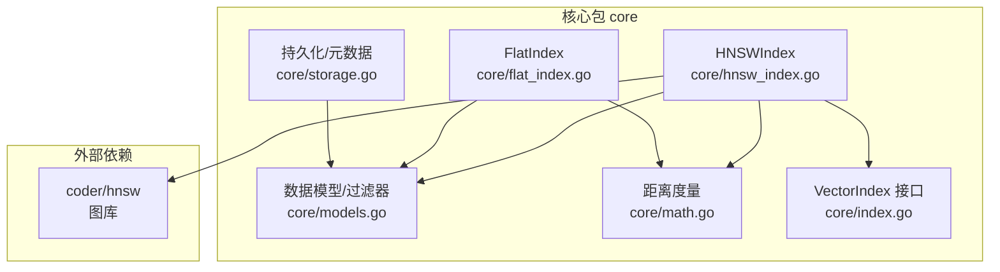
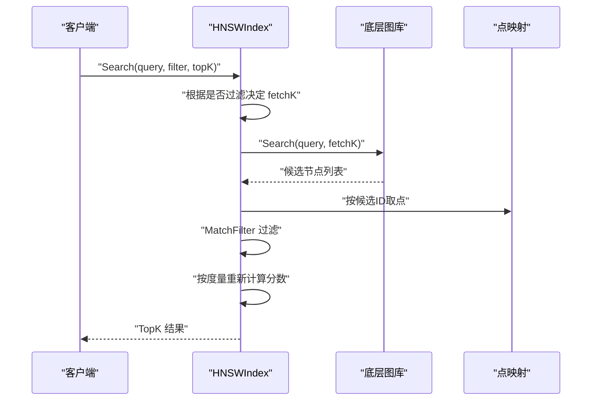
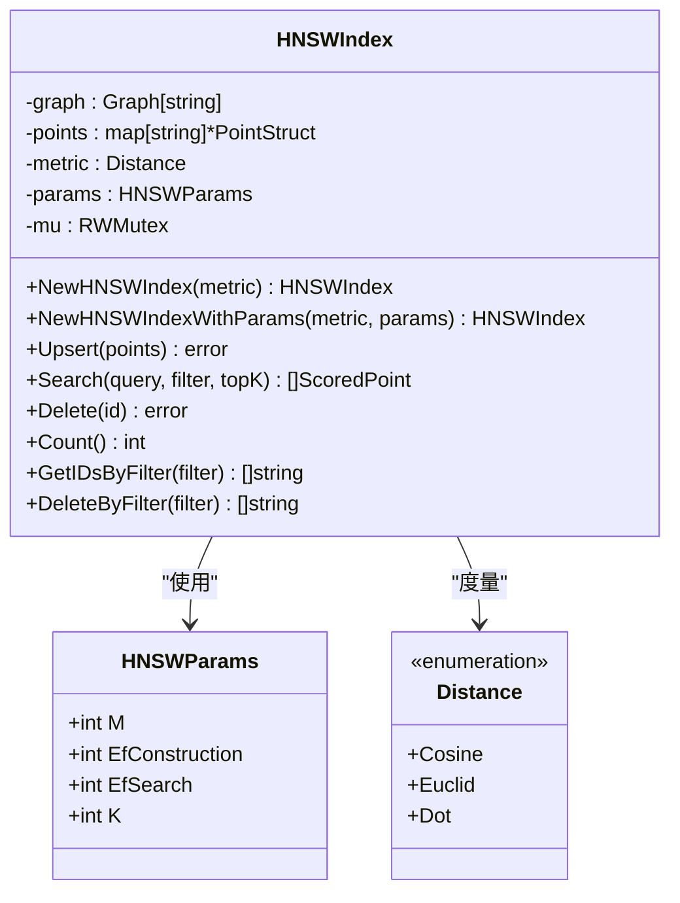
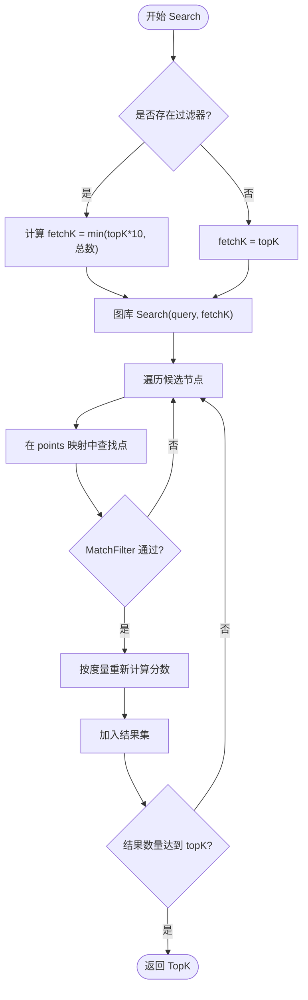
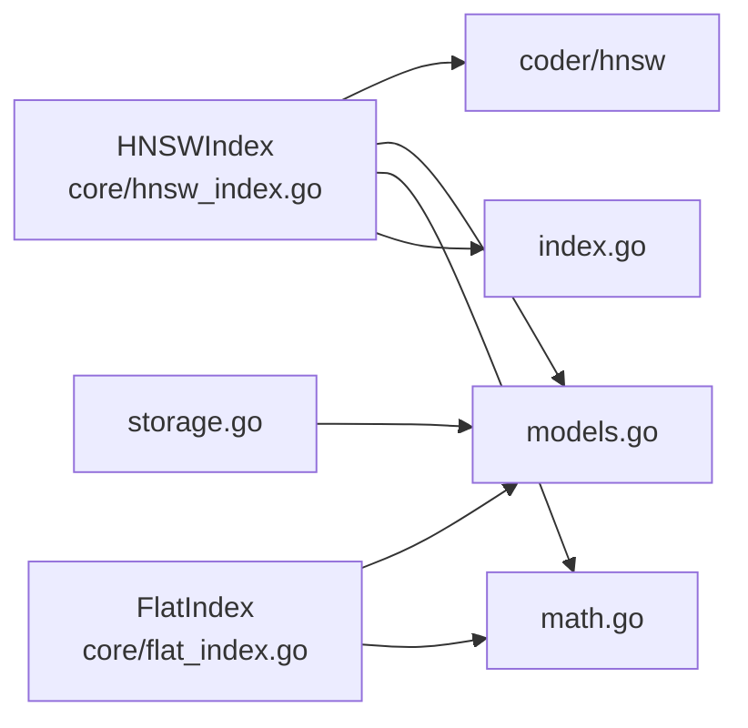

# HNSWIndex 图索引

<cite>
**本文引用的文件**
- [hnsw_index.go](file://core/hnsw_index.go)
- [hnsw_index_test.go](file://core/hnsw_index_test.go)
- [models.go](file://core/models.go)
- [index.go](file://core/index.go)
- [math.go](file://core/math.go)
- [storage.go](file://core/storage.go)
- [flat_index.go](file://core/flat_index.go)
- [README.md](file://README.md)
- [main.go](file://cmd/bench/main.go)
</cite>

## 目录
1. [简介](#简介)
2. [项目结构](#项目结构)
3. [核心组件](#核心组件)
4. [架构总览](#架构总览)
5. [详细组件分析](#详细组件分析)
6. [依赖关系分析](#依赖关系分析)
7. [性能与复杂度](#性能与复杂度)
8. [参数配置与调优](#参数配置与调优)
9. [搜索算法与实现细节](#搜索算法与实现细节)
10. [与其他索引方案对比](#与其他索引方案对比)
11. [故障排查](#故障排查)
12. [结论](#结论)
13. [附录：使用示例与最佳实践](#附录使用示例与最佳实践)

## 简介
本文件系统性解析 GoVector 中基于 Hierarchical Navigable Small World (HNSW) 的图索引实现，覆盖从理论到工程实践的完整路径。文档面向两类读者：
- 算法研究者：理解 HNSW 的层级结构、导航机制、参数影响与复杂度特性
- 开发者：掌握如何在 GoVector 中创建、配置与高效使用 HNSW 索引，以及在真实业务场景中进行参数调优与性能优化

## 项目结构
HNSWIndex 模块位于 core 包内，围绕向量点模型、距离度量、过滤器、存储与基准测试形成闭环。关键文件职责如下：
- core/hnsw_index.go：HNSWIndex 实现，封装底层图库，提供 Upsert/Search/Delete 等接口
- core/models.go：数据模型与过滤器定义，支持多种匹配类型
- core/math.go：距离度量与相似度计算
- core/index.go：统一的 VectorIndex 接口，便于替换 Flat/HNSW
- core/flat_index.go：暴力索引实现，用于对比与基准
- core/storage.go：持久化与元数据管理
- core/hnsw_index_test.go：HNSW 基本功能与多度量测试
- cmd/bench/main.go：大规模基准测试入口
- README.md：项目概述与性能报告

图表来源
- [hnsw_index.go:1-229](file://core/hnsw_index.go#L1-L229)
- [flat_index.go:1-124](file://core/flat_index.go#L1-L124)
- [models.go:1-280](file://core/models.go#L1-L280)
- [math.go:1-79](file://core/math.go#L1-L79)
- [index.go:1-29](file://core/index.go#L1-L29)
- [storage.go:1-360](file://core/storage.go#L1-L360)

章节来源
- [hnsw_index.go:1-229](file://core/hnsw_index.go#L1-L229)
- [README.md:1-135](file://README.md#L1-L135)

## 核心组件
- HNSWParams：HNSW 参数容器，包含 M（每节点最大连接数）、EfConstruction（构建时候选列表大小）、EfSearch（查询时候选列表大小）、K（返回前 K 个）
- HNSWIndex：封装底层图库，维护点映射与并发安全；提供 Upsert/Search/Delete/Count/GetIDsByFilter/DeleteByFilter
- VectorIndex 接口：统一的索引抽象，支持 Flat/HNSW 替换
- 数据模型与过滤器：PointStruct、Payload、Filter、Condition 及其匹配逻辑
- 距离度量：Cosine/Euclid/Dot 三种度量，分别适用于不同场景

章节来源
- [hnsw_index.go:11-39](file://core/hnsw_index.go#L11-L39)
- [hnsw_index.go:41-106](file://core/hnsw_index.go#L41-L106)
- [index.go:5-28](file://core/index.go#L5-L28)
- [models.go:9-79](file://core/models.go#L9-L79)
- [math.go:5-38](file://core/math.go#L5-L38)

## 架构总览
HNSWIndex 将外部图库与内部数据模型解耦，通过统一接口暴露能力。查询流程采用“先图后过滤”的策略：先用图库返回候选，再在本地映射上做精确评分与过滤，确保结果正确性与可扩展性。

图表来源
- [hnsw_index.go:126-176](file://core/hnsw_index.go#L126-L176)
- [models.go:81-106](file://core/models.go#L81-L106)
- [math.go:24-38](file://core/math.go#L24-L38)

## 详细组件分析

### HNSWIndex 类与参数
- 关键字段
  - graph：底层图实例
  - points：ID 到点结构的映射，用于快速定位与后过滤
  - metric：当前使用的距离度量
  - params：HNSW 参数集合
  - mu：读写锁，保证并发安全
- 构造函数
  - NewHNSWIndex：默认参数
  - NewHNSWIndexWithParams：自定义参数
  - 设置图库距离函数：Cosine/Euclid/Dot；Dot 需要取负以适配图库最小化目标
  - 设置 M 与 EfSearch
- 并发控制：Upsert/Search/Delete/Count/GetIDsByFilter/DeleteByFilter 均加锁保护

图表来源
- [hnsw_index.go:11-106](file://core/hnsw_index.go#L11-L106)
- [math.go:7-22](file://core/math.go#L7-L22)

章节来源
- [hnsw_index.go:41-106](file://core/hnsw_index.go#L41-L106)

### 搜索流程与后过滤策略
- fetchK 决策：若存在过滤器，则按固定倍数扩大候选规模，避免过滤后不足 topK
- 图库搜索：直接调用底层图库 Search 返回候选
- 后过滤与重打分：在 points 映射中取回点，执行 MatchFilter，随后按原始度量重新计算分数
- 结果截断：达到 topK 即停止

图表来源
- [hnsw_index.go:126-176](file://core/hnsw_index.go#L126-L176)
- [models.go:81-106](file://core/models.go#L81-L106)

章节来源
- [hnsw_index.go:126-176](file://core/hnsw_index.go#L126-L176)

### 删除与批量删除
- Delete：从图库与映射同时删除，不存在则报错
- DeleteByFilter：遍历映射，匹配条件后删除并记录已删 ID

章节来源
- [hnsw_index.go:178-228](file://core/hnsw_index.go#L178-L228)

### 数据模型与过滤器
- PointStruct：ID、版本、向量、负载
- Filter/Condition：支持 Must/MustNot，支持多种匹配类型（精确、范围、前缀、包含、正则）
- MatchFilter：先验 Must 全满足，再检查 MustNot 无满足，才认为匹配

章节来源
- [models.go:9-79](file://core/models.go#L9-L79)
- [models.go:81-280](file://core/models.go#L81-L280)

### 距离度量与相似度
- Cosine：角度余弦相似度，[-1,1]，越大越相似
- Euclid：欧氏距离，[0,+∞)，越小越相似
- Dot：点积，(-∞,+∞)，越大越相似
- 计算函数：统一入口，按度量分别计算

章节来源
- [math.go:5-38](file://core/math.go#L5-L38)
- [math.go:40-78](file://core/math.go#L40-L78)

## 依赖关系分析
- 外部依赖：coder/hnsw 提供图库能力
- 内部依赖：HNSWIndex 依赖 models 与 math；接口由 index.go 统一；存储由 storage.go 提供

图表来源
- [hnsw_index.go:1-10](file://core/hnsw_index.go#L1-L10)
- [index.go:1-29](file://core/index.go#L1-L29)
- [storage.go:1-11](file://core/storage.go#L1-L11)

章节来源
- [hnsw_index.go:1-10](file://core/hnsw_index.go#L1-L10)
- [index.go:1-29](file://core/index.go#L1-L29)
- [storage.go:1-11](file://core/storage.go#L1-L11)

## 性能与复杂度
- 查询复杂度：HNSW 在高维空间下近似 O(log N) 的检索复杂度，远优于暴力索引 O(N)
- 构建复杂度：HNSW 构建阶段与 EfConstruction、M 等参数相关，通常为 O(N log N)
- 内存占用：HNSW 需要额外的图结构内存，随 M 与节点数增长
- 基准表现（来自 README 与基准工具）：
  - HNSW 在百万级规模仍保持亚毫秒级平均延迟，吞吐可达数千 QPS
  - Flat 索引在大规模下延迟显著上升，适合小中型数据或精确检索需求

章节来源
- [README.md:60-71](file://README.md#L60-L71)
- [main.go:41-107](file://cmd/bench/main.go#L41-L107)

## 参数配置与调优
- M（每节点最大连接数）
  - 影响：增大 M 提高图稠密度，提升召回与精度，但增加内存与构建成本
  - 建议：默认 16；在高召回场景可适度提高
- EfConstruction（构建时候选列表大小）
  - 影响：增大 EfConstruction 提升图质量，但增加构建时间
  - 建议：默认 200；大规模构建时可按数据分布调整
- EfSearch（查询时候选列表大小）
  - 影响：增大 EfSearch 提升召回，但增加查询延迟
  - 建议：默认 64；在高召回需求场景适度上调
- K（返回前 K 个）
  - 影响：直接影响结果集大小与后续处理开销
  - 建议：结合业务召回率目标设置

章节来源
- [hnsw_index.go:11-39](file://core/hnsw_index.go#L11-L39)
- [hnsw_index.go:92-98](file://core/hnsw_index.go#L92-L98)

## 搜索算法与实现细节
- 导航机制：HNSW 通过多层图结构与局部贪心搜索实现高效导航
- 候选节点选择：图库内部维护动态候选列表，按距离优先级扩展
- 结果排序：后过滤阶段按度量重新计算分数并排序（Cosine/Dot 降序，Euclid 升序）

章节来源
- [hnsw_index.go:126-176](file://core/hnsw_index.go#L126-L176)
- [flat_index.go:40-74](file://core/flat_index.go#L40-L74)

## 与其他索引方案对比
- HNSW vs Flat
  - HNSW：近似检索，低延迟，适合大规模；需要额外内存与构建时间
  - Flat：精确检索，O(N) 查询复杂度，适合小中型数据或严格精度要求
- 选择建议
  - 大规模向量检索、实时性要求高：优先 HNSW
  - 小规模数据、必须精确检索：Flat 或 HNSW（小规模）

章节来源
- [README.md:30-42](file://README.md#L30-L42)
- [flat_index.go:9-17](file://core/flat_index.go#L9-L17)

## 故障排查
- 查询结果为空或不足
  - 检查过滤器是否过于严格，尝试放宽条件或临时移除过滤
  - 若使用过滤，确认 fetchK 是否被正确放大
- 删除失败
  - 确认 ID 存在；Delete 返回未找到错误时需检查 ID 一致性
- 性能不达预期
  - 调整 EfSearch 与 M；评估数据维度与度量选择
  - 对于高过滤率场景，考虑在上游预筛选或使用更合适的度量

章节来源
- [hnsw_index.go:178-189](file://core/hnsw_index.go#L178-L189)
- [hnsw_index.go:133-142](file://core/hnsw_index.go#L133-L142)

## 结论
HNSWIndex 在 GoVector 中提供了工业级的近似最近邻检索能力，具备良好的可扩展性与性能表现。通过合理的参数配置与过滤策略，可在大规模向量检索场景中取得优异的延迟与吞吐平衡。对于需要精确检索或小规模数据的场景，FlatIndex 提供了简单可靠的替代方案。

## 附录：使用示例与最佳实践
- 创建 HNSW 索引
  - 使用默认参数：参考 [NewHNSWIndex:52-57](file://core/hnsw_index.go#L52-L57)
  - 使用自定义参数：参考 [NewHNSWIndexWithParams:59-106](file://core/hnsw_index.go#L59-L106)
- 配置参数
  - 参考 [HNSWParams:11-39](file://core/hnsw_index.go#L11-L39) 与 [DefaultHNSWParams:31-39](file://core/hnsw_index.go#L31-L39)
  - 运行基准测试：参考 [main.go:41-107](file://cmd/bench/main.go#L41-L107)
- 执行搜索
  - 基本搜索：参考 [Search:126-176](file://core/hnsw_index.go#L126-L176)
  - 带过滤搜索：参考 [hnsw_index_test.go:45-60](file://core/hnsw_index_test.go#L45-L60)
- 最佳实践
  - 高召回场景适度提高 EfSearch 与 M
  - 高过滤率场景先在上游做粗筛，减少后过滤成本
  - 选择合适度量：Cosine 适合归一化向量；Euclid 适合绝对距离敏感任务；Dot 适合方向一致的相似度

章节来源
- [hnsw_index.go:52-106](file://core/hnsw_index.go#L52-L106)
- [hnsw_index.go:126-176](file://core/hnsw_index.go#L126-L176)
- [hnsw_index_test.go:7-90](file://core/hnsw_index_test.go#L7-L90)
- [main.go:41-107](file://cmd/bench/main.go#L41-L107)