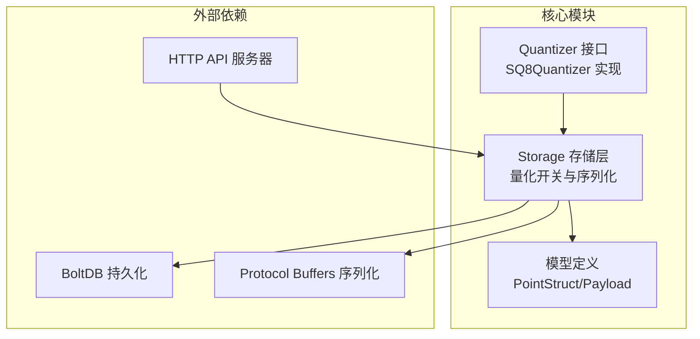
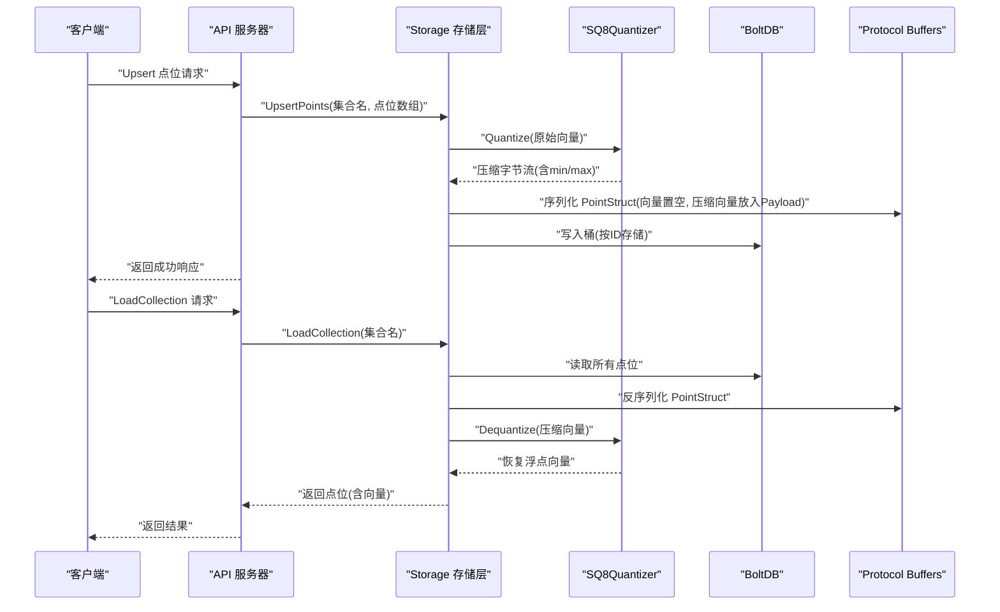
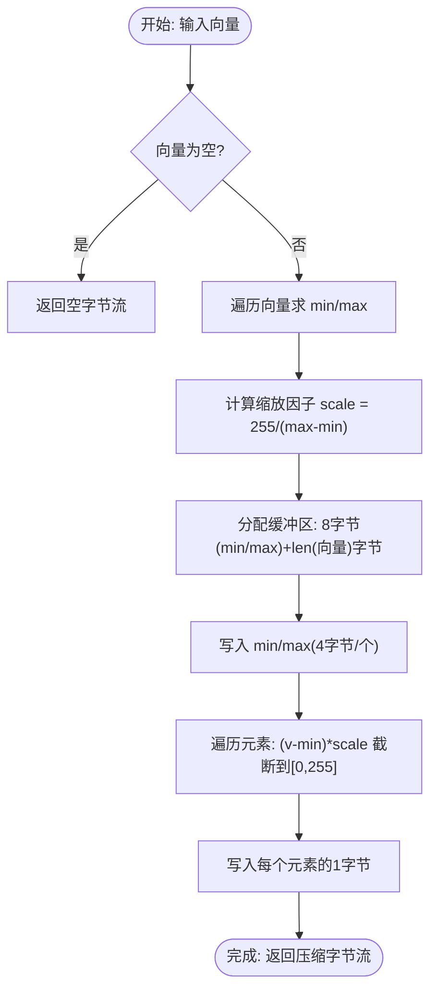
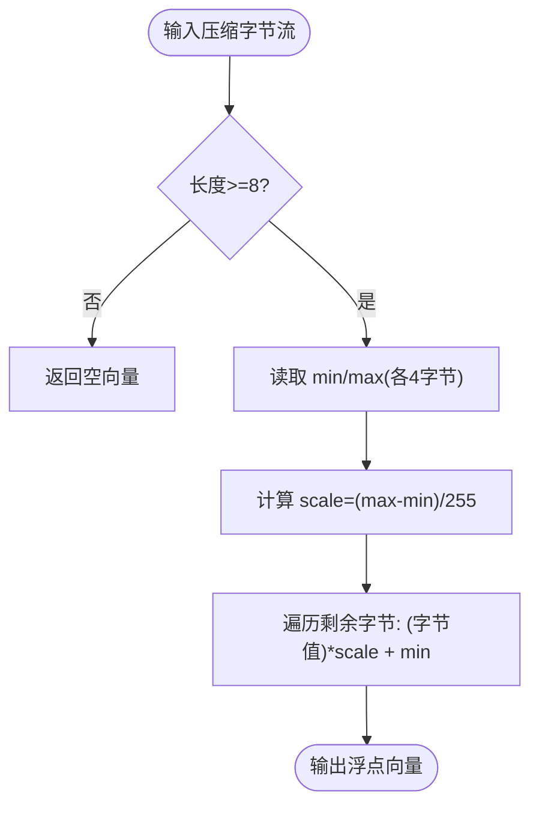
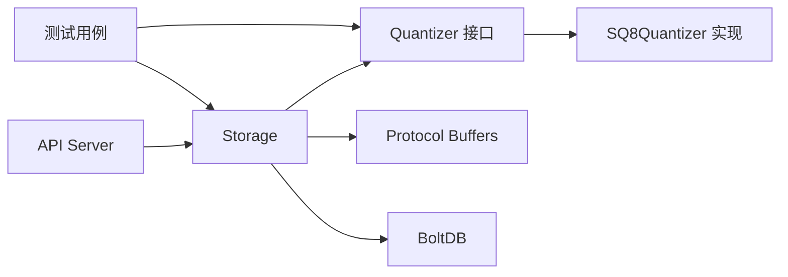

# Quantization 量化系统

<cite>
**本文档引用的文件**
- [quantization.go](file://core/quantization.go)
- [quantization_test.go](file://core/quantization_test.go)
- [storage.go](file://core/storage.go)
- [models.go](file://core/models.go)
- [server.go](file://api/server.go)
- [main.go](file://cmd/bench/main.go)
- [README.md](file://README.md)
- [README_zh.md](file://README_zh.md)
</cite>

## 目录
1. [简介](#简介)
2. [项目结构](#项目结构)
3. [核心组件](#核心组件)
4. [架构概览](#架构概览)
5. [详细组件分析](#详细组件分析)
6. [依赖关系分析](#依赖关系分析)
7. [性能考量](#性能考量)
8. [故障排除指南](#故障排除指南)
9. [结论](#结论)
10. [附录](#附录)

## 简介
本文件针对 GoVector 项目中的量化系统进行全面的技术文档说明，重点围绕 8 位标量量化（SQ8）算法的原理、实现与应用。量化技术通过将 32 位浮点向量压缩为更小的数据表示（如 8 位整数），在显著降低存储空间占用的同时，也带来查询性能与精度之间的权衡。本文将从算法原理、代码实现、配置方式、性能影响、质量评估与最佳实践等多维度展开，既面向算法研究者解释量化理论基础，也为开发者提供实用的工程指南。

## 项目结构
量化系统主要分布在以下模块：
- 核心量化接口与实现：位于 core/quantization.go，定义 Quantizer 接口与 SQ8Quantizer 实现
- 存储层集成：位于 core/storage.go，负责在持久化过程中启用/禁用量化，并在读取时解压向量
- 模型定义：位于 core/models.go，包含 PointStruct 结构体及 Payload 字段，用于承载向量与元数据
- API 服务器：位于 api/server.go，提供基于 HTTP 的 Qdrant 兼容接口，并支持量化开关
- 基准测试：位于 cmd/bench/main.go，演示大规模向量处理场景下的性能表现
- 文档：位于 README.md 与 README_zh.md，概述项目特性与性能指标



图表来源
- [quantization.go:9-18](file://core/quantization.go#L9-L18)
- [storage.go:15-20](file://core/storage.go#L15-L20)
- [models.go:11-16](file://core/models.go#L11-L16)
- [server.go:18-24](file://api/server.go#L18-L24)

章节来源
- [quantization.go:1-125](file://core/quantization.go#L1-L125)
- [storage.go:1-360](file://core/storage.go#L1-L360)
- [models.go:1-200](file://core/models.go#L1-L200)
- [server.go:1-200](file://api/server.go#L1-L200)
- [README.md:30-42](file://README.md#L30-L42)
- [README_zh.md:30-42](file://README_zh.md#L30-L42)

## 核心组件
- Quantizer 接口：定义量化与反量化能力，以及压缩尺寸估算
- SQ8Quantizer：实现 8 位标量量化，按向量的最小值与最大值动态缩放，将每个元素映射到 [0, 255] 区间
- Storage：在 Upsert 时根据 useQuant 与 quantizer 参数决定是否对向量进行量化；在 LoadCollection 时自动解压
- PointStruct/Payload：承载向量与元数据，量化后的向量以特殊键名存储于 Payload 中
- API Server：提供 NewServerWithQuantization 构造函数，便于以 HTTP 方式启用量化

章节来源
- [quantization.go:9-18](file://core/quantization.go#L9-L18)
- [quantization.go:24-29](file://core/quantization.go#L24-L29)
- [storage.go:15-20](file://core/storage.go#L15-L20)
- [storage.go:95-114](file://core/storage.go#L95-L114)
- [models.go:11-16](file://core/models.go#L11-L16)
- [server.go:36-44](file://api/server.go#L36-L44)

## 架构概览
量化系统在存储层与 API 层之间形成一条清晰的数据通路：写入路径启用量化，读取路径恢复原向量。整体流程如下：



图表来源
- [storage.go:148-187](file://core/storage.go#L148-L187)
- [storage.go:193-235](file://core/storage.go#L193-L235)
- [quantization.go:32-76](file://core/quantization.go#L32-L76)
- [quantization.go:78-104](file://core/quantization.go#L78-L104)

## 详细组件分析

### SQ8 8 位标量量化器
SQ8Quantizer 采用逐元素标量量化策略，核心思想是：
- 对每个向量计算 min 与 max，确定动态范围
- 将每个元素线性映射到 [0, 255]，并截断到合法范围
- 将 min 与 max 以 4 字节 float32 形式存储在压缩数据头部，以便后续重建
- 每个元素仅占用 1 字节，整体压缩率为 32:1（不考虑元数据）



图表来源
- [quantization.go:32-76](file://core/quantization.go#L32-L76)

章节来源
- [quantization.go:32-76](file://core/quantization.go#L32-L76)
- [quantization.go:106-109](file://core/quantization.go#L106-L109)

### 反量化与重建误差控制
反量化过程通过 min 与 max 恢复原始范围，并将每个字节乘以 scale 回到浮点域。由于量化为有损过程，重建误差取决于动态范围与量化粒度。测试用例验证了：
- 压缩后长度等于 8 + 维度
- 重建向量与原向量在允许误差范围内接近
- 边界情况（空向量、单元素、全相同值、无效数据长度、大范围值）均能正确处理



图表来源
- [quantization.go:78-104](file://core/quantization.go#L78-L104)

章节来源
- [quantization_test.go:8-45](file://core/quantization_test.go#L8-L45)
- [quantization_test.go:47-98](file://core/quantization_test.go#L47-L98)

### 存储层集成与持久化
Storage 在 Upsert 时根据 useQuant 与 quantizer 决定是否量化：
- 若启用量化且未提供自定义 quantizer，则默认使用 SQ8Quantizer
- 将原始向量置空，将压缩后的向量以特殊键名存入 Payload，随后进行 Protobuf 序列化并写入 BoltDB
- LoadCollection 时若检测到量化标记，则调用 Dequantize 恢复向量，并清理临时字段

```mermaid
classDiagram
class Storage {
-db : bbolt.DB
-closed : bool
-quantizer : Quantizer
-useQuant : bool
+UpsertPoints(colName, points) error
+LoadCollection(colName) map[string]*PointStruct, error
}
class SQ8Quantizer {
+Quantize(vector) []byte
+Dequantize(data) []float32
+GetCompressedSize(dim) int
}
class PointStruct {
+ID : string
+Version : uint64
+Vector : []float32
+Payload : map[string]interface{}
}
Storage --> SQ8Quantizer : "可选依赖"
Storage --> PointStruct : "序列化/反序列化"
```

图表来源
- [storage.go:15-20](file://core/storage.go#L15-L20)
- [storage.go:148-187](file://core/storage.go#L148-L187)
- [storage.go:193-235](file://core/storage.go#L193-L235)
- [quantization.go:24-29](file://core/quantization.go#L24-L29)
- [models.go:11-16](file://core/models.go#L11-L16)

章节来源
- [storage.go:95-114](file://core/storage.go#L95-L114)
- [storage.go:148-187](file://core/storage.go#L148-L187)
- [storage.go:193-235](file://core/storage.go#L193-L235)

### API 服务器与量化开关
API Server 提供 NewServerWithQuantization，允许以 HTTP 微服务形式启用量化：
- 通过 dbPath 与 useQuant 参数初始化 Storage
- 自动加载集合元数据并启动 HTTP 服务
- 与存储层一致，若 useQuant 为真且未指定 quantizer，则使用 SQ8Quantizer

章节来源
- [server.go:36-44](file://api/server.go#L36-L44)

## 依赖关系分析
量化系统与其他模块的耦合关系如下：
- Quantizer 接口与 SQ8Quantizer 实现与 Storage 解耦，可通过构造函数注入自定义量化器
- Storage 依赖 Protobuf 与 BoltDB，用于序列化与持久化
- API Server 依赖 Storage，提供 HTTP 入口
- 测试覆盖了量化器本身与存储层的端到端流程



图表来源
- [quantization.go:9-18](file://core/quantization.go#L9-L18)
- [storage.go:15-20](file://core/storage.go#L15-L20)
- [server.go:36-44](file://api/server.go#L36-L44)

章节来源
- [quantization.go:1-125](file://core/quantization.go#L1-L125)
- [storage.go:1-360](file://core/storage.go#L1-L360)
- [server.go:1-200](file://api/server.go#L1-L200)

## 性能考量
- 存储空间节省：每维 1 字节 + 8 字节元信息，整体约为 32:1 的压缩率（不计元数据）
- 查询性能：量化在 Upsert/Load 时引入少量 CPU 开销，但对检索阶段的向量比较无直接影响（因为检索使用的是索引而非原始向量）
- 内存占用：加载时会重建向量，因此内存峰值会略高于纯字节流存储
- 大规模基准：项目 README 展示了 Flat/HNSW 在不同规模下的延迟与吞吐，量化可在不改变索引的情况下进一步降低磁盘占用

章节来源
- [quantization.go:106-109](file://core/quantization.go#L106-L109)
- [README.md:60-71](file://README.md#L60-L71)
- [README_zh.md:60-71](file://README_zh.md#L60-L71)

## 故障排除指南
- 压缩后向量与原向量差异过大：检查输入向量是否存在极端范围或异常值；确认测试用例中的误差阈值设置
- 读取失败或向量为空：确认存储层已启用量化且 Payload 中存在量化标记；检查反量化数据长度是否至少为 8 字节
- API 服务无法持久化：确保 NewServerWithQuantization 正确传入 dbPath 与 useQuant；检查集合元数据保存与加载流程
- 性能异常：量化开启后 CPU 占用上升属正常；若出现内存峰值过高，检查是否在大量并发 LoadCollection 时未及时释放对象

章节来源
- [quantization_test.go:80-85](file://core/quantization_test.go#L80-L85)
- [storage.go:193-235](file://core/storage.go#L193-L235)
- [server.go:36-44](file://api/server.go#L36-L44)

## 结论
GoVector 的 SQ8 量化系统以简洁高效的标量量化策略，在不牺牲检索索引的前提下显著降低了存储成本。通过接口抽象与存储层集成，系统具备良好的扩展性与可维护性。对于追求极致存储效率的应用场景，建议结合业务数据分布选择合适的量化参数与阈值；对于对精度敏感的任务，可结合测试用例的误差评估方法进行权衡。

## 附录

### 量化参数配置与启用方式
- 作为嵌入式库启用量化：
  - 使用 NewStorageWithQuantization(dbPath, true, nil) 创建存储实例，内部将自动使用 SQ8Quantizer
  - 通过 Storage.UpsertPoints 与 LoadCollection 完成端到端流程
- 作为 HTTP 服务启用量化：
  - 使用 NewServerWithQuantization(":8080", "./govector.db", true) 启动服务
  - 通过 REST API 进行集合管理与点位操作

章节来源
- [storage.go:95-114](file://core/storage.go#L95-L114)
- [server.go:36-44](file://api/server.go#L36-L44)

### 量化效果评估方法
- 重建误差评估：对随机生成的向量进行量化/反量化，统计与原向量的偏差范围，参考测试用例中的误差阈值
- 存储空间对比：记录压缩前后字节数，计算压缩率；结合实际数据分布评估收益
- 查询性能对比：在相同硬件条件下，分别测试启用/关闭量化时的 Upsert/Load 性能，关注 CPU 占用与内存峰值

章节来源
- [quantization_test.go:8-45](file://core/quantization_test.go#L8-L45)
- [quantization_test.go:87-98](file://core/quantization_test.go#L87-L98)
- [main.go:41-107](file://cmd/bench/main.go#L41-L107)

### 不同量化方案对比与选择建议
- 4bit 量化：理论上压缩率更高，但重建误差更大，适合对精度要求较低的场景
- 8bit 量化（SQ8）：在精度与压缩率之间取得良好平衡，推荐大多数生产环境
- 16bit 量化：重建误差较小，但压缩率有限，适合对精度要求极高且存储资源充足的场景
- 选择建议：优先评估业务对精度的要求与存储预算，结合误差评估与基准测试结果进行决策

[本节为通用指导，不直接分析具体文件]