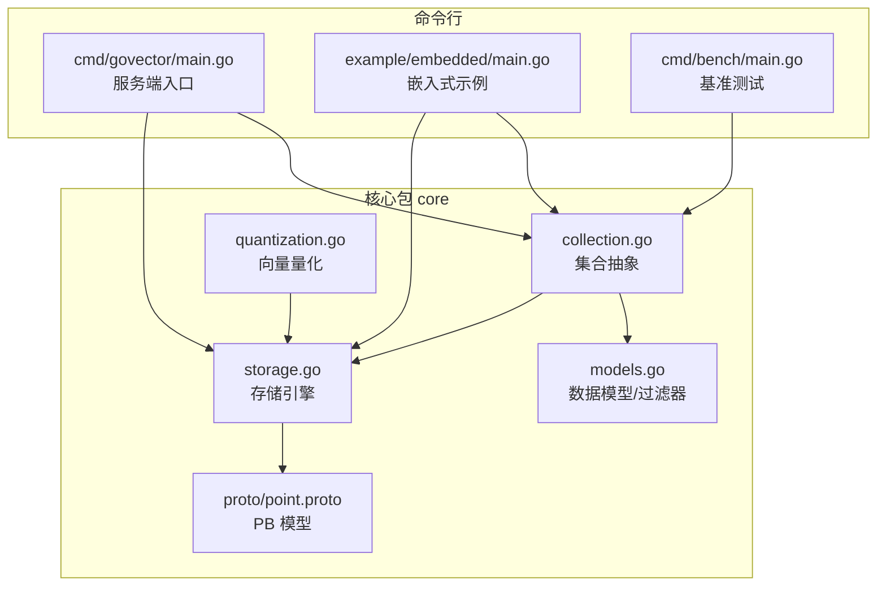
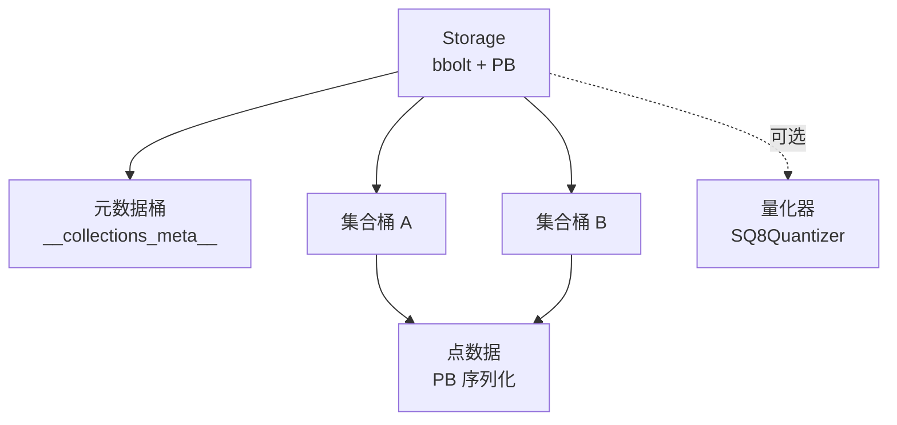
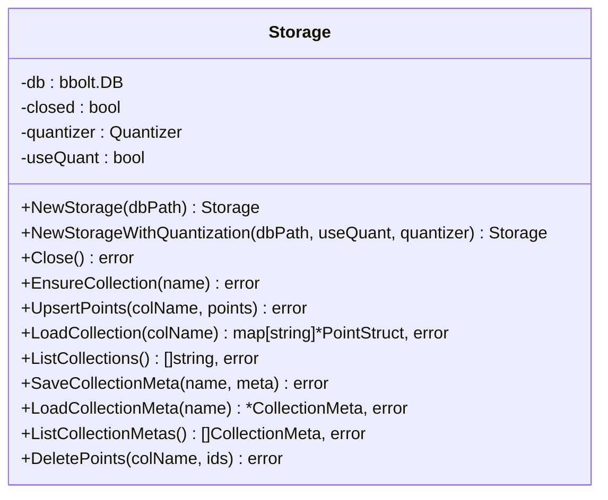
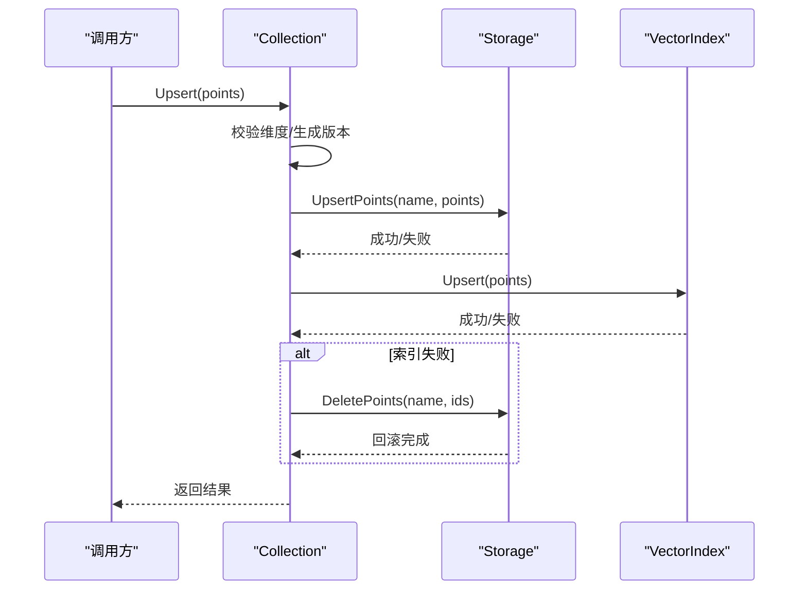
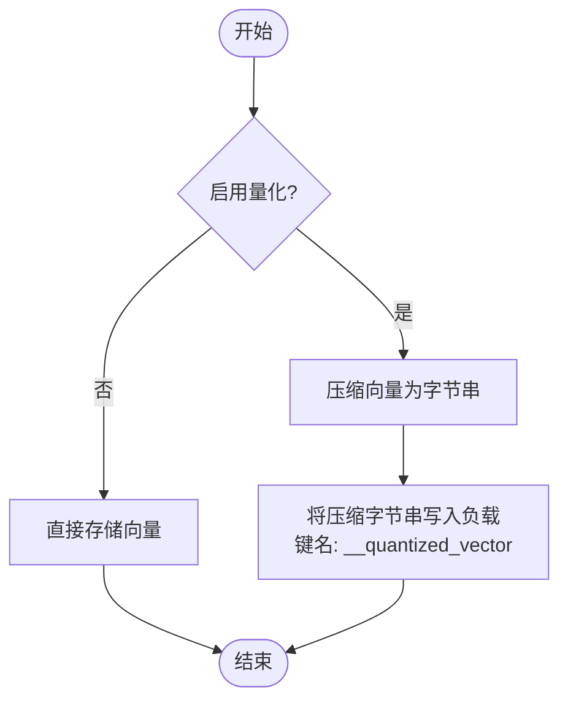
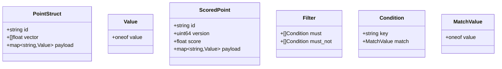
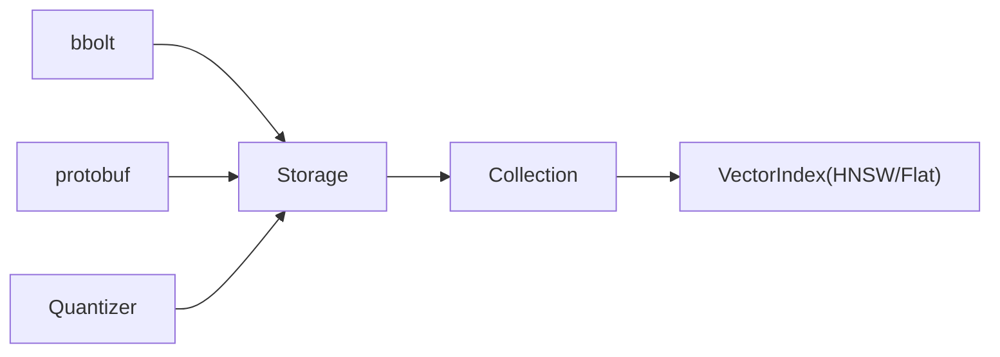

# Storage 存储引擎

<cite>
**本文引用的文件**
- [storage.go](file://core/storage.go)
- [storage_test.go](file://core/storage_test.go)
- [models.go](file://core/models.go)
- [quantization.go](file://core/quantization.go)
- [collection.go](file://core/collection.go)
- [main.go](file://cmd/govector/main.go)
- [main.go](file://example/embedded/main.go)
- [point.proto](file://core/proto/point.proto)
- [go.mod](file://go.mod)
- [README.md](file://README.md)
- [main.go](file://cmd/bench/main.go)
</cite>

## 目录
1. [简介](#简介)
2. [项目结构](#项目结构)
3. [核心组件](#核心组件)
4. [架构总览](#架构总览)
5. [详细组件分析](#详细组件分析)
6. [依赖分析](#依赖分析)
7. [性能考虑](#性能考虑)
8. [故障排查指南](#故障排查指南)
9. [结论](#结论)
10. [附录](#附录)

## 简介
本文件系统性阐述基于 BoltDB（bbolt）的嵌入式存储引擎实现，涵盖数据持久化机制、键值存储设计、事务处理、集合元数据存储、向量点数据序列化、批量操作优化、性能特征与磁盘使用模式、内存映射策略、配置选项、备份恢复、性能调优以及可靠性保证与扩展性。文档同时提供面向初学者的概念讲解与面向专家的底层实现细节，并通过具体代码示例路径帮助快速上手。

## 项目结构
该仓库采用按领域分层的组织方式：核心业务逻辑位于 core 包，命令行入口位于 cmd 目录，示例位于 example 目录，协议定义位于 core/proto。存储引擎位于 core/storage.go，配合 collection.go 提供集合级抽象，quantization.go 提供向量量化能力，models.go 定义数据模型与过滤器，proto 文件定义序列化结构。



图表来源
- [storage.go:1-360](file://core/storage.go#L1-L360)
- [collection.go:1-198](file://core/collection.go#L1-L198)
- [quantization.go:1-125](file://core/quantization.go#L1-L125)
- [models.go:1-280](file://core/models.go#L1-L280)
- [point.proto:1-49](file://core/proto/point.proto#L1-L49)
- [main.go:1-92](file://cmd/govector/main.go#L1-L92)
- [main.go:1-63](file://example/embedded/main.go#L1-L63)
- [main.go:1-142](file://cmd/bench/main.go#L1-L142)

章节来源
- [README.md:1-135](file://README.md#L1-L135)
- [go.mod:1-19](file://go.mod#L1-L19)

## 核心组件
- 存储引擎 Storage：封装 bbolt 数据库，提供集合桶管理、点数据的增删改查、集合元数据的持久化与加载、批量写入与删除、关闭与状态检查。
- 集合 Collection：在存储之上提供线程安全的集合抽象，负责维度校验、版本号生成、持久化优先的一致性策略、索引更新与回滚尝试。
- 向量量化 Quantizer/SQ8Quantizer：提供 8 位标量量化接口与实现，用于压缩向量以降低磁盘占用。
- 数据模型与过滤器：定义点结构、评分结果、过滤条件、匹配类型与范围条件，支持多种匹配策略。
- 协议定义：通过 protobuf 定义点结构、评分点、过滤器等消息格式，确保跨语言/跨进程的稳定序列化。

章节来源
- [storage.go:13-20](file://core/storage.go#L13-L20)
- [collection.go:12-20](file://core/collection.go#L12-L20)
- [quantization.go:9-18](file://core/quantization.go#L9-L18)
- [models.go:9-25](file://core/models.go#L9-L25)
- [point.proto:7-28](file://core/proto/point.proto#L7-L28)

## 架构总览
存储引擎采用“集合即桶”的键值存储设计，每个集合对应一个 bbolt 桶；点数据以 Protocol Buffers 序列化后作为值存入，ID 作为键；集合元数据单独保存在一个特殊桶中，使用 JSON 序列化。写入流程遵循“先持久化再索引”的一致性策略，读取时根据是否启用量化决定解压与内存清理。



图表来源
- [storage.go:131-142](file://core/storage.go#L131-L142)
- [storage.go:261-280](file://core/storage.go#L261-L280)
- [storage.go:282-307](file://core/storage.go#L282-L307)
- [storage.go:237-259](file://core/storage.go#L237-L259)
- [quantization.go:20-29](file://core/quantization.go#L20-L29)

## 详细组件分析

### 存储引擎 Storage 组件
- 初始化与关闭
  - NewStorage/NewStorageWithQuantization：打开 bbolt 数据库文件，支持可选量化器与量化开关。
  - Close：优雅关闭数据库连接，幂等设计。
- 集合管理
  - EnsureCollection：为集合创建桶（若不存在），每个集合独立桶。
  - ListCollections：枚举所有集合桶（排除元数据桶）。
- 点数据操作
  - UpsertPoints：批量写入点，支持量化压缩；序列化为 PB；键为点 ID。
  - LoadCollection：批量读取集合点，反序列化 PB；若启用量化则解压并清理临时字段。
  - DeletePoints：批量删除点，忽略不存在的 ID。
- 元数据管理
  - SaveCollectionMeta：将集合元数据写入特殊桶，JSON 序列化。
  - LoadCollectionMeta/ListCollectionMetas：读取单个或全部元数据。
- 错误处理与状态
  - 所有方法在存储关闭状态下返回明确错误。
  - 写入失败时返回带上下文的错误信息，便于定位问题。



图表来源
- [storage.go:13-20](file://core/storage.go#L13-L20)
- [storage.go:88-114](file://core/storage.go#L88-L114)
- [storage.go:131-142](file://core/storage.go#L131-L142)
- [storage.go:144-187](file://core/storage.go#L144-L187)
- [storage.go:189-235](file://core/storage.go#L189-L235)
- [storage.go:237-259](file://core/storage.go#L237-L259)
- [storage.go:261-307](file://core/storage.go#L261-L307)
- [storage.go:309-336](file://core/storage.go#L309-L336)
- [storage.go:338-360](file://core/storage.go#L338-L360)

章节来源
- [storage.go:88-114](file://core/storage.go#L88-L114)
- [storage.go:131-142](file://core/storage.go#L131-L142)
- [storage.go:144-187](file://core/storage.go#L144-L187)
- [storage.go:189-235](file://core/storage.go#L189-L235)
- [storage.go:237-259](file://core/storage.go#L237-L259)
- [storage.go:261-307](file://core/storage.go#L261-L307)
- [storage.go:309-336](file://core/storage.go#L309-L336)
- [storage.go:338-360](file://core/storage.go#L338-L360)

### 集合 Collection 组件
- 生命周期与一致性
  - NewCollection/NewCollectionWithParams：创建集合，自动确保桶存在，保存元数据，从存储加载现有点到内存索引。
  - Upsert：先持久化，再更新内存索引；若索引更新失败，尝试回滚删除已持久化的点，保持一致性。
  - Delete：先删除存储，再删除索引；支持按 ID 或过滤器删除。
- 线程安全
  - 使用读写锁保护集合内部状态与索引访问。
- 查询
  - Search：委托给底层索引（Flat/HNSW），支持过滤器与 TopK。



图表来源
- [collection.go:93-133](file://core/collection.go#L93-L133)
- [storage.go:144-187](file://core/storage.go#L144-L187)

章节来源
- [collection.go:22-91](file://core/collection.go#L22-L91)
- [collection.go:93-133](file://core/collection.go#L93-L133)
- [collection.go:135-147](file://core/collection.go#L135-L147)
- [collection.go:156-197](file://core/collection.go#L156-L197)

### 向量量化 Quantizer/SQ8Quantizer 组件
- 接口与实现
  - Quantizer：定义 Quantize/Dequantize/GetCompressedSize。
  - SQ8Quantizer：按向量最小/最大值归一化到 [0,255]，存储 min/max 与 8 位整数，解压时还原浮点向量。
- 存储集成
  - 当启用量化时，UpsertPoints 将原始向量置空，将压缩后的字节串放入点的负载中，加载时解压并移除临时字段，节省内存。



图表来源
- [storage.go:159-175](file://core/storage.go#L159-L175)
- [storage.go:215-224](file://core/storage.go#L215-L224)
- [quantization.go:31-76](file://core/quantization.go#L31-L76)
- [quantization.go:78-104](file://core/quantization.go#L78-L104)

章节来源
- [quantization.go:9-18](file://core/quantization.go#L9-L18)
- [quantization.go:20-29](file://core/quantization.go#L20-L29)
- [quantization.go:31-104](file://core/quantization.go#L31-L104)

### 数据模型与过滤器
- PointStruct/ScoredPoint：定义点 ID、版本、向量与负载。
- Filter/Condition：支持 Must/MustNot 条件，支持精确匹配、范围、前缀、包含、正则。
- 匹配算法：MatchFilter/matchCondition/matchRange/matchPrefix/matchContains/matchRegex。

```mermaid
classDiagram
class PointStruct {
+string ID
+uint64 Version
+[]float32 Vector
+Payload Payload
}
class ScoredPoint {
+string ID
+uint64 Version
+float32 Score
+Payload Payload
}
class Filter {
+[]Condition Must
+[]Condition MustNot
}
class Condition {
+string Key
+ConditionType Type
+MatchValue Match
+RangeValue Range
}
class MatchValue {
+interface{} Value
}
class RangeValue {
+interface{} GT
+interface{} GTE
+interface{} LT
+interface{} LTE
}
Filter --> Condition
Condition --> MatchValue
Condition --> RangeValue
```

图表来源
- [models.go:9-25](file://core/models.go#L9-L25)
- [models.go:27-69](file://core/models.go#L27-L69)
- [models.go:81-106](file://core/models.go#L81-L106)
- [models.go:108-129](file://core/models.go#L108-L129)
- [models.go:131-195](file://core/models.go#L131-L195)
- [models.go:197-248](file://core/models.go#L197-L248)
- [models.go:260-279](file://core/models.go#L260-L279)

章节来源
- [models.go:5-280](file://core/models.go#L5-L280)

### 协议定义（Protocol Buffers）
- PointStruct/Value/ScoredPoint/Filter/Condition/MatchValue：PB 消息定义，支持字符串、整数、双精度、布尔、字节等类型。
- 与存储的桥接：toProtoPoint/fromProtoPoint 在存储层负责与 PB 的转换。



图表来源
- [point.proto:7-28](file://core/proto/point.proto#L7-L28)

章节来源
- [point.proto:1-49](file://core/proto/point.proto#L1-L49)
- [storage.go:22-56](file://core/storage.go#L22-L56)
- [storage.go:58-86](file://core/storage.go#L58-L86)

## 依赖分析
- 外部依赖
  - bbolt：嵌入式键值数据库，提供 ACID 事务与只读视图。
  - protobuf：用于点结构与评分结果的高效序列化。
  - hnsw：可选的高性能近似最近邻索引（由集合层使用）。
- 内部耦合
  - Storage 依赖 bbolt 与 protobuf；Collection 依赖 Storage 与索引实现；Quantizer 与 Storage 解耦但被集成使用。
- 循环依赖
  - 未发现循环依赖，模块边界清晰。



图表来源
- [go.mod:5-9](file://go.mod#L5-L9)
- [storage.go:3-11](file://core/storage.go#L3-L11)
- [collection.go:3-7](file://core/collection.go#L3-L7)

章节来源
- [go.mod:1-19](file://go.mod#L1-L19)
- [storage.go:3-11](file://core/storage.go#L3-L11)
- [collection.go:3-7](file://core/collection.go#L3-L7)

## 性能考虑
- 磁盘与内存映射
  - bbolt 基于 LSM-Tree 的变体，适合顺序写入与随机读取；通过批量写入减少事务开销。
  - 量化可显著降低磁盘占用，但会引入解压成本；建议在高维向量场景开启。
- 事务与并发
  - 写入使用 Update 事务，读取使用 View 事务；集合层使用读写锁隔离集合级并发。
- 批量操作
  - UpsertPoints/DeletePoints 支持批量，减少多次事务与系统调用开销。
- 查询路径
  - 读取集合时可选择是否启用量化，避免不必要的解压；加载后清理临时字段释放内存。
- 基准测试
  - 提供纯索引基准脚本，可用于评估 Flat/HNSW 在不同规模下的构建时间、延迟与吞吐。

章节来源
- [storage.go:144-187](file://core/storage.go#L144-L187)
- [storage.go:189-235](file://core/storage.go#L189-L235)
- [collection.go:93-133](file://core/collection.go#L93-L133)
- [quantization.go:31-104](file://core/quantization.go#L31-L104)
- [main.go:41-107](file://cmd/bench/main.go#L41-L107)

## 故障排查指南
- 常见错误与处理
  - 存储关闭：所有方法在存储关闭状态下返回错误，需确保在正确生命周期内使用。
  - 集合不存在：Upsert/Load/Delete 对应桶不存在时的行为（Upsert 报错，Delete 忽略，Load 返回空）。
  - 序列化失败：PB 序列化/反序列化错误会返回带上下文的错误，检查点结构与类型兼容性。
  - 量化异常：解压失败或维度不一致会导致加载失败，检查量化器与存储数据一致性。
- 单元测试覆盖
  - 测试包含基本 CRUD、量化、元数据、错误场景与关闭状态下的行为验证，可作为回归参考。

章节来源
- [storage_test.go:9-162](file://core/storage_test.go#L9-L162)
- [storage_test.go:164-205](file://core/storage_test.go#L164-L205)
- [storage_test.go:207-264](file://core/storage_test.go#L207-L264)
- [storage_test.go:266-291](file://core/storage_test.go#L266-L291)

## 结论
该存储引擎以 bbolt 为基础，结合 PB 序列化与可选量化，在保证数据持久化与一致性的同时，提供了良好的性能与可扩展性。集合层通过“存储优先”的一致性策略与线程安全设计，使得嵌入式与微服务两种使用模式均具备工业级可靠性。对于大规模向量场景，建议结合量化与 HNSW 索引以获得更优的吞吐与延迟表现。

## 附录

### 使用示例（代码片段路径）
- 初始化存储与集合
  - [初始化存储:27-36](file://cmd/govector/main.go#L27-L36)
  - [创建集合:41-44](file://cmd/govector/main.go#L41-L44)
  - [嵌入式示例:14-24](file://example/embedded/main.go#L14-L24)
- 数据持久化与读取
  - [批量插入点:27-41](file://example/embedded/main.go#L27-L41)
  - [加载集合:189-235](file://core/storage.go#L189-L235)
  - [批量删除点:338-360](file://core/storage.go#L338-L360)
- 元数据管理
  - [保存元数据:261-280](file://core/storage.go#L261-L280)
  - [加载元数据:282-307](file://core/storage.go#L282-L307)
  - [列出元数据:309-336](file://core/storage.go#L309-L336)

章节来源
- [main.go:18-50](file://cmd/govector/main.go#L18-L50)
- [main.go:10-62](file://example/embedded/main.go#L10-L62)
- [storage.go:189-235](file://core/storage.go#L189-L235)
- [storage.go:261-307](file://core/storage.go#L261-L307)
- [storage.go:309-336](file://core/storage.go#L309-L336)
- [storage.go:338-360](file://core/storage.go#L338-L360)

### 配置选项与最佳实践
- 存储配置
  - 数据库路径：通过构造函数参数指定，建议使用绝对路径或稳定的相对路径。
  - 量化开关：NewStorageWithQuantization 可启用 SQ8 量化，默认使用内置量化器。
- 性能调优
  - 批量写入：合并小批次写入，减少事务次数。
  - 量化策略：高维向量建议开启量化；注意查询时的解压成本。
  - 索引选择：大规模数据优先 HNSW；小规模或低延迟要求可考虑 Flat。
- 备份与恢复
  - 复制 bbolt 数据库文件即可完成物理备份；恢复时确保应用处于停止状态或使用只读模式。
  - 元数据桶与集合桶均参与备份，确保重启后可自动发现集合。
- 可靠性与一致性
  - 写入采用“存储优先”策略，失败时尝试回滚；集合层提供版本号与维度校验。
  - 关闭存储前确保 Flush，避免数据丢失。

章节来源
- [storage.go:88-114](file://core/storage.go#L88-L114)
- [storage.go:144-187](file://core/storage.go#L144-L187)
- [collection.go:93-133](file://core/collection.go#L93-L133)
- [quantization.go:31-104](file://core/quantization.go#L31-L104)
- [README.md:30-42](file://README.md#L30-L42)