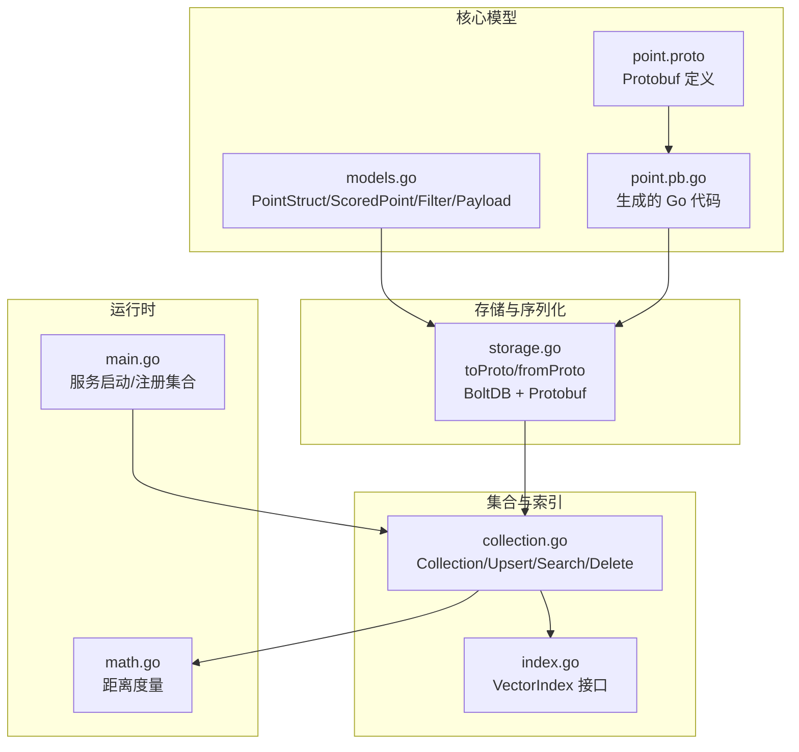
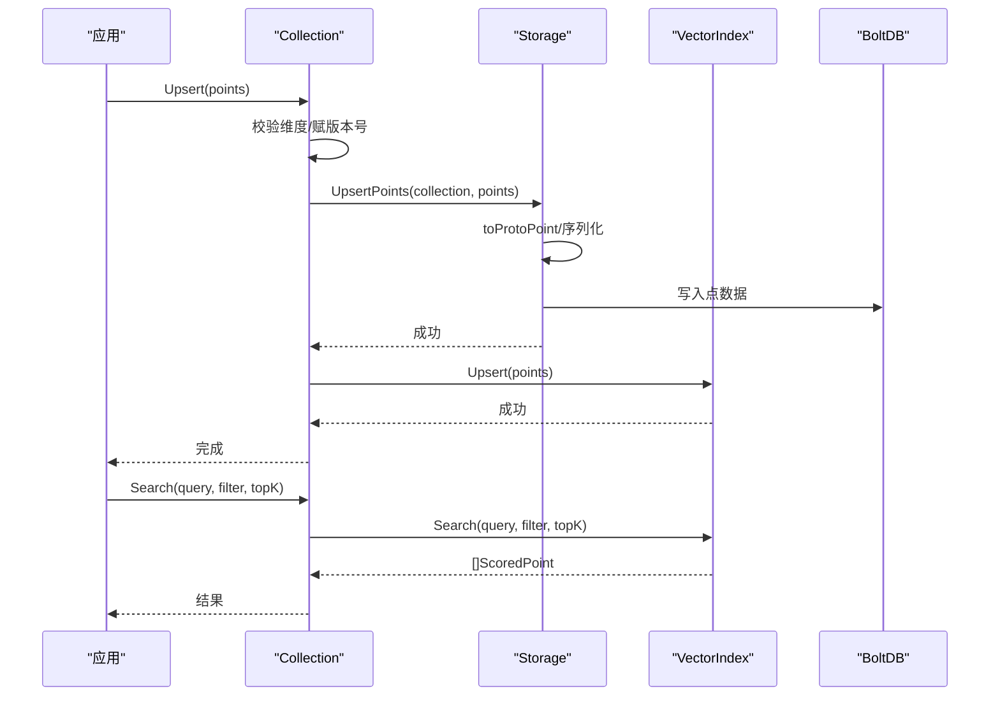
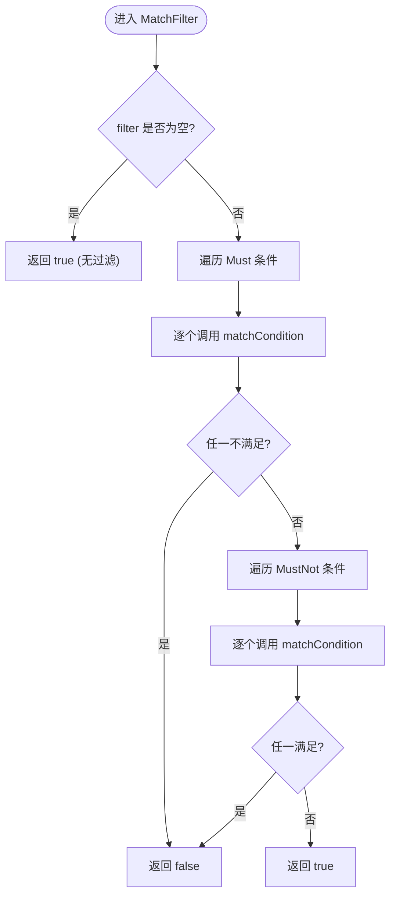
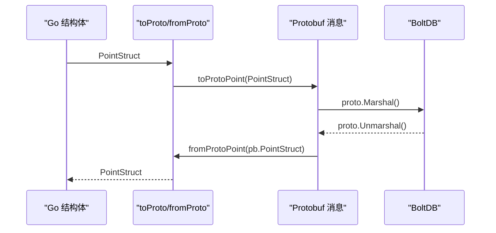
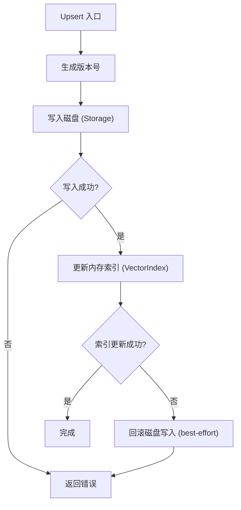
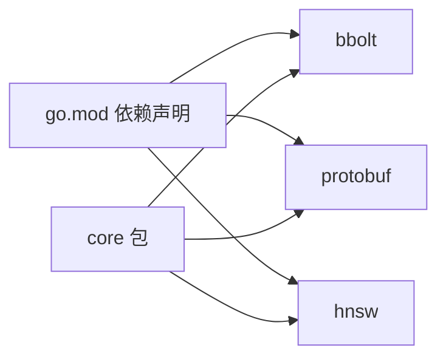

# 数据模型系统

<cite>
**本文引用的文件列表**
- [models.go](file://core/models.go)
- [point.proto](file://core/proto/point.proto)
- [point.pb.go](file://core/proto/point.pb.go)
- [storage.go](file://core/storage.go)
- [collection.go](file://core/collection.go)
- [index.go](file://core/index.go)
- [math.go](file://core/math.go)
- [main.go](file://cmd/govector/main.go)
- [go.mod](file://go.mod)
- [models_test.go](file://core/models_test.go)
</cite>

## 目录
1. [简介](#简介)
2. [项目结构](#项目结构)
3. [核心组件](#核心组件)
4. [架构总览](#架构总览)
5. [详细组件分析](#详细组件分析)
6. [依赖分析](#依赖分析)
7. [性能考量](#性能考量)
8. [故障排查指南](#故障排查指南)
9. [结论](#结论)
10. [附录](#附录)

## 简介
本文件系统性阐述 GoVector 的数据模型与序列化机制，重点覆盖以下内容：
- 核心数据结构：PointStruct、ScoredPoint、Filter、Condition、Payload 等
- 协议缓冲（Protocol Buffers）的使用与序列化/反序列化流程
- 版本管理与一致性保障（基于纳秒级时间戳）
- 数据验证规则、约束条件与错误处理策略
- 跨模块传递与转换过程（存储层、索引层、API 层）
- 性能优化建议与最佳实践
- 面向初学者的概念解释与面向专家的实现细节

## 项目结构
围绕数据模型与序列化的相关文件组织如下：
- 核心模型定义：core/models.go
- Protobuf 定义与生成代码：core/proto/point.proto、core/proto/point.pb.go
- 存储与序列化：core/storage.go
- 集合与索引接口：core/collection.go、core/index.go
- 距离度量：core/math.go
- 服务端入口：cmd/govector/main.go
- 依赖声明：go.mod
- 过滤器单元测试：core/models_test.go



图表来源
- [models.go:1-280](file://core/models.go#L1-L280)
- [point.proto:1-49](file://core/proto/point.proto#L1-L49)
- [point.pb.go:1-637](file://core/proto/point.pb.go#L1-L637)
- [storage.go:1-360](file://core/storage.go#L1-L360)
- [collection.go:1-198](file://core/collection.go#L1-L198)
- [index.go:1-29](file://core/index.go#L1-L29)
- [math.go:1-79](file://core/math.go#L1-L79)
- [main.go:1-92](file://cmd/govector/main.go#L1-L92)

章节来源
- [models.go:1-280](file://core/models.go#L1-L280)
- [point.proto:1-49](file://core/proto/point.proto#L1-L49)
- [point.pb.go:1-637](file://core/proto/point.pb.go#L1-L637)
- [storage.go:1-360](file://core/storage.go#L1-L360)
- [collection.go:1-198](file://core/collection.go#L1-L198)
- [index.go:1-29](file://core/index.go#L1-L29)
- [math.go:1-79](file://core/math.go#L1-L79)
- [main.go:1-92](file://cmd/govector/main.go#L1-L92)

## 核心组件
本节从数据模型角度拆解关键结构及其职责与关系。

- PointStruct：单条向量记录，包含唯一标识、版本号、向量数组与可选元数据。
- ScoredPoint：查询返回结果，包含匹配点的相似度分数与完整元数据。
- Filter/Condition/MatchValue/RangeValue：过滤条件模型，支持精确匹配、范围、前缀、包含、正则等类型。
- Payload：键值对元数据，用于检索过滤与业务语义标注。
- VectorIndex 接口：抽象索引能力，支持插入、搜索、删除、计数与按过滤条件取 ID。
- Collection：集合封装，负责线程安全的 Upsert/Search/Delete，并协调存储与索引。
- Storage：持久化引擎，基于 BoltDB 与 Protobuf，提供点写入、加载、删除与集合元数据管理。
- Distance：距离度量枚举，支持余弦、欧氏、点积三种。

章节来源
- [models.go:9-79](file://core/models.go#L9-L79)
- [index.go:5-28](file://core/index.go#L5-L28)
- [collection.go:9-20](file://core/collection.go#L9-L20)
- [storage.go:13-20](file://core/storage.go#L13-L20)
- [math.go:5-22](file://core/math.go#L5-L22)

## 架构总览
数据在系统中的流转路径如下：
- 写入路径：应用层构造 PointStruct → Collection.Upsert 做维度校验与版本赋值 → Storage.UpsertPoints 序列化为 Protobuf 并写入 BoltDB → 更新内存索引
- 查询路径：Collection.Search 校验查询向量维度 → VectorIndex.Search 返回 ScoredPoint 列表
- 删除路径：Collection.Delete 选择按 ID 或按过滤条件 → Storage.DeletePoints 删除磁盘数据 → VectorIndex.Delete 删除内存索引
- 元数据：CollectionMeta 通过 JSON 写入特殊桶，用于重启后恢复集合配置



图表来源
- [collection.go:93-147](file://core/collection.go#L93-L147)
- [storage.go:144-187](file://core/storage.go#L144-L187)
- [index.go:7-28](file://core/index.go#L7-L28)

## 详细组件分析

### 数据模型类图
展示核心数据结构之间的关系与字段含义。

```mermaid
classDiagram
class PointStruct {
+string ID
+uint64 Version
+[]float32 Vector
+Payload Payload
}
class ScoredPoint {
+string ID
+uint64 Version
+float32 Score
+Payload Payload
}
class Payload {
<<map>>
}
class Filter {
+[]Condition Must
+[]Condition MustNot
}
class Condition {
+string Key
+ConditionType Type
+MatchValue Match
+RangeValue Range
}
class MatchValue {
+interface{} Value
}
class RangeValue {
+interface{} GT
+interface{} GTE
+interface{} LT
+interface{} LTE
}
class Value {
<<oneof>>
+string stringValue
+int64 intValue
+double doubleValue
+bool boolValue
+bytes bytesValue
}
class PointStructPB {
+string id
+[]float32 vector
+map~string,Value~ payload
}
class ScoredPointPB {
+string id
+uint64 version
+float32 score
+map~string,Value~ payload
}
class FilterPB {
+[]ConditionPB must
+[]ConditionPB must_not
}
class ConditionPB {
+string key
+MatchValuePB match
}
class MatchValuePB {
<<oneof>>
+string string_value
+int64 int_value
+double double_value
+bool bool_value
+bytes bytes_value
}
PointStruct --> Payload : "包含"
ScoredPoint --> Payload : "包含"
Filter --> Condition : "包含"
Condition --> MatchValue : "可选"
Condition --> RangeValue : "可选"
PointStructPB --> Value : "包含"
ScoredPointPB --> Value : "包含"
FilterPB --> ConditionPB : "包含"
ConditionPB --> MatchValuePB : "包含"
```

图表来源
- [models.go:9-79](file://core/models.go#L9-L79)
- [point.proto:7-49](file://core/proto/point.proto#L7-L49)
- [point.pb.go:24-280](file://core/proto/point.pb.go#L24-L280)

章节来源
- [models.go:9-79](file://core/models.go#L9-L79)
- [point.proto:7-49](file://core/proto/point.proto#L7-L49)
- [point.pb.go:24-280](file://core/proto/point.pb.go#L24-L280)

### 过滤器匹配算法流程
过滤器支持 Must/MustNot 两组条件，Must 全部满足且 MustNot 全不满足时整体匹配成功。



图表来源
- [models.go:81-106](file://core/models.go#L81-L106)
- [models.go:108-129](file://core/models.go#L108-L129)

章节来源
- [models.go:81-106](file://core/models.go#L81-L106)
- [models.go:108-129](file://core/models.go#L108-L129)

### Protobuf 序列化与反序列化
- Protobuf 定义位于 core/proto/point.proto，涵盖 PointStruct、ScoredPoint、Filter、Condition、MatchValue 及 Value 的 oneof 字段。
- 生成代码 core/proto/point.pb.go 提供消息类型的访问器与序列化/反序列化方法。
- 在存储层，core/storage.go 实现了 Go 结构体与 Protobuf 消息之间的双向转换：
  - toProtoPoint：将 PointStruct 转换为 pb.PointStruct，并将 Payload 的 interface{} 值映射到 pb.Value 的 oneof 字段。
  - fromProtoPoint：将 pb.PointStruct 转回 PointStruct，还原 Payload 的具体类型。
- 写入时使用 google.golang.org/protobuf/proto 进行 Marshal；读取时进行 Unmarshal。



图表来源
- [storage.go:22-86](file://core/storage.go#L22-L86)
- [point.pb.go:24-280](file://core/proto/point.pb.go#L24-L280)

章节来源
- [storage.go:22-86](file://core/storage.go#L22-L86)
- [point.proto:7-49](file://core/proto/point.proto#L7-L49)
- [point.pb.go:24-280](file://core/proto/point.pb.go#L24-L280)

### 版本管理与一致性保障
- 写入时为每批点赋值纳秒级版本号（基于当前时间戳），确保幂等更新与冲突检测基础。
- 写入顺序采用“先持久化、后索引”的策略：若内存索引失败，尝试回滚已写入的磁盘数据，尽量保持一致性。
- 读取时通过 CollectionMeta 保存集合元信息（名称、维度、度量、索引参数等），重启后可自动恢复集合配置。



图表来源
- [collection.go:97-133](file://core/collection.go#L97-L133)
- [storage.go:144-187](file://core/storage.go#L144-L187)

章节来源
- [collection.go:97-133](file://core/collection.go#L97-L133)
- [storage.go:261-280](file://core/storage.go#L261-L280)

### 距离度量与排序
- 支持 Cosine、Euclid、Dot 三种度量，分别适用于不同场景：
  - Cosine：归一化夹角余弦，适合不同尺度向量比较
  - Euclid：欧氏距离，越小越相似
  - Dot：点积，越大越相似
- 计算函数根据 Metric 分派到具体实现，返回浮点相似度或距离值。

章节来源
- [math.go:5-79](file://core/math.go#L5-L79)

### 服务端集成与 API 使用
- 服务端入口 cmd/govector/main.go 初始化 Storage、创建/加载 Collection，并将集合注册到 API 服务器。
- 该流程展示了数据模型在实际运行时的使用方式：创建集合、写入点、执行查询与过滤。

章节来源
- [main.go:18-55](file://cmd/govector/main.go#L18-L55)

## 依赖分析
- 外部依赖
  - go.etcd.io/bbolt：嵌入式键值数据库，用于持久化集合与元数据
  - google.golang.org/protobuf：Protobuf 编解码
  - github.com/coder/hnsw：HNSW 图索引实现
- 内部模块耦合
  - models.go 与 point.proto/point.pb.go：模型定义与序列化契约
  - storage.go 依赖 protobuf 与 bbolt
  - collection.go 依赖 storage.go 与 VectorIndex 接口
  - index.go 抽象出 Flat/HNSW 索引实现
  - math.go 为搜索提供距离计算



图表来源
- [go.mod:5-18](file://go.mod#L5-L18)

章节来源
- [go.mod:5-18](file://go.mod#L5-L18)

## 性能考量
- 索引选择
  - Flat：简单直接，适合小规模或低延迟要求的场景
  - HNSW：近似最近邻，大规模下具备亚线性查询复杂度，适合高吞吐与低延迟
- 向量压缩
  - SQ8 量化可在存储层降低磁盘占用，加载时再解压，平衡空间与性能
- 序列化开销
  - Protobuf 二进制序列化较 JSON 更紧凑高效，适合高频读写
- 写入一致性
  - 先落盘后索引的顺序减少数据丢失风险，但可能带来短暂不一致窗口；可根据业务权衡

[本节为通用性能讨论，无需特定文件引用]

## 故障排查指南
- 维度不匹配
  - 写入或查询时若向量长度与集合维度不符，会返回错误；请检查输入向量维度
- 过滤条件无效
  - 非法类型或正则表达式编译失败会导致匹配失败；建议在应用层预编译正则并校验类型
- 存储关闭或不可用
  - Storage 关闭后所有操作会失败；确保正确生命周期管理
- 重复 ID 冲突
  - Upsert 会覆盖同 ID 的点；如需幂等，请在上层做去重或版本控制
- 量化异常
  - 启用量化后，加载时会从元数据中提取压缩向量并解压；若格式不一致可能导致解压失败

章节来源
- [collection.go:105-109](file://core/collection.go#L105-L109)
- [storage.go:149-151](file://core/storage.go#L149-L151)
- [models.go:261-279](file://core/models.go#L261-L279)

## 结论
GoVector 的数据模型以简洁、可扩展为核心设计目标：
- 通过 Protobuf 明确序列化契约，确保跨语言与跨进程兼容
- 以 Collection 为中心协调存储与索引，提供强一致性的写入流程
- 过滤器模型覆盖常见查询需求，便于构建灵活的检索策略
- 版本号与元数据持久化为系统可靠性与可恢复性提供基础
- 面向初学者，可从 PointStruct/Simple Filter 开始；面向专家，可利用 HNSW、SQ8、自定义距离度量与扩展接口深入优化

[本节为总结性内容，无需特定文件引用]

## 附录

### 字段与含义速查
- PointStruct
  - ID：字符串型唯一标识
  - Version：纳秒级版本号
  - Vector：向量数组（float32）
  - Payload：元数据（map[string]interface{}）
- ScoredPoint
  - ID、Version、Score、Payload
- Filter
  - Must：必须全部满足
  - MustNot：不得有任何满足
- Condition
  - Key：元数据键名
  - Type：匹配类型（exact/range/prefix/contains/regex）
  - Match：精确匹配值
  - Range：范围条件（gt/gte/lt/lte）
- Value（Protobuf）
  - oneof：string/int64/double/bool/bytes

章节来源
- [models.go:9-79](file://core/models.go#L9-L79)
- [point.proto:7-49](file://core/proto/point.proto#L7-L49)

### 使用示例（步骤指引）
- 创建存储与集合
  - 初始化 Storage（BoltDB）
  - 新建 Collection（指定维度、度量、是否启用 HNSW）
- 写入数据
  - 准备 []PointStruct，调用 Collection.Upsert
- 查询与过滤
  - 构造 Filter（Must/MustNot + Condition），调用 Collection.Search
- 删除
  - 按 ID 或按过滤条件调用 Collection.Delete

章节来源
- [main.go:27-55](file://cmd/govector/main.go#L27-L55)
- [collection.go:93-147](file://core/collection.go#L93-L147)

### 最佳实践
- 写入前校验维度与类型，避免运行期错误
- 对大文本字段使用前缀/正则时，建议在应用层预编译正则
- 批量写入时统一版本号，便于事务性更新
- 启用 HNSW 时合理设置参数，结合数据规模与延迟目标调优
- 使用 SQ8 量化降低存储成本，注意解压带来的 CPU 开销

[本节为通用建议，无需特定文件引用]