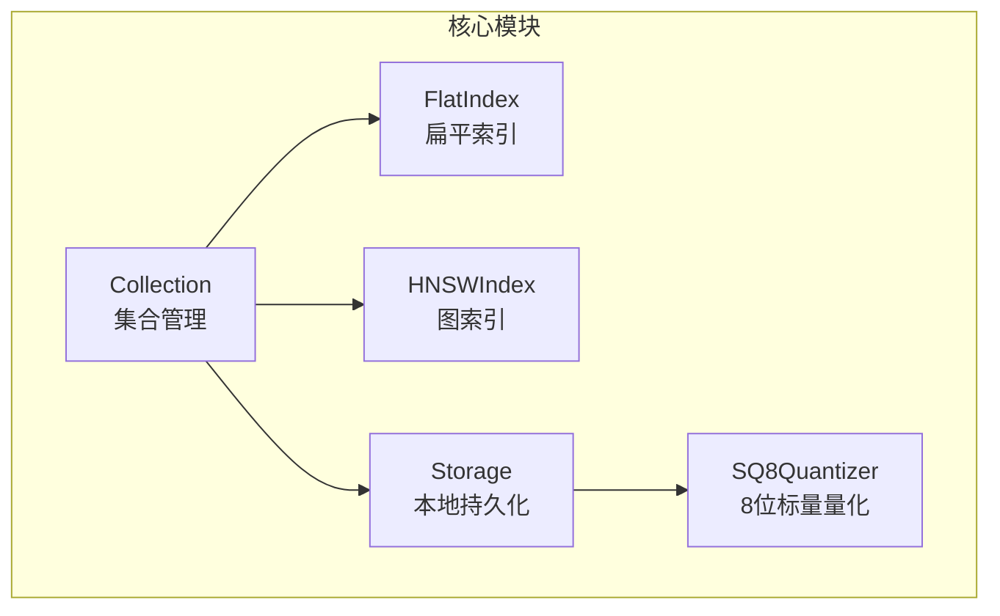
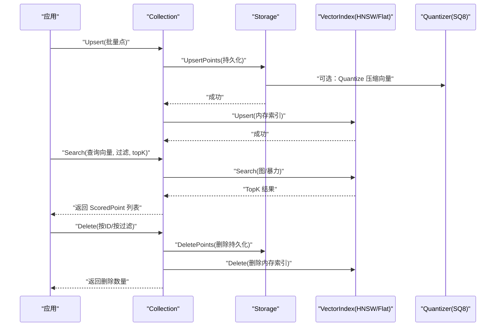
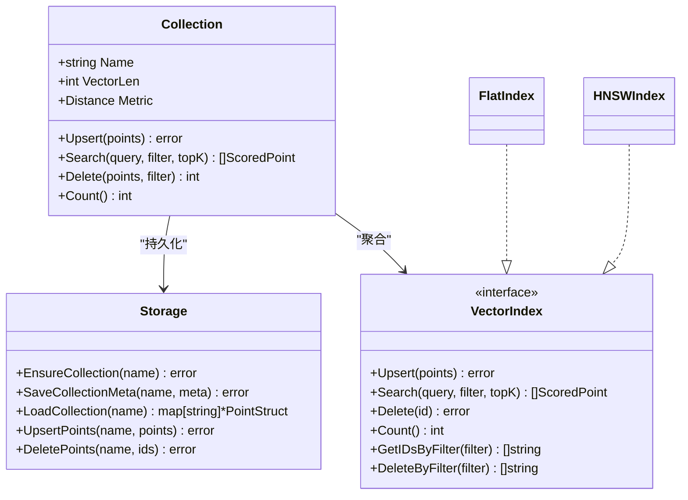
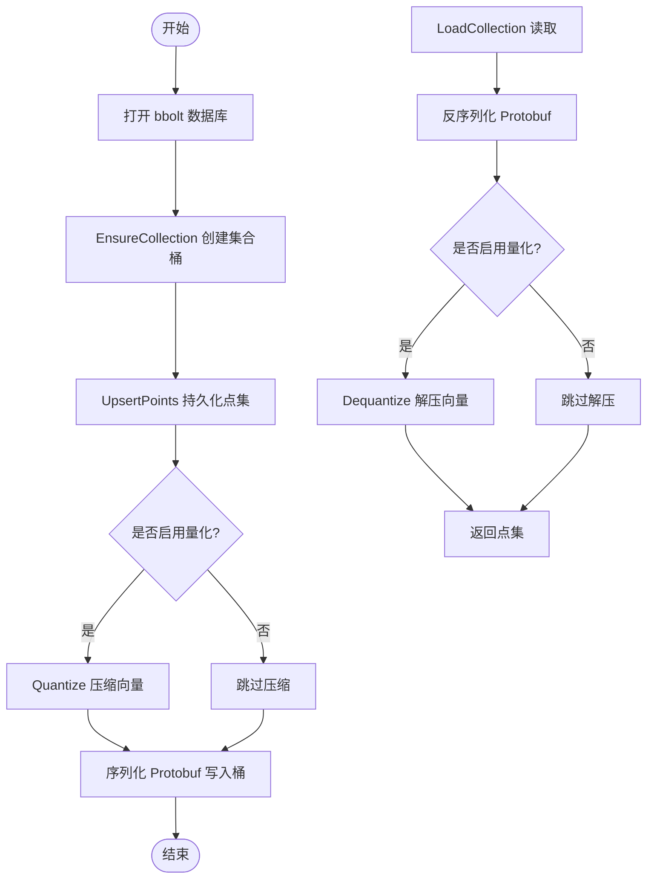
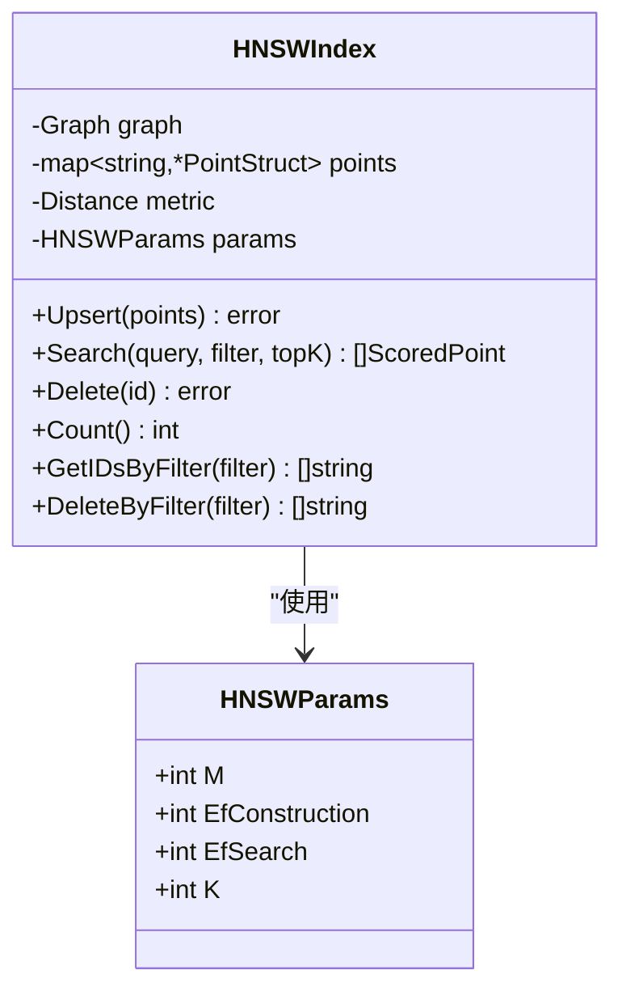
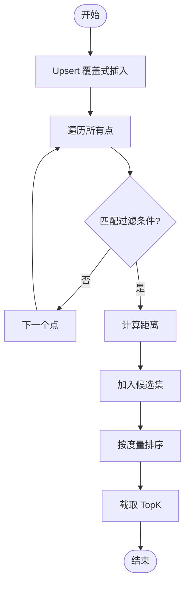
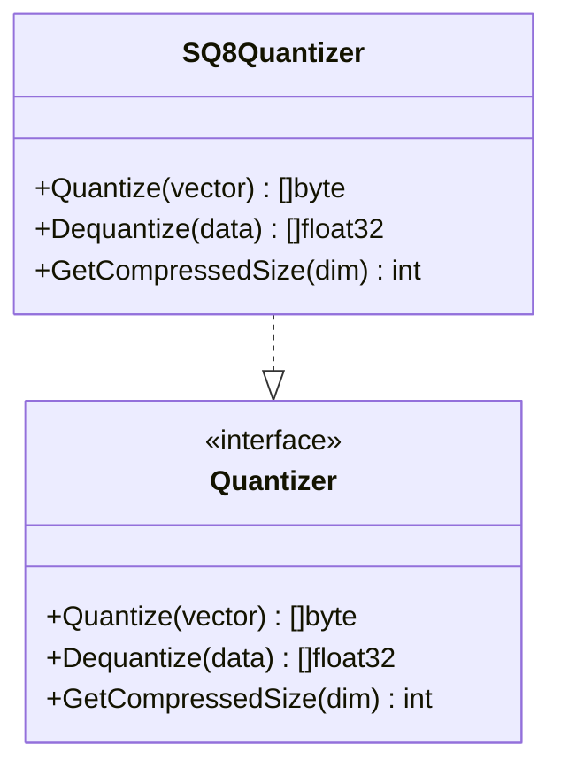
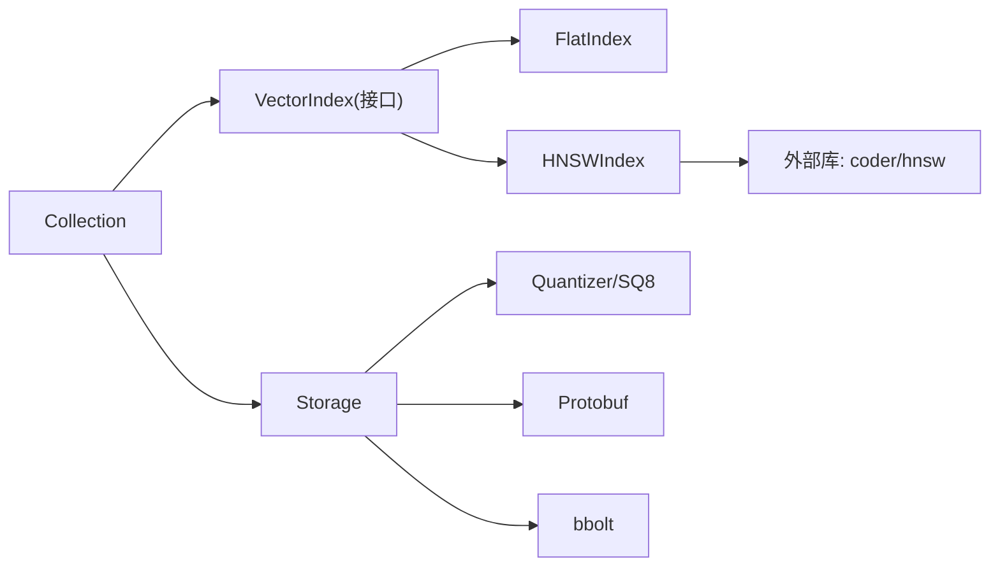

# 核心模块

<cite>
**本文引用的文件列表**
- [collection.go](file://core/collection.go)
- [storage.go](file://core/storage.go)
- [hnsw_index.go](file://core/hnsw_index.go)
- [flat_index.go](file://core/flat_index.go)
- [quantization.go](file://core/quantization.go)
- [index.go](file://core/index.go)
- [models.go](file://core/models.go)
- [math.go](file://core/math.go)
- [README.md](file://README.md)
- [collection_test.go](file://core/collection_test.go)
- [storage_test.go](file://core/storage_test.go)
- [main.go](file://example/embedded/main.go)
</cite>

## 目录
1. [简介](#简介)
2. [项目结构](#项目结构)
3. [核心组件](#核心组件)
4. [架构总览](#架构总览)
5. [详细组件分析](#详细组件分析)
6. [依赖关系分析](#依赖关系分析)
7. [性能考量](#性能考量)
8. [故障排查指南](#故障排查指南)
9. [结论](#结论)
10. [附录：使用示例与最佳实践](#附录使用示例与最佳实践)

## 简介
本文件为 GoVector 核心模块的综合技术文档，聚焦以下关键子系统：
- Collection 集合管理：统一的向量集合抽象，负责 Upsert/Search/Delete 的一致性控制与线程安全。
- Storage 存储引擎：基于 bbolt（BoltDB）与 Protocol Buffers 的本地持久化层，支持元数据与点集的读写。
- HNSWIndex 图索引：基于图的近似最近邻搜索，适合大规模高维向量检索。
- FlatIndex 扁平索引：暴力检索策略，适合小中规模数据或需要精确结果的场景。
- Quantization 量化系统：8位标量量化（SQ8），降低存储与内存占用，提升吞吐。

文档同时提供模块间协作关系、数据流、使用模式、性能特征与适用场景，并给出面向初学者的概念解释与面向专家的实现细节与扩展建议。

## 项目结构
核心模块位于 core 目录，围绕“集合-索引-存储”三层设计组织：
- 接口层：VectorIndex 定义统一索引接口，支持透明切换 Flat/HNSW。
- 实现层：FlatIndex 与 HNSWIndex 分别实现 VectorIndex；Collection 聚合两者与 Storage。
- 数据模型层：PointStruct、ScoredPoint、Filter、CollectionMeta 等定义数据结构与过滤规则。
- 数学与度量：Distance 枚举与 CalculateDistance 实现 Cosine/Euclid/Dot。
- 量化：Quantizer 接口与 SQ8Quantizer 实现，配合 Storage 提供可选压缩。

图表来源
- [collection.go:12-20](file://core/collection.go#L12-L20)
- [storage.go:15-20](file://core/storage.go#L15-L20)
- [flat_index.go:13-17](file://core/flat_index.go#L13-L17)
- [hnsw_index.go:44-50](file://core/hnsw_index.go#L44-L50)
- [quantization.go:24](file://core/quantization.go#L24)

章节来源
- [README.md:122-127](file://README.md#L122-L127)

## 核心组件
- Collection：集合抽象，封装 Upsert/Search/Delete 操作，确保存储与内存索引的一致性；支持 HNSW 或 Flat 两种索引策略。
- Storage：BoltDB + Protobuf 的持久化引擎，提供集合桶、元数据桶、点集读写、删除与集合枚举。
- VectorIndex 接口：统一的索引接口，定义 Upsert/Search/Delete/Count/按过滤条件查询/按过滤条件删除。
- FlatIndex：内存中存储所有向量，暴力计算距离，返回精确结果，适合小中规模。
- HNSWIndex：Hierarchical Navigable Small World 图，支持近似检索，复杂度近似 O(log N)，适合大规模。
- Quantizer/SQ8Quantizer：向量压缩到 8 位整数，减少磁盘与内存占用，加载时自动解压。
- 数据模型与过滤：PointStruct/ScoredPoint/Filter/CollectionMeta；MatchFilter 支持 Must/MustNot 与多种匹配类型。

章节来源
- [collection.go:9-20](file://core/collection.go#L9-L20)
- [storage.go:13-20](file://core/storage.go#L13-L20)
- [index.go:5-28](file://core/index.go#L5-L28)
- [flat_index.go:9-17](file://core/flat_index.go#L9-L17)
- [hnsw_index.go:41-50](file://core/hnsw_index.go#L41-L50)
- [quantization.go:5-18](file://core/quantization.go#L5-L18)
- [models.go:5-29](file://core/models.go#L5-L29)

## 架构总览
下图展示了 Collection、Storage、VectorIndex（Flat/HNSW）、Quantization 的整体交互与数据流。

图表来源
- [collection.go:97-133](file://core/collection.go#L97-L133)
- [collection.go:135-147](file://core/collection.go#L135-L147)
- [collection.go:162-197](file://core/collection.go#L162-L197)
- [storage.go:148-187](file://core/storage.go#L148-L187)
- [storage.go:189-235](file://core/storage.go#L189-L235)
- [hnsw_index.go:108-124](file://core/hnsw_index.go#L108-L124)
- [flat_index.go:27-38](file://core/flat_index.go#L27-L38)
- [quantization.go:32-76](file://core/quantization.go#L32-L76)

## 详细组件分析

### Collection 集合管理
- 职责
  - 统一的 Upsert/Search/Delete 入口，保证存储与内存索引一致性。
  - 在启用 Storage 时，自动保存集合元信息与加载历史点集。
  - 通过互斥锁保障并发安全。
- 关键流程
  - 初始化：根据 useHNSW 决定创建 HNSWIndex 或 FlatIndex；若提供 Storage，则确保集合存在、保存元信息、加载点集并批量 Upsert 到索引。
  - Upsert：先持久化，再更新内存索引；失败时尝试回滚（best-effort）。
  - Search：校验查询向量维度后委托索引执行。
  - Delete：支持按 ID 或过滤器删除；先删持久化，再删内存索引。
- 公共接口与参数
  - NewCollection/NewCollectionWithParams：选择 HNSW/Flat，可传入自定义 HNSW 参数。
  - Upsert(points)、Search(query, filter, topK)、Delete(points, filter)、Count()。
- 使用模式
  - 作为嵌入式库：直接构造 Collection 并调用方法。
  - 与 Storage 协作：在重启后自动恢复集合与点集。

图表来源
- [collection.go:12-20](file://core/collection.go#L12-L20)
- [index.go:7-28](file://core/index.go#L7-L28)
- [flat_index.go:13-17](file://core/flat_index.go#L13-L17)
- [hnsw_index.go:44-50](file://core/hnsw_index.go#L44-L50)

章节来源
- [collection.go:22-91](file://core/collection.go#L22-L91)
- [collection.go:97-133](file://core/collection.go#L97-L133)
- [collection.go:135-147](file://core/collection.go#L135-L147)
- [collection.go:162-197](file://core/collection.go#L162-L197)

### Storage 存储引擎
- 职责
  - 以集合为桶（bucket）组织数据，使用 bbolt 存储；元信息单独存于特殊桶。
  - 通过 Protobuf 序列化点结构，兼容 Payload 多类型。
  - 可选启用 SQ8 量化：在存储前压缩向量，在加载时解压。
- 关键能力
  - EnsureCollection、ListCollections、UpsertPoints、LoadCollection、DeletePoints。
  - SaveCollectionMeta、LoadCollectionMeta、ListCollectionMetas。
  - 关闭状态检查与错误处理。
- 性能与可靠性
  - 基于 bbolt 的事务读写，保证一致性；关闭后禁止操作。
  - 量化可显著降低磁盘占用，加载时解压，内存中仍为浮点向量。

图表来源
- [storage.go:88-114](file://core/storage.go#L88-L114)
- [storage.go:131-142](file://core/storage.go#L131-L142)
- [storage.go:144-187](file://core/storage.go#L144-L187)
- [storage.go:189-235](file://core/storage.go#L189-L235)
- [storage.go:261-307](file://core/storage.go#L261-L307)
- [storage.go:309-336](file://core/storage.go#L309-L336)

章节来源
- [storage.go:88-114](file://core/storage.go#L88-L114)
- [storage.go:131-142](file://core/storage.go#L131-L142)
- [storage.go:144-187](file://core/storage.go#L144-L187)
- [storage.go:189-235](file://core/storage.go#L189-L235)
- [storage.go:261-307](file://core/storage.go#L261-L307)
- [storage.go:309-336](file://core/storage.go#L309-L336)

### HNSWIndex 图索引
- 职责
  - 基于图的近似最近邻搜索，支持 Cosine/Euclid/Dot 三种度量。
  - 通过参数 M/EfConstruction/EfSearch/K 控制构建与搜索行为。
- 关键流程
  - 构造：根据度量设置距离函数，初始化底层图并应用参数。
  - Upsert：将点加入图与本地映射（用于快速元数据访问）。
  - Search：先从图中 over-fetch，再应用过滤与精确打分，返回 TopK。
  - Delete/Count/GetIDsByFilter/DeleteByFilter：维护图与映射一致性。
- 参数与默认值
  - M 默认 16，EfConstruction 默认 200，EfSearch 默认 64，K 默认 10。
- 适用场景
  - 大规模高维向量检索，追求低延迟与高吞吐。

图表来源
- [hnsw_index.go:44-50](file://core/hnsw_index.go#L44-L50)
- [hnsw_index.go:11-29](file://core/hnsw_index.go#L11-L29)
- [hnsw_index.go:59-106](file://core/hnsw_index.go#L59-L106)
- [hnsw_index.go:108-124](file://core/hnsw_index.go#L108-L124)
- [hnsw_index.go:126-176](file://core/hnsw_index.go#L126-L176)
- [hnsw_index.go:178-229](file://core/hnsw_index.go#L178-L229)

章节来源
- [hnsw_index.go:11-29](file://core/hnsw_index.go#L11-L29)
- [hnsw_index.go:59-106](file://core/hnsw_index.go#L59-L106)
- [hnsw_index.go:108-124](file://core/hnsw_index.go#L108-L124)
- [hnsw_index.go:126-176](file://core/hnsw_index.go#L126-L176)
- [hnsw_index.go:178-229](file://core/hnsw_index.go#L178-L229)

### FlatIndex 扁平索引
- 职责
  - 内存中存储所有向量，暴力遍历计算距离，返回精确结果。
- 关键流程
  - Upsert：覆盖式插入。
  - Search：按过滤条件筛选，计算距离并排序，返回 TopK。
  - Delete/Count/GetIDsByFilter/DeleteByFilter：基于内存映射。
- 适用场景
  - 小中规模数据、需要精确检索、或对延迟要求极低且数据量可控。

图表来源
- [flat_index.go:27-38](file://core/flat_index.go#L27-L38)
- [flat_index.go:40-74](file://core/flat_index.go#L40-L74)
- [flat_index.go:76-87](file://core/flat_index.go#L76-L87)
- [flat_index.go:89-124](file://core/flat_index.go#L89-L124)

章节来源
- [flat_index.go:9-17](file://core/flat_index.go#L9-L17)
- [flat_index.go:27-38](file://core/flat_index.go#L27-L38)
- [flat_index.go:40-74](file://core/flat_index.go#L40-L74)
- [flat_index.go:76-87](file://core/flat_index.go#L76-L87)
- [flat_index.go:89-124](file://core/flat_index.go#L89-L124)

### Quantization 量化系统
- 职责
  - 定义 Quantizer 接口，提供 Quantize/Dequantize 与压缩尺寸估算。
  - SQ8Quantizer：将浮点向量压缩为 8 位整数，保留 min/max 以便解压。
- 工作机制
  - 压缩：扫描向量找到 min/max，按比例映射到 [0,255]，并偏移至 [-128,127] 存储。
  - 解压：读取 min/max，按比例还原为浮点向量。
  - 存储：当启用量化时，将压缩数据放入 Payload 的特定键，原向量置空或仅保留必要字段。
- 性能与精度
  - 显著降低存储与内存占用；解压成本低，适合大规模数据。
  - 由于量化引入误差，Cosine/Dot 场景通常影响较小，Euclid 场景需关注阈值调整。

图表来源
- [quantization.go:5-18](file://core/quantization.go#L5-L18)
- [quantization.go:20-29](file://core/quantization.go#L20-L29)
- [quantization.go:31-76](file://core/quantization.go#L31-L76)
- [quantization.go:78-104](file://core/quantization.go#L78-L104)
- [quantization.go:106-109](file://core/quantization.go#L106-L109)

章节来源
- [quantization.go:5-18](file://core/quantization.go#L5-L18)
- [quantization.go:20-29](file://core/quantization.go#L20-L29)
- [quantization.go:31-76](file://core/quantization.go#L31-L76)
- [quantization.go:78-104](file://core/quantization.go#L78-L104)
- [quantization.go:106-109](file://core/quantization.go#L106-L109)

## 依赖关系分析
- 组件耦合
  - Collection 与 Storage 强耦合：Collection 在初始化与 Upsert/Delete 时依赖 Storage 的持久化能力。
  - Collection 与 VectorIndex 松耦合：通过 VectorIndex 接口抽象，可透明切换 Flat/HNSW。
  - Storage 与 Quantizer：可选依赖，通过布尔开关与接口注入。
  - HNSWIndex 依赖外部图库（coder/hnsw），内部封装距离函数与参数。
- 外部依赖
  - bbolt：本地键值数据库。
  - protobuf：点结构序列化。
  - coder/hnsw：HNSW 图算法库。
- 循环依赖
  - 未发现循环依赖；各模块职责清晰，接口边界明确。

图表来源
- [collection.go:17-19](file://core/collection.go#L17-L19)
- [storage.go:15-20](file://core/storage.go#L15-L20)
- [hnsw_index.go:3-9](file://core/hnsw_index.go#L3-L9)
- [index.go:7-28](file://core/index.go#L7-L28)

章节来源
- [collection.go:17-19](file://core/collection.go#L17-L19)
- [storage.go:15-20](file://core/storage.go#L15-L20)
- [hnsw_index.go:3-9](file://core/hnsw_index.go#L3-L9)
- [index.go:7-28](file://core/index.go#L7-L28)

## 性能考量
- 向量维度与规模
  - FlatIndex：O(N) 搜索，适合中小规模；维度越高，遍历成本越大。
  - HNSWIndex：近似检索，构建时间较长但查询极快，适合大规模高维向量。
- 度量选择
  - Cosine/Dot：适合归一化或方向敏感场景，更高相似度意味着更接近。
  - Euclid：适合绝对距离敏感场景，越小越相似。
- 量化
  - SQ8 显著降低存储与内存占用，加载时解压成本低；对 Cosine/Dot 影响较小，Euclid 需注意阈值调整。
- 并发与一致性
  - Collection 使用读写锁保护；Upsert/Delete 严格遵循“先持久化，后索引”的顺序，失败时尽力回滚。
- 基准参考
  - README 提供了不同规模与索引下的延迟与吞吐对比，可据此评估部署规模与参数。

章节来源
- [README.md:60-71](file://README.md#L60-L71)
- [math.go:24-38](file://core/math.go#L24-L38)
- [quantization.go:106-109](file://core/quantization.go#L106-L109)

## 故障排查指南
- 常见错误与定位
  - 向量维度不匹配：Upsert/Search/Delete 前会校验维度，不一致将报错。
  - 查询向量维度不匹配：Search 会检查维度。
  - 删除参数缺失：Delete 必须提供 points 或 filter。
  - 存储已关闭：调用存储方法时若已 Close 将报错。
  - 加载点维度不一致：Collection 初始化时会验证加载点维度，不一致将报错。
  - 索引 Upsert 失败：Collection 会在持久化成功后更新索引，若失败会尽力回滚。
- 建议排查步骤
  - 确认 Collection 初始化参数（维度、度量、是否启用 HNSW）与实际数据一致。
  - 检查 Storage 是否正确打开且未关闭。
  - 若启用量化，确认压缩/解压路径正常，避免在 Payload 中误删压缩键。
  - 对 HNSW 参数进行基准测试，逐步调整 EfConstruction/EfSearch 以平衡精度与速度。
- 相关测试参考
  - 集合与存储的单元测试覆盖了 Upsert/Search/Delete、错误处理与回滚逻辑。

章节来源
- [collection.go:101-130](file://core/collection.go#L101-L130)
- [collection.go:139-141](file://core/collection.go#L139-L141)
- [collection.go:173-175](file://core/collection.go#L173-L175)
- [storage.go:149-151](file://core/storage.go#L149-L151)
- [storage.go:341-359](file://core/storage.go#L341-L359)
- [collection_test.go:166-191](file://core/collection_test.go#L166-L191)
- [storage_test.go:266-291](file://core/storage_test.go#L266-L291)

## 结论
GoVector 的核心模块以 Collection 为中心，通过 VectorIndex 抽象实现了对 Flat/HNSW 的透明切换；Storage 提供可靠的本地持久化与可选量化能力；Quantization 进一步优化了存储与内存占用。整体设计兼顾易用性与高性能，既可作为嵌入式库直接集成，也可作为轻量微服务对外提供 Qdrant 兼容 API。对于大规模场景优先推荐 HNSW + 量化组合，小规模或需要精确检索的场景可采用 Flat。

## 附录：使用示例与最佳实践
- 嵌入式库使用（零网络开销）
  - 初始化 Storage，创建 Collection，Upsert 点集，Search 时可带过滤条件，Delete 支持按 ID 或过滤器。
  - 示例参考：[embedded/main.go:10-62](file://example/embedded/main.go#L10-L62)
- 服务器模式（Qdrant 兼容 API）
  - 通过命令行启动服务，即可获得标准 REST API。
  - 参考 README 的启动与 API 描述：[README.md:109-119](file://README.md#L109-L119)
- 最佳实践
  - 选择合适的索引：小规模/精确需求用 Flat；大规模/低延迟用 HNSW。
  - 合理设置 HNSW 参数：EfConstruction 控制构建质量，EfSearch 控制查询召回与延迟。
  - 启用量化：在满足精度前提下显著节省存储与内存。
  - 过滤策略：尽量使用精确匹配与范围匹配，避免复杂正则导致的性能下降。
  - 版本与一致性：利用 Collection 的版本号与存储优先写入策略，确保一致性。

章节来源
- [README.md:74-119](file://README.md#L74-L119)
- [example/embedded/main.go:10-62](file://example/embedded/main.go#L10-L62)