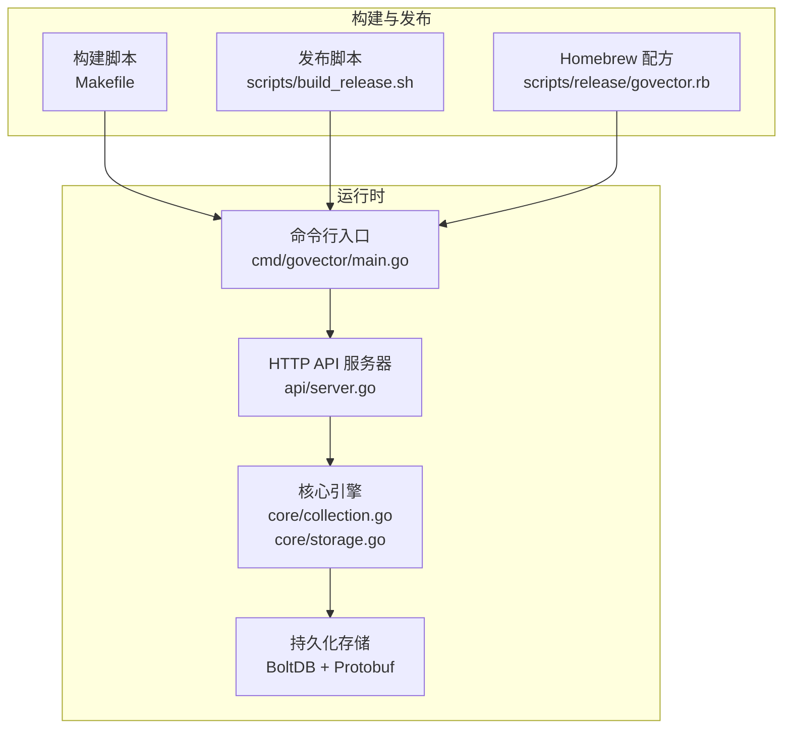
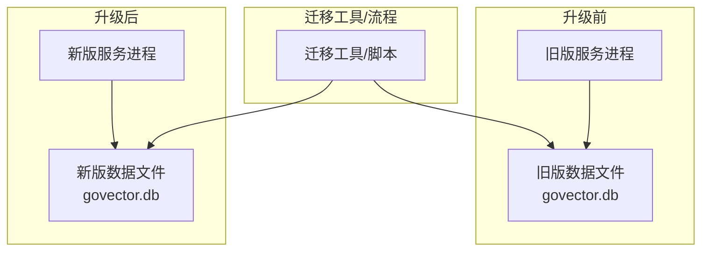
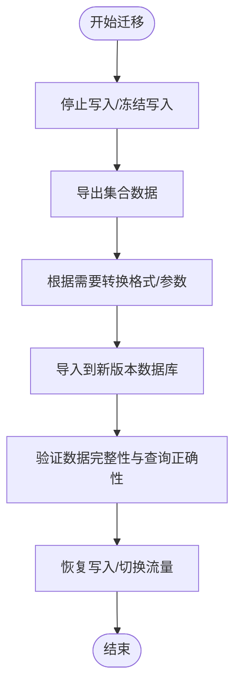
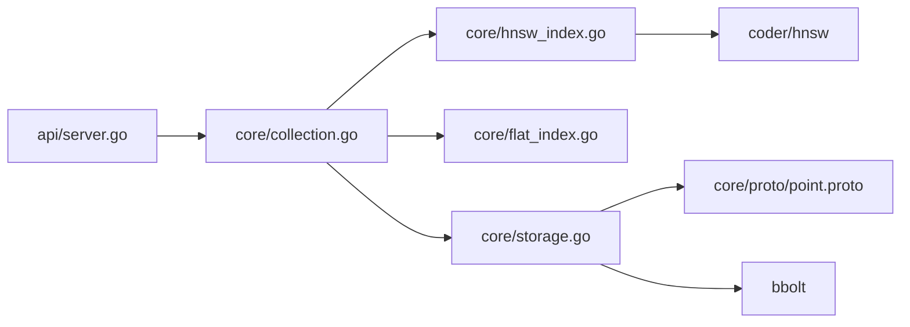

# 升级迁移

<cite>
**本文引用的文件**
- [README.md](file://README.md)
- [go.mod](file://go.mod)
- [Makefile](file://Makefile)
- [cmd/govector/main.go](file://cmd/govector/main.go)
- [api/server.go](file://api/server.go)
- [core/models.go](file://core/models.go)
- [core/storage.go](file://core/storage.go)
- [core/collection.go](file://core/collection.go)
- [core/quantization.go](file://core/quantization.go)
- [core/hnsw_index.go](file://core/hnsw_index.go)
- [core/flat_index.go](file://core/flat_index.go)
- [core/proto/point.proto](file://core/proto/point.proto)
- [scripts/release/govector.rb](file://scripts/release/govector.rb)
- [scripts/build_release.sh](file://scripts/build_release.sh)
</cite>

## 目录
1. [简介](#简介)
2. [项目结构](#项目结构)
3. [核心组件](#核心组件)
4. [架构总览](#架构总览)
5. [详细组件分析](#详细组件分析)
6. [依赖关系分析](#依赖关系分析)
7. [性能考量](#性能考量)
8. [故障排查指南](#故障排查指南)
9. [结论](#结论)
10. [附录](#附录)

## 简介
本指南面向从旧版本升级到新版本的 GoVector 用户，提供版本兼容性检查方法、升级前准备、渐进式升级策略（蓝绿与滚动）、数据格式与迁移步骤（向量与元数据）、配置文件差异与迁移注意事项、回滚与应急处理、升级测试与验证方法，以及多节点集群协调升级步骤。目标是帮助您以低风险、可追踪的方式完成升级。

## 项目结构
GoVector 采用“命令行入口 + API 服务 + 核心引擎”的分层组织方式：
- 命令行入口：启动独立服务或嵌入式库
- API 层：提供与 Qdrant 兼容的 REST 接口
- 核心层：集合管理、索引（HNSW/Flat）、存储（BoltDB + Protobuf）
- 构建与发布：跨平台打包与 Homebrew 配方

图表来源
- [cmd/govector/main.go:18-92](file://cmd/govector/main.go#L18-L92)
- [api/server.go:54-95](file://api/server.go#L54-L95)
- [core/collection.go:22-91](file://core/collection.go#L22-L91)
- [core/storage.go:88-114](file://core/storage.go#L88-L114)
- [Makefile:9-22](file://Makefile#L9-L22)
- [scripts/build_release.sh:15-78](file://scripts/build_release.sh#L15-L78)
- [scripts/release/govector.rb:25-40](file://scripts/release/govector.rb#L25-L40)

章节来源
- [README.md:16-42](file://README.md#L16-L42)
- [go.mod:1-19](file://go.mod#L1-L19)
- [Makefile:1-35](file://Makefile#L1-L35)

## 核心组件
- 存储与序列化：基于 bbolt 的本地存储，使用 Protobuf 序列化点数据；支持可选的向量量化（SQ8）。
- 集合与元数据：每个集合对应 bbolt 中的一个桶，并在特殊元数据桶中保存集合配置（维度、度量、是否启用 HNSW 及参数）。
- 索引：支持 Flat（精确）与 HNSW（近似）两种索引，HNSW 参数可调。
- API：提供集合管理与点操作的 REST 接口，自动加载持久化集合。
- 量化器：提供 8 位标量量化接口及实现，用于降低磁盘占用与内存压力。

章节来源
- [core/storage.go:13-20](file://core/storage.go#L13-L20)
- [core/models.go:71-79](file://core/models.go#L71-L79)
- [core/hnsw_index.go:41-50](file://core/hnsw_index.go#L41-L50)
- [core/flat_index.go:9-17](file://core/flat_index.go#L9-L17)
- [api/server.go:54-95](file://api/server.go#L54-L95)
- [core/quantization.go:5-18](file://core/quantization.go#L5-L18)

## 架构总览
下图展示升级前后系统交互与数据流变化的关键点，便于识别兼容性风险与迁移路径。

图表来源
- [cmd/govector/main.go:27-36](file://cmd/govector/main.go#L27-L36)
- [core/storage.go:88-114](file://core/storage.go#L88-L114)

## 详细组件分析

### 版本兼容性检查与升级前准备
- 语言与依赖版本
  - Go 版本要求：模块声明的 Go 版本需满足新版本要求。
  - 外部依赖：HNSW、bbolt、Protobuf 等版本变更可能影响行为或性能。
- 数据文件与元数据
  - 集合元数据保存在特殊元数据桶中，重启时自动加载。
  - 启动时会读取集合元数据并重建集合实例，确保配置一致性。
- 配置项与参数
  - HNSW 参数（M、EfConstruction、EfSearch、K）在集合元数据中持久化，升级后仍可恢复。
  - 量化开关与量化器实现由存储初始化时决定，升级后可保持一致或按需切换。

章节来源
- [go.mod:3-9](file://go.mod#L3-L9)
- [core/storage.go:261-336](file://core/storage.go#L261-L336)
- [api/server.go:97-129](file://api/server.go#L97-L129)
- [core/hnsw_index.go:11-29](file://core/hnsw_index.go#L11-L29)

### 渐进式升级策略
- 蓝绿部署
  - 准备两套环境：当前（蓝色）与新建（绿色）。
  - 将流量从蓝色切换至绿色，验证无误后再关闭蓝色。
  - 适用于需要零停机且可快速回切的场景。
- 滚动升级
  - 分批重启节点，每次只替换一部分实例，持续监控健康状态。
  - 适合在线服务，降低单次变更的影响面。
- 多节点集群协调
  - 统一版本与配置，先升级控制面（如配置中心），再逐节点滚动升级。
  - 升级期间保持对外服务可用，必要时降级为只读或短暂停机窗口。

[本节为通用策略说明，不直接分析具体文件，故无章节来源]

### 数据格式变更与迁移步骤
- Protobuf 数据模型
  - 点结构包含 id、向量数组、payload 映射；分数结果包含 id、version、score、payload。
  - 条件与过滤器支持多种匹配类型（精确、范围、前缀、包含、正则）。
- 向量数据迁移
  - 若启用量化，向量在存储前会被压缩，加载时解压；升级后可保留或切换量化策略。
  - 迁移时建议先停止写入，导出全部集合，再导入到新版本数据库。
- 元数据迁移
  - 集合元数据（名称、维度、度量、HNSW 开关与参数）保存在元数据桶中，升级后自动恢复。
  - 迁移时应确保元数据桶存在且可读，避免启动失败。

图表来源
- [core/proto/point.proto:7-28](file://core/proto/point.proto#L7-L28)
- [core/storage.go:144-187](file://core/storage.go#L144-L187)
- [core/storage.go:189-235](file://core/storage.go#L189-L235)
- [core/storage.go:261-336](file://core/storage.go#L261-L336)

章节来源
- [core/proto/point.proto:1-49](file://core/proto/point.proto#L1-L49)
- [core/models.go:50-69](file://core/models.go#L50-L69)
- [core/storage.go:144-235](file://core/storage.go#L144-L235)

### 配置文件版本差异与迁移注意事项
- 命令行参数
  - 服务端口、数据库路径、是否启用 HNSW 等参数在启动时解析。
  - 升级后若新增参数，需在启动脚本中补充。
- API 配置
  - API 服务器自动加载持久化集合，无需手动维护集合列表。
- Homebrew 服务配置
  - 服务配方定义了默认端口、数据库路径与启动参数，升级后需同步更新。
- 构建与发布
  - 跨平台打包脚本会生成各平台归档与校验和，升级版本号与校验和需同步更新。

章节来源
- [cmd/govector/main.go:18-23](file://cmd/govector/main.go#L18-L23)
- [api/server.go:54-95](file://api/server.go#L54-L95)
- [scripts/release/govector.rb:25-40](file://scripts/release/govector.rb#L25-L40)
- [scripts/build_release.sh:80-115](file://scripts/build_release.sh#L80-L115)

### 升级回滚策略与应急处理
- 回滚策略
  - 保留旧版本二进制与数据文件副本，回滚时恢复旧版本并重新启动。
  - 若启用量化，回滚后可关闭量化以避免兼容性问题。
- 应急处理
  - 启动失败：检查日志与元数据桶是否存在；确认集合维度与度量一致。
  - 查询异常：检查索引参数与过滤条件；必要时回退到 Flat 索引进行对比验证。
  - 写入失败：检查存储权限与磁盘空间；必要时清理损坏的桶或修复元数据。

章节来源
- [cmd/govector/main.go:70-88](file://cmd/govector/main.go#L70-L88)
- [core/storage.go:261-336](file://core/storage.go#L261-L336)
- [core/hnsw_index.go:126-176](file://core/hnsw_index.go#L126-L176)

### 升级测试流程与验证方法
- 功能验证
  - 创建/删除集合、批量写入、检索与过滤、删除等基本操作。
- 性能验证
  - 在相同硬件与数据规模下对比延迟与吞吐，确保升级未引入性能退化。
- 兼容性验证
  - 对比不同版本的查询结果一致性，尤其是启用/关闭量化时。
- 压力测试
  - 模拟高并发写入与查询，观察系统稳定性与资源占用。

章节来源
- [README.md:60-71](file://README.md#L60-L71)
- [Makefile:24-27](file://Makefile#L24-L27)

## 依赖关系分析
- 外部依赖
  - HNSW 图算法库：提供近似最近邻搜索能力。
  - bbolt：键值数据库，提供事务与持久化。
  - Protobuf：序列化点与元数据。
- 内部耦合
  - API 层依赖核心引擎；核心引擎依赖存储层；集合与索引相互协作。
  - 量化器可插拔，不影响上层接口与数据模型。

图表来源
- [api/server.go:16-24](file://api/server.go#L16-L24)
- [core/collection.go:9-20](file://core/collection.go#L9-L20)
- [core/storage.go:3-11](file://core/storage.go#L3-L11)
- [core/hnsw_index.go:8](file://core/hnsw_index.go#L8)
- [go.mod:5-9](file://go.mod#L5-L9)

章节来源
- [go.mod:1-19](file://go.mod#L1-L19)

## 性能考量
- HNSW 参数调优
  - M、EfConstruction、EfSearch、K 影响构建与查询性能，需结合业务场景调整。
- 量化策略
  - SQ8 可显著降低存储与内存占用，但会引入压缩/解压开销；需权衡精度与性能。
- 并发与锁
  - 集合与索引均采用读写锁保护，升级后建议评估高并发下的锁竞争情况。

章节来源
- [core/hnsw_index.go:11-29](file://core/hnsw_index.go#L11-L29)
- [core/quantization.go:20-104](file://core/quantization.go#L20-L104)
- [core/collection.go:93-133](file://core/collection.go#L93-L133)

## 故障排查指南
- 启动失败
  - 检查数据库文件权限与路径；确认元数据桶存在且可读。
- 查询异常
  - 核对查询向量维度与集合维度一致；检查过滤条件与 payload 类型。
- 写入失败
  - 查看存储错误日志；确认 bbolt 事务成功提交；必要时回滚并重试。
- 服务优雅停机
  - 通过信号触发优雅停机，确保未完成请求处理完毕与资源释放。

章节来源
- [cmd/govector/main.go:70-88](file://cmd/govector/main.go#L70-L88)
- [api/server.go:131-143](file://api/server.go#L131-L143)
- [core/storage.go:144-187](file://core/storage.go#L144-L187)

## 结论
通过遵循本指南中的兼容性检查、渐进式升级策略、数据迁移步骤与测试验证流程，您可以安全地将 GoVector 从旧版本平滑升级到新版本。建议在非生产环境先行演练，再在生产环境中按批次执行，并准备好回滚预案与应急响应流程。

## 附录
- 构建与发布
  - 使用 Makefile 构建二进制；使用发布脚本生成跨平台归档与 Homebrew 配方。
- 版本号与校验和
  - 发布脚本会自动更新版本号与各平台校验和，确保安装一致性。

章节来源
- [Makefile:9-22](file://Makefile#L9-L22)
- [scripts/build_release.sh:80-115](file://scripts/build_release.sh#L80-L115)
- [scripts/release/govector.rb:4](file://scripts/release/govector.rb#L4)