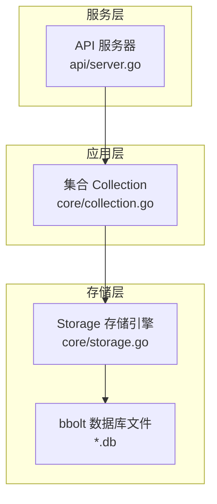
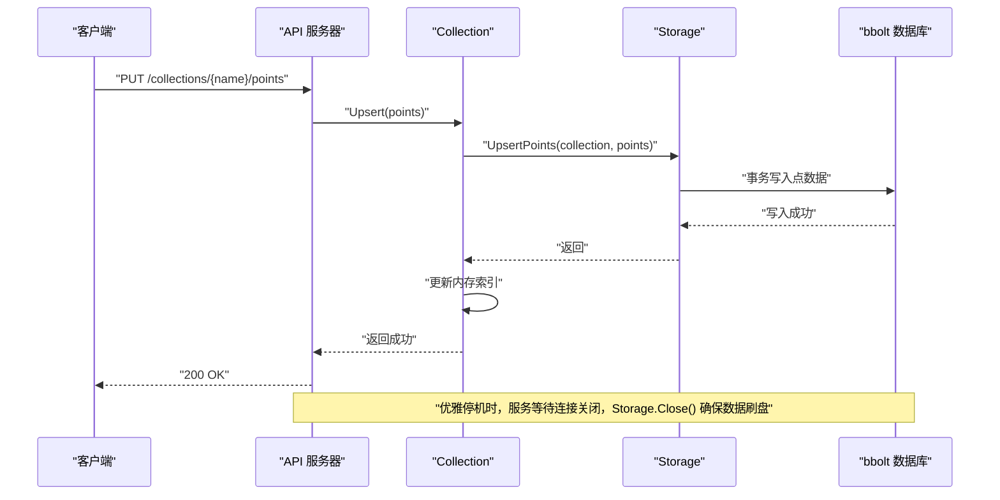
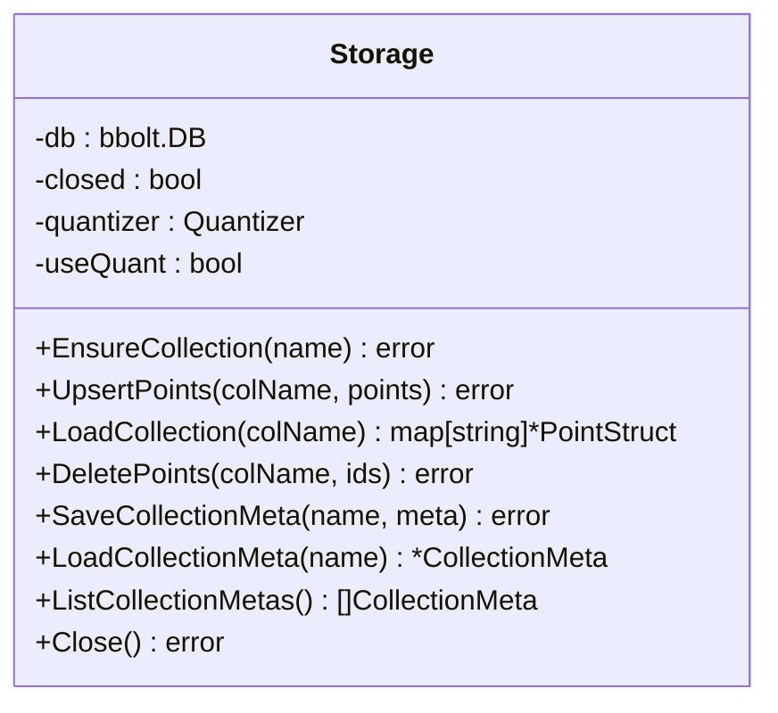
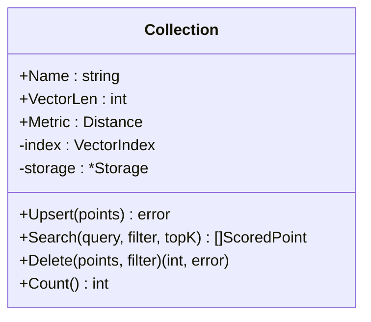
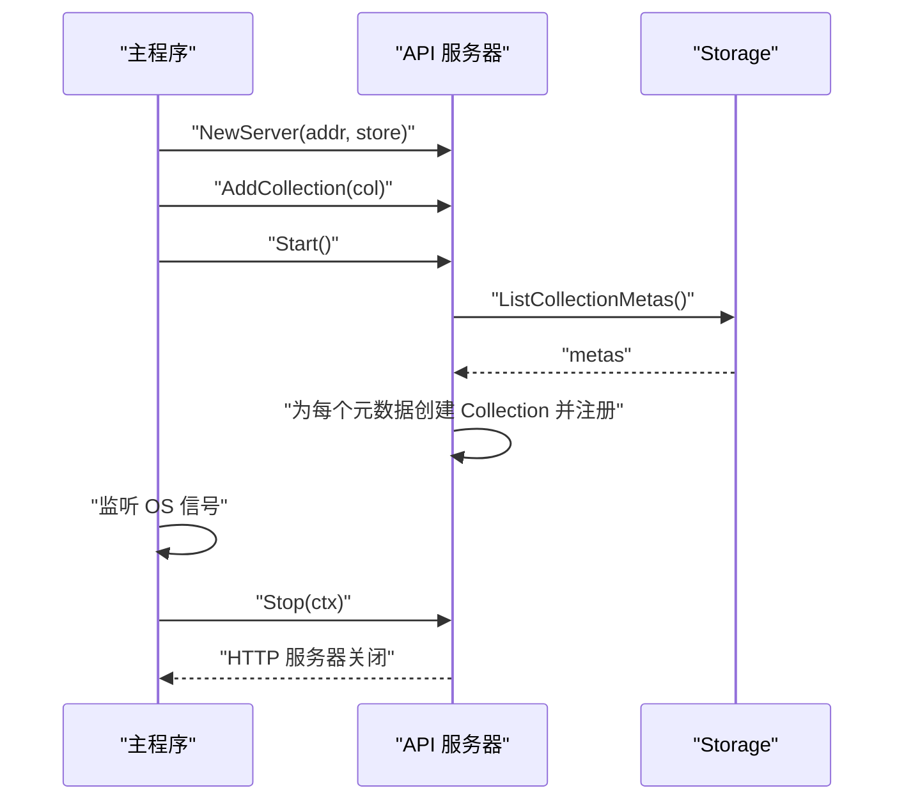
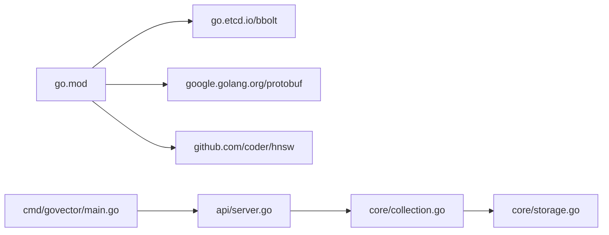

# 备份恢复

<cite>
**本文引用的文件列表**
- [README.md](file://README.md)
- [cmd/govector/main.go](file://cmd/govector/main.go)
- [api/server.go](file://api/server.go)
- [core/storage.go](file://core/storage.go)
- [core/collection.go](file://core/collection.go)
- [go.mod](file://go.mod)
- [Makefile](file://Makefile)
- [demo.sh](file://demo.sh)
- [scripts/build_release.sh](file://scripts/build_release.sh)
</cite>

## 目录
1. [简介](#简介)
2. [项目结构与数据持久化概览](#项目结构与数据持久化概览)
3. [核心组件与备份关系](#核心组件与备份关系)
4. [架构总览](#架构总览)
5. [详细组件分析](#详细组件分析)
6. [依赖关系分析](#依赖关系分析)
7. [性能与可靠性考量](#性能与可靠性考量)
8. [备份策略与实施步骤](#备份策略与实施步骤)
9. [恢复流程与演练](#恢复流程与演练)
10. [灾难恢复与业务连续性](#灾难恢复与业务连续性)
11. [备份验证与恢复测试](#备份验证与恢复测试)
12. [数据迁移与版本升级注意事项](#数据迁移与版本升级注意事项)
13. [故障排查指南](#故障排查指南)
14. [结论](#结论)

## 简介
本文件面向 GoVector 的运维与开发团队，系统化阐述数据备份与恢复策略，覆盖全量与增量备份、自动与手动备份、存储位置与安全、恢复流程（完整与部分）、灾难恢复与业务连续性、验证与测试方法，以及数据迁移与版本升级中的备份要点。GoVector 采用嵌入式存储引擎，基于 bbolt（BoltDB）实现本地持久化，并通过 Protobuf 序列化点数据，确保数据在进程重启后可恢复。

## 项目结构与数据持久化概览
- 存储引擎：bbolt（BoltDB），以键值形式存储集合数据；集合元数据保存在特殊桶中。
- 序列化：点数据使用 Protobuf 编解码；集合元数据使用 JSON。
- 服务模式：支持作为独立微服务运行，也支持以嵌入式库方式集成到应用中。
- 关键路径：
  - 服务入口：命令行参数指定数据库文件路径与端口。
  - API 层：提供集合管理与点操作接口。
  - 存储层：负责集合桶创建、点写入/读取、删除、元数据读写等。

图表来源
- [api/server.go:54-95](file://api/server.go#L54-L95)
- [core/collection.go:22-91](file://core/collection.go#L22-L91)
- [core/storage.go:88-114](file://core/storage.go#L88-L114)

章节来源
- [README.md:16-42](file://README.md#L16-L42)
- [cmd/govector/main.go:18-50](file://cmd/govector/main.go#L18-L50)
- [api/server.go:54-95](file://api/server.go#L54-L95)
- [core/storage.go:13-20](file://core/storage.go#L13-L20)

## 核心组件与备份关系
- Storage：负责集合桶创建、点的 Upsert/Load/Delete、集合元数据的保存与加载。
- Collection：封装集合维度、度量、索引类型与内存索引，提供 Upsert/Search/Delete 等操作；Upsert 会先落盘再更新内存索引。
- API Server：对外暴露 REST 接口，内部持有 Storage 与 Collection，负责优雅停机。
- 服务入口：解析命令行参数，初始化 Storage 与 Collection，启动 API 服务并监听信号进行优雅关闭。

章节来源
- [core/storage.go:131-187](file://core/storage.go#L131-L187)
- [core/collection.go:93-133](file://core/collection.go#L93-L133)
- [api/server.go:16-44](file://api/server.go#L16-L44)
- [cmd/govector/main.go:18-91](file://cmd/govector/main.go#L18-L91)

## 架构总览
下图展示从 API 请求到存储落盘的关键调用链，以及优雅停机对数据一致性的影响。

图表来源
- [api/server.go:145-176](file://api/server.go#L145-L176)
- [core/collection.go:93-133](file://core/collection.go#L93-L133)
- [core/storage.go:144-187](file://core/storage.go#L144-L187)
- [cmd/govector/main.go:70-91](file://cmd/govector/main.go#L70-L91)

## 详细组件分析

### Storage 组件（持久化核心）
- 职责：集合桶管理、点的批量写入/删除、集合元数据保存/读取、集合列表查询。
- 关键点：
  - 集合桶命名即集合名；集合元数据保存在特殊桶中，便于启动时自动重建集合。
  - 写入采用 bbolt 事务，保证原子性；序列化使用 Protobuf，元数据使用 JSON。
  - 支持可选的向量量化（SQ8），在存储前压缩向量并在加载时解压。

图表来源
- [core/storage.go:13-20](file://core/storage.go#L13-L20)
- [core/storage.go:131-187](file://core/storage.go#L131-L187)
- [core/storage.go:261-336](file://core/storage.go#L261-L336)

章节来源
- [core/storage.go:88-114](file://core/storage.go#L88-L114)
- [core/storage.go:131-187](file://core/storage.go#L131-L187)
- [core/storage.go:261-336](file://core/storage.go#L261-L336)

### Collection 组件（集合与索引）
- 职责：封装集合元信息与内存索引，提供 Upsert/Search/Delete。
- 关键点：
  - Upsert 先持久化再更新内存索引，失败时尝试回滚存储侧变更，保持一致性。
  - 支持 Flat/HNSW 两种索引，按需选择。

图表来源
- [core/collection.go:9-20](file://core/collection.go#L9-L20)
- [core/collection.go:93-133](file://core/collection.go#L93-L133)

章节来源
- [core/collection.go:22-91](file://core/collection.go#L22-L91)
- [core/collection.go:93-133](file://core/collection.go#L93-L133)

### API Server 组件（REST 接口与优雅停机）
- 职责：注册集合管理与点操作路由，启动/停止 HTTP 服务，加载集合元数据。
- 关键点：
  - 启动时从存储加载集合元数据并重建集合。
  - 优雅停机通过 context 控制超时，确保请求处理完成后再关闭。

图表来源
- [api/server.go:26-44](file://api/server.go#L26-L44)
- [api/server.go:97-129](file://api/server.go#L97-L129)
- [cmd/govector/main.go:52-91](file://cmd/govector/main.go#L52-L91)

章节来源
- [api/server.go:54-95](file://api/server.go#L54-L95)
- [api/server.go:97-129](file://api/server.go#L97-L129)
- [cmd/govector/main.go:18-91](file://cmd/govector/main.go#L18-L91)

## 依赖关系分析
- go.mod 显示核心依赖：bbolt（本地数据库）、Protobuf（序列化）、HNSW（索引）。
- 服务入口通过命令行参数控制数据库文件路径与端口，便于在不同环境中部署与备份。

图表来源
- [go.mod:5-9](file://go.mod#L5-L9)
- [cmd/govector/main.go:3-16](file://cmd/govector/main.go#L3-L16)
- [api/server.go:5-14](file://api/server.go#L5-L14)
- [core/collection.go:3-7](file://core/collection.go#L3-L7)
- [core/storage.go:3-11](file://core/storage.go#L3-L11)

章节来源
- [go.mod:1-19](file://go.mod#L1-L19)
- [cmd/govector/main.go:18-50](file://cmd/govector/main.go#L18-L50)

## 性能与可靠性考量
- bbolt 事务写入保证单次 Upsert 的原子性，适合高并发下的批量写入场景。
- 量化（SQ8）可显著降低磁盘占用，但会增加 CPU 开销；根据数据规模与硬件能力权衡启用。
- 优雅停机与 Close() 调用确保数据刷盘，避免进程异常退出导致的数据丢失风险。

章节来源
- [core/storage.go:144-187](file://core/storage.go#L144-L187)
- [core/storage.go:116-129](file://core/storage.go#L116-L129)
- [cmd/govector/main.go:70-91](file://cmd/govector/main.go#L70-L91)

## 备份策略与实施步骤

### 备份时机与频率建议
- 全量备份
  - 上线前：首次部署后立即进行一次全量备份。
  - 变更窗口：在业务低峰期（如凌晨）执行全量备份。
  - 规则：建议每日一次全量备份，或在重大数据变更后立即执行。
- 增量备份
  - 建议：结合业务日志与 API 操作记录，可在每次大规模 Upsert/删除后触发增量备份。
  - 注意：bbolt 为单文件数据库，通常以“复制数据库文件”作为增量备份手段（见下一节）。

### 自动备份脚本
- 建议脚本思路（示例步骤，不直接粘贴代码）：
  - 停止服务或进入只读模式（可选）。
  - 复制数据库文件到备份目录（建议在同一文件系统内使用硬链接以减少 IO）。
  - 对备份文件进行压缩与校验（可选）。
  - 上传至对象存储或归档到本地/远程介质。
  - 清理过期备份（保留 N 天/周/月）。
  - 记录备份结果与告警。

- 参考仓库中的脚本与命令：
  - 服务启动与停止：命令行参数指定数据库路径与端口，优雅停机。
  - 构建与清理：Makefile 提供构建、运行、清理目标，可用于自动化流水线。

章节来源
- [cmd/govector/main.go:18-50](file://cmd/govector/main.go#L18-L50)
- [Makefile:15-34](file://Makefile#L15-L34)

### 手动备份操作步骤
- 确认数据库文件路径（默认由命令行参数指定）。
- 停止服务或切换到只读模式（可选，降低一致性风险）。
- 复制数据库文件到安全位置（建议在同一文件系统内使用硬链接）。
- 校验备份文件完整性（可使用校验和工具）。
- 归档与保留策略：按天/周/月归档，保留周期遵循合规要求。

章节来源
- [cmd/govector/main.go:18-50](file://cmd/govector/main.go#L18-L50)

### 备份数据的存储位置与安全保护
- 存储位置
  - 本地：数据库文件与备份文件应放置在独立挂载点，避免与日志同盘。
  - 远程：建议上传至对象存储（如 S3、NAS、云盘）或异地机房。
- 安全保护
  - 文件权限：限制数据库文件与备份文件的访问权限（例如仅允许运行用户读写）。
  - 加密：传输与静态加密（如启用对象存储加密或本地磁盘加密）。
  - 审计：记录备份操作与访问日志，定期审计。

章节来源
- [core/storage.go:98-114](file://core/storage.go#L98-L114)

## 恢复流程与演练

### 完整恢复
- 准备阶段
  - 选择最近一次成功的全量备份作为基线。
  - 确认备份文件可用且未被篡改。
- 恢复步骤
  - 停止服务。
  - 将备份文件替换为当前数据库文件（或重命名为数据库文件名）。
  - 启动服务，确认集合元数据与点数据均正确加载。
  - 进行功能验证（检索、过滤、统计）。
- 验证清单
  - 集合数量与元数据一致。
  - 点数量与版本信息正常。
  - 查询结果稳定。

### 部分恢复（按集合/按 ID）
- 按集合恢复
  - 从备份中提取对应集合桶的数据（需要解析 bbolt 结构或使用工具导出）。
  - 在当前数据库中重建集合桶并导入数据。
- 按 ID 删除/恢复
  - 使用 API 或存储层提供的删除接口进行删除。
  - 如需恢复，可通过备份中的历史数据重新 Upsert。

章节来源
- [api/server.go:260-380](file://api/server.go#L260-L380)
- [core/storage.go:338-359](file://core/storage.go#L338-L359)

### 恢复演练（RTO/RPO）
- RTO：通过预热镜像与快速启动脚本缩短恢复时间。
- RPO：结合全量+增量策略，尽量贴近目标 RPO。
- 演练频率：建议每季度进行一次完整演练，每年进行一次跨地域演练。

## 灾难恢复与业务连续性

### 灾难恢复计划
- 灾难类型识别：硬件故障、网络中断、误删、病毒破坏、自然灾害。
- 恢复优先级：先恢复核心集合，再恢复次要集合。
- 多地备份：至少一个异地备份，确保跨区域容灾。
- 自动化：通过脚本与 CI/CD 实现一键恢复与验证。

### 业务连续性保障
- 读写分离：在只读副本上提供查询能力，主库负责写入。
- 快速回滚：版本化备份与灰度发布，出现问题可快速回滚。
- 监控告警：监控数据库文件大小、IO 延迟、备份成功率与恢复演练结果。

## 备份验证与恢复测试

### 备份验证
- 校验和：对备份文件计算哈希，比对历史记录。
- 结构检查：使用 bbolt 工具检查数据库文件完整性。
- 元数据一致性：核对集合元数据与点数量是否匹配。

### 恢复测试
- 抽样测试：随机抽取若干集合与点进行查询验证。
- 压力测试：模拟生产流量进行检索与过滤测试。
- 回归测试：对比恢复前后检索结果与性能指标。

章节来源
- [core/storage.go:261-336](file://core/storage.go#L261-L336)

## 数据迁移与版本升级注意事项

### 数据迁移
- 迁移前：执行一次全量备份。
- 迁移中：在维护窗口内停止服务，导出/导入数据（可借助 bbolt 工具或自定义导出脚本）。
- 迁移后：进行恢复测试与功能验证。

### 版本升级
- 升级前：执行全量备份。
- 升级后：验证集合元数据与点数据一致性，进行检索回归测试。
- 回滚策略：保留旧版本二进制与备份，必要时快速回滚。

章节来源
- [scripts/build_release.sh:1-131](file://scripts/build_release.sh#L1-131)
- [Makefile:19-22](file://Makefile#L19-L22)

## 故障排查指南
- 无法启动或连接失败
  - 检查数据库文件是否存在与权限是否正确。
  - 查看服务日志，确认端口占用与优雅停机是否完成。
- 数据不一致
  - 确认 Upsert 是否成功提交事务。
  - 检查存储层错误日志与 bbolt 事务状态。
- 恢复失败
  - 校验备份文件完整性与版本兼容性。
  - 确认集合元数据桶存在且可读。

章节来源
- [cmd/govector/main.go:70-91](file://cmd/govector/main.go#L70-L91)
- [core/storage.go:144-187](file://core/storage.go#L144-L187)

## 结论
GoVector 的持久化模型简单可靠：单文件 bbolt 数据库 + Protobuf/JSON 序列化，便于备份与恢复。通过合理的全量/增量策略、严格的备份验证与恢复演练、完善的灾难恢复与业务连续性方案，可有效保障数据安全与服务可用性。建议将备份纳入自动化流水线，持续优化 RTO/RPO，确保在任何情况下都能快速、准确地恢复数据。