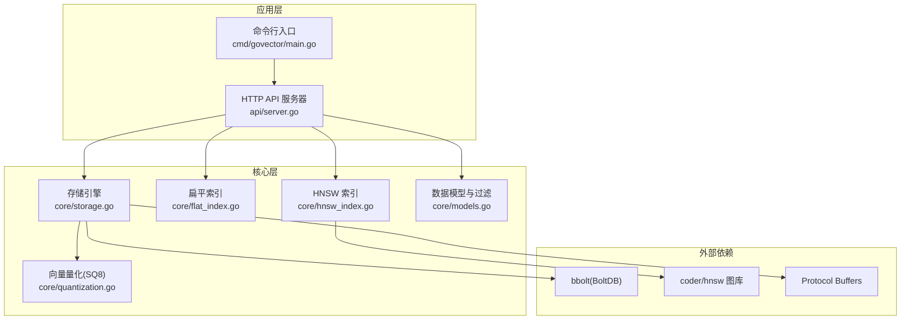
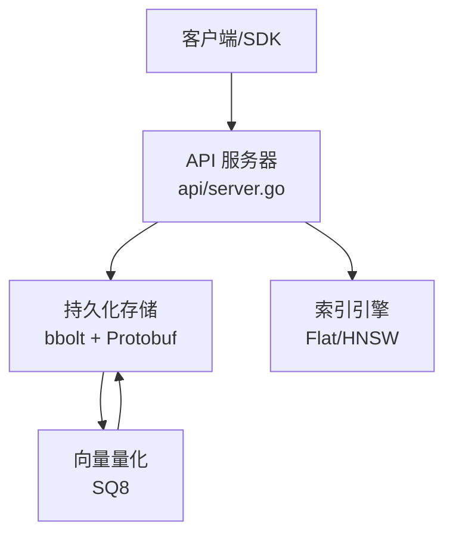
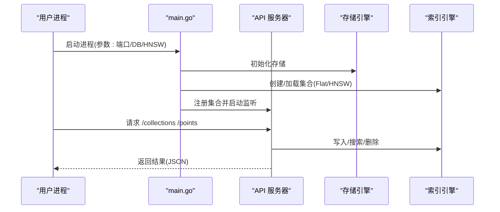
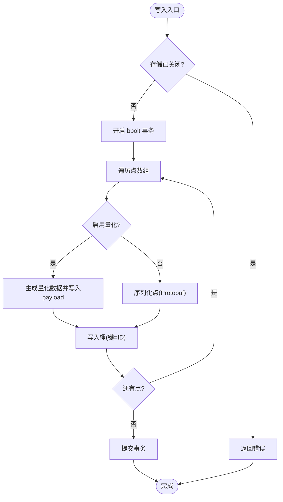
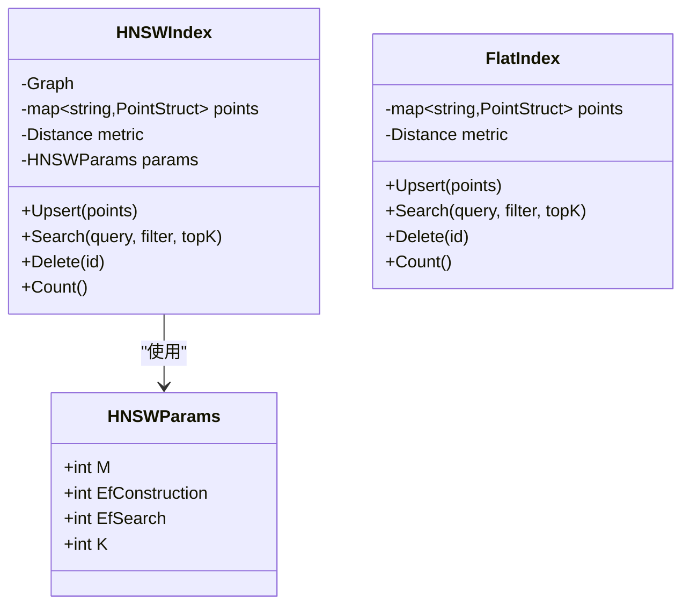
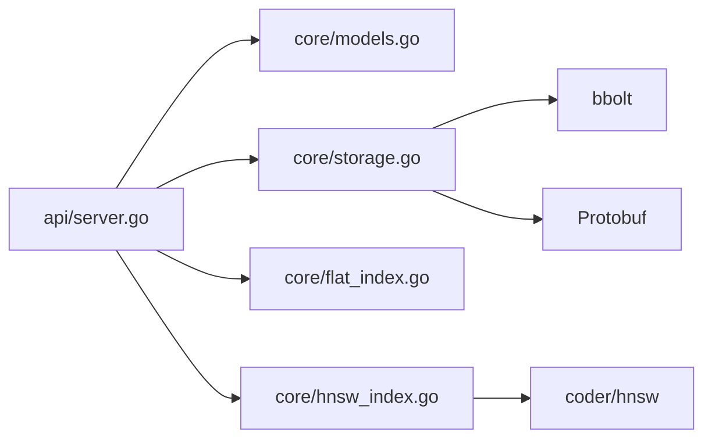

# 生产环境部署

<cite>
**本文引用的文件**
- [README.md](file://README.md)
- [go.mod](file://go.mod)
- [Makefile](file://Makefile)
- [cmd/govector/main.go](file://cmd/govector/main.go)
- [api/server.go](file://api/server.go)
- [core/storage.go](file://core/storage.go)
- [core/models.go](file://core/models.go)
- [core/hnsw_index.go](file://core/hnsw_index.go)
- [core/flat_index.go](file://core/flat_index.go)
- [core/quantization.go](file://core/quantization.go)
- [scripts/release/govector.rb](file://scripts/release/govector.rb)
- [scripts/release/govector.service](file://scripts/release/govector.service)
- [scripts/build_release.sh](file://scripts/build_release.sh)
- [cmd/bench/main.go](file://cmd/bench/main.go)
- [demo.sh](file://demo.sh)
</cite>

## 目录
1. [简介](#简介)
2. [项目结构](#项目结构)
3. [核心组件](#核心组件)
4. [架构总览](#架构总览)
5. [详细组件分析](#详细组件分析)
6. [依赖关系分析](#依赖关系分析)
7. [性能考量与调优](#性能考量与调优)
8. [部署方式与配置](#部署方式与配置)
9. [网络与安全配置](#网络与安全配置)
10. [部署验证与健康检查](#部署验证与健康检查)
11. [故障排查指南](#故障排查指南)
12. [结论](#结论)

## 简介
本指南面向生产环境，提供 GoVector 的完整部署方案，涵盖硬件资源建议、系统依赖、多种部署方式（Homebrew、SystemD、Docker、Kubernetes）、网络与安全加固、性能调优、以及部署验证与健康检查方法。GoVector 是一个纯 Go 实现的嵌入式向量数据库，提供与 Qdrant 兼容的 REST API，支持 HNSW 近似最近邻检索与持久化存储。

## 项目结构
- 顶层模块定义与 Go 版本要求见 go.mod。
- 服务入口位于 cmd/govector/main.go，负责解析命令行参数、初始化存储与集合，并启动 HTTP API 服务器。
- API 层位于 api/server.go，提供 /collections、/points 等端点，支持创建、删除、查询、删除等操作。
- 核心存储与索引位于 core 包：bbolt 作为本地持久化引擎；Flat/HNSW 索引实现；Payload 过滤逻辑；向量量化（SQ8）能力。
- 构建与发布脚本位于 scripts/，包含 Homebrew Formula、SystemD 服务模板与跨平台发布打包脚本。
- 性能基准与演示脚本位于 cmd/bench/main.go 与 demo.sh。

图表来源
- [cmd/govector/main.go:18-92](file://cmd/govector/main.go#L18-L92)
- [api/server.go:26-95](file://api/server.go#L26-L95)
- [core/storage.go:88-114](file://core/storage.go#L88-L114)
- [core/hnsw_index.go:41-106](file://core/hnsw_index.go#L41-L106)
- [core/flat_index.go:9-25](file://core/flat_index.go#L9-L25)
- [core/models.go:5-280](file://core/models.go#L5-L280)
- [core/quantization.go:1-125](file://core/quantization.go#L1-L125)

章节来源
- [go.mod:1-19](file://go.mod#L1-L19)
- [Makefile:9-17](file://Makefile#L9-L17)

## 核心组件
- 存储引擎（Storage）
  - 基于 bbolt 的本地持久化，使用 Protocol Buffers 序列化点数据。
  - 支持可选的向量量化（SQ8），以降低磁盘占用与内存压力。
  - 提供集合元数据管理、批量写入、加载、删除等能力。
- 索引引擎
  - FlatIndex：暴力检索，适合小规模或对精度要求极高的场景。
  - HNSWIndex：图结构近似检索，支持 Cosine/Euclidean/Dot 距离度量，适合大规模高维向量。
- API 服务器
  - 提供与 Qdrant 兼容的 REST 接口：集合管理、点写入、搜索、删除。
  - 启动时自动从存储加载集合元数据与数据，支持优雅停机。
- 数据模型与过滤
  - Payload 结构支持多类型值；Filter 支持 must/must_not、精确匹配、范围、前缀、包含、正则等。
- 构建与发布
  - Makefile 提供构建、运行、清理、基准测试目标。
  - scripts/build_release.sh 支持跨平台编译与 Homebrew Formula 同步更新。

章节来源
- [core/storage.go:88-360](file://core/storage.go#L88-L360)
- [core/hnsw_index.go:41-200](file://core/hnsw_index.go#L41-L200)
- [core/flat_index.go:9-124](file://core/flat_index.go#L9-L124)
- [api/server.go:26-424](file://api/server.go#L26-L424)
- [core/models.go:5-280](file://core/models.go#L5-L280)
- [Makefile:9-35](file://Makefile#L9-L35)
- [scripts/build_release.sh:1-131](file://scripts/build_release.sh#L1-L131)

## 架构总览
下图展示生产部署中各组件交互：客户端通过 HTTP API 访问服务，服务读写 bbolt 存储，索引层根据配置选择 Flat 或 HNSW；可选启用 SQ8 量化以节省空间。

图表来源
- [api/server.go:54-95](file://api/server.go#L54-L95)
- [core/storage.go:88-114](file://core/storage.go#L88-L114)
- [core/hnsw_index.go:41-106](file://core/hnsw_index.go#L41-L106)
- [core/flat_index.go:9-25](file://core/flat_index.go#L9-L25)
- [core/quantization.go:20-125](file://core/quantization.go#L20-L125)

## 详细组件分析

### API 服务器（HTTP）
- 功能要点
  - 解析命令行参数（端口、数据库路径、是否启用 HNSW）。
  - 初始化存储与默认集合，注册到 API 服务器。
  - 提供集合管理、点写入、搜索、删除等端点。
  - 支持优雅停机与信号处理。
- 关键流程（启动与请求处理）

图表来源
- [cmd/govector/main.go:18-92](file://cmd/govector/main.go#L18-L92)
- [api/server.go:54-95](file://api/server.go#L54-L95)

章节来源
- [cmd/govector/main.go:18-92](file://cmd/govector/main.go#L18-L92)
- [api/server.go:54-95](file://api/server.go#L54-L95)

### 存储与持久化（bbolt + Protobuf）
- 能力
  - 集合级桶隔离；集合元数据桶保存配置与参数。
  - Protobuf 序列化点数据；支持可选 SQ8 量化。
  - 批量写入、加载、删除；列表集合与元数据。
- 复杂度与性能
  - 写入为事务内批量 Put，受磁盘吞吐影响。
  - 加载时遍历桶并反序列化，内存占用与数据量线性相关。

图表来源
- [core/storage.go:144-187](file://core/storage.go#L144-L187)
- [core/quantization.go:31-76](file://core/quantization.go#L31-L76)

章节来源
- [core/storage.go:88-360](file://core/storage.go#L88-L360)
- [core/quantization.go:1-125](file://core/quantization.go#L1-L125)

### 索引引擎（Flat 与 HNSW）
- FlatIndex
  - 暴力比较，O(N) 查询复杂度；适合中小规模或需要精确检索的场景。
- HNSWIndex
  - 图结构检索，支持自定义参数（M、EfConstruction、EfSearch、K）。
  - 搜索时采用后过滤策略（过采样再过滤），在过滤条件下保证正确性。
- 参数建议
  - 默认参数适用于通用场景；可根据吞吐与延迟目标调整 EfConstruction/EfSearch/K。

图表来源
- [core/hnsw_index.go:11-106](file://core/hnsw_index.go#L11-L106)
- [core/flat_index.go:9-74](file://core/flat_index.go#L9-L74)

章节来源
- [core/hnsw_index.go:41-200](file://core/hnsw_index.go#L41-L200)
- [core/flat_index.go:9-124](file://core/flat_index.go#L9-L124)

### 数据模型与过滤
- Payload 支持多类型值；Filter 支持 must/must_not 条件组合。
- 过滤类型覆盖精确、范围、前缀、包含、正则，满足常见业务筛选需求。

章节来源
- [core/models.go:5-280](file://core/models.go#L5-L280)

## 依赖关系分析
- 模块依赖
  - go.mod 明确了 bbolt、coder/hnsw、protobuf 等依赖。
- 组件耦合
  - API 服务器依赖存储与索引；存储依赖 bbolt 与 Protobuf；HNSW 依赖 coder/hnsw。
- 外部接口
  - 通过 HTTP REST API 对外提供服务；内部通过 Protobuf 与 bbolt 交互。

图表来源
- [go.mod:5-18](file://go.mod#L5-L18)
- [api/server.go:13-14](file://api/server.go#L13-L14)
- [core/storage.go:3-11](file://core/storage.go#L3-L11)
- [core/hnsw_index.go:8](file://core/hnsw_index.go#L8)

章节来源
- [go.mod:1-19](file://go.mod#L1-L19)

## 性能考量与调优
- 硬件建议（经验参考）
  - 小规模（百万级以下）：16–32 GB 内存、SSD、4–8 核 CPU。
  - 大规模（千万级及以上）：64+ GB 内存、NVMe SSD、16+ 核 CPU。
- 存储与 IO
  - 优先使用 NVMe SSD；确保磁盘具备足够 IOPS 以支撑批量写入与索引构建。
  - 合理规划数据目录与日志目录分离，避免 IO 抖动。
- 索引参数
  - HNSW：提高 EfConstruction 可提升召回但增加构建时间；提高 EfSearch 可改善查询延迟但增加计算开销；K 控制返回数量。
  - Flat：适合小规模或对延迟极敏感且可接受 O(N) 的场景。
- 向量量化（SQ8）
  - 在不显著影响相似度排序的前提下，可减少约 75% 的存储与内存占用；适合大规模数据。
- 并发与连接
  - 合理设置并发写入批次大小，避免单次批量过大导致内存峰值过高。
- 基准与监控
  - 使用内置基准工具评估不同规模下的延迟与吞吐；结合系统监控（CPU、内存、IO、网络）持续观察。

章节来源
- [cmd/bench/main.go:41-142](file://cmd/bench/main.go#L41-L142)
- [core/hnsw_index.go:31-106](file://core/hnsw_index.go#L31-L106)
- [core/quantization.go:20-125](file://core/quantization.go#L20-L125)

## 部署方式与配置

### 1) Homebrew 安装（Mac/Linux 守护进程）
- 安装
  - 添加 Tap 并安装 govector。
- 服务管理
  - 使用 brew services start/stop/restart 管理守护进程。
  - 默认运行参数包含端口、数据库路径与 HNSW 开关。
- 日志
  - 标准输出与错误输出重定向至指定日志文件。

章节来源
- [README.md:52-56](file://README.md#L52-L56)
- [scripts/release/govector.rb:25-40](file://scripts/release/govector.rb#L25-L40)

### 2) SystemD 服务配置
- 单位文件
  - 提供简单类型的服务单元，设置 ExecStart、重启策略、工作目录与日志路径。
- 运行参数
  - 可按需修改端口、数据库路径与 HNSW 开关。
- 用户与权限
  - 当前示例以 root 用户运行；生产中建议使用专用非特权用户并限制权限。

章节来源
- [scripts/release/govector.service:5-17](file://scripts/release/govector.service#L5-L17)

### 3) Docker 容器化部署（建议）
- 构建镜像
  - 使用多阶段构建或直接基于 alpine:latest 运行二进制，避免 CGO 依赖。
- 容器参数
  - 暴露端口与挂载数据卷（数据库文件所在目录）。
  - 设置环境变量或启动参数控制端口、数据库路径与索引模式。
- 健康检查
  - 通过 HTTP 探针访问 /collections（或 /health）进行存活与就绪检查。
- 安全加固
  - 使用只读根文件系统、drop unnecessary capabilities、限制资源配额。

说明：本节为通用容器化最佳实践建议，未直接引用具体源码文件。

### 4) Kubernetes 集群部署（建议）
- Deployment
  - 使用副本数与滚动更新策略；设置资源请求与限制。
- Service
  - ClusterIP/LoadBalancer 以暴露服务；Ingress 控制器统一入口。
- ConfigMap/Secret
  - 通过环境变量或配置文件注入运行参数（端口、DB 路径、HNSW 参数）。
- 存储
  - 使用 PVC 挂载持久化存储；建议使用高性能存储类。
- 健康检查
  - Liveness/Readiness 探针指向 /collections 或 /health。
- 安全
  - PodSecurityContext/SecurityContext 最小权限；网络策略限制入站流量。

说明：本节为通用 Kubernetes 最佳实践建议，未直接引用具体源码文件。

## 网络与安全配置
- 网络
  - 默认监听端口可在命令行参数中配置；生产中建议绑定内网地址或通过反向代理暴露。
  - 如需多实例横向扩展，建议通过负载均衡器分发请求。
- 防火墙
  - 仅开放 API 服务端口；限制来源 IP（如仅内网或特定网段）。
- 安全加固
  - 以非 root 用户运行；最小权限原则；禁用不必要的系统调用。
  - 启用 TLS（建议通过反向代理或服务网格）；必要时添加鉴权中间件。
  - 定期备份数据库文件；监控异常访问与错误日志。

说明：本节为通用安全建议，未直接引用具体源码文件。

## 部署验证与健康检查
- 健康检查
  - 通过 /collections 列表端点确认服务可用与集合加载状态。
  - 可编写定时探针，检查响应状态码与基本字段。
- 功能验证
  - 使用 demo.sh 中的 curl 示例进行端到端验证：插入点、无过滤搜索、带过滤搜索。
- 性能验证
  - 使用基准工具在目标硬件上跑出延迟与吞吐基线，作为后续调优依据。

章节来源
- [demo.sh:1-43](file://demo.sh#L1-L43)
- [api/server.go:382-400](file://api/server.go#L382-L400)
- [cmd/bench/main.go:109-142](file://cmd/bench/main.go#L109-L142)

## 故障排查指南
- 启动失败
  - 检查数据库文件权限与路径是否存在；确认端口未被占用。
- 写入/查询异常
  - 查看 API 层错误响应与日志；确认集合存在且维度一致。
- 存储问题
  - 检查 bbolt 文件完整性与磁盘空间；必要时重建索引或恢复备份。
- 性能退化
  - 观察 CPU/内存/IO 使用率；调整 HNSW 参数或启用 SQ8 量化。
- 优雅停机
  - 确认服务收到信号后能正常关闭 HTTP 服务器与存储连接。

章节来源
- [cmd/govector/main.go:70-88](file://cmd/govector/main.go#L70-L88)
- [api/server.go:131-143](file://api/server.go#L131-L143)
- [core/storage.go:116-129](file://core/storage.go#L116-L129)

## 结论
本指南提供了 GoVector 在生产环境中的部署蓝图：从硬件资源、系统依赖、多种部署方式，到网络与安全加固、性能调优与验证方法。结合内置 API 与存储/索引特性，可在不同规模与场景下获得稳定、低延迟的向量检索能力。建议在上线前完成容量规划、压测与安全审计，并建立完善的监控与备份机制。