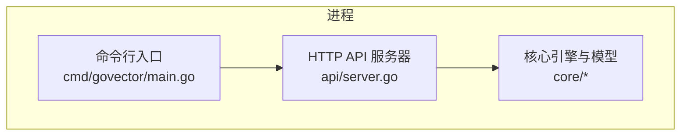
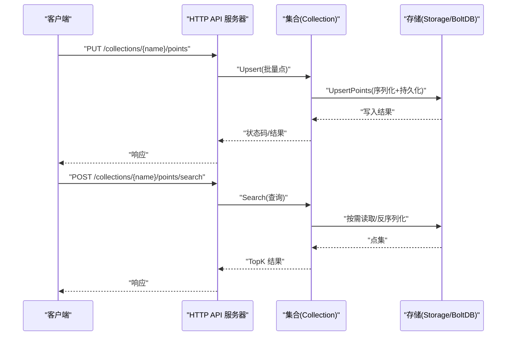
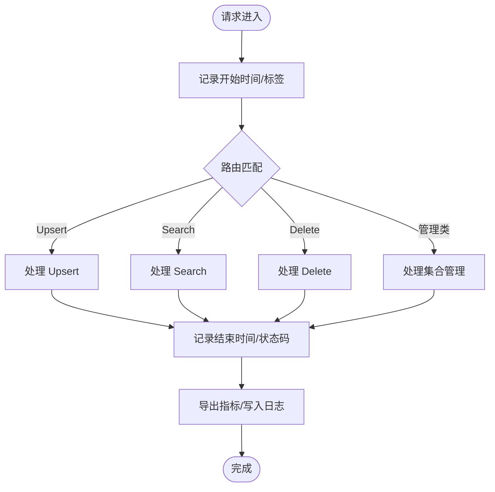
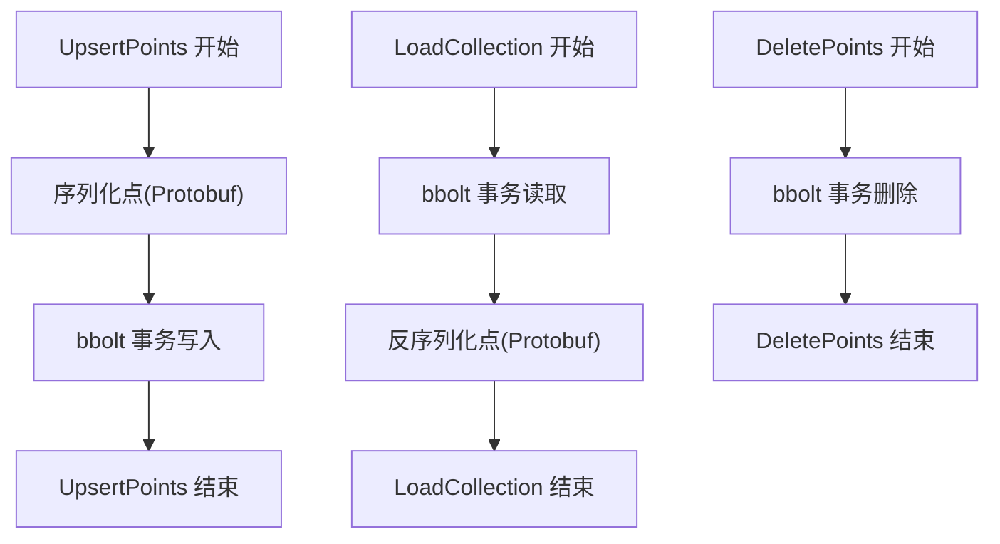
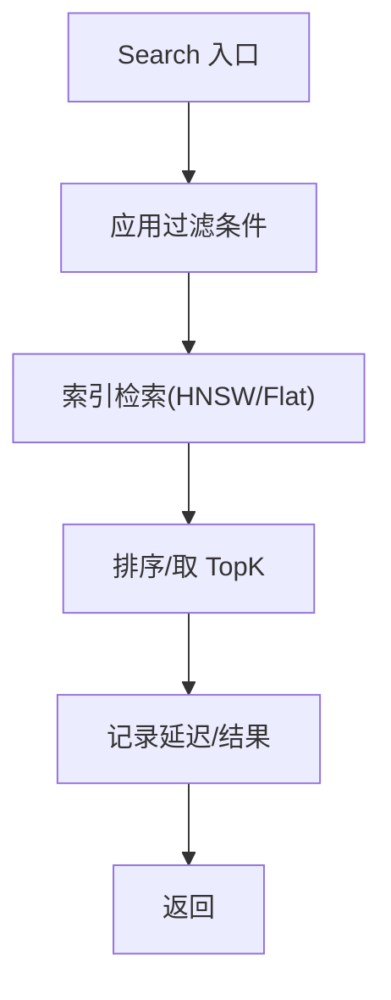
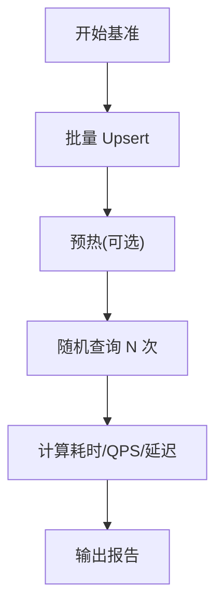
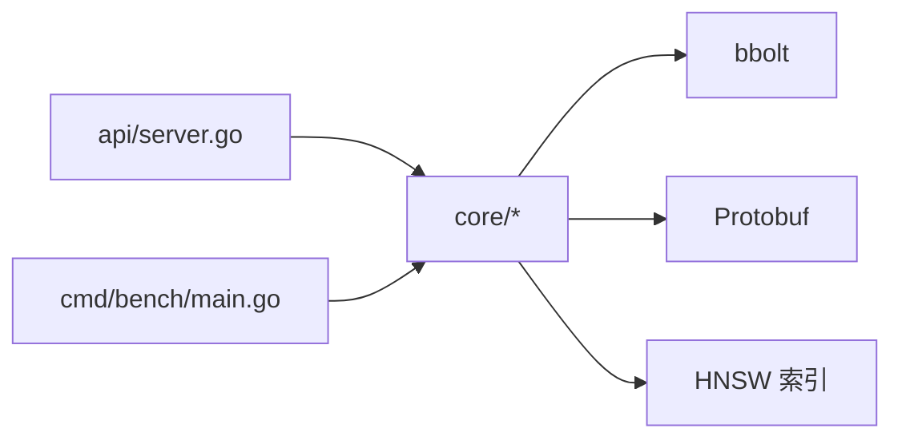

# 监控告警

<cite>
**本文引用的文件**
- [README.md](file://README.md)
- [go.mod](file://go.mod)
- [cmd/govector/main.go](file://cmd/govector/main.go)
- [api/server.go](file://api/server.go)
- [core/storage.go](file://core/storage.go)
- [core/models.go](file://core/models.go)
- [cmd/bench/main.go](file://cmd/bench/main.go)
- [demo.sh](file://demo.sh)
</cite>

## 目录
1. [简介](#简介)
2. [项目结构](#项目结构)
3. [核心组件](#核心组件)
4. [架构总览](#架构总览)
5. [详细组件分析](#详细组件分析)
6. [依赖分析](#依赖分析)
7. [性能考量](#性能考量)
8. [故障排查指南](#故障排查指南)
9. [结论](#结论)
10. [附录](#附录)

## 简介
本指南面向运维与平台工程团队，围绕 GoVector 的监控与告警体系提供可落地的配置建议。内容覆盖以下方面：
- 关键性能指标（查询延迟、内存使用率、磁盘 I/O、网络吞吐量）的采集与观测方法
- Prometheus 监控集成与 Grafana 仪表板模板建议
- 告警规则设计（阈值与级别）
- 日志收集与分析（访问日志、错误日志、性能日志）
- 故障检测与自动恢复机制配置思路
- 监控数据可视化与报告生成

当前仓库未内置 Prometheus/Grafana 配置或日志框架集成，因此本指南提供通用最佳实践与可扩展的集成路径。

## 项目结构
GoVector 采用“命令行入口 + HTTP API 服务器 + 核心引擎”的分层组织方式：
- 命令行入口：负责参数解析、存储初始化、集合加载与 HTTP 服务启动/优雅停机
- API 层：提供 Qdrant 兼容的 REST 接口，封装集合管理与向量操作
- 存储层：基于 bbolt 的本地持久化，支持元数据与点集的读写
- 模型与过滤：定义点结构、过滤器与匹配逻辑
- 基准工具：提供内存统计与查询吞吐/延迟的测量能力

**图表来源**
- [cmd/govector/main.go:18-92](file://cmd/govector/main.go#L18-L92)
- [api/server.go:54-95](file://api/server.go#L54-L95)

**章节来源**
- [README.md:109-118](file://README.md#L109-L118)
- [cmd/govector/main.go:18-92](file://cmd/govector/main.go#L18-L92)
- [api/server.go:54-95](file://api/server.go#L54-L95)

## 核心组件
- 命令行入口与生命周期
  - 解析端口、数据库路径、索引类型等参数
  - 初始化存储引擎与默认集合
  - 启动 HTTP 服务并注册信号处理实现优雅停机
- HTTP API 服务器
  - 提供集合管理与点操作接口
  - 内部维护集合映射与并发安全
- 存储引擎
  - 基于 bbolt 的桶式存储，支持集合元数据与点集读写
  - 支持可选的向量量化压缩
- 模型与过滤
  - 定义点结构、评分点、过滤器与多种匹配类型
- 基准工具
  - 输出内存统计、索引入库耗时、平均查询延迟与 QPS

**章节来源**
- [cmd/govector/main.go:18-92](file://cmd/govector/main.go#L18-L92)
- [api/server.go:18-52](file://api/server.go#L18-L52)
- [core/storage.go:13-20](file://core/storage.go#L13-L20)
- [core/models.go:9-25](file://core/models.go#L9-L25)
- [cmd/bench/main.go:34-107](file://cmd/bench/main.go#L34-L107)

## 架构总览
下图展示从客户端到存储的调用链路与关键观测点：

**图表来源**
- [api/server.go:148-176](file://api/server.go#L148-L176)
- [api/server.go:182-218](file://api/server.go#L182-L218)
- [core/storage.go:144-187](file://core/storage.go#L144-L187)

## 详细组件分析

### 组件一：HTTP API 服务器（监控重点）
- 观测维度
  - 请求总量、成功率、错误码分布
  - 路由级延迟（按端点区分）
  - 并发连接数与队列等待时间
- 建议埋点位置
  - 在请求进入与返回处记录时间戳与状态码
  - 对集合管理与点操作两类端点分别统计
- 可观测性输出
  - 将指标导出为 Prometheus 文本格式
  - 与现有日志结合形成访问日志

**图表来源**
- [api/server.go:148-258](file://api/server.go#L148-L258)

**章节来源**
- [api/server.go:54-95](file://api/server.go#L54-L95)
- [api/server.go:148-258](file://api/server.go#L148-L258)

### 组件二：存储引擎（磁盘 I/O 与内存）
- 观测维度
  - Upsert/Load/Delete 的耗时与吞吐
  - bbolt 事务提交次数与失败率
  - 序列化/反序列化开销（Protobuf）
  - 向量量化启用时的 CPU 与内存变化
- 建议埋点位置
  - 在 UpsertPoints/LoadCollection/DeletePoints 前后打点
  - 记录批量大小、点数量、字节长度
- 可观测性输出
  - 指标：每批写入耗时、读取耗时、失败计数
  - 日志：异常堆栈与上下文信息

**图表来源**
- [core/storage.go:144-187](file://core/storage.go#L144-L187)
- [core/storage.go:189-235](file://core/storage.go#L189-L235)
- [core/storage.go:338-360](file://core/storage.go#L338-L360)

**章节来源**
- [core/storage.go:144-187](file://core/storage.go#L144-L187)
- [core/storage.go:189-235](file://core/storage.go#L189-L235)
- [core/storage.go:338-360](file://core/storage.go#L338-L360)

### 组件三：集合与过滤（查询延迟）
- 观测维度
  - Search 平均延迟、P95/P99 延迟
  - 过滤条件复杂度对延迟的影响
  - 不同距离度量与索引类型（HNSW/Flat）的对比
- 建议埋点位置
  - 在 Search 入口与返回处打点
  - 区分是否使用过滤器、TopK 大小
- 可观测性输出
  - 延迟直方图与摘要
  - 错误分类统计

**图表来源**
- [api/server.go:182-218](file://api/server.go#L182-L218)
- [core/models.go:81-106](file://core/models.go#L81-L106)

**章节来源**
- [api/server.go:182-218](file://api/server.go#L182-L218)
- [core/models.go:81-106](file://core/models.go#L81-L106)

### 组件四：基准工具（性能基线）
- 观测维度
  - 索引入库耗时、平均耗时/点
  - 查询平均延迟、QPS
  - 运行时内存分配与 GC 次数
- 建议埋点位置
  - 在基准脚本中打印关键指标
- 可观测性输出
  - 结构化日志（JSON），便于后续入库分析
  - 与不同规模/维度/索引类型的对比

**图表来源**
- [cmd/bench/main.go:41-107](file://cmd/bench/main.go#L41-L107)

**章节来源**
- [cmd/bench/main.go:34-107](file://cmd/bench/main.go#L34-L107)

## 依赖分析
- 外部依赖
  - bbolt：本地键值存储
  - Protobuf：点结构序列化
  - HNSW：近似最近邻索引
- 内部耦合
  - API 服务器依赖集合与存储
  - 存储依赖 Protobuf 与 bbolt
  - 基准工具独立于运行时，仅复用核心模型

**图表来源**
- [go.mod:5-18](file://go.mod#L5-L18)
- [api/server.go:18-24](file://api/server.go#L18-L24)
- [core/storage.go:13-11](file://core/storage.go#L13-L11)

**章节来源**
- [go.mod:5-18](file://go.mod#L5-L18)
- [api/server.go:18-24](file://api/server.go#L18-L24)
- [core/storage.go:13-11](file://core/storage.go#L13-L11)

## 性能考量
- 查询延迟
  - 使用 HNSW 可显著降低查询延迟；Flat 适合小规模或低延迟要求场景
  - 过滤条件越复杂，查询成本越高
- 内存使用
  - 基准工具展示了不同规模下的内存分配与 GC 次数，可用于容量规划
- 磁盘 I/O
  - 批量 Upsert/Load/删除会触发 bbolt 事务，应避免过小批次导致频繁 IO
- 网络吞吐
  - API 层为单机 HTTP 服务，瓶颈通常在网络栈与 CPU；可通过并发与连接池优化

**章节来源**
- [README.md:60-71](file://README.md#L60-L71)
- [cmd/bench/main.go:34-107](file://cmd/bench/main.go#L34-L107)

## 故障排查指南
- 启动与优雅停机
  - 若监听失败，检查端口占用与权限
  - 优雅停机通过信号处理实现，确保在超时前完成资源释放
- API 错误码
  - 404：集合不存在
  - 400：请求体无效或参数非法
  - 500：内部错误（索引/存储异常）
- 存储问题
  - bbolt 打不开或事务失败：检查磁盘空间、文件权限与并发写入
  - 量化启用后反序列化异常：确认量化器配置一致
- 日志定位
  - 使用 demo 脚本验证端到端流程，结合服务日志快速定位问题

**章节来源**
- [cmd/govector/main.go:57-88](file://cmd/govector/main.go#L57-L88)
- [api/server.go:148-258](file://api/server.go#L148-L258)
- [core/storage.go:91-114](file://core/storage.go#L91-L114)
- [demo.sh:1-43](file://demo.sh#L1-L43)

## 结论
- 当前仓库未内置监控与日志框架，但具备清晰的观测边界与埋点位置
- 建议以 Prometheus 采集指标、以日志与追踪作为补充，结合 Grafana 构建统一仪表板
- 告警规则应覆盖延迟、错误率、资源使用与容量健康度
- 自动恢复可通过进程守护与健康检查实现，配合外部编排系统

## 附录

### A. 关键性能指标与采集清单
- 查询延迟
  - 指标：search_duration_seconds（直方图）、search_errors_total
  - 来源：Search 入口/出口打点
- 内存使用率
  - 指标：go_memstats_alloc_bytes、process_resident_memory_bytes
  - 来源：运行时与系统指标
- 磁盘 I/O
  - 指标：bbolt_tx_write_total、bbolt_tx_failed_total、storage_ops_duration_seconds
  - 来源：Upsert/Load/Delete 埋点
- 网络吞吐量
  - 指标：http_request_duration_seconds、http_requests_total
  - 来源：API 层中间件

**章节来源**
- [api/server.go:148-218](file://api/server.go#L148-L218)
- [core/storage.go:144-187](file://core/storage.go#L144-L187)
- [cmd/bench/main.go:34-107](file://cmd/bench/main.go#L34-L107)

### B. Prometheus 监控集成建议
- 导出端点
  - 新增 HTTP 路由导出 /metrics（文本格式）
- 指标命名
  - govector_api_search_duration_seconds
  - govector_storage_upsert_duration_seconds
  - govector_process_memory_bytes
- 抓取策略
  - 15s 抓取间隔，针对不同指标设置不同保留周期

[本节为通用集成建议，不直接分析具体文件，故无“章节来源”]

### C. Grafana 仪表板模板建议
- 面板一：API 请求速率与错误率（按端点分组）
- 面板二：查询延迟（P50/P95/P99）与 QPS
- 面板三：存储写入/读取延迟与失败率
- 面板四：内存与 GC 指标
- 面板五：进程资源使用（CPU/内存/IO）

[本节为通用可视化建议，不直接分析具体文件，故无“章节来源”]

### D. 告警规则与级别
- 一级（严重）：search_duration_p99 > 阈值 或 error_rate > 阈值
- 二级（警告）：search_duration_p95 > 阈值 或 storage_write_error > 阈值
- 三级（提醒）：memory_usage > 阈值 或 disk_io_wait > 阈值

[本节为通用规则建议，不直接分析具体文件，故无“章节来源”]

### E. 日志收集与分析
- 访问日志
  - 结构化 JSON：时间戳、方法、URL、状态码、耗时、远程地址
- 错误日志
  - 结构化 JSON：错误码、错误消息、堆栈、上下文
- 性能日志
  - 结构化 JSON：指标名称、数值、采样时间、标签
- 工具链建议
  - 日志采集：Promtail/Fluent Bit
  - 存储：Loki/ELK
  - 分析：Grafana Explore/QL

[本节为通用日志建议，不直接分析具体文件，故无“章节来源”]

### F. 故障检测与自动恢复
- 健康检查
  - /healthz：返回服务可用性
- 自动恢复
  - 进程守护（systemd/Docker）与重启策略
  - 外部编排：Kubernetes Liveness/Readiness Probe

[本节为通用恢复建议，不直接分析具体文件，故无“章节来源”]