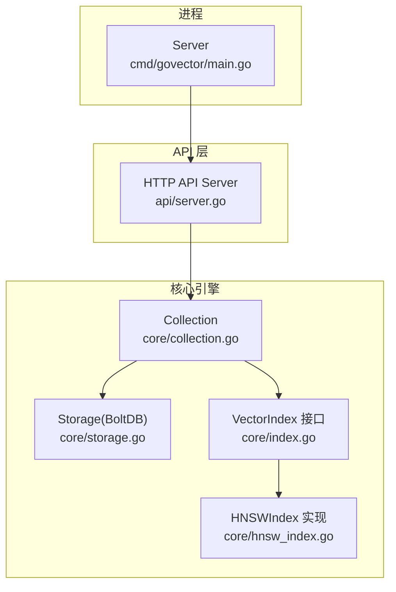
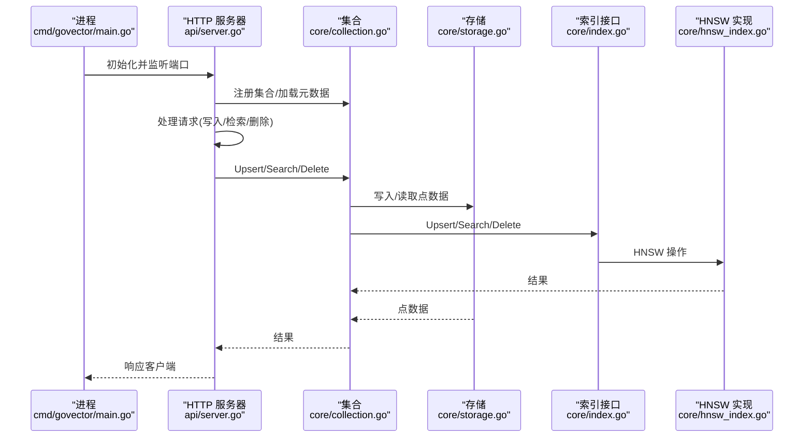
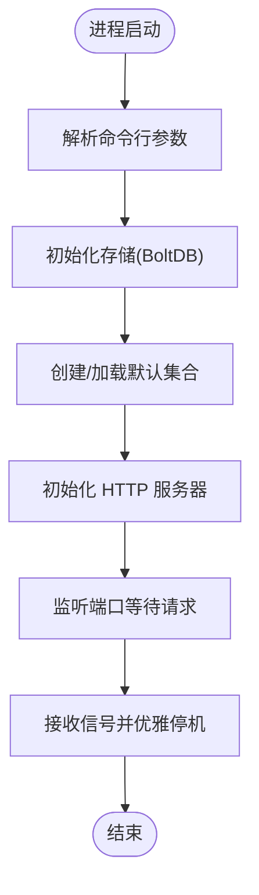
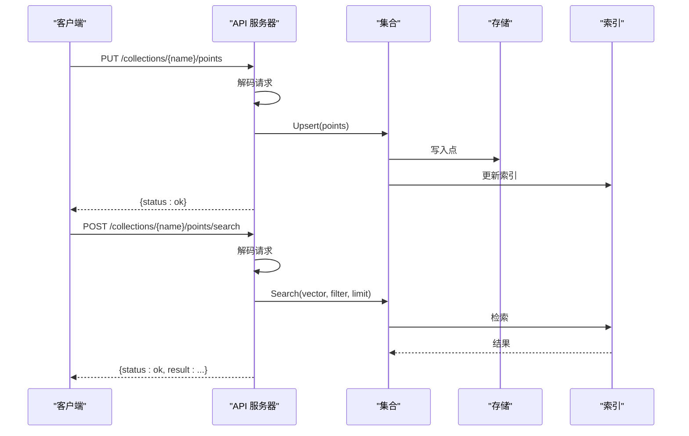
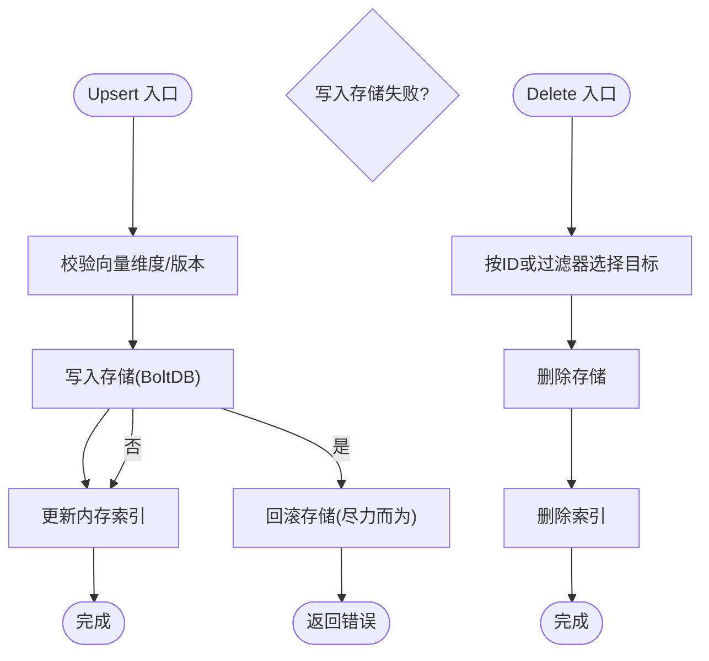
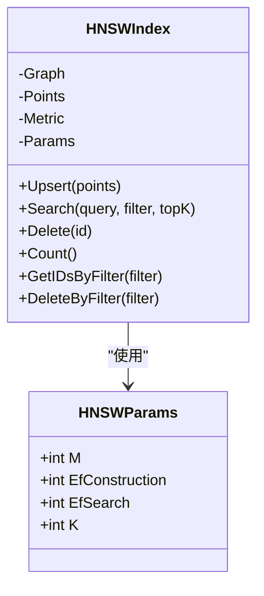
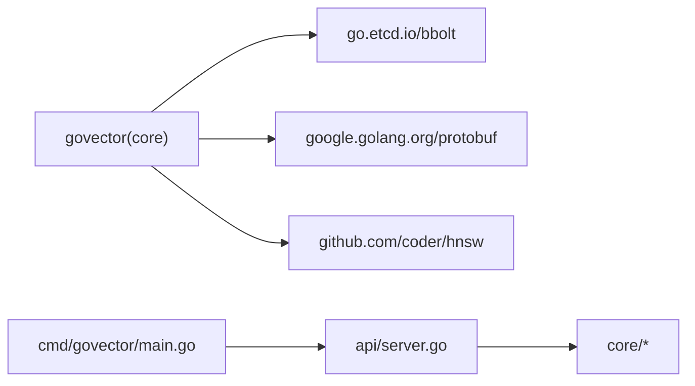
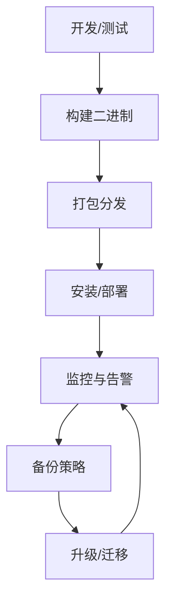

# 部署运维

<cite>
**本文引用的文件**
- [README.md](file://README.md)
- [go.mod](file://go.mod)
- [Makefile](file://Makefile)
- [cmd/govector/main.go](file://cmd/govector/main.go)
- [api/server.go](file://api/server.go)
- [core/storage.go](file://core/storage.go)
- [core/collection.go](file://core/collection.go)
- [core/models.go](file://core/models.go)
- [core/index.go](file://core/index.go)
- [core/hnsw_index.go](file://core/hnsw_index.go)
- [scripts/build_release.sh](file://scripts/build_release.sh)
- [scripts/release/govector.service](file://scripts/release/govector.service)
- [scripts/release/govector.rb](file://scripts/release/govector.rb)
- [demo.sh](file://demo.sh)
- [codecov.yml](file://codecov.yml)
</cite>

## 目录
1. [简介](#简介)
2. [项目结构](#项目结构)
3. [核心组件](#核心组件)
4. [架构总览](#架构总览)
5. [详细组件分析](#详细组件分析)
6. [依赖关系分析](#依赖关系分析)
7. [性能与容量规划](#性能与容量规划)
8. [监控与告警](#监控与告警)
9. [备份与恢复](#备份与恢复)
10. [升级与迁移](#升级与迁移)
11. [日志管理与故障排除](#日志管理与故障排除)
12. [容器化与云平台集成](#容器化与云平台集成)
13. [运维自动化与配置模板](#运维自动化与配置模板)
14. [结论](#结论)

## 简介
本文件面向生产环境的 GoVector 部署与运维，覆盖硬件与系统配置、网络与端口、监控与告警、备份与恢复、升级与迁移、日志与排障、容器化与云平台集成，以及自动化脚本与配置模板。GoVector 提供嵌入式向量数据库能力，支持作为独立微服务运行（HTTP API 兼容 Qdrant），亦可作为 Go 库嵌入到应用中。

## 项目结构
- 可执行入口：cmd/govector/main.go
- HTTP API 层：api/server.go
- 核心引擎：core/collection.go、core/storage.go、core/index.go、core/hnsw_index.go
- 构建与发布：scripts/build_release.sh、scripts/release/govector.service、scripts/release/govector.rb
- 示例与基准：demo.sh、Makefile
- 依赖声明：go.mod

图表来源
- [cmd/govector/main.go:18-92](file://cmd/govector/main.go#L18-L92)
- [api/server.go:26-95](file://api/server.go#L26-L95)
- [core/collection.go:22-91](file://core/collection.go#L22-L91)
- [core/storage.go:88-114](file://core/storage.go#L88-L114)
- [core/index.go:5-29](file://core/index.go#L5-L29)
- [core/hnsw_index.go:41-106](file://core/hnsw_index.go#L41-L106)

章节来源
- [README.md:16-42](file://README.md#L16-L42)
- [go.mod:1-19](file://go.mod#L1-L19)
- [Makefile:1-35](file://Makefile#L1-L35)

## 核心组件
- 服务入口与参数
  - 端口、数据库路径、是否启用 HNSW 索引等命令行参数由服务入口解析并传入 API 层。
- HTTP API 服务器
  - 提供集合管理、点写入、检索、删除等 REST 接口；支持优雅停机。
- 存储层
  - 基于 bbolt 的本地持久化，使用 Protobuf 序列化点数据；支持可选的向量量化以降低磁盘占用。
- 集合与索引
  - Collection 封装集合元信息、距离度量、内存索引与存储；支持 Flat/HNSW 两种索引策略。
- HNSW 索引
  - 基于 coder/hnsw 图算法，支持 Cosine/Euclid/Dot 距离度量与参数调优。

章节来源
- [cmd/govector/main.go:18-51](file://cmd/govector/main.go#L18-L51)
- [api/server.go:54-95](file://api/server.go#L54-L95)
- [core/storage.go:88-114](file://core/storage.go#L88-L114)
- [core/collection.go:22-91](file://core/collection.go#L22-L91)
- [core/hnsw_index.go:41-106](file://core/hnsw_index.go#L41-L106)

## 架构总览
下图展示从进程启动到 API 请求处理、索引查询与存储读写的完整链路。

图表来源
- [cmd/govector/main.go:52-88](file://cmd/govector/main.go#L52-L88)
- [api/server.go:148-258](file://api/server.go#L148-L258)
- [core/collection.go:97-133](file://core/collection.go#L97-L133)
- [core/storage.go:144-187](file://core/storage.go#L144-L187)
- [core/hnsw_index.go:108-176](file://core/hnsw_index.go#L108-L176)

## 详细组件分析

### 服务入口与启动流程
- 解析参数：端口、数据库路径、是否启用 HNSW。
- 初始化存储（bbolt）与默认集合。
- 启动 HTTP 服务器并注册集合。
- 支持信号中断与优雅停机。

图表来源
- [cmd/govector/main.go:18-92](file://cmd/govector/main.go#L18-L92)

章节来源
- [cmd/govector/main.go:18-92](file://cmd/govector/main.go#L18-L92)

### HTTP API 与请求处理
- 端点概览
  - 集合管理：POST/DELETE /collections、GET /collections、GET /collections/{name}
  - 点操作：PUT /collections/{name}/points、POST /collections/{name}/points/search、POST /collections/{name}/points/delete
- 关键处理逻辑
  - 写入：解码 JSON -> 校验 -> 写入存储 -> 更新内存索引
  - 搜索：解码 JSON -> 校验维度 -> 索引检索 -> 过滤 -> 返回结果
  - 删除：按 ID 或过滤器删除 -> 先删存储再删索引

图表来源
- [api/server.go:148-258](file://api/server.go#L148-L258)
- [core/collection.go:97-147](file://core/collection.go#L97-L147)
- [core/storage.go:144-187](file://core/storage.go#L144-L187)

章节来源
- [api/server.go:54-95](file://api/server.go#L54-L95)
- [api/server.go:148-258](file://api/server.go#L148-L258)
- [core/collection.go:97-147](file://core/collection.go#L97-L147)

### 存储与持久化
- 存储引擎：bbolt，每个集合一个桶；集合元数据保存在特殊桶中。
- 序列化：Protobuf 编解码点数据；支持可选向量量化（SQ8）。
- 一致性：先写存储，再更新索引；失败时尝试回滚存储。

图表来源
- [core/collection.go:97-133](file://core/collection.go#L97-L133)
- [core/storage.go:144-187](file://core/storage.go#L144-L187)
- [core/storage.go:338-359](file://core/storage.go#L338-L359)

章节来源
- [core/storage.go:88-114](file://core/storage.go#L88-L114)
- [core/storage.go:144-187](file://core/storage.go#L144-L187)
- [core/storage.go:261-307](file://core/storage.go#L261-L307)
- [core/collection.go:97-133](file://core/collection.go#L97-L133)

### HNSW 索引与参数
- 参数：M、EfConstruction、EfSearch、K；默认值见实现。
- 距离度量：Cosine/Euclid/Dot；Dot 需要取负以适配最小化距离的约定。
- 检索策略：在存在过滤时采用“超取”策略，再进行后过滤。

图表来源
- [core/hnsw_index.go:11-39](file://core/hnsw_index.go#L11-L39)
- [core/hnsw_index.go:41-106](file://core/hnsw_index.go#L41-L106)
- [core/hnsw_index.go:126-176](file://core/hnsw_index.go#L126-L176)

章节来源
- [core/hnsw_index.go:41-106](file://core/hnsw_index.go#L41-L106)
- [core/hnsw_index.go:126-176](file://core/hnsw_index.go#L126-L176)

## 依赖关系分析
- 外部依赖
  - bbolt：本地键值存储
  - protobuf：点数据序列化
  - coder/hnsw：HNSW 图算法
- 内部模块
  - cmd/govector serve：进程入口
  - api：HTTP 服务器
  - core：集合、存储、索引、模型

图表来源
- [go.mod:5-18](file://go.mod#L5-L18)
- [cmd/govector/main.go:14-16](file://cmd/govector/main.go#L14-L16)
- [api/server.go:13](file://api/server.go#L13)

章节来源
- [go.mod:1-19](file://go.mod#L1-L19)

## 性能与容量规划
- 索引选择
  - 小规模/低延迟优先：Flat 索引
  - 大规模/高吞吐：HNSW 索引，并根据场景调整参数（EfSearch、K）
- 向量量化
  - 启用 SQ8 量化可显著降低磁盘占用，适合大规模数据
- 端口与并发
  - 默认端口可在启动参数中配置；生产建议绑定内网地址并配合反向代理
- 基准参考
  - README 提供不同规模与索引下的延迟与吞吐参考，可用于容量评估

章节来源
- [README.md:60-71](file://README.md#L60-L71)
- [api/server.go:26-44](file://api/server.go#L26-L44)
- [core/hnsw_index.go:31-39](file://core/hnsw_index.go#L31-L39)

## 监控与告警
- 指标建议
  - 基础指标：CPU、内存、磁盘空间、连接数、QPS、P95/P99 延迟
  - 业务指标：集合数量、点总数、Upsert/搜索/删除成功率、存储大小
- 监控采集
  - 使用系统监控工具采集进程级指标
  - 在应用侧可扩展埋点统计关键路径耗时（如存储写入、索引更新）
- 告警阈值
  - 延迟突增、QPS 下降、错误率上升、磁盘空间不足、存储写入失败
- 日志
  - 标准输出/错误输出由系统服务管理；建议统一收集并分级

[本节为通用运维建议，不直接分析具体文件，故无章节来源]

## 备份与恢复
- 备份对象
  - 数据库文件（默认名称可在启动参数中指定）
  - 集合元数据（自动保存在特殊桶中）
- 备份策略
  - 增量/全量结合：小规模可每日全量+每小时增量；大规模可定时快照
  - 异地多副本：跨机房/跨区域复制
- 恢复流程
  - 停止服务 -> 恢复数据库文件 -> 启动服务 -> 校验集合数量与点数
- 一致性
  - 建议在停机窗口内进行备份，避免并发写入导致的数据不一致

章节来源
- [core/storage.go:261-307](file://core/storage.go#L261-L307)
- [core/storage.go:338-359](file://core/storage.go#L338-L359)
- [cmd/govector/main.go:27-36](file://cmd/govector/main.go#L27-L36)

## 升级与迁移
- 版本兼容性
  - 严格遵循语义化版本；升级前核对 go.mod 中依赖版本
- 升级步骤
  - 备份数据库文件 -> 停止服务 -> 替换二进制 -> 启动验证
- 迁移流程
  - 新旧版本共存期：导出旧集合 -> 导入新集合 -> 校验一致性
  - 参数变更：根据 HNSW 参数变化调整 EfSearch/K 等
- 回滚策略
  - 保留上一版本二进制与备份，快速回滚

章节来源
- [go.mod:1-19](file://go.mod#L1-L19)
- [scripts/build_release.sh:15-21](file://scripts/build_release.sh#L15-L21)
- [Makefile:19-22](file://Makefile#L19-L22)

## 日志管理与故障排除
- 日志位置
  - 系统服务标准输出/错误输出路径见服务单元配置
- 常见问题
  - 无法启动：检查端口占用、数据库路径权限
  - 写入失败：检查磁盘空间、bbolt 文件权限
  - 搜索异常：确认向量维度与集合一致、过滤条件合法
- 排障步骤
  - 查看服务日志 -> 核对启动参数 -> 验证数据库文件 -> 重试关键操作

章节来源
- [scripts/release/govector.service:9-17](file://scripts/release/govector.service#L9-L17)
- [api/server.go:148-258](file://api/server.go#L148-L258)
- [core/models.go:81-106](file://core/models.go#L81-L106)

## 容器化与云平台集成
- 容器镜像
  - 建议基于精简基础镜像构建，仅包含二进制与必要运行时
  - 挂载数据库文件与配置目录，设置只读根文件系统
- 编排
  - Docker Compose/Swarm 或 Kubernetes；设置健康检查与资源限制
- 云平台
  - AWS/GCP/Azure：结合对象存储做备份归档，使用托管监控与日志服务
- 网络
  - 生产建议绑定内网地址，通过反向代理暴露 API；开启 TLS

[本节为通用运维建议，不直接分析具体文件，故无章节来源]

## 运维自动化与配置模板
- 构建与发布
  - 跨平台编译与打包脚本，生成校验和并更新 Homebrew Formula
- 系统服务
  - systemd 服务模板与 Homebrew Formula，便于安装与自启
- 示例脚本
  - demo.sh 展示基本的插入、检索与过滤流程，可用于集成测试

图表来源
- [scripts/build_release.sh:15-78](file://scripts/build_release.sh#L15-L78)
- [scripts/release/govector.service:1-21](file://scripts/release/govector.service#L1-L21)
- [scripts/release/govector.rb:1-45](file://scripts/release/govector.rb#L1-L45)
- [demo.sh:1-43](file://demo.sh#L1-L43)

章节来源
- [scripts/build_release.sh:1-131](file://scripts/build_release.sh#L1-L131)
- [scripts/release/govector.service:1-21](file://scripts/release/govector.service#L1-L21)
- [scripts/release/govector.rb:1-45](file://scripts/release/govector.rb#L1-L45)
- [demo.sh:1-43](file://demo.sh#L1-L43)
- [Makefile:1-35](file://Makefile#L1-L35)

## 结论
本文提供了 GoVector 在生产环境中的部署与运维全景：从进程启动、API 处理、存储与索引，到监控告警、备份恢复、升级迁移、日志排障、容器化与云集成，以及自动化脚本与模板。建议在上线前完成容量评估、备份演练与应急预案，并持续优化索引参数与监控阈值，确保系统稳定与业务连续性。