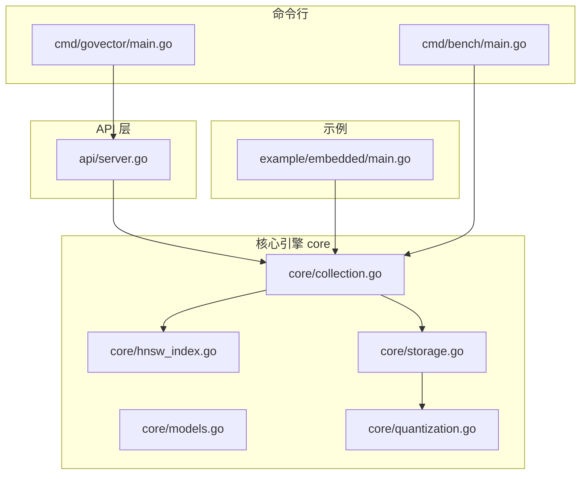
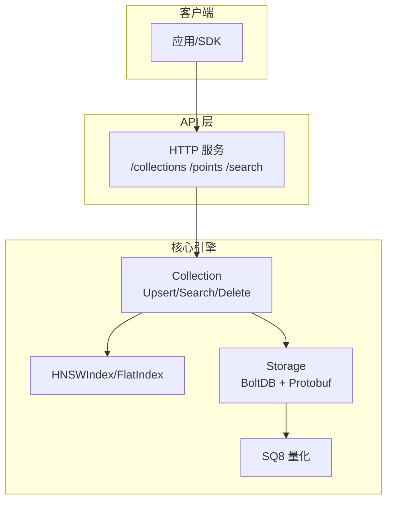
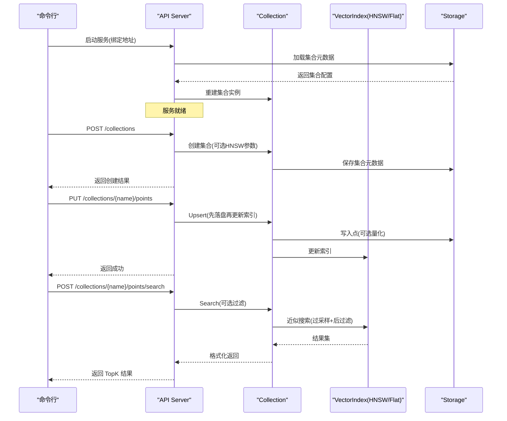
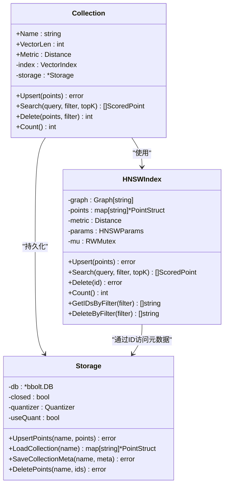
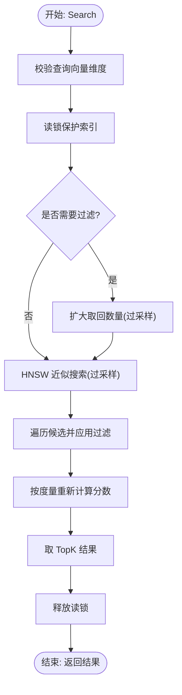
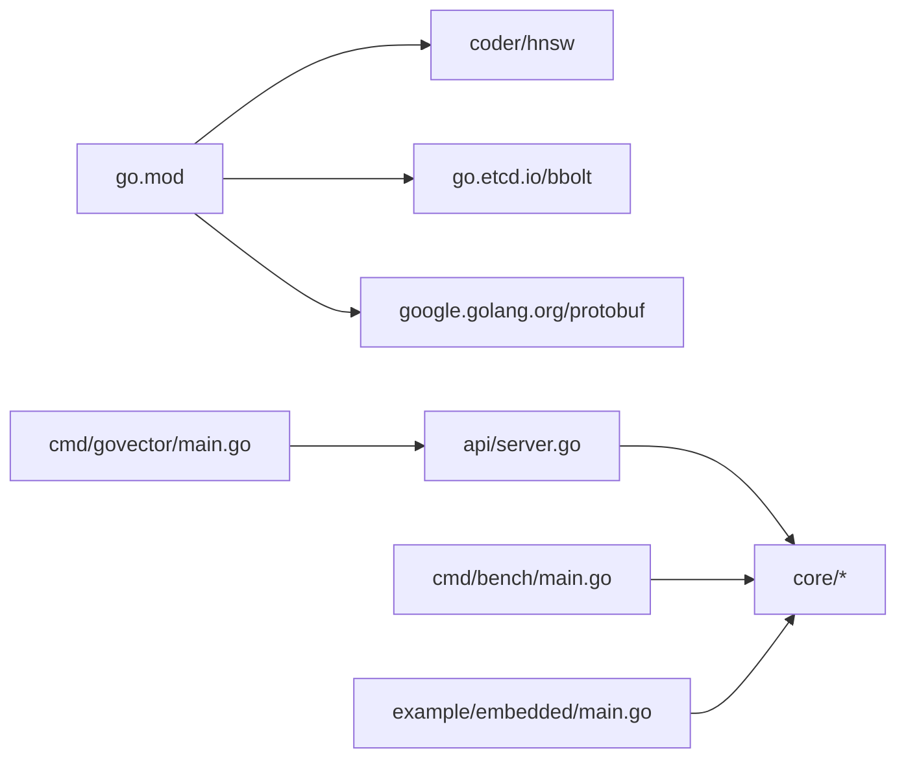

# 项目概述

<cite>
**本文引用的文件**
- [README.md](file://README.md)
- [README_zh.md](file://README_zh.md)
- [go.mod](file://go.mod)
- [Makefile](file://Makefile)
- [cmd/govector/main.go](file://cmd/govector/main.go)
- [cmd/bench/main.go](file://cmd/bench/main.go)
- [example/embedded/main.go](file://example/embedded/main.go)
- [api/server.go](file://api/server.go)
- [core/collection.go](file://core/collection.go)
- [core/hnsw_index.go](file://core/hnsw_index.go)
- [core/storage.go](file://core/storage.go)
- [core/models.go](file://core/models.go)
- [core/quantization.go](file://core/quantization.go)
- [core/collection_test.go](file://core/collection_test.go)
- [api/server_test.go](file://api/server_test.go)
</cite>

## 目录
1. [简介](#简介)
2. [项目结构](#项目结构)
3. [核心组件](#核心组件)
4. [架构总览](#架构总览)
5. [详细组件分析](#详细组件分析)
6. [依赖分析](#依赖分析)
7. [性能考量](#性能考量)
8. [故障排查指南](#故障排查指南)
9. [结论](#结论)
10. [附录](#附录)

## 简介
GoVector 是一款用纯 Go 编写的轻量级、可嵌入向量数据库，定位为“向量界的 SQLite”。它面向本地 AI、桌面应用与边缘计算场景，提供：
- 与 Qdrant 兼容的 REST API
- HNSW 图索引实现近似最近邻检索（ANN），支持 O(log N) 搜索复杂度
- 基于 BoltDB 的 Protobuf 持久化，支持重启后自动发现与加载集合
- 内置 SQ8 8 位标量量化，显著降低磁盘占用
- 双模式运行：嵌入式库（零网络开销）与独立微服务（Qdrant 兼容）

项目已通过全面审计，测试覆盖率达 92% 以上，在百万级规模下仍能保持亚毫秒级延迟，远超传统暴力索引。

**章节来源**
- [README.md:16-42](file://README.md#L16-L42)
- [README_zh.md:16-42](file://README_zh.md#L16-L42)

## 项目结构
仓库采用按功能域分层的组织方式：
- cmd：命令行入口与基准测试
  - cmd/govector serve：独立服务入口
  - cmd/bench：大规模性能基准
- core：核心引擎（集合、索引、存储、模型、量化）
- api：Qdrant 兼容 HTTP API 层
- example：嵌入式使用示例
- scripts：构建与发布脚本
- 根目录：README、go.mod、Makefile 等

**图表来源**
- [cmd/govector/main.go:18-92](file://cmd/govector/main.go#L18-L92)
- [cmd/bench/main.go:41-142](file://cmd/bench/main.go#L41-L142)
- [api/server.go:26-424](file://api/server.go#L26-L424)
- [core/collection.go:22-198](file://core/collection.go#L22-L198)
- [core/hnsw_index.go:52-229](file://core/hnsw_index.go#L52-L229)
- [core/storage.go:88-360](file://core/storage.go#L88-L360)
- [core/models.go:5-280](file://core/models.go#L5-L280)
- [core/quantization.go:5-125](file://core/quantization.go#L5-L125)
- [example/embedded/main.go:10-63](file://example/embedded/main.go#L10-L63)

**章节来源**
- [Makefile:9-35](file://Makefile#L9-L35)
- [go.mod:1-19](file://go.mod#L1-L19)

## 核心组件
- 集合 Collection：封装固定维度、指定距离度量的向量集合；统一提供 Upsert/Search/Delete；线程安全；支持持久化与内存索引双写一致性。
- HNSWIndex：基于 coder/hnsw 的图索引，支持余弦、欧氏、点积；提供批量插入、近似搜索、删除、按过滤器取 ID 等能力。
- Storage：基于 bbolt 的本地持久化，使用 Protobuf 序列化点；支持集合元数据、批量读写、删除、列表集合；可选 SQ8 量化。
- API Server：提供 /collections、/points、/search 等 Qdrant 风格 REST 接口；支持启动时从存储加载集合；优雅关闭。
- 模型与过滤：PointStruct、ScoredPoint、Filter、Condition 等，支持精确匹配、范围、前缀、包含、正则等多种过滤。
- 量化：SQ8 量化器接口与实现，压缩/解压向量，降低磁盘占用。

**章节来源**
- [core/collection.go:9-198](file://core/collection.go#L9-L198)
- [core/hnsw_index.go:41-229](file://core/hnsw_index.go#L41-L229)
- [core/storage.go:13-360](file://core/storage.go#L13-L360)
- [api/server.go:16-424](file://api/server.go#L16-L424)
- [core/models.go:5-280](file://core/models.go#L5-L280)
- [core/quantization.go:5-125](file://core/quantization.go#L5-L125)

## 架构总览
GoVector 采用“存储引擎 + 索引引擎 + API 层”的分层设计：
- 存储层：BoltDB + Protobuf，保证数据持久化与跨版本兼容
- 索引层：扁平索引（内存）与 HNSW 图索引（内存+图），按需选择
- API 层：HTTP 服务暴露 Qdrant 风格接口，支持嵌入式与独立服务两种模式
- 量化层：可选 SQ8 量化，减少磁盘占用

**图表来源**
- [api/server.go:54-95](file://api/server.go#L54-L95)
- [core/collection.go:93-198](file://core/collection.go#L93-L198)
- [core/storage.go:13-360](file://core/storage.go#L13-L360)
- [core/hnsw_index.go:41-106](file://core/hnsw_index.go#L41-L106)

## 详细组件分析

### API 服务工作流（启动与请求处理）

**图表来源**
- [cmd/govector/main.go:18-92](file://cmd/govector/main.go#L18-L92)
- [api/server.go:54-258](file://api/server.go#L54-L258)
- [core/collection.go:93-147](file://core/collection.go#L93-L147)
- [core/hnsw_index.go:126-176](file://core/hnsw_index.go#L126-L176)
- [core/storage.go:144-187](file://core/storage.go#L144-L187)

**章节来源**
- [cmd/govector/main.go:18-92](file://cmd/govector/main.go#L18-L92)
- [api/server.go:54-258](file://api/server.go#L54-L258)

### HNSW 索引类图

**图表来源**
- [core/hnsw_index.go:41-229](file://core/hnsw_index.go#L41-L229)
- [core/collection.go:9-91](file://core/collection.go#L9-L91)
- [core/storage.go:13-114](file://core/storage.go#L13-L114)

**章节来源**
- [core/hnsw_index.go:41-229](file://core/hnsw_index.go#L41-L229)
- [core/collection.go:9-91](file://core/collection.go#L9-L91)
- [core/storage.go:13-114](file://core/storage.go#L13-L114)

### 查询流程（含过滤策略）

**图表来源**
- [core/collection.go:135-147](file://core/collection.go#L135-L147)
- [core/hnsw_index.go:126-176](file://core/hnsw_index.go#L126-L176)

**章节来源**
- [core/collection.go:135-147](file://core/collection.go#L135-L147)
- [core/hnsw_index.go:126-176](file://core/hnsw_index.go#L126-L176)

### 嵌入式使用示例（零网络开销）
- 初始化本地存储
- 创建集合（自动持久化元数据）
- 直接 Upsert 点（Go 结构体，无 HTTP 开销）
- 执行带过滤的搜索
- 直接获得原生 Go 对象结果

**章节来源**
- [example/embedded/main.go:10-63](file://example/embedded/main.go#L10-L63)

## 依赖分析
- 外部依赖
  - coder/hnsw：HNSW 图索引实现
  - go.etcd.io/bbolt：嵌入式键值数据库
  - google.golang.org/protobuf：消息序列化
- 内部模块
  - core：核心引擎
  - api：HTTP API
  - cmd/govector serve：服务入口
  - cmd/bench：基准测试
  - example/embedded：嵌入式示例

**图表来源**
- [go.mod:5-18](file://go.mod#L5-L18)
- [cmd/govector/main.go:14-16](file://cmd/govector/main.go#L14-L16)
- [api/server.go:5-14](file://api/server.go#L5-L14)
- [cmd/bench/main.go:9](file://cmd/bench/main.go#L9)
- [example/embedded/main.go:7](file://example/embedded/main.go#L7)

**章节来源**
- [go.mod:1-19](file://go.mod#L1-L19)

## 性能考量
- 大规模基准（128 维，Cosine，TopK=10）
  - Flat 索引：10 万规模构建约 186ms，平均延迟 ~54.46ms，QPS 约 18
  - HNSW 索引：10 万规模构建约 20.9s，平均延迟 ~0.08ms，QPS 约 11,812
  - HNSW 索引：100 万规模构建约 4 分 17 秒，平均延迟 ~0.11ms，QPS 约 8,709
- 关键优化点
  - HNSW 参数可调（M、EfConstruction、EfSearch、K）
  - 过采样 + 后过滤策略平衡过滤场景下的准确性与性能
  - SQ8 量化显著降低磁盘占用，适合大规模数据
  - 存储与索引双写一致性，确保高可靠

**章节来源**
- [README.md:60-71](file://README.md#L60-L71)
- [README_zh.md:60-71](file://README_zh.md#L60-L71)
- [cmd/bench/main.go:41-142](file://cmd/bench/main.go#L41-L142)
- [core/hnsw_index.go:126-176](file://core/hnsw_index.go#L126-L176)
- [core/quantization.go:31-104](file://core/quantization.go#L31-L104)

## 故障排查指南
- 服务启动失败
  - 检查数据库路径权限与可写性
  - 查看存储初始化错误日志
- 请求 404/400/500
  - 确认集合存在且名称正确
  - 检查请求体 JSON 格式与字段
  - 检查向量维度与集合配置一致
- 搜索结果异常
  - 确认过滤条件语法正确
  - HNSW 参数是否合理（EfSearch、K）
- 数据不一致
  - Upsert 失败会尝试回滚存储写入
  - 检查存储关闭状态与并发访问

**章节来源**
- [api/server.go:145-258](file://api/server.go#L145-L258)
- [core/collection.go:93-133](file://core/collection.go#L93-L133)
- [api/server_test.go:158-258](file://api/server_test.go#L158-L258)
- [core/collection_test.go:166-191](file://core/collection_test.go#L166-L191)

## 结论
GoVector 将“向量版 SQLite”的理念落地为生产可用的嵌入式向量数据库：纯 Go、CGO 无关、跨平台、易部署；通过 HNSW 索引与 BoltDB 持久化，兼顾性能与可靠性；提供 Qdrant 兼容 API 与嵌入式库两种使用模式，满足本地 AI、桌面应用与边缘计算的多样化需求。配合 SQ8 量化与完善的测试覆盖，可在不同规模数据下稳定运行并持续演进。

[无章节来源——本节为总结性内容]

## 附录
- 快速开始
  - 嵌入式库：参考示例工程
  - 独立服务：命令行启动，绑定端口与数据库路径
  - 基准测试：一键运行大规模性能测试
- 构建与发布
  - Makefile 提供 build/run/release/clean 等目标
  - 交叉编译与打包由脚本完成

**章节来源**
- [example/embedded/main.go:10-63](file://example/embedded/main.go#L10-L63)
- [cmd/govector/main.go:18-92](file://cmd/govector/main.go#L18-L92)
- [cmd/bench/main.go:109-142](file://cmd/bench/main.go#L109-L142)
- [Makefile:9-35](file://Makefile#L9-L35)