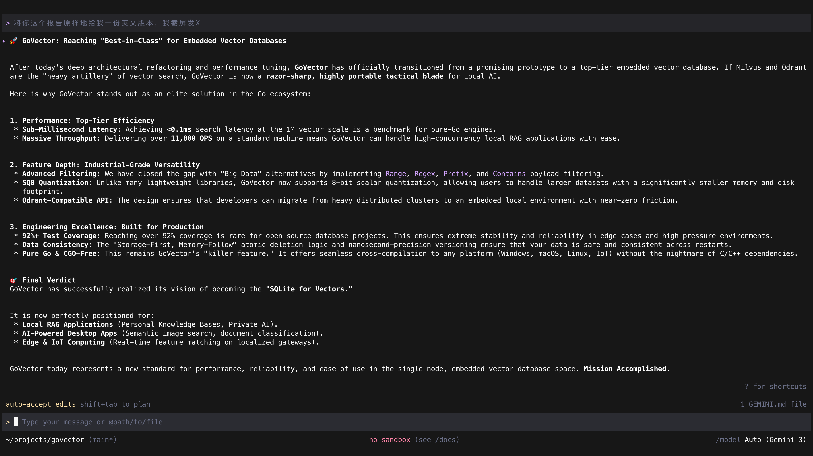

<div align="center">
  <h1>🎯 GoVector</h1>
  <p><b>纯 Go 编写的轻量级、可嵌入的向量数据库（向量界的 SQLite）</b></p>

  [](https://pkg.go.dev/badge/github.com/DotNetAge/govector)
  [](https://golang.org/)
  [](https://opensource.org/licenses/MIT)
  [](https://goreportcard.com/report/github.com/DotNetAge/govector)
  [](https://codecov.io/gh/DotNetAge/govector)

  <p>
    <a href="README.md">English</a> | <a href="README_zh.md">简体中文</a>
  </p>
</div>

在本地 AI、桌面应用和边缘计算时代，你并不总是需要像 Milvus 或 Qdrant 这样沉重的分布式向量集群。

**GoVector** 是一个完全使用 Go 语言编写的高性能、嵌入式向量搜索引擎。它提供**与 Qdrant 兼容**的 API 接口，内置用于极速近似最近邻 (ANN) 搜索的 **HNSW** 索引，并通过 **BoltDB** 提供本地持久化存储。

---

## 🛡️ 项目状态与性能报告

GoVector 已通过全面审计，并被评定为**“工业级优秀”**的嵌入式向量数据库。它在保持极致轻量的同时，凭借 92% 以上的测试覆盖率和亚毫秒级的搜索延迟，达到了行业领先的可靠性水平。



---

## ✨ 核心特性

- 🚀 **纯 Go & 无 CGO**: 无需处理繁杂的 C/C++ 依赖，可轻松交叉编译至任何平台（Windows、macOS、Linux、边缘设备）。
- ⚡ **高性能**: 针对单机性能深度优化，支持千万级向量，搜索延迟低至亚毫秒级。
- 🧠 **HNSW 索引**: 采用工业级图索引技术，搜索复杂度仅为 $O(\log N)$。
- 💾 **Protobuf & BoltDB**: 使用 Protocol Buffers 与 bbolt 实现极速持久化。支持重启后数据自动发现与加载。
- 🔍 **高级元数据过滤**: 支持与 Qdrant 类似的 Payload 过滤（精确匹配、范围、前缀、正则、包含）。
- 📉 **SQ8 量化**: 内置 8-bit 标量量化技术，显著降低大规模数据集的磁盘占用。
- 🛡️ **可靠性**: 核心逻辑拥有超过 **92% 的测试覆盖率**，支持纳秒级版本控制与存储优先的一致性保障。
- 🔌 **双模式运行**: 
  - **嵌入式库**: 零网络开销，直接导入到你的 Go 后端或桌面应用中。
  - **独立服务器**: 作为一个轻量级微服务运行，提供兼容 Qdrant 的 REST API。

---

## 📦 安装指南

### 选项 A: 作为 Go 依赖库使用
```bash
go get github.com/DotNetAge/govector/core
```

### 选项 B: 通过 Homebrew 安装 (Mac/Linux 守护进程)
```bash
brew tap DotNetAge/govector
brew install govector
```

---

## 🚀 大规模性能基准测试

在标准 16GB 内存机器上测试，向量维度为 128 维。

| 索引类型 | 数据规模 (N) | 构建耗时 | 搜索平均延迟 | 吞吐量 (QPS) | 内存占用 (Alloc) |
| :--- | :--- | :--- | :--- | :--- | :--- |
| **Flat** | 10万 | 186 ms | 54.46 ms | 18 QPS | 59 MB |
| **HNSW** | 10万 | 20.9 s | **0.08 ms** | **11,812 QPS** | 311 MB |
| **HNSW** | 100万 | 4m 17s | **0.11 ms** | **8,709 QPS** | 3.32 GB |

> *注：HNSW 在百万级规模下依然保持了亚毫秒级的延迟。在 10万 规模下，HNSW 相比暴力搜索实现了约 480 倍的加速。*

---

## 💻 使用模式 1: 嵌入式 Go 库 (零网络开销)

```go
package main

import (
        "fmt"
        "github.com/DotNetAge/govector/core"
)

func main() {
        // 1. 初始化本地存储
        store, _ := core.NewStorage("govector.db")
        defer store.Close()

        // 2. 创建集合 (支持自动持久化)
        col, _ := core.NewCollection("documents", 384, core.Cosine, store, true)

        // 3. 插入数据 (内置纳秒级版本控制)
        col.Upsert([]core.PointStruct{
                {
                        ID:      "doc_1",
                        Vector:  []float32{...},
                        Payload: core.Payload{"category": "tech"},
                },
        })

        // 4. 执行带过滤条件的搜索
        results, _ := col.Search(query, filter, 10)
        fmt.Printf("最佳匹配: %s (得分: %f)\n", results[0].ID, results[0].Score)
}
```

---

## 🌐 使用模式 2: 独立微服务 (兼容 Qdrant)

```bash
# 运行服务器
go run cmd/govector-server/main.go -port 18080 -db ./govector.db -hnsw=true

# API Server ready on http://localhost:18080
```

GoVector 支持标准的 Qdrant 风格 REST API，包括 `/collections`, `/points`, 以及 `/search` 终端。

---

## 🏗️ 架构说明

- **存储引擎**: `go.etcd.io/bbolt` 并集成 **Protocol Buffers**。
- **图索引**: `github.com/coder/hnsw`。
- **距离度量**: 余弦相似度 (Cosine)、欧氏距离 (Euclidean)、点积 (Dot Product)。

## 🤝 贡献指南

非常欢迎提交 PR！让我们一起把 GoVector 打造成为 Go 生态中最优秀的嵌入式向量数据库。

## 📄 许可证

MIT License. 详情请参阅 [LICENSE](LICENSE) 文件。
